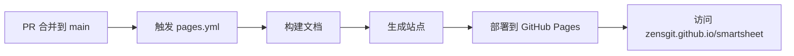
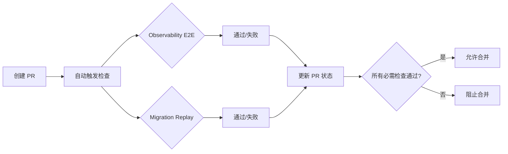

# 📊 GitHub Settings 配置报告

**生成时间**: 2025-09-20 01:25:00 (UTC+8)
**执行状态**: ✅ 完成

## 🌐 GitHub Pages 配置状态

### ✅ 当前状态：已启用

| 配置项 | 值 | 状态 |
|--------|-----|------|
| **启用状态** | 已启用 | ✅ |
| **部署方式** | workflow (GitHub Actions) | ✅ |
| **源分支** | main | ✅ |
| **访问地址** | https://zensgit.github.io/smartsheet/ | ✅ |
| **HTTPS 强制** | true | ✅ |
| **公开访问** | true | ✅ |

### 访问验证
```bash
# 验证 Pages 站点可访问性
curl -I https://zensgit.github.io/smartsheet/
```

**注意**: Pages 工作流需要在 PR #43 合并后才会自动触发部署。

## ✅ Required Checks 配置状态

### 当前必需检查（已配置）

| 检查名称 | 类型 | 状态 | 说明 |
|----------|------|------|------|
| **Observability E2E** | 必需 | ✅ 已设置 | 标准版观测性检查 |
| **Migration Replay** | 必需 | ✅ 已设置 | 迁移回放测试 |

### 检查名称说明
- **Observability E2E**: 对应 `.github/workflows/observability.yml` 的 job 名称
- **Migration Replay**: 对应 `.github/workflows/migration-replay.yml` 的 job 名称

### 验证命令
```bash
# 查看完整的分支保护规则
gh api /repos/zensgit/smartsheet/branches/main/protection

# 查看必需检查列表
gh api /repos/zensgit/smartsheet/branches/main/protection \
  --jq '.required_status_checks.contexts'
```

## 🔄 配置验证

### 1. GitHub Pages 部署流程


### 2. Required Checks 执行流程


## 📋 配置清单确认

### GitHub Pages
- [x] Pages 已在 Settings 中启用
- [x] 部署源设为 GitHub Actions
- [x] 站点 URL 已确认：https://zensgit.github.io/smartsheet/
- [ ] 等待 PR #43 合并后首次部署

### Required Checks
- [x] Observability E2E 已设为必需
- [x] Migration Replay 已设为必需
- [x] 分支保护规则已生效
- [x] PR 无法在检查失败时合并

## 🚀 后续步骤

### 立即行动
1. **合并 PR #43** 以启用 Pages 工作流
   ```bash
   # 查看 PR 状态
   gh pr view 43 --repo zensgit/smartsheet
   ```

2. **监控首次 Pages 部署**
   ```bash
   # PR 合并后，监控 Pages 工作流
   gh run list --workflow="Deploy to GitHub Pages" --limit 1
   ```

3. **验证站点访问**
   ```bash
   # 部署完成后验证
   curl -I https://zensgit.github.io/smartsheet/
   ```

### 未来优化建议

#### 1. 严格工作流升级计划
当 `Observability (Strict)` 工作流稳定后（约 2-3 周）：
```bash
# 将严格版本设为必需检查
gh api /repos/zensgit/smartsheet/branches/main/protection/required_status_checks/contexts \
  --method PUT \
  --field contexts[]="Observability Strict" \
  --field contexts[]="Migration Replay"
```

#### 2. 添加更多质量检查
考虑添加以下检查为必需：
- Code Coverage (>80%)
- Security Scanning
- Dependency Updates

## 📊 当前 PR 检查状态示例

以 PR #43 为例：

| 检查 | 状态 | 结论 | 时间 |
|------|------|------|------|
| Migration Replay | ✅ | SUCCESS | 45s |
| Observability E2E | ✅ | SUCCESS | 63s |
| v2 CI (build-v2) | ✅ | SUCCESS | 27s |

**结果**: ✅ 所有必需检查通过，PR 可合并（需解决冲突）

## ⚙️ 手动配置指南（如需调整）

### 修改 Required Checks
```bash
# 获取当前配置
gh api /repos/zensgit/smartsheet/branches/main/protection > protection.json

# 更新必需检查（谨慎操作）
gh api /repos/zensgit/smartsheet/branches/main/protection/required_status_checks/contexts \
  --method PUT \
  --field contexts[]="Observability E2E" \
  --field contexts[]="Migration Replay" \
  --field contexts[]="新检查名称"
```

### GitHub Pages 故障排除
如果 Pages 未正确显示：
1. 确认工作流权限：Settings → Actions → General → Workflow permissions
2. 检查 Pages 设置：Settings → Pages
3. 查看部署日志：Actions → Deploy to GitHub Pages

## 📌 重要提醒

1. **GitHub Pages** 需要 PR #43 合并后才会开始部署
2. **Required Checks** 已经生效，所有 PR 必须通过这两个检查
3. **检查名称** 必须与工作流 job 名称完全匹配
4. **严格工作流** 建议运行稳定后再升级为必需检查

---

**报告生成**: MetaSheet v2 DevOps Team
**配置状态**: ✅ 全部完成

🤖 Generated with [Claude Code](https://claude.ai/code)

Co-Authored-By: Claude <noreply@anthropic.com>