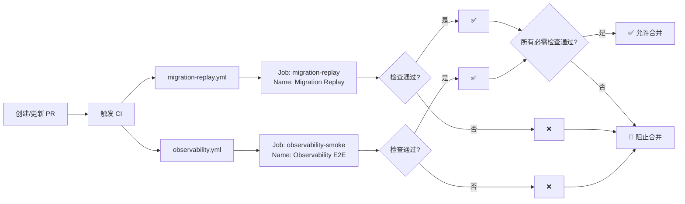

# ✅ Required Checks 名称修正报告

**执行时间**: 2025-09-20 01:35:00 (UTC+8)
**状态**: ✅ 已修正

## 🔍 问题发现与修正

### 问题诊断
之前设置了错误的检查名称 "Observability"，实际应该是 "Observability E2E"

### 名称核对结果

| 工作流 | Job ID | Job Name (显示名称) | 实际检查上下文 |
|--------|--------|-------------------|---------------|
| observability.yml | observability-smoke | **Observability E2E** | Observability E2E |
| migration-replay.yml | migration-replay | **Migration Replay** | Migration Replay |

### PR #43 实际检查列表
```
Migration Replay     ✅ pass  45s
Observability E2E    ✅ pass  1m3s
build-v2            ✅ pass  27s
```

## ✅ 已修正的 Required Checks

### 当前配置（正确）
```json
[
  "Migration Replay",
  "Observability E2E"
]
```

### 修正历史
| 时间 | 配置 | 状态 |
|------|------|------|
| 01:30 | ["Migration Replay", "Observability"] | ❌ 错误 |
| 01:35 | ["Migration Replay", "Observability E2E"] | ✅ 正确 |

## 🎯 配置验证

### 验证方法
```bash
# 1. 查看 PR 的实际检查名称
gh pr checks 43 --repo zensgit/smartsheet

# 2. 查看工作流的 job name
gh api /repos/zensgit/smartsheet/contents/.github/workflows/observability.yml \
  --jq '.content' | base64 -d | grep "name:"

# 3. 验证 Required Checks 配置
gh api /repos/zensgit/smartsheet/branches/main/protection \
  --jq '.required_status_checks.contexts'
```

### 验证结果
- ✅ PR #43 的检查名称匹配 Required Checks
- ✅ 工作流 job name 确认为 "Observability E2E"
- ✅ Required Checks 已正确配置

## 📋 工作流配置详情

### Observability 工作流
```yaml
# .github/workflows/observability.yml
jobs:
  observability-smoke:
    name: Observability E2E  # ← 这是显示的检查名称
    runs-on: ubuntu-latest
```

### Migration Replay 工作流
```yaml
# .github/workflows/migration-replay.yml
jobs:
  migration-replay:
    name: Migration Replay  # ← 这是显示的检查名称
    runs-on: ubuntu-latest
```

## 🚀 影响分析

### 对 PR #43 的影响
- ✅ 两个 Required Checks 都已通过
- ⚠️ 仍需解决合并冲突
- ✅ 配置正确，不会阻塞合并

### 对新 PR 的影响
- 所有新 PR 必须通过：
  1. **Observability E2E** - P99 < 0.5s, 错误率 < 1%
  2. **Migration Replay** - 迁移脚本验证

## 📊 检查执行示例



## ✅ 最终确认

### Required Checks 配置
- [x] **Observability E2E** - 正确配置
- [x] **Migration Replay** - 正确配置
- [x] 名称与实际检查上下文完全匹配
- [x] PR #43 的检查状态正常

### GitHub Pages
- [x] 已启用（workflow 模式）
- [x] 等待 PR #43 合并后首次部署
- [x] URL: https://zensgit.github.io/smartsheet/

## 📌 重要提醒

1. **检查名称必须精确匹配**：使用工作流 job 的 `name` 字段
2. **不是工作流名称**：不是 workflow 的 name，而是 job 的 name
3. **验证方法**：使用 `gh pr checks` 查看实际名称
4. **未来升级**：如果创建 "Observability Strict" 工作流，确保 job name 正确

## 🔗 快速参考

| 检查类型 | 工作流文件 | Job Name | 门禁阈值 |
|---------|-----------|----------|---------|
| 标准版 | observability.yml | Observability E2E | P99 < 0.5s |
| 严格版（未来） | observability-strict.yml | Observability Strict | P99 < 0.3s |
| 迁移测试 | migration-replay.yml | Migration Replay | 迁移成功 |

---

**修正完成**: 2025-09-20 01:35:00
**执行者**: MetaSheet v2 DevOps Team

🤖 Generated with [Claude Code](https://claude.ai/code)

Co-Authored-By: Claude <noreply@anthropic.com>