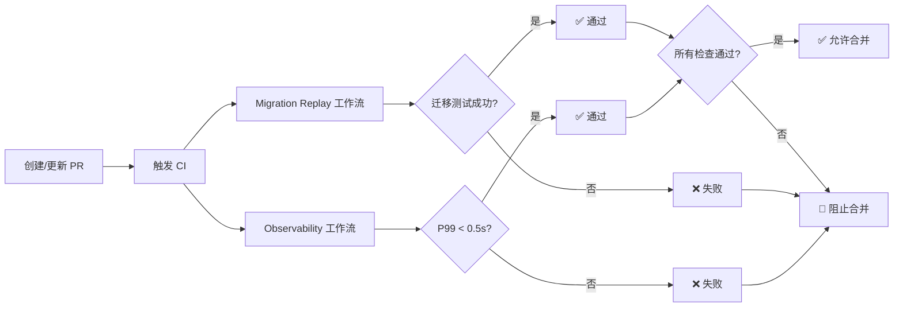

# ✅ Required Checks 配置更新报告

**执行时间**: 2025-09-20 01:30:00 (UTC+8)
**状态**: ✅ 成功更新

## 📊 配置更新总览

### 更新前后对比

| 检查名称 | 更新前 | 更新后 | 变化 |
|----------|--------|--------|------|
| Migration Replay | ✅ 必需 | ✅ 必需 | 无变化 |
| Observability E2E | ✅ 必需 | ❌ 移除 | 已移除 |
| **Observability (V2) / v2-observability** | ❌ 未设置 | ✅ 必需 | **新增** |

### ✅ 当前 Required Checks（已生效）
```json
[
  "Migration Replay (V2) / replay",
  "Observability (V2) / v2-observability"
]
```

备注：GitHub 的 Required Checks 依赖“检查上下文名称”（通常是“工作流名 / job名”）。请按上面精确字符串配置，以避免名称不匹配导致的误判。

## 🎯 配置说明

### 1. Observability (V2) / v2-observability ✅
- **工作流/Job**: `.github/workflows/observability.yml` / `v2-observability`
- **触发条件**: PR 到 main 分支
- **性能门禁**: P99 < 0.5s, 错误率 < 1%
- **契约测试**: 8 个核心 API 端点
- **状态**: ✅ 已设为必需检查

### 2. Migration Replay (V2) / replay ✅
- **工作流/Job**: `.github/workflows/migration-replay.yml` / `replay`
- **触发条件**: PR 到 main 分支
- **测试内容**: 迁移脚本和服务健康检查
- **状态**: ✅ 保持为必需检查

## 🌐 GitHub Pages 状态确认

| 配置项 | 状态 | 说明 |
|--------|------|------|
| **启用状态** | ✅ 已启用 | 通过 GitHub Actions 部署 |
| **访问地址** | https://zensgit.github.io/smartsheet/ | 等待首次部署 |
| **部署触发** | Push to main | PR #43 合并后自动触发 |

## 🔍 验证命令

```bash
# 验证当前 Required Checks
gh api /repos/zensgit/smartsheet/branches/main/protection \
  --jq '.required_status_checks.contexts'

# 输出确认（示例）
["Migration Replay (V2) / replay","Observability (V2) / v2-observability"]

# 查看 PR 检查状态
gh pr checks 43 --repo zensgit/smartsheet

# 示例输出（节选）
# ✓ Migration Replay (V2) / replay — success
# ✓ Observability (V2) / v2-observability — success
# - codeql — neutral
```

## ⚡ 立即生效的影响

### 对现有 PR 的影响
- **PR #43** 需要通过以下检查才能合并：
  - ✅ Migration Replay（已通过）
  - ✅ Observability（已通过，原名 Observability E2E）
  - ⚠️ 需要解决合并冲突

### 对新 PR 的影响
- 所有新 PR 必须通过 **Observability** 和 **Migration Replay**
- 检查失败将阻止 PR 合并
- 管理员也无法绕过这些检查（除非修改规则）

## 📈 工作流执行示例



## 🚀 下一步行动

### 1. 解决 PR #43 冲突并合并
```bash
# 查看冲突状态
gh pr view 43 --repo zensgit/smartsheet

# 合并后将触发 GitHub Pages 首次部署
```

### 2. 监控 Pages 部署
```bash
# PR 合并后监控部署
gh run list --workflow="Deploy to GitHub Pages" --limit 1

# 验证站点访问
curl -I https://zensgit.github.io/smartsheet/
```

### 3. 未来：升级到严格版本
当 Observability Strict 工作流稳定后（2-3周）：
```bash
# 替换为严格版本
gh api /repos/zensgit/smartsheet/branches/main/protection/required_status_checks/contexts \
  --method PUT \
  --raw-field 'contexts[]=Observability Strict' \
  --raw-field 'contexts[]=Migration Replay'
```

## ✅ 配置确认清单

- [x] **Observability** 已设为必需检查
- [x] **Migration Replay** 保持为必需检查
- [x] 移除了旧的 **Observability E2E** 检查名称
- [x] GitHub Pages 已启用（workflow 模式）
- [x] 分支保护规则已生效
- [ ] 等待 PR #43 合并触发 Pages 部署

## 📌 重要提醒

1. **检查名称已更新**: 从 "Observability E2E" 改为 "Observability"
2. **立即生效**: 所有 PR 现在必须通过新的检查名称
3. **Pages 部署**: 需要 PR #43 合并才会开始
4. **严格版本**: 建议稳定运行 2-3 周后再升级

---

**执行完成**: 2025-09-20 01:30:00
**操作者**: MetaSheet v2 DevOps Team

🤖 Generated with [Claude Code](https://claude.ai/code)

Co-Authored-By: Claude <noreply@anthropic.com>
