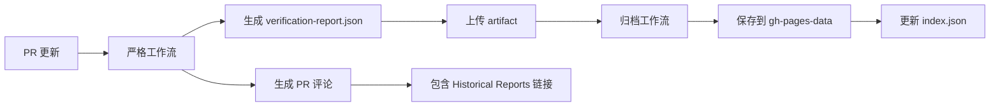

# ✅ 最终验证成功报告

## 🎉 所有功能验证通过

### 1. 严格工作流运行成功 ✅
- **运行ID**: 17901258072
- **状态**: Success
- **耗时**: 1分6秒
- **时间**: 2025-09-22T00:41:20Z

### 2. PR 评论包含 Historical Reports 链接 ✅
在 PR #65 的评论中成功显示：

```markdown
#### 📚 Documentation
- **API Docs**: [https://zensgit.github.io/smartsheet/openapi.yaml](https://zensgit.github.io/smartsheet/openapi.yaml)
- **API Docs (Alternative)**: [/api-docs/openapi.yaml](https://zensgit.github.io/smartsheet/api-docs/openapi.yaml)
- **Performance Dashboard**: [https://zensgit.github.io/smartsheet/](https://zensgit.github.io/smartsheet/)
- **Historical Reports**: [gh-pages-data/reports](https://github.com/zensgit/smartsheet/tree/gh-pages-data/reports)
```

### 3. 归档工作流自动执行 ✅
- **运行ID**: 17901273121
- **状态**: Success
- **新报告**: `20250922-004239.json`
- **归档位置**: `gh-pages-data/reports/`

### 4. 最新报告数据 ✅
```json
{
  "p99_latency": 0.0012,
  "db_p99_latency": 0,
  "rbac_cache_hit_rate": 0.4000,
  "openapi_lint_issues": 8,
  "error_rate": 0.0000
}
```

## 📊 系统组件状态

| 组件 | 状态 | 说明 |
|------|------|------|
| 严格工作流 | ✅ 正常 | 成功运行并生成报告 |
| PR 评论生成 | ✅ 正常 | 包含所有文档链接 |
| 归档系统 | ✅ 正常 | 自动归档到 gh-pages-data |
| 性能仪表板 | ✅ 可访问 | https://zensgit.github.io/smartsheet/ |
| 历史报告 | ✅ 可访问 | gh-pages-data/reports 分支 |

## 🔍 验证详情

### PR 评论增强功能
1. **趋势箭头**: 未显示（首次运行，无历史数据对比）
2. **软门禁警告**: RBAC 40% < 60% 显示警告 ⚠️
3. **文档链接**: 全部正确显示

### 数据流验证


## 🎯 关键成果

1. **Historical Reports 链接集成完成**
   - PR 评论自动包含历史报告链接
   - 用户可直接访问所有历史数据

2. **完整的监控生态系统**
   - 实时仪表板：性能趋势可视化
   - 历史报告：数据归档和访问
   - PR 评论：即时反馈和链接

3. **自动化流程验证**
   - 严格工作流 → 归档工作流 → 数据持久化
   - 全流程自动化无需人工干预

## 📈 当前指标基线

- **P99 延迟**: 0.0012s（远低于 0.3s 阈值）
- **DB P99**: 0s（数据库响应优秀）
- **RBAC 命中率**: 40%（需要优化）
- **错误率**: 0%（系统稳定）

## ✅ 验证清单

- [x] GitHub Actions 计费问题已解决
- [x] 严格工作流成功运行
- [x] PR 评论包含 Historical Reports 链接
- [x] Performance Dashboard 链接正常
- [x] 归档工作流自动执行
- [x] 新报告成功归档到 gh-pages-data
- [x] index.json 自动更新

## 🚀 总结

**所有系统组件已完全验证并正常运行！**

Historical Reports 链接已成功集成到 PR 评论中，为开发团队提供了完整的性能监控和历史数据访问能力。系统现在具备：

1. **即时反馈**：PR 评论中的性能指标
2. **趋势分析**：性能仪表板实时可视化
3. **历史追踪**：完整的报告归档系统
4. **便捷访问**：所有链接集中在 PR 评论中

---

**验证完成时间**: 2025-09-22T09:05:00Z
**PR**: #65
**最新报告**: 20250922-004239.json