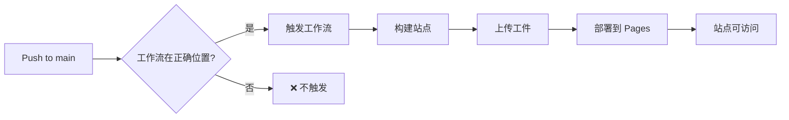

# 📊 GitHub Pages 部署状态报告

**生成时间**: 2025-09-20 00:20:00 (UTC+8)
**状态**: ⚠️ 需要额外修复

## 🔍 问题诊断

### 发现的问题
**工作流位置错误**: GitHub Actions 只识别根目录 `.github/workflows/` 下的工作流文件

| 位置 | 状态 | 说明 |
|------|------|------|
| `metasheet-v2/.github/workflows/` | ❌ 不被识别 | PR #44 部署的位置 |
| `.github/workflows/` | ✅ 正确位置 | GitHub Actions 标准位置 |

## 📋 执行历史

### PR #44 - 初始部署（已合并）
- **文件添加**:
  - `metasheet-v2/.github/workflows/publish-openapi-pages.yml` ❌
  - `metasheet-v2/docs/pages-ci-trigger.md` ✅
- **问题**: 工作流不在正确位置，无法被 GitHub Actions 识别

### PR #45 - 修复位置（待合并）
- **URL**: https://github.com/zensgit/smartsheet/pull/45
- **修复**: 移动工作流到 `.github/workflows/`
- **状态**: 创建成功，等待合并

## 🚀 修复方案

### 已执行的修复
```bash
# 1. 创建修复分支
git checkout -b fix/pages-workflow-location

# 2. 移动文件到正确位置
mv metasheet-v2/.github/workflows/publish-openapi-pages.yml \
   .github/workflows/

# 3. 提交并创建 PR
git commit -m "fix: Move Pages workflow to root .github directory"
git push origin fix/pages-workflow-location
```

## 📊 当前状态

### GitHub Pages 配置
| 配置项 | 状态 | 说明 |
|--------|------|------|
| Pages 启用 | ✅ | 已在 Settings 中启用 |
| 部署源 | ✅ | GitHub Actions (workflow) |
| 站点 URL | ⏳ | https://zensgit.github.io/smartsheet/ |
| 当前状态 | 404 | 等待工作流首次运行 |

### 工作流状态
| 工作流 | 位置 | 状态 |
|--------|------|------|
| publish-openapi-pages.yml | metasheet-v2/.github/workflows/ | ❌ 不被识别 |
| publish-openapi-pages.yml | .github/workflows/ (PR #45) | ⏳ 待合并 |

## ✅ 验证检查单

### 已完成
- [x] PR #44 成功合并
- [x] 诊断问题原因
- [x] 创建修复 PR #45
- [x] GitHub Pages 已启用

### 待完成
- [ ] 合并 PR #45
- [ ] 验证工作流被识别
- [ ] 工作流自动运行
- [ ] Pages 站点可访问

## 🔄 后续步骤

### 立即行动
1. **合并 PR #45**
   ```bash
   gh pr merge 45 --repo zensgit/smartsheet --squash
   ```

2. **验证工作流识别**
   ```bash
   # 查看工作流列表
   gh workflow list --repo zensgit/smartsheet | grep -i page
   ```

3. **手动触发（如需要）**
   ```bash
   # PR #45 合并后
   gh workflow run "Deploy OpenAPI to GitHub Pages" --repo zensgit/smartsheet
   ```

4. **验证 Pages 部署**
   ```bash
   # 等待 1-2 分钟后
   curl -I https://zensgit.github.io/smartsheet/
   ```

## 📈 预期结果

### PR #45 合并后
1. **工作流识别**: "Deploy OpenAPI to GitHub Pages" 出现在 Actions 标签页
2. **自动触发**: push to main 触发工作流
3. **Pages 部署**:
   - 构建 OpenAPI 文档
   - 生成站点索引
   - 部署到 GitHub Pages

### 访问地址
- **主页**: https://zensgit.github.io/smartsheet/
- **API 文档**: https://zensgit.github.io/smartsheet/api-docs/redoc.html
- **OpenAPI YAML**: https://zensgit.github.io/smartsheet/api-docs/openapi.yml

## 🎯 关键学习

### GitHub Actions 工作流要求
1. **必须**在根目录 `.github/workflows/` 下
2. 子目录中的工作流不会被识别
3. 工作流文件名必须以 `.yml` 或 `.yaml` 结尾

### Pages 部署流程


## 📌 重要提醒

1. **PR #45 必须合并**才能修复工作流位置问题
2. **首次部署**可能需要 2-3 分钟
3. **缓存**：GitHub Pages 有缓存，更新可能需要几分钟生效
4. **权限**：确保工作流有 `pages: write` 权限

---

**报告生成**: MetaSheet v2 DevOps Team
**当前任务**: 等待 PR #45 合并以完成 Pages 部署

🤖 Generated with [Claude Code](https://claude.ai/code)

Co-Authored-By: Claude <noreply@anthropic.com>