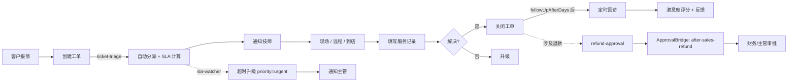
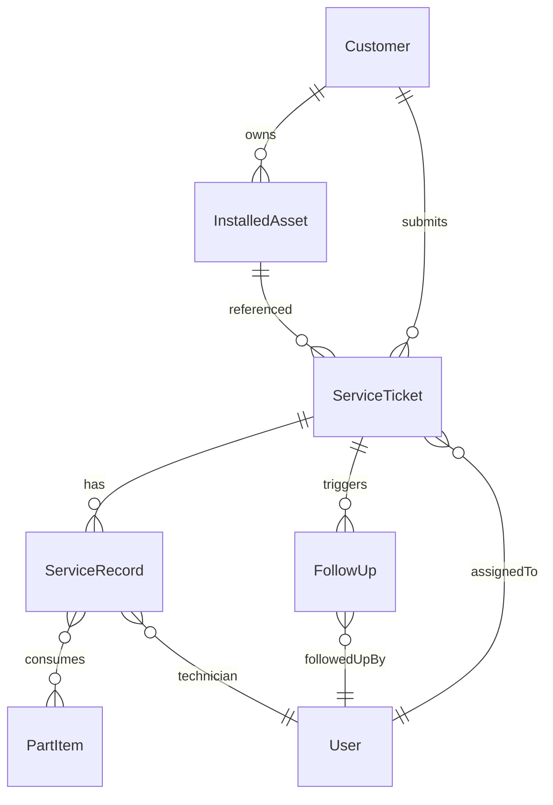

# 售后项目模板设计 (after-sales-project-template-design-20260407)

> **文档类型**：业务模板设计 / Pre-Implementation Design
> **日期**：2026-04-07
> **范围**：v1 唯一售后子域实例的默认模板（`after-sales-default`）
> **来源词典**：2026-04-07 接口词典 v1.0（locked）
> **配套交付**：本文档为「2026-04-07 平台项目创建器 + 售后模板」5 份设计稿之 #1，后续 #2-#5 见同目录其他 `*-20260407.md` 文件

## TL;DR

售后默认模板把"客户 / 装机资产 / 工单 / 服务记录 / 配件 / 回访"6 个对象、5 个默认视图、3 个默认自动化、4 个默认通知主题与 6 个角色权限，打包成一份可一键启用的项目蓝图。v1 每租户启用一次即得唯一售后业务子域；退款/赔付审批走 `ApprovalBridgeService`；`fieldPolicies.hidden` 仅在 UI 层隐藏 `refundAmount`，API 仍返回；v2 才扩展为多个售后项目实例。

---

## 1. 业务目标

售后默认模板的目标是让一个全新租户在不写任何代码、不调任何 API 的情况下，从启用按钮到可用的售后业务系统在分钟级完成。覆盖能力：

- 客户与装机资产档案管理
- 工单创建、分派、SLA 监控
- 现场 / 远程 / 到店三种服务方式
- 配件与耗材消耗记录
- 退款 / 赔付审批桥接
- 服务结束后的定时回访
- 6 类角色的权限边界

模板交付的不是"功能"，而是"可被实施者一比一落地的对象 + 视图 + 流程 + 通知 + 权限的完整声明"。

## 2. 角色矩阵

v1 使用 6 个固定角色 slug。类型与接口层使用英文 slug，UI 文案与文档叙述使用中文标签。

| Slug | 中文标签 | 默认权限 |
|---|---|---|
| `customer_service` | 客服 | `after_sales:read`, `after_sales:write` |
| `technician` | 技师 | `after_sales:read`, `after_sales:write` |
| `supervisor` | 主管 | `after_sales:read`, `after_sales:write`, `after_sales:approve` |
| `finance` | 财务 | `after_sales:read`, `after_sales:approve` |
| `admin` | 管理员 | `after_sales:read`, `after_sales:write`, `after_sales:approve`, `after_sales:admin` |
| `viewer` | 只读 | `after_sales:read` |

### 字段级权限策略 (fieldPolicies)

v1 唯一启用 `fieldPolicies` 的字段是 `serviceTicket.refundAmount`：

| 角色 | visibility | editability |
|---|---|---|
| `finance` | `visible` | `editable` |
| `admin` | `visible` | `editable` |
| `supervisor` | `visible` | `readonly` |
| `customer_service` | `hidden` | `readonly` |
| `technician` | `hidden` | `readonly` |
| `viewer` | `hidden` | `readonly` |

**v1 强约束**：`visibility = 'hidden'` 仅在前端字段渲染层隐藏，与 multitable 现有 `hidden_field_ids` 实现对齐（参考 `apps/web` 与 `packages/core-backend/src/routes/univer-meta.ts:1086 / 3133`）。**API 仍返回该列**。v2 才考虑列级 API 裁剪。

## 3. 默认对象字段表

模板安装时生成 6 个 **multitable 对象** 的默认字段表。此外保留 `warrantyPolicy` 作为 service-backed 支撑能力，由 `AfterSalesTemplateConfig.enableWarranty` 配置开关控制，**不进入这 6 张字段表**（详见 §11 与 #2 安装器文档对 backing 选择的说明）。

字段类型严格使用接口词典 v1.0 的 10 种规范类型（`string / number / boolean / date / formula / select / link / lookup / rollup / attachment`），识别类字段一律使用 `string`。

### 3.1 Customer (客户)

| 字段 | 类型 | 必填 | 说明 |
|---|---|---|---|
| `id` | `string` | ✓ | 主键 |
| `customerCode` | `string` | ✓ | 客户编码（识别类字段） |
| `name` | `string` | ✓ | 客户名称 |
| `type` | `select` | ✓ | options: `individual` / `enterprise` |
| `contactPhone` | `string` |  | |
| `contactEmail` | `string` |  | |
| `address` | `string` |  | |
| `accountManager` | `link` |  | reference: `{ objectId: 'user', refKind: 'user' }` |
| `createdAt` | `date` | ✓ | |
| `updatedAt` | `date` | ✓ | |

### 3.2 InstalledAsset (装机资产)

| 字段 | 类型 | 必填 | 说明 |
|---|---|---|---|
| `id` | `string` | ✓ | 主键 |
| `assetCode` | `string` | ✓ | 资产编码（识别类字段） |
| `serialNo` | `string` | ✓ | 序列号（识别类字段） |
| `customerId` | `link` | ✓ | reference: `{ objectId: 'customer' }` |
| `model` | `string` |  | 型号 |
| `installedAt` | `date` |  | 安装日期 |
| `warrantyUntil` | `date` |  | 保修截止 |
| `status` | `select` | ✓ | options: `active` / `expired` / `decommissioned` |
| `location` | `string` |  | 安装地点 |
| `createdAt` | `date` | ✓ | |
| `updatedAt` | `date` | ✓ | |

### 3.3 ServiceTicket (工单) — 词典锁定字段集

| 字段 | 类型 | 必填 | 说明 |
|---|---|---|---|
| `id` | `string` | ✓ | 主键 |
| `ticketNo` | `string` | ✓ | 工单号（识别类字段） |
| `title` | `string` | ✓ | |
| `customerId` | `link` | ✓ | reference: `{ objectId: 'customer' }` |
| `assetId` | `link` |  | reference: `{ objectId: 'installedAsset' }` |
| `source` | `select` | ✓ | options: `phone` / `email` / `web` / `wechat` |
| `priority` | `select` | ✓ | options: `low` / `normal` / `high` / `urgent`，默认 `normal` |
| `status` | `select` | ✓ | options: `new` / `assigned` / `inProgress` / `done` / `closed`，默认 `new` |
| `slaDueAt` | `date` | ✓ | SLA 截止时间，由 ticket-triage 自动写入 |
| `assignedTo` | `link` |  | reference: `{ objectId: 'user', refKind: 'user' }` |
| `refundAmount` | `number` |  | 受 fieldPolicies 控制 |
| `createdAt` | `date` | ✓ | |
| `updatedAt` | `date` | ✓ | |

### 3.4 ServiceRecord (服务记录) — 词典锁定字段集

| 字段 | 类型 | 必填 | 说明 |
|---|---|---|---|
| `id` | `string` | ✓ | 主键 |
| `ticketId` | `link` | ✓ | reference: `{ objectId: 'serviceTicket' }` |
| `visitType` | `select` | ✓ | options: `onsite` / `remote` / `pickup` |
| `scheduledAt` | `date` | ✓ | 计划上门时间 |
| `startedAt` | `date` |  | 实际开始时间 |
| `completedAt` | `date` |  | 完成时间 |
| `technicianId` | `link` | ✓ | reference: `{ objectId: 'user', refKind: 'user' }` |
| `workSummary` | `string` |  | 工作摘要 |
| `result` | `select` | ✓ | options: `resolved` / `partial` / `escalated` |
| `createdAt` | `date` | ✓ | |

### 3.5 PartItem (配件 / 耗材)

| 字段 | 类型 | 必填 | 说明 |
|---|---|---|---|
| `id` | `string` | ✓ | 主键 |
| `partNo` | `string` | ✓ | 物料编码（识别类字段） |
| `name` | `string` | ✓ | 物料名称 |
| `category` | `select` | ✓ | options: `spare_part` / `consumable` / `tool` |
| `unit` | `string` | ✓ | 计量单位（pcs / kg / m 等） |
| `unitCost` | `number` |  | 单价 |
| `stockQuantity` | `number` | ✓ | 当前库存 |
| `minStockQuantity` | `number` |  | 安全库存阈值 |
| `createdAt` | `date` | ✓ | |
| `updatedAt` | `date` | ✓ | |

### 3.6 FollowUp (回访)

| 字段 | 类型 | 必填 | 说明 |
|---|---|---|---|
| `id` | `string` | ✓ | 主键 |
| `ticketId` | `link` | ✓ | reference: `{ objectId: 'serviceTicket' }` |
| `customerId` | `link` | ✓ | reference: `{ objectId: 'customer' }` |
| `scheduledAt` | `date` | ✓ | 计划回访时间 |
| `followUpType` | `select` | ✓ | options: `phone` / `sms` / `email` / `visit` |
| `status` | `select` | ✓ | options: `pending` / `done` / `skipped`，默认 `pending` |
| `satisfactionScore` | `number` |  | 1-5 评分 |
| `feedback` | `string` |  | 客户反馈文本 |
| `followedUpBy` | `link` |  | reference: `{ objectId: 'user', refKind: 'user' }` |
| `createdAt` | `date` | ✓ | |

## 4. 默认视图清单

模板声明 5 个默认视图，全部落在 `grid` / `kanban` / `calendar` / `form` 四种类型上。**v1 不使用 `gantt` / `timeline`**（依据：`packages/core-backend/src/services/view-service.ts:12` 当前公开类型上界为 gantt，timeline 仅前端有，未在核心 view-service 暴露）。

| 视图 ID | 名称 | 类型 | 对象 | 关键配置 |
|---|---|---|---|---|
| `ticket-board` | 工单看板 | `kanban` | `serviceTicket` | groupBy: `status` |
| `today-visit-calendar` | 今日上门日历 | `calendar` | `serviceRecord` | dateField: `scheduledAt` |
| `customer-360` | 客户 360 | `form` | `customer` | layout: 全字段单条详情 |
| `sla-risk-list` | SLA 风险列表 | `grid` | `serviceTicket` | filter: `slaDueAt` < now + 24h, sort: `slaDueAt` asc |
| `pending-followup` | 待回访列表 | `grid` | `followUp` | filter: `status = pending`, sort: `scheduledAt` asc |

## 5. 默认自动化 (AutomationRuleDraft)

模板声明 3 条默认自动化规则，使用接口词典 v1.0 的结构化 trigger。所有规则的 `conditions` 字段在 v1 留空数组，v2 才启用运行时条件。

### 5.1 ticket-triage (工单分派)

```json
{
  "id": "ticket-triage",
  "trigger": { "event": "ticket.created" },
  "conditions": [],
  "actions": [
    { "type": "assign", "assigneeRule": "by-area-or-round-robin" },
    { "type": "updateField", "field": "slaDueAt", "value": "{{computeSlaDueAt(priority)}}" },
    { "type": "sendNotification", "topic": "after-sales.ticket.assigned" }
  ],
  "enabled": true
}
```

### 5.2 sla-watcher (SLA 超时升级)

```json
{
  "id": "sla-watcher",
  "trigger": {
    "event": "ticket.overdue",
    "filter": [
      { "field": "status", "operator": "in", "value": ["new", "assigned", "inProgress"] }
    ]
  },
  "conditions": [],
  "actions": [
    { "type": "updateField", "field": "priority", "value": "urgent" },
    { "type": "sendNotification", "topic": "after-sales.ticket.overdue" }
  ],
  "enabled": true
}
```

### 5.3 refund-approval (退款 / 赔付审批)

```json
{
  "id": "refund-approval",
  "trigger": { "event": "ticket.refundRequested" },
  "conditions": [],
  "actions": [
    { "type": "submitApproval", "bridge": "after-sales-refund" },
    { "type": "sendNotification", "topic": "after-sales.approval.pending" }
  ],
  "enabled": true
}
```

**强约束**：退款 / 赔付审批 v1 必须通过 `ApprovalBridgeService` 完成，`submitApproval.bridge` 固定为 `after-sales-refund`。**禁止**在 workflow 引擎中实现人工审批节点。

## 6. 默认通知主题 (NotificationTopicSpec)

| topic | event | channels | defaultRecipients |
|---|---|---|---|
| `after-sales.ticket.assigned` | `ticket.assigned` | `email`, `feishu` | `{{ticket.assignedTo}}` |
| `after-sales.ticket.overdue` | `ticket.overdue` | `email`, `feishu` | `{{ticket.assignedTo}}`, `{{ticket.assignedSupervisor}}` |
| `after-sales.approval.pending` | `approval.pending` | `feishu` | `role:finance`, `role:supervisor` |
| `after-sales.followup.due` | `followup.due` | `feishu` | `{{followUp.followedUpBy}}` |

**v1 强约束**：channels 枚举固定为 `email` / `webhook` / `feishu`，与 `packages/core-backend/src/services/NotificationService.ts:263` 已注册的渠道对齐。**禁止出现 `inApp`**——`inApp` 是 v2 通知中枢的目标，v1 文档不得出现。

## 7. 默认值小表 (AfterSalesTemplateConfig)

| 配置 | 默认值 | 备注 |
|---|---|---|
| `enableWarranty` | `true` | |
| `enableRefundApproval` | `true` | true 时挂载 ApprovalBridge: `after-sales-refund` |
| `enableVisitScheduling` | `true` | |
| `enableFollowUp` | `true` | |
| `defaultSlaHours` | `24` | 普通工单 SLA |
| `urgentSlaHours` | `4` | 紧急工单 SLA |
| `followUpAfterDays` | `7` | 工单完成后第 7 天触发回访 |

`computeSlaDueAt(priority)` 的语义：
- `priority ∈ {low, normal, high}` → `now + defaultSlaHours`
- `priority = urgent` → `now + urgentSlaHours`

## 8. 业务闭环图 (Mermaid)



## 9. 对象关系图 (Mermaid ER)



## 10. v1 / v2 差异

| 维度 | v1（本文档范围） | v2（未来） |
|---|---|---|
| 实例语义 | 每租户每应用 = 唯一业务子域 | 每租户每应用 = 多个项目实例 |
| `projectId` | 伪值 `${tenantId}:after-sales` | 用户创建时分配真值 |
| 启用动作 | "启用售后" | "创建项目"（可多次） |
| 入口 UI | 主导航单一菜单项 | 项目切换器 + 多项目主页 |
| 数据隔离 | 仅 `tenant_id` | `tenant_id` + `project_id` |
| 卸载粒度 | 关停整个应用 | 删除单个项目 / 关停整个应用 |
| RBAC 粒度 | `after_sales:write` | `after_sales:write@projectId=...` |
| 字段 ACL | UI 层隐藏（本文档） | UI 隐藏 + API 列裁剪 |
| 通知渠道 | `email` / `webhook` / `feishu` | + `inApp`（通知中枢） |
| API 路由 | `/api/after-sales/...` | `/api/p/:projectId/after-sales/...` |

**v1 → v2 升级承诺**：v1 安装器创建的所有 multitable 数据，在 v2 加入 `project_id` 列时统一回填为 `${tenantId}:after-sales`。v1 实施代码必须避免 hardcode `WHERE tenant_id = ?` 的查询模式，应通过 service helper 留出 projectId 过滤挂点；安装器账本表的 `project_id` 列已经预留真值位（详见 #2 对象模型与模板安装器文档）。

## 11. 与 plugin-after-sales 起点文件的映射

本模板**不重写**起点文件，只补完它们的语义。

| 起点文件 | 当前内容 | 模板对应 |
|---|---|---|
| `plugins/plugin-after-sales/app.manifest.json` | `boundedContext`、`objects`、`workflows`、`permissions` 声明 | 本文档 §3 字段表是 `objects` 的细化；§5 自动化是 `workflows` 的细化；§2 角色矩阵覆盖 `permissions` |
| `plugins/plugin-after-sales/index.cjs` | `/api/after-sales/health`、`/api/after-sales/app-manifest` 路由；`after-sales.plugin.activated` 事件 | v1 实施期新增 `/api/after-sales/projects/install` 入口（HTTP 契约见 #4 创建流程文档） |
| `apps/web/src/views/AfterSalesView.vue` | manifest 卡片展示页 | v1 演进为售后首页：默认视图入口、partial 状态条与"重新安装"按钮（细节见 #4） |

起点文件已声明的 3 对象与 2 工作流是本模板的**最小子集**。本模板的扩展方式：

- **multitable 对象**：把起点文件中的 `serviceTicket` / `installedAsset` 两个 multitable 对象扩展为 6 个（新增 `customer` / `serviceRecord` / `partItem` / `followUp`），统一进入 §3 字段表
- **service-backed 对象**：`warrantyPolicy` 在 v1 仍以 service backing 存在，由 `enableWarranty` 配置开关控制，**不进入 §3 字段表**，也不由模板安装器创建表结构；其内部 schema 由 plugin-after-sales 服务自管
- **自动化**：把 `ticket-triage / refund-approval` 扩展为 3 条（新增 `sla-watcher`），全部以 `AutomationRuleDraft` 形式描述

## 12. 词典补丁记录

按"对象字段可增补，公共契约不可偷改"规则，本文档对接口词典 v1.0 只做对象字段层补充，**不改公共类型 / 枚举 / 默认值 / 接口字段名**。

| 补丁类型 | 内容 | 触发位置 |
|---|---|---|
| 新增对象字段 | `Customer.{customerCode, name, type, contactPhone, contactEmail, address, accountManager}` | §3.1 |
| 新增对象字段 | `InstalledAsset.{assetCode, serialNo, customerId, model, installedAt, warrantyUntil, status, location}` | §3.2 |
| 新增对象字段 | `PartItem.{partNo, name, category, unit, unitCost, stockQuantity, minStockQuantity}` | §3.5 |
| 新增对象字段 | `FollowUp.{ticketId, customerId, scheduledAt, followUpType, status, satisfactionScore, feedback, followedUpBy}` | §3.6 |
| 命名约定 | 5 个默认视图 ID 使用 kebab-case slug | §4 |
| 命名约定 | 3 条默认自动化 ID 使用 kebab-case slug | §5 |
| 命名约定 | 通知 topic 使用 `after-sales.{domain}.{event}` 三段式 | §6 |
| Helper 引用 | `computeSlaDueAt(priority)` 是模板使用的服务端 helper，**v1 由 #2 安装器文档以"有限 helper 白名单"形式明文化**，禁止理解为通用表达式引擎 | §5.1 / §7 |
| 上下文字段约定 | 通知 recipient 中的 `{{ticket.assignedSupervisor}}` 是 plugin-after-sales 在事件发出前 enrich 的扁平上下文字段，**禁止链式取值如 `{{ticket.assignedTo.supervisor}}`**，由 #3 文档以"recipient 解析约定"明文化 | §6 |

**未触发公共契约升级**：本文档未新增字段类型、未改 `AutomationRuleDraft` 结构、未改默认值、未改 API 字段名。词典版本仍为 **v1.0**。
