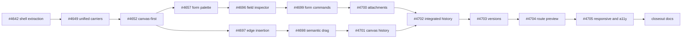

# Approval Authoring and Data Closure Execution Ledger (2026-07-31)

**Status:** IMPLEMENTATION CANDIDATE - Canvas V2 code is complete on a Draft stack; owner merge, staging UAT, and flags remain open
**Design authority:** `approval-canvas-v2-development-plan-20260720.md`
**Candidate head:** `1f92c6720`
**Runtime authority:** `ApprovalGraph` plus backend `normalizeApprovalGraph`
**Runtime posture:** Canvas, durable automation, Class A/Class B, FWB, and attachment flags remain default OFF

This ledger replaces the 2026-07-21 partial snapshot. It records what has been built and verified on the stacked
candidate. It does not authorize merging a PR, deploying a build, running tenant UAT, or enabling a flag.

## 1. Delivery topology

The two middle lanes are deliberately independent. #4702 is the convergence point; it must be rebased after both
lanes land so its final product diff contains only the integration delta.

## 2. PR ledger

| PR | Scope | Head at reconciliation | Gate state |
|---:|---|---|---|
| #4642 | Extract flow canvas shell without behavior change | `5a9bb4db23` | Draft |
| #4649 | Unify linear and graph canvas carriers | `704276e1a7` | Draft |
| #4652 | Make Canvas V2 the primary enabled authoring surface | `068d6e6286` | Draft |
| #4657 | Draggable/clickable form component palette | `6b926dce52` | Draft |
| #4696 | Focused field inspector | `93a9527f20` | Draft |
| #4697 | Edge insertion controls | `525915d3df` | Draft |
| #4698 | Semantic node and branch movement | `c6f0b7bbce` | Draft |
| #4699 | Form command/identity protection | `4ccc20f719` | Draft |
| #4700 | Attachment field authoring behind its flag | `2cbbd539a7` | Draft |
| #4701 | Canvas undo/redo history | `a2dacd5624` | Draft |
| #4702 | Unified form/canvas history and real-browser gate | `eff8d8933d` | Draft |
| #4703 | Version timeline, diff, synchronized comparison, restore | `519386738e` | Draft; remote checks green at reconciliation |
| #4704 | Saved-draft route preview embedded in Canvas | `78fefe6abe` | Draft; independent exact-diff review APPROVE |
| #4705 | Responsive/accessibility hardening | `1f92c6720` | Draft; exact-head local gates and all four emitted remote checks passed; independent review APPROVE |

Head SHAs are review coordinates, not merge proof. Any rebase invalidates the row until the named tests rerun.

## 3. Capability ledger

### 3.1 Form authoring

- Palette components can be dragged onto a selected insertion slot or added by click.
- Existing fields can be reordered by drag or keyboard; add/remove/reorder are typed commands in the shared history.
- The inspector edits the current field without exposing raw JSON or field IDs.
- Attachment fields appear only when the independent attachment capability is enabled.
- Narrow layouts stack palette -> form canvas -> inspector and preserve the non-drag path.

### 3.2 Flow authoring

- Linear and graph drafts use one Canvas carrier and one `ApprovalGraph` command model.
- Edge `+` controls insert approval, cc, condition, or parallel nodes only through legal typed commands.
- Node movement and branch priority changes target semantic slots. Cycles, orphaning, ambiguous fork/join changes,
  empty parallel branches, and illegal nested shapes fail closed without partial mutation.
- Canvas and form commands share undo/redo history and focus restoration.
- The backend remains the final graph authority on save and publish.

### 3.3 Versions and preview

- Version history renders a timeline and human-readable form/node/edge changes.
- Historical/current canvases use the same graph layout and synchronized zoom/scroll.
- Restore requires explicit acknowledgement and `expectedLatestVersionId`; a stale fence refreshes instead of
  overwriting a newer draft. Restore creates a new draft.
- Route preview calls `/api/approval-templates/:id/route-preview` for the last saved draft, forwards the same optimistic
  version fence, and highlights only an unambiguous graph path. Reconvergent/ambiguous anchors degrade to node-only
  highlighting with a visible partial-result warning.
- Returned IDs and unresolved directory values are sanitized before ordinary-user display.

### 3.4 Responsive and accessibility

- Browser gates cover 1280x800, 1024x768, and 390x844.
- Header actions stay within the viewport; sticky navigation/actions do not cover Canvas or form-builder content.
- Active mode contrast is measured from computed colors at >=4.5:1.
- Mobile Canvas node/move controls are >=40x40 CSS px; toolbar, branch-inspector, route-preview, version, checkbox,
  input, select, number-stepper, and textarea targets used by the narrow layout are >=44x44.
- Palette labels do not break mid-word; version dates/cards remain fully visible; no tested surface produces horizontal
  document overflow.

## 4. Approval-data boundary inherited by this candidate

The Canvas stack consumes the already-built durable/FWB/attachment substrate; it does not widen those gates.

- Approved form values can reach multitable through the independently gated FWB production action for the supported
  mapped types (`text`, `select`, `date`, and record-link paths covered by their own contracts).
- `targetType: 'number'` remains explicitly unavailable: create/update/execute paths call
  `hasUnavailableFwbNumberMapping` and fail closed with `exact_number_mapping_unavailable`. The presence of a numeric
  converter does not make that production path reachable.
- Approval attachments remain separately default OFF and retain their storage, scanning, authorization, bind/GC, and
  lifecycle gates.
- Canvas enablement cannot enable durable delivery, Class A/Class B, FWB, or attachments.

## 5. Verification ledger

| Gate | Candidate evidence | Meaning |
|---|---:|---|
| CI-equivalent real-browser workflow | 15/15 at `1f92c6720` | 11 approval-designer scenarios plus four neighboring browser verifications |
| Route-preview real-DB API | 11/11 | same-bundle authz/schema/version fence and values-free failure behavior |
| Focused frontend suites | 77/77 at #4704 | Canvas/form/version/preview unit and mounted behavior |
| Required Web Tests | 361 files / 4378 tests on the exact documentation tree over `1f92c6720` | required collection, not only the verification harness |
| Web typecheck | pass | exact frontend type surface |
| Web production build | pass | Vite production bundle completes; existing chunk-size warnings remain non-blocking |
| P1 independent review | APPROVE, 0 P1/P2 after fixes | version fence moved before schema/authz reads; non-Canvas fallback retained |
| X1 visual critique | Kimi input plus DOM refutation | valid clipping/touch findings were fixed; image-downsample measurements were not used as geometry proof |
| X1 exact-diff review | APPROVE, 0 P1/P2/P3 at `1f92c6720` | every touch-target class is rendered separately and turns RED when its size rule is neutralized |

After rebasing onto `1f92c6720`, the documentation tree reran the CI-equivalent browser workflow, route-preview
real-DB API suite, Required Web Tests, frontend/backend typechecks, and the web production build. The focused 77/77
row remains evidence from #4704 and is not relabeled as an exact-#4705 rerun. #4705's four emitted remote checks also
passed on that exact product head. The documentation PR's own remote CI remains a separate gate and must bind its
pushed head.

## 6. Stable residuals and owner gates

### Engineering residuals intentionally deferred

- Arbitrary free-position nodes/edges, cross-region free drag, and persisted coordinates.
- Native mobile authoring and 100+ node virtualization/performance qualification.
- Handler nodes, within-node ordered approvers, and new organization-derived assignee sources.
- Production FWB number mapping.

### Owner-only sequence

1. Review and land #4642 -> #4649 -> #4652.
2. Land the form and flow lanes bottom-up; rebase and reduce #4702 to its integration delta.
3. Land #4703 -> #4704 -> #4705 -> documentation, rerunning required checks after every rebase.
4. Rerun the full matrix on merged main with every flag still OFF.
5. Deploy to staging, capture baseline screenshots, and run owner UAT for form drag/click, condition/parallel authoring,
   semantic move, undo/redo, version compare/restore, route preview, keyboard use, and narrow layout.
6. Only after UAT, decide whether to enable `APPROVAL_CANVAS_V2_ENABLED` for a canary. Other runtime flags retain their
   own ladders.
