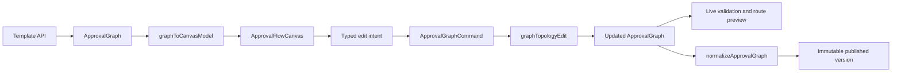
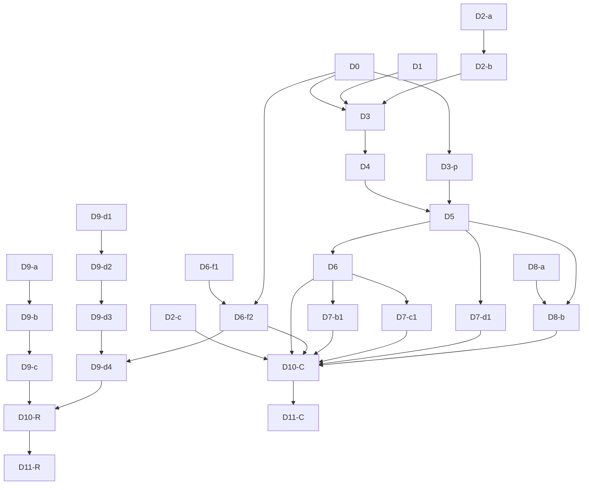

# Approval Canvas V2 Development Plan (2026-07-20)

**Status:** PROPOSED - owner ratification required before D3 canvas foundation work starts
**Baseline:** `origin/main@a98996ee2e0269b22801a6b87d2b8d5b5f076025`
**Scope:** approval form authoring, approval-flow canvas, template versions, form/decision-value writeback, and attachment integration
**Flags:** Canvas V2 defaults OFF until G5-C plus owner UAT; FWB and attachments retain separate default-OFF gates
**Authoritative runtime model:** existing `ApprovalGraph` plus backend `normalizeApprovalGraph`

This document is the execution baseline for the next approval-authoring phase. It is intentionally more
specific than a roadmap: every implementation PR must map to one work item, meet its named gate, and leave
the remaining items unchanged. Runtime flags, production rollout, and UAT remain owner-controlled.

## 1. Product outcome

An ordinary business administrator must be able to complete the following workflow without seeing or
editing JSON, field IDs, edge keys, raw user IDs, or implementation terminology:

1. Build an approval form.
2. Compose a linear, conditional, or parallel approval flow on one canvas.
3. Configure each node from a contextual property inspector.
4. Preview the actual route for representative request data.
5. Save a draft, publish a version, compare versions, and restore an earlier version into a new draft.
6. Create or update a multitable record from submitted or approver-confirmed values.
7. Carry supported attachments through submission and writeback without bypassing authorization.

The target is comparable core authoring capability, not a visual clone of another product. MetaSheet's
differentiation remains the approval-to-multitable-to-automation loop.

Item 4 is an as-built prerequisite, not a greenfield promise: the current mainline already provides the
requester route preview and template-author dry-run through the RP-1..RP-3 path. Canvas work must surface and
regression-test that capability; it must not rebuild a parallel preview service.

This program has two separately shippable outcomes:

- **Canvas delivery:** form builder, flow canvas, current shipped node/assignee semantics, route preview, and
  version lifecycle. It may canary after G5-C without waiting for FWB, attachments, or greenfield node semantics.
- **Approval-data closure:** FWB, approver-confirmed values, attachments, and any separately ratified runtime
  capability. It passes G5-R independently and cannot borrow Canvas evidence.

## 2. Ratification delta from the 2026-06-24 canvas lock

The existing `docs/design/approval-visual-authoring-canvas-design-lock-20260624.md` and its TODO described
the structured list as a permanent user-facing fallback and the canvas as an additive secondary view.
The current owner direction is different: normal users should work on the canvas and should not need the
structured list or JSON-like surfaces.

Ratifying this plan therefore supersedes these earlier clauses:

- The canvas becomes the primary ordinary-user flow-authoring surface. It becomes the sole ordinary-user
  entry only after G6-C proves equivalent assistive-technology authoring; otherwise the accessible structured
  alternative remains.
- The structured editor may remain temporarily behind an internal support/debug gate during rollout, but
  it is not a normal workflow and cannot be required to configure a node.
- Arbitrary node-position dragging is not a product feature. Dragging means a semantic move to a valid
  insertion point or branch. Layout coordinates do not enter the saved approval graph.
- The prior bespoke fixed-box SVG/HTML canvas is a compatibility baseline, not the final rendering engine.
- The 2026-06-24 D-0..D-6 identifiers and its "bespoke canvas is final" implementation assumption are retired;
  work is tracked only by this plan's D-identifiers after ratification.
- The prior v1 deferral of undo/redo and narrow-layout interaction is reopened by D0/D2-b/D5. This does not
  silently reopen mobile runtime parity.

No runtime graph semantics are superseded by this document. Existing templates and running instances keep
their current graph/version meaning. A handler/processing node, within-node ordered approvers, new assignee
sources, or readonly/editable runtime enforcement therefore requires its own design lock and owner ratification;
placing it in the backlog below does not authorize implementation.

## 3. Non-negotiable invariants

### I1 - One business model

`ApprovalGraph` remains the canonical business model. The canvas maintains a render model, but every edit
must become a typed graph command and then pass through the existing graph edit/normalization path.

### I2 - Backend remains authoritative

Frontend validation improves feedback but never relaxes `normalizeApprovalGraph`. A graph rejected by the
backend cannot be published through a canvas-only exception.

### I3 - No user-visible internals

Ordinary-user surfaces must not display raw graph JSON, form-schema JSON, field IDs, edge keys, raw assignee
IDs, or internal enum values. A separate read-only support diagnostic may exist only behind an explicit
admin/support capability.

### I4 - Stable deterministic layout

The same graph and viewport class must produce a stable vertical layout. Node coordinates are derived, not
persisted in `ApprovalGraph`. Node height is measured or declared by the renderer; edge routing must not
assume every card has one fixed height.

### I5 - Semantic drag only

Drop targets are valid graph insertion slots, branch positions, and reorder positions. A drop operation is
rejected before mutation if it would create an unsupported cycle, orphan, invalid fork/join, or illegal
node placement.

### I6 - Version isolation

Publishing creates an immutable template version. Running instances stay pinned to the version they
started with. Restoring history creates a new draft and never mutates an old published version in place.

### I7 - Permission and data handling

Node configuration and version restore retain their existing backend authorization. Record-link selection,
writeback, and attachments must preserve the authorization contracts in their ratified design locks when
their runtime lands. Client-side hiding is never the authorization boundary.

### I8 - Dormant rollout

The V2 canvas is introduced through the existing session-aware feature mechanism as an additive
`approvalCanvasV2` capability, default false. It must be added to `ProductFeatures`, accept the backend payload
aliases `approvalCanvasV2` / `approval_canvas_v2`, use only the existing authorized development override, and
must not infer enablement from admin role, plugin state, or product mode. The old surface remains the fallback
until the G6-C fallback window closes.

### I9 - Exact-head evidence

Review and verification claims apply only to the exact pushed head. Rebasing requires rerunning the named
tests and visual evidence before merge.

## 4. Architecture

### 4.1 Proposed frontend modules

- `ApprovalFlowCanvas.vue` - viewport, selection, insertion slots, pan/zoom, fit, and keyboard focus.
- `ApprovalFlowNode.vue` plus typed node variants - business summary only; no button clusters.
- `ApprovalFlowEdge.vue` - directional connector and accessible add-node action.
- `ApprovalFlowInspector.vue` - contextual editor on desktop; bottom sheet on narrow viewports.
- `approvalCanvasAdapter.ts` - pure `ApprovalGraph` to canvas render-model adapter.
- `approvalCanvasCommands.ts` - typed add/move/remove/reorder commands and undo/redo inverses.
- `approvalCanvasLayout.ts` - deterministic layered layout adapter.
- `approvalCanvasValidation.ts` - high-value live diagnostics; backend remains final.
- `ApprovalVersionCanvas.vue` - read-only current/history overlay and restore preview.
- `ApprovalFormBuilder.vue` - field palette and semantic reorder over the existing form schema.
- `approvalFormCommands.ts` - pure add/remove/reorder operations for existing field types; schema-changing
  layout constructs require a separate contract.

### 4.2 Library decision

D3 evaluates `@vue-flow/core` for interaction/rendering and `elkjs` layered layout. The disposable
2026-07-21 spike established the following owner-visible evidence; it did not authorize production code:

- Vue Flow `1.48.2` passed the interaction-shell capability check at about 50 KB gzip.
- ELK `0.12.0` preserved condition and parallel business order and produced routed edges without crossings
  in the spike, but adds about 427 KB gzip and requires an explicit EPL-2.0/GPL-3.0-or-later license choice.
- Dagre `3.0.0` is much smaller and MIT-licensed, but failed the adversarial condition/parallel ordering
  fixture. Using it would require a separately specified post-layout ordering and rerouting layer; it is not
  an implicit fallback.

Adoption requires:

- compatible license and acceptable bundle impact;
- custom nodes/edges and controlled drag behavior;
- deterministic layout from stable graph identifiers;
- keyboard-selectable nodes and controls;
- no requirement to persist free-form positions;
- acceptable rendering for the 100-node acceptance fixture.

O3 must choose Vue Flow plus lazy-loaded ELK, or explicitly amend this plan to fund and verify the Dagre
ordering/rerouting layer. Until that choice is recorded, D3 stops. It must not silently fall back to Dagre
or to extending the bespoke geometry.

### 4.3 Release and flag boundaries

- `approvalCanvasV2` gates only the new form/canvas/version authoring surface. It does not enable FWB,
  attachments, or a new runtime node.
- Attachment runtime remains governed by `APPROVAL_ATTACHMENTS_ENABLED` and
  `docs/development/approval-attachment-pipeline-design-lock-20260709.md` (B3-07).
- FWB remains governed by its independently reviewed runtime gates from
  `docs/development/approval-form-writeback-fwb0-designlock-20260712.md` and its implementation slices; no
  umbrella Canvas flag may turn those paths on.
- A Canvas canary may start after G5-C. G5-R is required only before the corresponding FWB/attachment/runtime
  flags can enter their own owner-controlled UAT.

## 5. Work breakdown and merge order

Each row is one reviewable PR unless the gate explicitly authorizes a split. A PR must not combine a UI hot
file migration with backend runtime semantics.

| ID    | Work item                           | Main output                                                                                                 | Model                                    | Depends on                         | Exit gate       |
| ----- | ----------------------------------- | ----------------------------------------------------------------------------------------------------------- | ---------------------------------------- | ---------------------------------- | --------------- |
| D0    | Interaction design lock             | Canvas/form IA, node anatomy, inspector states, touch/keyboard alternatives, version-diff states            | Kimi K3, Codex finalization              | none                               | G0              |
| D1    | User-facing hygiene                 | Remove JSON preview, internal IDs/keys, manual-ID normal path, debug logging, misleading free-position copy | Grok                                     | none                               | H1-H4           |
| D2-a  | Existing graph-command hardening    | Extract/harden #4433 add/remove/branch commands and tests; no renderer or backend-runtime merge             | Grok                                     | none                               | C1-C3,C5        |
| D2-b  | Move and undo command algebra       | New semantic move/reorder commands, explicit inverses, selection restore, invalid-drop rollback             | Grok, Codex contract review              | D2-a                               | C4-C5           |
| D2-c  | Backend empty-rule compatibility    | Isolate and review #4433 empty condition/branch capture without any authoring UI or renderer                | Grok, Codex runtime review               | none                               | C6              |
| D3    | Canvas engine spike                 | Vue Flow/ELK adapters, exact feature capability contract, deterministic layout, no persistence change       | Grok                                     | D0, D1, D2-b                       | G1              |
| D3-p  | Timeout/threshold parity foundation | Add the shipped timeout/threshold fields to shared frontend types and the Canvas adapter contract; no new runtime semantics | Sonnet implementation, Codex contract review | D0 | G1-p |
| D4    | Canvas shell                        | Custom start/approval/cc/condition/parallel/end nodes, edges, insertion controls, pan/zoom/fit              | Grok                                     | D3                                 | G2-a            |
| D5    | Inspector and command UX            | Right inspector, save validation, node summaries, timeout/threshold controls, undo/redo, keyboard selection | Grok                                     | D4, D3-p                           | G2-b            |
| D6    | Condition and parallel authoring    | Rule priority/default branch, parallel all/any, semantic branch reorder, readable labels                    | Grok                                     | D5                                 | G2-c            |
| D6-f1 | Form-command foundation             | Pure add/remove/reorder for all existing field kinds; save-without-edit and dependency-rewrite tests        | Grok                                     | none                               | F1-F3           |
| D6-f2 | Form builder                        | Field palette, drag/keyboard reorder, field inspector, narrow-layout alternative; no JSON/ID entry          | Kimi K3 visual pass, Grok implementation | D0, D6-f1                          | G2-f            |
| D7-a  | Handler-node design lock (optional) | Define product need, graph schema, timeout/jump/return behavior; PROPOSED docs only                         | Codex                                    | Canvas delivery not required       | separate ratify |
| D7-b1 | Existing sequential-chain UX        | Author multi-node ordered chains using shipped `manager_at_level`; no within-node runtime semantics         | Grok                                     | D6                                 | G3-b1           |
| D7-b2 | Within-node ordered approvers       | Explicitly deferred; requires a new lock reconciling the static-graph decision                              | Codex                                    | owner opt-in after D7-b1           | separate ratify |
| D7-c1 | Shipped assignee parity             | Canvas config and summaries for current core sources, including manager/dept/level and empty-policy states  | Grok                                     | D6                                 | G3-c1           |
| D7-c2 | New assignee sources (optional)     | Design/runtime for group, form department, requester-selected approver, or new fallback policy              | Codex, Grok after ratify                 | Canvas delivery not required       | separate ratify |
| D7-d1 | Hidden-field preservation           | Preserve current server-side hidden-field behavior through Canvas, preview, snapshots, and history          | Grok, Codex security review              | D5                                 | G3-d1           |
| D7-d2 | Readonly/editable enforcement       | New submission/decision/writeback contract; no claim of as-built enforcement                                | Codex, Grok after ratify                 | owner opt-in                       | separate ratify |
| D8-a  | Safe version service                | Rebase/split #4439 backend diff/restore contract; restore creates a new draft                               | Grok                                     | none                               | V1-V4           |
| D8-b  | Canvas version UX                   | Side-by-side synchronized canvases, ghost add/remove nodes, before/after inspector, restore preview         | Kimi K3 visual pass, Grok implementation | D5, D8-a                           | G4              |
| D9-a  | New-record writeback                | Review/restack #4341 against ratified FWB-0 and its ledger dependency                                       | Grok, Codex runtime review               | landed durable substrate           | W1-W4           |
| D9-b  | Existing-record writeback           | Review/restack #4343 record-link authorization and update path                                              | Grok, Codex security review              | D9-a                               | W5-W8           |
| D9-c  | Approver decision values            | Review/restack #4344 value freeze and node-round identity                                                   | Grok, Codex concurrency review           | D9-b                               | W9-W12          |
| D9-d1 | Attachment contract                 | B3-07 validation, size/count limits, permanent content-type rejects, schema mapping                         | Grok, Codex security review              | none                               | A1-A3           |
| D9-d2 | Attachment storage/routes           | Production storage policy, upload/download authorization, values-free errors                                | Grok, Codex security review              | D9-d1                              | A4-A5           |
| D9-d3 | Attachment lifecycle                | Bind/GC race, purge/reconcile leases, idempotent object deletion                                            | Grok, Codex concurrency review           | D9-d2                              | A6-A7           |
| D9-d4 | Attachment authoring/writeback      | Form control, draft restore, approval snapshot, FWB shaping                                                 | Grok, Kimi K3 visual pass                | D6-f2, D9-d3                       | A8              |
| D10-C | Canvas acceptance                   | Canvas/form/version/preview scenarios, browser visual/a11y, compatibility, flag-off proof                   | Codex gate                               | D2-c, D6, D6-f2, D7-b1/c1/d1, D8-b | G5-C            |
| D10-R | Approval-data acceptance            | Real-DB FWB/attachment and separately ratified runtime scenarios                                            | Codex gate                               | applicable D7 optional, D9         | G5-R            |
| D11-C | Canvas switch and fallback close    | Canary, owner UAT, accessible fallback window, ordinary-user legacy-entry decision                          | Codex, owner merge/enablement            | D10-C                              | G6-C            |
| D11-R | Approval-data closeout              | Independent flag ladders, runtime UAT, full-line as-built MD                                                | Codex, owner enablement                  | D10-R                              | G6-R            |

### 5.1 Dependency graph

### 5.2 Safe parallel lanes

- Wave 0: D0, D1, D2-a, D2-c, D6-f1, and D8-a may run in parallel in separate worktrees.
- Wave 0.5: D2-b follows D2-a; D6-f2 follows D0 plus D6-f1.
- Wave 1: D3 and the type-only D3-p foundation may run in parallel on disjoint files. D3 owns the initial
  canvas adapter/dependency surface. D3 and D6-f2 serialize if both
  need `TemplateAuthoringView.vue`; the coordinator assigns the first owner before either starts.
- Wave 2: D4 then D5 are serial because both establish shared canvas component APIs.
- Wave 3: D6, D7-d1, D8-b, and D9 runtime work may fan out only after their dependency is on main.
- Wave 4: D7-b1/D7-c1 and D9-d1..d4 may run in parallel only when the hot-file rules below permit it.
- Wave 5-C: D10-C then D11-C are serial; they do not wait for D9 or optional D7 runtime locks.
- Wave 5-R: D10-R then D11-R are serial and independently gated.

### 5.3 Hot-file ownership

- `TemplateAuthoringView.vue` has one owner at a time. D1, D3-D6, D6-f2, D7-b1/c1/d1, and D8-b serialize
  whenever they touch it; delegation does not override ownership.
- `ApprovalProductService.ts` and `ApprovalGraphExecutor.ts` have one runtime lane at a time. Optional D7,
  D8-a, FWB, and attachments cannot overlap edits there.
- Shared approval types, feature payloads, and migrations are coordinator-owned integration surfaces.
- #4433 must be mined as two concerns: its frontend graph commands/tests feed D2-a/D6, while its backend
  empty-rule/runtime changes feed D2-c. They cannot land as one Canvas PR.

## 6. Existing PR disposition

This section is a 2026-07-20 snapshot, not a substitute for live `gh pr view` and checks.

| PR    | Current role                                          | Required disposition                                                                                                                                                 |
| ----- | ----------------------------------------------------- | -------------------------------------------------------------------------------------------------------------------------------------------------------------------- |
| #4433 | Restored branch authoring and vertical bespoke canvas | Mine frontend command/branch behavior into D2-a/D6 and backend empty-rule behavior into D2-c. Do not merge its renderer, sidecar, FE, and backend as one V2 vehicle. |
| #4439 | Template version diff and safe restore                | Split D8-a backend safety from D8-b transitional text UI where practical. Rebase before review.                                                                      |
| #4482 | 125-file composite integration draft                  | Freeze as rehearsal/reference only. Never use it as the final merge vehicle. Transfer only reviewed slices.                                                          |
| #4341 | FWB-1 mapping                                         | D9-a source; rebase and review exact head.                                                                                                                           |
| #4343 | FWB-2 record-link/update                              | D9-b source; resolve stack/base state only after D9-a lands.                                                                                                         |
| #4344 | FWB-3 decision values                                 | D9-c source; retarget after D9-b.                                                                                                                                    |
| #4342 | Attachment full stack                                 | D9-d1..d4 source; diagnose stale failing checks and split because one review cannot prove all four security/concurrency scopes.                                      |
| #4457 | Previous approval-line closeout doc                   | Historical evidence only; it does not close Canvas V2.                                                                                                               |

### 6.1 As-built prerequisites to preserve, not rebuild

- RP-1..RP-3 route preview is present on main in `ApprovalProductService`, `ApprovalNewView.vue`, and
  `TemplateAuthoringView.vue`. Canvas integration must invoke the existing template-author dry-run and keep its
  stale-result guard and wire contract.
- Core approval already recognizes `direct_manager`, `dept_head`, `continuous_managers`, and
  `manager_at_level`; D7-c1 is authoring parity and regression work, not a new attendance-only resolver port.
- Current field access is asymmetric by design: `hidden` has server-side behavior; `readonly` and `editable` are
  contract-stable but runtime-inert. D7-d1 preserves the first; D7-d2 cannot be claimed without new runtime work.
- Current sequential escalation is a chain of approval nodes, commonly using `manager_at_level`. A single node
  containing a mutable ordered approver pipeline is not as-built.

## 7. Named gates and acceptance evidence

### D1 hygiene checks (H1-H4)

- **H1:** The rendered ordinary-user authoring DOM contains no JSON preview, field ID, edge key, or raw
  assignee ID label; a positive control proves the test mounted a populated complex template.
- **H2:** Normal user/role/field selection uses typed pickers and business labels. Manual ID entry, if kept
  for support, is capability-gated and absent from the ordinary-user path.
- **H3:** Approval authoring emits no debug `console.log` containing graph, field, assignee, or template
  identifiers. Expected error telemetry remains values-free.
- **H4:** The cleanup changes no graph payload, backend route contract, or save/publish behavior; the existing
  authoring regression set stays green.

### D2 command checks (C1-C5)

- **C1:** Add/insert/remove linear nodes preserve stable node IDs and reconnect only the intended neighbors.
- **C2:** Add/remove/reorder condition branches preserve priority, default branch, and readable branch identity.
- **C3:** Add/remove/reorder parallel branches preserve fork/join and all/any semantics.
- **C4:** Semantic move has an inverse command; move then undo restores the normalized graph and selection.
- **C5:** Invalid cycle/orphan/fork-join operations are rejected without partial mutation, while representative
  legacy complex graphs round-trip unchanged.
- **C6:** The isolated backend empty-rule behavior has a runtime-positive case and a RED-before regression; it
  lands without any Canvas renderer or frontend hot-file change.

### D6-f form-builder checks (F1-F3)

- **F1:** Add/remove/reorder covers every currently supported field type and never exposes a field ID as normal
  user input; keyboard controls and drag produce the same field order.
- **F2:** Moving a field preserves or explicitly rejects its visibility, assignee-source, condition, permission,
  detail-column, and mapping references; no reference is silently rewritten to a different field.
- **F3:** A representative legacy form with detail fields, visibility dependencies, user fields, and attachments
  opens and saves without semantic drift. Sections/columns are not invented unless a separate schema lock lands.

### D8-a version checks (V1-V4)

- **V1:** A running instance resolves its pinned template version after newer versions publish.
- **V2:** Restore creates a new draft with provenance and never updates a published historical row.
- **V3:** `expectedLatestVersionId` or equivalent stale-base protection rejects a concurrent restore/edit.
- **V4:** Read/diff/restore endpoints enforce the intended template permissions and do not expose inaccessible
  versions through existence, count, or error-detail differences.

### D9 writeback checks (W1-W12)

- **W1:** Mapping supports only declared source and destination field types; missing/invalid values fail closed.
- **W2:** Mapping-excluded and unauthorized fields never enter the writeback payload.
- **W3:** New record, revision, idempotency claim, and durable outbox row commit in one transaction.
- **W4:** Replaying the same approval instance produces no second record or second downstream effect.
- **W5:** Record-link selection verifies that the form filler can read the selected source record.
- **W6:** Execution rechecks source existence/access and target write capability.
- **W7:** Record-link and update failures do not reveal whether an inaccessible record exists.
- **W8:** Existing-record update, revision, claim, and outbox commit atomically.
- **W9:** Approver-entered decision values freeze inside the authoritative action transaction.
- **W10:** Decision values bind to the exact node key and node-entry epoch/round.
- **W11:** Reject, skip, jump, timeout, stale card, and incomplete-node paths cannot write partial values.
- **W12:** Retry/replay reuses the frozen values and idempotency identity rather than recapturing current form state.

### D9 attachment checks (A1-A8)

- **A1:** Per-file, per-field, and per-submission count/size limits are enforced server-side.
- **A2:** SVG, HTML, XML, executable, and disguised/unsupported payloads remain permanently rejected.
- **A3:** Attachment field values contain opaque references, never storage paths or credentials.
- **A4:** Production requires the approved object store; unsupported local production storage fails closed.
- **A5:** Upload/download routes enforce template/instance/field authorization without an existence oracle.
- **A6:** Bind and GC are mutually safe under both interleavings; a bound reference never points to a deleted blob.
- **A7:** Purge/reconcile claims are leased/fenced and object deletion is idempotent and prefix-scoped.
- **A8:** Draft restore, approval snapshot, version diff, and FWB preserve only authorized attachment references.

### G0 - Design ratification

- One-canvas IA and inspector interaction are explicit.
- Node summaries fit the longest supported labels.
- Condition, parallel, validation, empty-state, loading, permission-denied, and conflict states are shown.
- Desktop and narrow layouts are defined.
- Touch placement has an explicit insertion-menu alternative; drag is never the only narrow-screen action.
- Screen-reader authoring either reaches every Canvas command or retains an accessible structured alternative.
- Old structured editor retirement and support-only fallback are decided.

### G1 - Model and layout compatibility

- Existing graph fixtures render without mutation.
- Load followed by save-without-edit preserves the normalized business graph.
- Layout is deterministic for linear, condition, parallel, and mixed fixtures.
- Dynamic node heights do not cause an edge to cross a card.
- No canvas coordinate appears in the approval graph payload.
- The 100-node fixture renders, fits, selects, pans, and zooms without overlap or runtime error.

### G2 - Single-canvas authoring

- **G2-a:** The custom node/edge shell renders all existing node types; every insertion control is keyboard
  reachable and has an accessible label.
- **G2-b:** A user creates, configures, reorders, and removes nodes through the inspector without opening the
  structured list; undo/redo restores both topology and selected-node context.
- **G2-c:** Conditions show readable rules and priority, never edge keys; parallel branches show all/any
  semantics and branch summaries.
- **G2-f:** The same ordinary-user authoring journey builds and reorders form fields without JSON, internal IDs,
  or repeated up/down clicking; field inspector focus returns to the moved/created field.

### G3 - Runtime capability integrity

- **G3-b1:** Existing multi-node sequential chains preserve node order and current transfer, add/reduce sign,
  return, revoke, and re-entry behavior. The Canvas does not compress them into one node.
- **G3-c1:** Every shipped assignee source has a positive summary/resolution test and an empty/unresolved negative
  test; authoring cannot broaden fallback authorization.
- **G3-d1:** Hidden fields remain excluded from unauthorized preview, snapshots, and history. The gate makes no
  claim that readonly/editable is enforced.
- **Optional-runtime rule:** D7-a, D7-b2, D7-c2, and D7-d2 receive their own design lock, RED-before runtime
  tests, and owner ratification. None is part of G5-C.

### G4 - Version lifecycle

- Editing a published template creates a new draft/version path.
- Running instances remain pinned to their original version.
- Diff distinguishes add/remove/change and shows property before/after values.
- Restore preview uses side-by-side synchronized canvases with stable node identity. Removed nodes remain as
  read-only ghosts, added nodes are highlighted, and the property inspector shows explicit before/after values;
  two independently relaid-out graphs are never ambiguously overlaid.
- Restore creates a new draft and handles stale latest-version conflicts fail-closed.

### G5-C - Canvas acceptance

The following scenarios must run through real product entry points, not only pure helpers:

| Scenario                 | Required result                                                                                              |
| ------------------------ | ------------------------------------------------------------------------------------------------------------ |
| S1 Form authoring        | create/reorder all existing field kinds by drag and keyboard without internal IDs                            |
| S2 Linear                | requester -> approval -> cc/end publishes and executes                                                       |
| S3 Conditional           | two ordered conditions plus default select the expected branch                                               |
| S4 Parallel all          | all branches must complete before join                                                                       |
| S5 Parallel any          | first valid branch completion advances without corrupting siblings                                           |
| S6 Dynamic assignee      | shipped manager/role/form-driven resolution and empty fallback are visible and correct                       |
| S7 Route preview         | representative form values invoke the existing dry-run and show the actual path without creating an instance |
| S8 Hidden-field boundary | hidden behavior holds through submit, preview, snapshot, and history boundaries                              |
| S9 Version               | publish v1/v2, inspect side-by-side diff, run v1 instance, restore v1 to a new draft                         |
| S10 Legacy round-trip    | representative pre-V2 complex graphs and forms open/save without semantic drift                              |
| S11 Scale                | 100-node mixed graph remains readable and operable with no edge/card overlap                                 |
| S12 Accessible authoring | keyboard plus screen-reader path, or retained accessible alternative, completes linear and branch edits      |

### G5-R - Approval-data acceptance

| Scenario                    | Required result                                                                                  |
| --------------------------- | ------------------------------------------------------------------------------------------------ |
| R1 New-record FWB           | independent approval form creates exactly one multitable record                                  |
| R2 Update FWB               | approver-confirmed values update the authorized selected record exactly once                     |
| R3 Attachment               | accepted file binds, survives approval, and is written back; rejected type/size remains rejected |
| R4 Optional runtime feature | each separately ratified D7 feature passes its own real-entry scenario before its flag/UAT       |

### G6-C / G6-R - Rollout

- Canvas default remains OFF through internal and tenant canary; G5-C makes it eligible for owner UAT, not ON.
- Canary telemetry covers load/save failure, backend validation failure, layout failure, and fallback use,
  without logging form values or identifiers not already approved for telemetry.
- Owner UAT signs off before default ON.
- The structured-list ordinary-user entry is removed only after the fallback window closes **and** S12 proves
  equivalent assistive-technology authoring. Otherwise an accessible structured alternative remains.
- FWB, attachments, and optional D7 runtime flags follow their own G5-R evidence and owner UAT; Canvas rollout
  cannot enable them transitively.

## 8. Verification matrix

| Layer               | Required verification                                                                                                                |
| ------------------- | ------------------------------------------------------------------------------------------------------------------------------------ |
| Pure graph commands | Unit matrices for add/move/remove/reorder, cycle/orphan/fork-join rejection, inverse commands                                        |
| Adapter/layout      | Determinism, dynamic-height routing, 100-node fixture, no graph mutation                                                             |
| Vue components      | Mounted tests for node/field selection, inspector updates, insertion menu, touch alternative, keyboard access, undo/redo             |
| Backend contract    | Existing graph/mode/hidden-field suites plus separately ratified optional-runtime contracts                                          |
| Version/runtime     | Real-DB tests for version pinning, stale restore conflict, FWB transaction/idempotency, attachment bind/GC                           |
| Browser             | Playwright at 1440x900, 1280x800, 1024x768, and 390x844; no overlap or clipped controls                                              |
| Visual              | Baseline screenshots for Canvas scenarios and long-label/validation states; Kimi K3 performs a separate visual critique              |
| Accessibility       | Keyboard-only and screen-reader core authoring, visible focus, accessible names, contrast, announcements, and inspector focus return |
| Regression          | Required `web-tests`, approval web guard, backend targeted suites, typecheck, and build                                              |

Every load-bearing guard requires a discriminating negative test or mutation. A source-text assertion alone
does not prove graph behavior, authorization, transactionality, or layout correctness.

## 9. Model operating procedure

### Kimi K3

- Owns D0 interaction alternatives, node anatomy, inspector hierarchy, copy, responsive behavior, and
  post-implementation screenshot critique.
- May create a disposable frontend-only prototype in an isolated worktree.
- Does not decide graph/runtime contracts, authorization, persistence, or merge status.
- Does not directly rewrite `TemplateAuthoringView.vue` on the production implementation branch.

### Grok

- Implements one bounded D-item in an isolated worktree from an exact base SHA.
- Receives allowed files, forbidden files, contracts, acceptance tests, and required commands before work.
- Runs tests and commits/pushes but never self-merges or broadens scope.
- Does not modify a ratified design decision because a local implementation is easier.

### Codex

- Owns baseline verification, task packets, contract reconciliation, exact-head review, integration order,
  Playwright visual QA, and final go/no-go verdicts.
- Re-runs load-bearing tests independently and checks served PR diff/body, not only the agent report.
- Stops a lane when it crosses authorization, data, security, concurrency, or hot-file boundaries.

### Human merge authority

- Subagent and Codex verdicts are review recommendations. They do not authorize a merge, ratify a design lock,
  or enable a flag.
- A named human owner/reviewer approves each PR after exact-head evidence. Only the owner or an explicitly
  authorized merge operator may transition the ledger from `APPROVED` to `MERGED`.
- D10-C/D10-R evidence may be prepared by Codex, but the corresponding UAT and enablement decisions remain human.

### Per-PR handoff packet

Every delegated implementation starts with:

1. Plan item and exact base SHA.
2. Allowed and forbidden paths.
3. Existing contracts that must remain unchanged.
4. User-visible acceptance criteria.
5. Required positive and negative tests.
6. Required screenshots/viewports for UI work.
7. Feature-flag and rollback behavior.
8. Commit/push allowed; merge forbidden.

## 10. PR and execution-ledger discipline

Each PR body must contain:

- `Plan item` (one D-item only; optional design locks and runtime implementation are separate PRs);
- exact base and dependency PRs;
- allowed scope and explicit non-goals;
- user-visible behavior;
- compatibility and rollback statement;
- commands run with exact counts/results;
- screenshots for UI work;
- discriminating mutation/negative proof;
- next item unlocked by merge.

The ratified plan is not edited by every implementation lane. A single coordinator maintains a GitHub issue
as the live status ledger, with these states:

- `NOT_STARTED`
- `IN_PROGRESS`
- `REVIEW`
- `CHANGES_REQUESTED`
- `APPROVED`
- `MERGED`
- `OWNER_GATE` for an explicit owner-ratification boundary
- `BLOCKED` with an explicit blocker

This prevents every concurrent PR from conflicting on one shared checklist file. The final D11-R closeout MD
reconciles the plan with as-built commit SHAs and honest deviations.

## 11. Stop conditions (anti-drift tripwires)

Stop the current lane and return to review if any of the following occurs:

- a normal user must open JSON or type an internal ID to finish a workflow;
- save-without-edit changes an existing graph's business meaning;
- canvas positions enter the runtime graph or become required to execute it;
- the new canvas needs the structured list to configure any supported node;
- an implementation changes backend graph semantics without a separately approved contract slice;
- one PR mixes authoring-hot-file migration with FWB/attachment runtime changes;
- a model edits a file outside its allowed-path packet;
- two active lanes claim `TemplateAuthoringView.vue`, `ApprovalProductService.ts`, `ApprovalGraphExecutor.ts`,
  shared approval types, or the same migration range;
- a security, permission, transaction, or concurrency claim is supported only by mocks or text scans;
- visual evidence is from a different head than the reviewed code;
- #4482 is proposed as one-shot merge rather than a source/rehearsal branch;
- the Canvas flag is enabled before G5-C plus owner UAT, or any FWB/attachment/optional-runtime flag is enabled
  before G5-R plus its own owner UAT.

## 12. Initial execution ledger

| Item        | Initial state | First action                                                                                     |
| ----------- | ------------- | ------------------------------------------------------------------------------------------------ |
| D0          | NOT_STARTED   | Kimi K3 prepares representative form/flow/version prototypes plus keyboard/touch/AT state tables |
| D1          | READY         | Grok removes user-visible internals in a small frontend-only PR                                  |
| D2-a        | READY         | Re-review #4433 frontend command files/tests without blessing its renderer or backend diff       |
| D2-b        | BLOCKED       | Follow D2-a with separately tested semantic move/inverse algebra                                 |
| D2-c        | READY         | Isolate #4433 backend empty-rule behavior into a runtime-only review/PR                          |
| D3-p        | BLOCKED       | Wait for D0 ratification; close shipped timeout/threshold frontend parity before D5               |
| D3-D6       | BLOCKED       | Wait for D0 ratification, O3 layout choice, and predecessor merge                                 |
| D6-f1       | READY         | Extract current pure field reorder/add/remove contracts and dependency-reference tests           |
| D6-f2       | BLOCKED       | Wait for D0 and D6-f1                                                                            |
| D7-b1/c1/d1 | BLOCKED       | Wait for Canvas inspector contracts; preserve only as-built runtime semantics                    |
| Optional D7 | OWNER_GATE    | No runtime until a separate design lock is ratified                                              |
| D8-a        | READY         | Re-review/rebase #4439 and isolate safe restore backend contract                                 |
| D8-b        | BLOCKED       | Wait for D5 and D8-a                                                                             |
| D9-a        | REVIEW        | Re-check #4341 against current main, FWB-0, and landed durable substrate                         |
| D9-b/D9-c   | BLOCKED       | Land the FWB stack bottom-up                                                                     |
| D9-d1..d4   | REVIEW        | Diagnose #4342 exact-head CI, then split it along the four B3-07 attachment scopes               |
| D10-C/D11-C | BLOCKED       | Wait for Canvas/Form/Version gates; do not wait for D9 or optional D7                            |
| D10-R/D11-R | BLOCKED       | Wait for the independently authorized approval-data runtime gates                                |

## 13. Owner ratification checklist

Ratifying this plan confirms only the development order and product direction. It does not enable runtime
flags or production rollout.

- [ ] O1 - Canvas is the normal user's primary flow-authoring surface after G6-C.
- [ ] O2 - The structured editor becomes temporary support-only fallback; ordinary-user entry is removed only
      if the accessible-authoring equivalence gate passes.
- [ ] O3 - Choose Vue Flow plus lazy-loaded ELK, accepting its measured bundle/license cost; otherwise amend
      the plan to authorize and verify a Dagre post-layout ordering/rerouting layer. No silent fallback.
- [ ] O4 - Dragging is semantic placement; arbitrary persisted positions are out of scope.
- [ ] O5 - Canvas delivery is D0-D6/D6-f/D7-b1-c1-d1/D8 and may canary without D9 or optional D7 runtime.
- [ ] O6 - Handler nodes, within-node ordered approvers, new assignee sources, and readonly/editable enforcement
      each require a separate design lock; this plan does not authorize their runtime.
- [ ] O7 - Existing sequential approval remains a multi-node chain; an auto-expand convenience is a later lock.
- [ ] O8 - Version restore always creates a new draft and never rewrites published history.
- [ ] O9 - FWB and attachments remain independent runtime lanes and converge only at G5-R.
- [ ] O10 - Kimi K3 designs/critiques; Grok implements bounded slices; Codex independently reviews; a human owner merges.
- [ ] O11 - No Canvas flag turns ON before G5-C and owner UAT; no data/runtime flag turns ON before G5-R and its own UAT.
- [ ] O12 - The structured editor is removed from ordinary users only after assistive-technology equivalence is proven;
      otherwise an accessible alternative remains.

## 14. Definition of complete

**Canvas delivery is complete** when:

1. D0, D1, D2-a/b/c, D3-D6, D6-f1/f2, D7-b1/c1/d1, D8-a/b, D10-C, and D11-C are MERGED or explicitly
   removed by owner decision.
2. G0-G5-C and S1-S12 have named exact-head evidence; owner UAT controls G6-C.
3. Ordinary users can build a form and supported flow without JSON, internal IDs, or repeated structured-list work.
4. Existing templates and running instances retain their semantics and version pinning.
5. Route preview reuses the as-built RP path and creates no approval instance.
6. Removing the legacy ordinary-user entry does not remove an accessible authoring path.

**Approval-data closure is complete** only when:

1. D9 plus any owner-selected optional D7 lock/runtime are reconciled independently.
2. G5-R passes through real product entry points and each runtime flag completes its own G6-R/UAT ladder.
3. Form values, approver-confirmed values, record links, and supported attachments reach multitable through
   authorized, idempotent paths.
4. The final closeout MD records as-built SHAs, tests, screenshots, flags, residual gaps, and owner-only actions
   without using Canvas delivery to declare unbuilt runtime complete.

## 15. Independent review disposition

The initial commit `2338eb928` received two read-only independent reviews before ratification:

- **Grok engineering review:** `NEEDS_CHANGES`. Accepted findings drove the Canvas/runtime gate split, D2-a/b/c
  decomposition, static sequential semantics, field-access honesty, flag contract, hot-file ownership, and
  explicit supersession of the 2026-06-24 identifiers.
- **Kimi K3 product/UX review:** `NEEDS_CHANGES`. Accepted findings added the missing form-builder lane,
  assistive-technology retirement gate, narrow-screen non-drag alternative, deterministic version comparison,
  and human merge authority.
- **Refuted after code verification:** route preview is not missing; RP-1..RP-3 already exist and now have S7
  regression ownership. Manager/dept/level assignee sources are not attendance-only; they are present in the
  core approval types and product service and now have D7-c1 parity ownership.

Subagent findings are inputs, not proof. This revision was reconciled against the repository by Codex; the plan
remains PROPOSED until the owner checks section 13.
