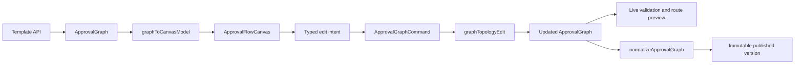
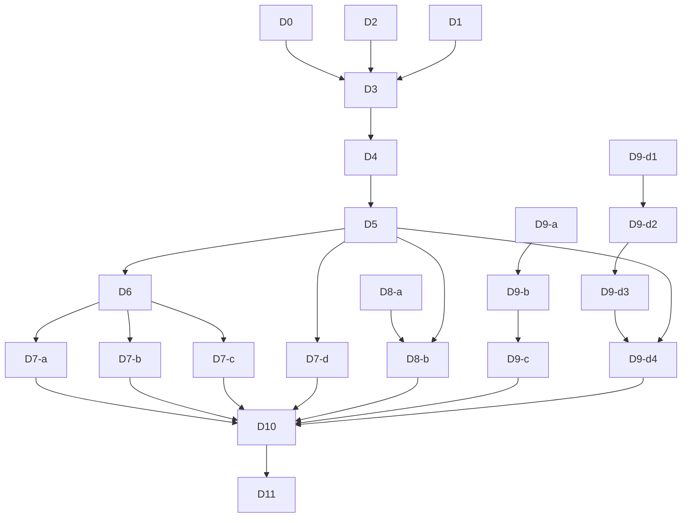

# Approval Canvas V2 Development Plan (2026-07-20)

**Status:** PROPOSED - owner ratification required before D3 runtime/UI foundation work starts  
**Baseline:** `origin/main@a98996ee2e0269b22801a6b87d2b8d5b5f076025`  
**Scope:** approval form authoring, approval-flow canvas, template versions, form/decision-value writeback, and attachment integration  
**Flags:** all new canvas behavior defaults OFF until G5 passes  
**Authoritative runtime model:** existing `ApprovalGraph` plus backend `normalizeApprovalGraph`

This document is the execution baseline for the next approval-authoring phase. It is intentionally more
specific than a roadmap: every implementation PR must map to one work item, meet its named gate, and leave
the remaining items unchanged. Runtime flags, production rollout, and UAT remain owner-controlled.

## 1. Product outcome

An ordinary business administrator must be able to complete the following workflow without seeing or
editing JSON, field IDs, edge keys, raw user IDs, or implementation terminology:

1. Build an approval form.
2. Compose a linear, conditional, or parallel approval flow on one canvas.
3. Configure each node from a contextual property inspector.
4. Preview the actual route for representative request data.
5. Save a draft, publish a version, compare versions, and restore an earlier version into a new draft.
6. Create or update a multitable record from submitted or approver-confirmed values.
7. Carry supported attachments through submission and writeback without bypassing authorization.

The target is comparable core authoring capability, not a visual clone of another product. MetaSheet's
differentiation remains the approval-to-multitable-to-automation loop.

## 2. Ratification delta from the 2026-06-24 canvas lock

The existing `docs/design/approval-visual-authoring-canvas-design-lock-20260624.md` and its TODO described
the structured list as a permanent user-facing fallback and the canvas as an additive secondary view.
The current owner direction is different: normal users should work on the canvas and should not need the
structured list or JSON-like surfaces.

Ratifying this plan therefore supersedes these earlier clauses:

- The canvas becomes the primary and eventually sole ordinary-user flow-authoring surface.
- The structured editor may remain temporarily behind an internal support/debug gate during rollout, but
  it is not a normal workflow and cannot be required to configure a node.
- Arbitrary node-position dragging is not a product feature. Dragging means a semantic move to a valid
  insertion point or branch. Layout coordinates do not enter the saved approval graph.
- The prior bespoke fixed-box SVG/HTML canvas is a compatibility baseline, not the final rendering engine.

No runtime graph semantics are superseded by this document. Existing templates and running instances keep
their current graph/version meaning.

## 3. Non-negotiable invariants

### I1 - One business model

`ApprovalGraph` remains the canonical business model. The canvas maintains a render model, but every edit
must become a typed graph command and then pass through the existing graph edit/normalization path.

### I2 - Backend remains authoritative

Frontend validation improves feedback but never relaxes `normalizeApprovalGraph`. A graph rejected by the
backend cannot be published through a canvas-only exception.

### I3 - No user-visible internals

Ordinary-user surfaces must not display raw graph JSON, form-schema JSON, field IDs, edge keys, raw assignee
IDs, or internal enum values. A separate read-only support diagnostic may exist only behind an explicit
admin/support capability.

### I4 - Stable deterministic layout

The same graph and viewport class must produce a stable vertical layout. Node coordinates are derived, not
persisted in `ApprovalGraph`. Node height is measured or declared by the renderer; edge routing must not
assume every card has one fixed height.

### I5 - Semantic drag only

Drop targets are valid graph insertion slots, branch positions, and reorder positions. A drop operation is
rejected before mutation if it would create an unsupported cycle, orphan, invalid fork/join, or illegal
node placement.

### I6 - Version isolation

Publishing creates an immutable template version. Running instances stay pinned to the version they
started with. Restoring history creates a new draft and never mutates an old published version in place.

### I7 - Permission and data handling

Node configuration, version restore, record-link selection, writeback, and attachments retain their
existing backend authorization. Client-side hiding is never the authorization boundary.

### I8 - Dormant rollout

The V2 canvas is introduced through the existing session-aware feature mechanism as an additive
`approvalCanvasV2` capability, default false. The old surface remains the fallback until G5.

### I9 - Exact-head evidence

Review and verification claims apply only to the exact pushed head. Rebasing requires rerunning the named
tests and visual evidence before merge.

## 4. Architecture

### 4.1 Proposed frontend modules

- `ApprovalFlowCanvas.vue` - viewport, selection, insertion slots, pan/zoom, fit, and keyboard focus.
- `ApprovalFlowNode.vue` plus typed node variants - business summary only; no button clusters.
- `ApprovalFlowEdge.vue` - directional connector and accessible add-node action.
- `ApprovalFlowInspector.vue` - contextual editor on desktop; bottom sheet on narrow viewports.
- `approvalCanvasAdapter.ts` - pure `ApprovalGraph` to canvas render-model adapter.
- `approvalCanvasCommands.ts` - typed add/move/remove/reorder commands and undo/redo inverses.
- `approvalCanvasLayout.ts` - deterministic layered layout adapter.
- `approvalCanvasValidation.ts` - high-value live diagnostics; backend remains final.
- `ApprovalVersionCanvas.vue` - read-only current/history overlay and restore preview.

### 4.2 Library decision

D3 evaluates `@vue-flow/core` for interaction/rendering and `elkjs` layered layout. Adoption requires:

- compatible license and acceptable bundle impact;
- custom nodes/edges and controlled drag behavior;
- deterministic layout from stable graph identifiers;
- keyboard-selectable nodes and controls;
- no requirement to persist free-form positions;
- acceptable rendering for the 100-node acceptance fixture.

If the spike fails one of these gates, D3 stops for an owner-visible alternative decision. It must not
silently fall back to extending the bespoke geometry.

## 5. Work breakdown and merge order

Each row is one reviewable PR unless the gate explicitly authorizes a split. A PR must not combine a UI hot
file migration with backend runtime semantics.

| ID    | Work item                        | Main output                                                                                                 | Model                                    | Depends on               | Exit gate |
| ----- | -------------------------------- | ----------------------------------------------------------------------------------------------------------- | ---------------------------------------- | ------------------------ | --------- |
| D0    | Interaction design lock          | Canvas IA, node anatomy, inspector schema, drag/drop states, version-diff states, desktop/narrow prototypes | Kimi K3, Codex finalization              | none                     | G0        |
| D1    | User-facing hygiene              | Remove JSON preview, internal IDs/keys, manual-ID normal path, debug logging, misleading free-position copy | Grok                                     | none                     | H1-H4     |
| D2    | Graph-command foundation         | Extract and harden pure add/remove/move/branch commands from #4433; no rendering rewrite                    | Grok                                     | none                     | C1-C5     |
| D3    | Canvas engine spike              | Vue Flow/ELK adapters, feature capability default OFF, deterministic layout, no persistence change          | Grok                                     | D0, D2                   | G1        |
| D4    | Canvas shell                     | Custom start/approval/cc/condition/parallel/end nodes, edges, insertion controls, pan/zoom/fit              | Grok                                     | D3                       | G2-a      |
| D5    | Inspector and command UX         | Right inspector, save validation, node summaries, undo/redo, keyboard selection                             | Grok                                     | D4                       | G2-b      |
| D6    | Condition and parallel authoring | Rule priority/default branch, parallel all/any, semantic branch reorder, readable labels                    | Grok                                     | D5                       | G2-c      |
| D7-a  | Handler node                     | Authoring/runtime contract for a handler/processing node                                                    | Grok, Codex contract review              | D6                       | G3-a      |
| D7-b  | Sequential approval              | Within-node ordered approvers, transfer/return interaction, and frozen execution order                      | Grok, Codex concurrency review           | D6                       | G3-b      |
| D7-c  | Assignee completeness            | Empty-assignee designated/admin fallback, user group, form department, requester-selected approver          | Grok                                     | D6                       | G3-c      |
| D7-d  | Field access enforcement         | Make hidden/readonly/editable behavior effective at submission and approval, not decorative UI              | Grok, Codex security review              | D5                       | G3-d      |
| D8-a  | Safe version service             | Rebase/split #4439 backend diff/restore contract; restore creates a new draft                               | Grok                                     | none                     | V1-V4     |
| D8-b  | Canvas version UX                | Current-vs-history overlay, before/after inspector, restore preview                                         | Kimi K3 visual pass, Grok implementation | D5, D8-a                 | G4        |
| D9-a  | New-record writeback             | Review/restack #4341 and its ledger dependency                                                              | Grok, Codex runtime review               | landed durable substrate | W1-W4     |
| D9-b  | Existing-record writeback        | Review/restack #4343 record-link authorization and update path                                              | Grok, Codex security review              | D9-a                     | W5-W8     |
| D9-c  | Approver decision values         | Review/restack #4344 value freeze and node-round identity                                                   | Grok, Codex concurrency review           | D9-b                     | W9-W12    |
| D9-d1 | Attachment contract              | Validation, size/count limits, permanent content-type rejects, schema mapping                               | Grok, Codex security review              | none                     | A1-A3     |
| D9-d2 | Attachment storage/routes        | Production storage policy, upload/download authorization, values-free errors                                | Grok, Codex security review              | D9-d1                    | A4-A5     |
| D9-d3 | Attachment lifecycle             | Bind/GC race, purge/reconcile leases, idempotent object deletion                                            | Grok, Codex concurrency review           | D9-d2                    | A6-A7     |
| D9-d4 | Attachment authoring/writeback   | Form control, draft restore, approval snapshot, FWB shaping                                                 | Grok, Kimi K3 visual pass                | D5, D9-d3                | A8        |
| D10   | Full-chain acceptance            | Product scenarios, real-DB, browser E2E, visual/a11y, compatibility, flag-off proof                         | Codex gate                               | D6-D9                    | G5        |
| D11   | Default switch and closeout      | Canary rollout, fallback window, remove ordinary-user list/JSON entry, closeout MD                          | Codex                                    | D10, owner UAT           | G6        |

### 5.1 Dependency graph

### 5.2 Safe parallel lanes

- Wave 0: D0, D1, D2, and D8-a may run in parallel in separate worktrees.
- Wave 1: D3 is serial and owns the initial canvas adapter/dependency surface.
- Wave 2: D4 then D5 are serial because both establish shared canvas component APIs.
- Wave 3: D6, D7-d, D8-b, and D9 runtime work may fan out only after their dependency is on main.
- Wave 4: D7-a/D7-b/D7-c and D9-d1..d4 may run in parallel if they do not share `ApprovalProductService` or the
  same authoring component. File ownership wins over the diagram when a conflict appears.
- Wave 5: D10 and D11 are serial.

## 6. Existing PR disposition

This section is a 2026-07-20 snapshot, not a substitute for live `gh pr view` and checks.

| PR    | Current role                                          | Required disposition                                                                                                                                                   |
| ----- | ----------------------------------------------------- | ---------------------------------------------------------------------------------------------------------------------------------------------------------------------- |
| #4433 | Restored branch authoring and vertical bespoke canvas | Mine D2/D6 behavior and tests. Do not treat the fixed-size renderer or transient coordinate sidecar as V2. Split or supersede rather than blindly merging visual code. |
| #4439 | Template version diff and safe restore                | Split D8-a backend safety from D8-b transitional text UI where practical. Rebase before review.                                                                        |
| #4482 | 125-file composite integration draft                  | Freeze as rehearsal/reference only. Never use it as the final merge vehicle. Transfer only reviewed slices.                                                            |
| #4341 | FWB-1 mapping                                         | D9-a source; rebase and review exact head.                                                                                                                             |
| #4343 | FWB-2 record-link/update                              | D9-b source; resolve stack/base state only after D9-a lands.                                                                                                           |
| #4344 | FWB-3 decision values                                 | D9-c source; retarget after D9-b.                                                                                                                                      |
| #4342 | Attachment full stack                                 | D9-d1..d4 source; diagnose stale failing checks and split because one review cannot prove all four security/concurrency scopes.                                        |
| #4457 | Previous approval-line closeout doc                   | Historical evidence only; it does not close Canvas V2.                                                                                                                 |

## 7. Named gates and acceptance evidence

### D1 hygiene checks (H1-H4)

- **H1:** The rendered ordinary-user authoring DOM contains no JSON preview, field ID, edge key, or raw
  assignee ID label; a positive control proves the test mounted a populated complex template.
- **H2:** Normal user/role/field selection uses typed pickers and business labels. Manual ID entry, if kept
  for support, is capability-gated and absent from the ordinary-user path.
- **H3:** Approval authoring emits no debug `console.log` containing graph, field, assignee, or template
  identifiers. Expected error telemetry remains values-free.
- **H4:** The cleanup changes no graph payload, backend route contract, or save/publish behavior; the existing
  authoring regression set stays green.

### D2 command checks (C1-C5)

- **C1:** Add/insert/remove linear nodes preserve stable node IDs and reconnect only the intended neighbors.
- **C2:** Add/remove/reorder condition branches preserve priority, default branch, and readable branch identity.
- **C3:** Add/remove/reorder parallel branches preserve fork/join and all/any semantics.
- **C4:** Semantic move has an inverse command; move then undo restores the normalized graph and selection.
- **C5:** Invalid cycle/orphan/fork-join operations are rejected without partial mutation, while representative
  legacy complex graphs round-trip unchanged.

### D8-a version checks (V1-V4)

- **V1:** A running instance resolves its pinned template version after newer versions publish.
- **V2:** Restore creates a new draft with provenance and never updates a published historical row.
- **V3:** `expectedLatestVersionId` or equivalent stale-base protection rejects a concurrent restore/edit.
- **V4:** Read/diff/restore endpoints enforce the intended template permissions and do not expose inaccessible
  versions through existence, count, or error-detail differences.

### D9 writeback checks (W1-W12)

- **W1:** Mapping supports only declared source and destination field types; missing/invalid values fail closed.
- **W2:** Mapping-excluded and unauthorized fields never enter the writeback payload.
- **W3:** New record, revision, idempotency claim, and durable outbox row commit in one transaction.
- **W4:** Replaying the same approval instance produces no second record or second downstream effect.
- **W5:** Record-link selection verifies that the form filler can read the selected source record.
- **W6:** Execution rechecks source existence/access and target write capability.
- **W7:** Record-link and update failures do not reveal whether an inaccessible record exists.
- **W8:** Existing-record update, revision, claim, and outbox commit atomically.
- **W9:** Approver-entered decision values freeze inside the authoritative action transaction.
- **W10:** Decision values bind to the exact node key and node-entry epoch/round.
- **W11:** Reject, skip, jump, timeout, stale card, and incomplete-node paths cannot write partial values.
- **W12:** Retry/replay reuses the frozen values and idempotency identity rather than recapturing current form state.

### D9 attachment checks (A1-A8)

- **A1:** Per-file, per-field, and per-submission count/size limits are enforced server-side.
- **A2:** SVG, HTML, XML, executable, and disguised/unsupported payloads remain permanently rejected.
- **A3:** Attachment field values contain opaque references, never storage paths or credentials.
- **A4:** Production requires the approved object store; unsupported local production storage fails closed.
- **A5:** Upload/download routes enforce template/instance/field authorization without an existence oracle.
- **A6:** Bind and GC are mutually safe under both interleavings; a bound reference never points to a deleted blob.
- **A7:** Purge/reconcile claims are leased/fenced and object deletion is idempotent and prefix-scoped.
- **A8:** Draft restore, approval snapshot, version diff, and FWB preserve only authorized attachment references.

### G0 - Design ratification

- One-canvas IA and inspector interaction are explicit.
- Node summaries fit the longest supported labels.
- Condition, parallel, validation, empty-state, loading, permission-denied, and conflict states are shown.
- Desktop and narrow layouts are defined.
- Old structured editor retirement and support-only fallback are decided.

### G1 - Model and layout compatibility

- Existing graph fixtures render without mutation.
- Load followed by save-without-edit preserves the normalized business graph.
- Layout is deterministic for linear, condition, parallel, and mixed fixtures.
- Dynamic node heights do not cause an edge to cross a card.
- No canvas coordinate appears in the approval graph payload.
- The 100-node fixture renders, fits, selects, pans, and zooms without overlap or runtime error.

### G2 - Single-canvas authoring

- **G2-a:** The custom node/edge shell renders all existing node types; every insertion control is keyboard
  reachable and has an accessible label.
- **G2-b:** A user creates, configures, reorders, and removes nodes through the inspector without opening the
  structured list; undo/redo restores both topology and selected-node context.
- **G2-c:** Conditions show readable rules and priority, never edge keys; parallel branches show all/any
  semantics and branch summaries.

### G3 - Runtime capability integrity

- **G3-a:** Handler nodes serialize to a documented graph contract, execute once in the correct round, and
  have explicit timeout/jump/return behavior.
- **G3-b:** Sequential approval freezes the ordered approver list for the node round and preserves transfer,
  add/reduce sign, return, revoke, and re-entry semantics.
- **G3-c:** Every new assignee source has a positive resolution test and an empty/unresolved negative test;
  designated/admin fallback does not broaden authorization.
- **G3-d:** Hidden fields never enter unauthorized snapshots or mappings, and readonly/editable restrictions
  are enforced server-side at submission/decision/writeback boundaries.

### G4 - Version lifecycle

- Editing a published template creates a new draft/version path.
- Running instances remain pinned to their original version.
- Diff distinguishes add/remove/change and shows property before/after values.
- Restore preview compares the selected historical version with the current version on the same canvas.
- Restore creates a new draft and handles stale latest-version conflicts fail-closed.

### G5 - Full-chain acceptance

The following scenarios must run through real product entry points, not only pure helpers:

| Scenario              | Required result                                                                                  |
| --------------------- | ------------------------------------------------------------------------------------------------ |
| S1 Linear             | requester -> approval -> cc/end publishes and executes                                           |
| S2 Conditional        | two ordered conditions plus default select the expected branch                                   |
| S3 Parallel all       | all branches must complete before join                                                           |
| S4 Parallel any       | first valid branch completion advances without corrupting siblings                               |
| S5 Dynamic assignee   | manager/role/form-driven resolution and empty fallback are visible and correct                   |
| S6 Field access       | hidden/readonly/editable behavior holds through submit, approve, history, and writeback          |
| S7 Version            | publish v1/v2, inspect diff, run v1 instance, restore v1 to a new draft                          |
| S8 New-record FWB     | independent approval form creates exactly one multitable record                                  |
| S9 Update FWB         | approver-confirmed values update the authorized selected record exactly once                     |
| S10 Attachment        | accepted file binds, survives approval, and is written back; rejected type/size remains rejected |
| S11 Legacy round-trip | representative pre-V2 complex graphs open and save without semantic drift                        |
| S12 Scale             | 100-node mixed graph remains readable and operable with no edge/card overlap                     |

### G6 - Rollout

- Default remains OFF through internal and tenant canary.
- Canary telemetry covers load/save failure, backend validation failure, layout failure, and fallback use,
  without logging form values or identifiers not already approved for telemetry.
- Owner UAT signs off before default ON.
- The structured-list ordinary-user entry is removed only after the fallback window closes.

## 8. Verification matrix

| Layer               | Required verification                                                                                        |
| ------------------- | ------------------------------------------------------------------------------------------------------------ |
| Pure graph commands | Unit matrices for add/move/remove/reorder, cycle/orphan/fork-join rejection, inverse commands                |
| Adapter/layout      | Determinism, dynamic-height routing, 100-node fixture, no graph mutation                                     |
| Vue components      | Mounted tests for node selection, inspector updates, insertion menu, keyboard access, undo/redo              |
| Backend contract    | Existing `normalizeApprovalGraph` suites plus new node/mode/field-permission contracts                       |
| Version/runtime     | Real-DB tests for version pinning, stale restore conflict, FWB transaction/idempotency, attachment bind/GC   |
| Browser             | Playwright at 1440x900, 1280x800, 1024x768, and 390x844; no overlap or clipped controls                      |
| Visual              | Baseline screenshots for S1-S7 and long-label/validation states; Kimi K3 performs a separate visual critique |
| Accessibility       | Keyboard-only core authoring, visible focus, accessible names, contrast, and inspector focus return          |
| Regression          | Required `web-tests`, approval web guard, backend targeted suites, typecheck, and build                      |

Every load-bearing guard requires a discriminating negative test or mutation. A source-text assertion alone
does not prove graph behavior, authorization, transactionality, or layout correctness.

## 9. Model operating procedure

### Kimi K3

- Owns D0 interaction alternatives, node anatomy, inspector hierarchy, copy, responsive behavior, and
  post-implementation screenshot critique.
- May create a disposable frontend-only prototype in an isolated worktree.
- Does not decide graph/runtime contracts, authorization, persistence, or merge status.
- Does not directly rewrite `TemplateAuthoringView.vue` on the production implementation branch.

### Grok

- Implements one bounded D-item in an isolated worktree from an exact base SHA.
- Receives allowed files, forbidden files, contracts, acceptance tests, and required commands before work.
- Runs tests and commits/pushes but never self-merges or broadens scope.
- Does not modify a ratified design decision because a local implementation is easier.

### Codex

- Owns baseline verification, task packets, contract reconciliation, exact-head review, integration order,
  Playwright visual QA, and final go/no-go verdicts.
- Re-runs load-bearing tests independently and checks served PR diff/body, not only the agent report.
- Stops a lane when it crosses authorization, data, security, concurrency, or hot-file boundaries.

### Per-PR handoff packet

Every delegated implementation starts with:

1. Plan item and exact base SHA.
2. Allowed and forbidden paths.
3. Existing contracts that must remain unchanged.
4. User-visible acceptance criteria.
5. Required positive and negative tests.
6. Required screenshots/viewports for UI work.
7. Feature-flag and rollback behavior.
8. Commit/push allowed; merge forbidden.

## 10. PR and execution-ledger discipline

Each PR body must contain:

- `Plan item` (one D-item only);
- exact base and dependency PRs;
- allowed scope and explicit non-goals;
- user-visible behavior;
- compatibility and rollback statement;
- commands run with exact counts/results;
- screenshots for UI work;
- discriminating mutation/negative proof;
- next item unlocked by merge.

The ratified plan is not edited by every implementation lane. A single coordinator maintains a GitHub issue
as the live status ledger, with these states:

- `NOT_STARTED`
- `IN_PROGRESS`
- `REVIEW`
- `CHANGES_REQUESTED`
- `APPROVED`
- `MERGED`
- `BLOCKED` with an explicit blocker

This prevents every concurrent PR from conflicting on one shared checklist file. The final D11 closeout MD
reconciles the plan with as-built commit SHAs and honest deviations.

## 11. Stop conditions (anti-drift tripwires)

Stop the current lane and return to review if any of the following occurs:

- a normal user must open JSON or type an internal ID to finish a workflow;
- save-without-edit changes an existing graph's business meaning;
- canvas positions enter the runtime graph or become required to execute it;
- the new canvas needs the structured list to configure any supported node;
- an implementation changes backend graph semantics without a separately approved contract slice;
- one PR mixes authoring-hot-file migration with FWB/attachment runtime changes;
- a model edits a file outside its allowed-path packet;
- a security, permission, transaction, or concurrency claim is supported only by mocks or text scans;
- visual evidence is from a different head than the reviewed code;
- #4482 is proposed as one-shot merge rather than a source/rehearsal branch;
- any canvas/FWB/attachment flag is enabled before G5 and owner UAT.

## 12. Initial execution ledger

| Item      | Initial state | First action                                                                         |
| --------- | ------------- | ------------------------------------------------------------------------------------ |
| D0        | NOT_STARTED   | Kimi K3 prepares three representative flow prototypes and an interaction state table |
| D1        | READY         | Grok removes user-visible internals in a small frontend-only PR                      |
| D2        | READY         | Re-review #4433 and extract pure command/branch tests without blessing its renderer  |
| D3-D7     | BLOCKED       | Wait for D0 ratification and predecessor merge                                       |
| D8-a      | READY         | Re-review/rebase #4439 and isolate safe restore backend contract                     |
| D8-b      | BLOCKED       | Wait for D5 and D8-a                                                                 |
| D9-a      | REVIEW        | Re-check #4341 against current main and landed durable substrate                     |
| D9-b/D9-c | BLOCKED       | Land the FWB stack bottom-up                                                         |
| D9-d1..d4 | REVIEW        | Diagnose #4342 exact-head CI, then split it along the four attachment scopes above   |
| D10-D11   | BLOCKED       | Wait for all required implementation gates                                           |

## 13. Owner ratification checklist

Ratifying this plan confirms only the development order and product direction. It does not enable runtime
flags or production rollout.

- [ ] O1 - Canvas is the normal user's sole flow-authoring surface after G6.
- [ ] O2 - The structured editor becomes temporary support-only fallback, then ordinary-user entry is removed.
- [ ] O3 - D3 may add Vue Flow/ELK dependencies if the spike satisfies section 4.2.
- [ ] O4 - Dragging is semantic placement; arbitrary persisted positions are out of scope.
- [ ] O5 - D7 capability additions require separate runtime-contract review where the current graph lacks them.
- [ ] O6 - Version restore always creates a new draft and never rewrites published history.
- [ ] O7 - FWB and attachments remain independent runtime lanes and converge only at D10.
- [ ] O8 - Kimi K3 designs/critiques; Grok implements bounded slices; Codex independently gates each head.
- [ ] O9 - No feature flag turns ON before G5, owner UAT, and a separate enablement decision.

## 14. Definition of complete

This development line is complete only when:

1. D0-D11 are reconciled as MERGED or explicitly removed by an owner decision.
2. G0-G6 have named exact-head evidence.
3. S1-S12 pass through real product entry points.
4. Ordinary users can author supported approval flows without JSON, internal IDs, or the structured list.
5. Existing templates and running instances retain their semantics and version pinning.
6. Form values, approver-confirmed values, record links, and supported attachments reach multitable through
   authorized, idempotent paths.
7. The closeout MD records as-built SHAs, test evidence, screenshots, flags, residual gaps, and owner-only
   rollout actions without declaring unbuilt code complete.
