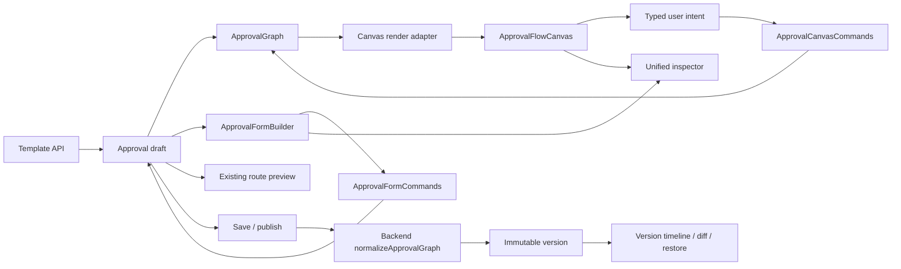
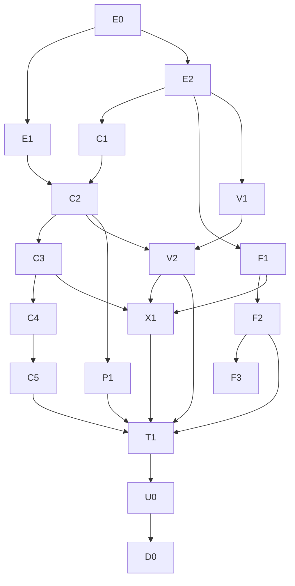

# 审批编辑器与流程编排对标开发计划（2026-07-27）

**状态：IN PROGRESS（E0 / E1 / E1-b / E2 / C1 / C2 已完成并形成待审 Draft PR；C3 以后及 F1-F3 仍在开发队列）**

**事实审计基线：** `origin/main@d449aa7e6d02f94df2738a77cafffa778b12fde0`

**E2 实现基线：** `origin/main@9da0335b4`（2026-07-28）

**范围：** 审批模板编辑器、表单设计器、流程画布、节点检查器、路由试运行、版本查看/比较/恢复、浏览器验收和灰度启用。

**不在本计划内：** 修改审批运行时语义、自由连线白板、生产 flag 直接开启、真实租户 UAT 代执行、FWB/附件/钉钉凭据变更。

本计划刷新而不替代以下文档：

- `approval-canvas-v2-development-plan-20260720.md`
- `approval-canvas-v2-interaction-design-lock-20260721.md`
- `approval-automation-canvas-completion-closeout-verification-20260722.md`

旧文档分别记录目标合同、早期执行分解和基础工程收口。本计划只排列当前 `main` 上仍未完成的产品化差距，不把已落地能力重新开发，也不把“已合入、CI 绿、flag OFF、UAT 未做”混写成同一状态。

---

## 1. 产品目标

普通业务管理员无需接触 JSON、字段 ID、边 key 或原始成员 ID，即可在一个编辑工作区完成：

1. 从控件面板添加并排序表单字段；
2. 在垂直流程画布上配置线性、条件和并行流程；
3. 点击节点，在同一检查器中配置审批人、审批方式、字段权限、条件优先级和并行汇聚方式；
4. 用边上的 `+` 插入节点，也可把字段或节点拖到合法语义槽位；
5. 对代表性表单数据执行真实路由试运行；
6. 保存草稿、发布版本、查看历史差异并恢复为新草稿；
7. 在桌面、紧凑桌面和窄屏上完成等价操作；
8. 保留结构化辅助编辑入口，直到键盘和辅助技术等价性有真实浏览器证据。

对标目标是飞书/钉钉的核心创作闭环和可理解性，不是复制视觉皮肤。飞书管理员手册描述的中部流程设计区和边上 `+` 添加审批人、抄送人、办理人、条件分支，是本计划的最低交互基线；MetaSheet 保留更严格的语义拖拽、版本恢复和审批数据写回差异化能力。

参考：

- [飞书审批管理员手册](https://www.feishu.cn/hc/zh-CN/articles/360033971554-%E9%A3%9E%E4%B9%A6%E5%AE%A1%E6%89%B9%E7%AE%A1%E7%90%86%E5%91%98%E6%89%8B%E5%86%8C)
- [钉钉 OA 审批业务控件](https://open.dingtalk.com/document/dashboard/oa-approval-business-controls-overview)

---

## 2. 当前实现对账

### 2.1 已完成，禁止重建

| 能力 | 当前证据 | 本计划处置 |
|---|---|---|
| 审批图业务模型 | `ApprovalGraph` + 后端 `normalizeApprovalGraph` | 保持唯一权威，不引入第二份画布模型 |
| 条件/并行拓扑 | `graphTopologyEdit.ts`、`parallelEdit.ts` | 只改善交互，不改运行时语义 |
| 语义移动/分支排序/逆操作代数 | `approvalCanvasCommands.ts`（577 行） | 接入 UI 和统一历史，不重写算法 |
| 表单增删排序与依赖保护 | `approvalFormCommands.ts`（521 行） | 接入 palette/键盘/拖拽，不另造命令层 |
| 确定性布局、缩放、适应画布、缩略图 | `graphLayout.ts`、`canvasViewport.ts`、`TemplateAuthoringView.vue` | 作为 renderer 输入和回归基线 |
| 复杂图画布和右侧节点配置 | `TemplateAuthoringView.vue` + `ApprovalGraphNodeConfigEditor.vue` | 抽组件并产品化，不复制配置逻辑 |
| 路由试运行 | 既有 template-author dry-run 和 stale-result guard | 迁入统一检查器，不新建 preview 服务 |
| 版本读取、差异、恢复 | `TemplateDetailView.vue`、`templateVersionDiff.ts`、`restoreTemplateVersion` | 保留安全合同，只升级呈现 |
| 安全恢复语义 | 恢复创建新草稿；`expectedLatestVersionId` 并发保护；运行实例继续 pin 历史版本 | 必须持续有真实 API/DB 回归 |
| FWB 和附件底座 | 已落 `main`，独立 flag 和独立验收 | 只做编辑器兼容回归，不借 Canvas flag 开启 |

### 2.2 已部分完成，不能宣称对标完成

| 用户面 | 当前 `main` | 对标差距 |
|---|---|---|
| 信息架构 | C2 在 Canvas flag ON 时提供表单/流程直接模式切换 | shell、字段 builder 和版本工作区仍待继续拆分 |
| 线性流程 | C1 派生统一 Canvas carrier；C2 默认进入流程画布 | 边 `+`、统一历史和拖拽反馈仍未产品化 |
| 复杂流程 | flag ON 后默认 Canvas；结构视图保留为“辅助编辑模式” | 节点按钮群、分支拖排和 undo/redo 尚未收口 |
| 节点操作 | 节点内上移/下移/移动/插入/删除按钮群 | 应改为边 `+`、上下文菜单和检查器动作 |
| 拖拽 | 审批/抄送节点可移入合法边槽 | 缺合法槽持续高亮、统一拖拽状态机和分支拖排 UI |
| 撤销/重做 | 命令层有逆操作/历史类型 | 顶栏未挂载统一 undo/redo |
| 表单设计 | 已有字段拖排；新增字段靠“添加字段”按钮 | 缺控件 palette 拖入、字段插入槽和字段检查器 |
| 检查器 | 复杂画布已有右侧检查器 | 线性流程、字段、版本差异未统一；窄屏不是正式 bottom sheet |
| 版本比较 | 表格历史 + 变化列表 + 单画布 overlay | 缺编辑器内时间线、双画布并排和 before/after 检查器 |
| 可访问性 | 部分按钮/键盘事件和结构列表 fallback | 缺完整键盘创作、live region、焦点恢复和真实浏览器证明 |
| 浏览器验收 | 主要为 Vitest/jsdom 和真库 API | 没有审批编辑器 Playwright 视觉/交互矩阵 |
| 文件边界 | `TemplateAuthoringView.vue` 3732 行/约 150 KB | 热文件继续叠功能会扩大回归和并行冲突 |
| feature flag | `approvalCanvasV2` 默认 `false` | 未经 staging UAT，不得开启生产 |

### 2.3 状态纪律

1. `approval-canvas-v2-interaction-design-lock-20260721.md` 的仓内状态仍写 `PROPOSED`。本计划不把历史实现合入自动解释为整份锁已 ratify。
2. 进入 E2 以前，owner 需要确认剩余交互方向：canvas-first、结构化辅助模式保留、边 `+`、统一 undo/redo、表单 palette、版本双画布。
3. 每一项必须分别记录：设计状态、代码状态、CI 状态、合入状态、部署状态、UAT 状态、flag 状态。

---

## 3. 目标架构

### 3.1 组件边界

- `TemplateAuthoringView.vue`：路由、加载、保存/发布、权限和全局草稿协调；不再承载具体画布和字段编辑 DOM。
- `ApprovalAuthoringShell.vue`：顶栏、表单/流程切换、状态、undo/redo、试运行和版本入口。
- `ApprovalFlowCanvas.vue`：选择、焦点、viewport、插入槽、拖拽会话、live region；不直接改图。
- `ApprovalFlowNode.vue` / `ApprovalFlowEdge.vue`：业务摘要和交互外壳；不下沉业务校验。
- `ApprovalFlowInspector.vue`：节点/分支/字段/全局检查；复用现有 `ApprovalGraphNodeConfigEditor`。
- `ApprovalFormBuilder.vue`：控件 palette、字段序列、插入槽和字段检查器；调用 `approvalFormCommands.ts`。
- `ApprovalVersionWorkspace.vue`：历史时间线、双画布比较、before/after 检查器和恢复预览。
- `approvalCanvasCommands.ts` / `approvalFormCommands.ts`：唯一写命令入口；renderer 不复制拓扑规则。

### 3.2 Renderer 决策

E1 spike 只允许以下两种结果：

1. **Vue Flow 负责渲染/交互，继续使用现有 `computeLayout` 提供确定性坐标。** 这是首选验证路径，可避免立即引入约 427 KB gzip 且带 EPL/GPL 许可选择的 ELK。
2. **保留现有 renderer，但必须证明全部 V 系列验收、100 节点性能、键盘焦点和边槽命中。**

E1 不得默认引入 ELK。只有现有布局在构造的条件/并行/长标签/100 节点 fixture 上失败，且 owner 接受 bundle 与许可证后，才能单独提案 lazy-loaded ELK。

---

## 4. 执行切片和合入顺序

每行默认一个 PR。除 E0/E1/U0 外，前置依赖必须先进入 `main`，不得长期 stacked 在未审热文件上。

| ID | 工作 | 主要输出 | 前置 | 模型主责 | 必过门 |
|---|---|---|---|---|---|
| E0 | exact-head 全链审阅和状态对账 | 代码/设计锁/flag/旧 PR 清单；截取当前 UI 基线；不改产品代码 | 无 | Codex；Claude Opus 对抗复核 | A0 |
| E1 | renderer + 视觉 spike | Vue Flow+现有布局与现 renderer 对照；1440/1024/390 原型；bundle/a11y/100 节点数据 | E0 的 fixture/约束清单 | Kimi K3 视觉；Grok spike；Codex裁决 | A1 |
| E2 | 热文件无行为抽取 | 拆 `TemplateAuthoringView` 为 shell/form/flow/inspector 边界；DOM、payload、flag OFF 字节等价 | E0 | Sonnet 5；Codex复核 | A2 |
| C1 | 统一线性/复杂图适配 | 线性草稿派生为画布 render model；未编辑保存 round-trip 等价；不持久化坐标 | E2 | Grok；Claude Opus图不变量复核 | C1 |
| C2 | canvas-first 工作区 | flag ON 默认画布；表单/流程 segmented control；结构列表保留为“辅助编辑模式” | C1,E1 | Grok + Kimi K3视觉复核 | C2 |
| C3 | 边 `+` 和插入菜单 | 所有合法边槽可点/键盘插入；菜单只列合法节点类型；节点按钮群移除 | C2 | Grok | C3 |
| C4 | 语义拖拽和分支排序 | 节点/条件优先级/并行分支拖排；合法槽高亮；非法落点 no-op + live message | C3 | Grok；Claude Opus命令复核 | C4 |
| C5 | 统一 undo/redo | 顶栏按钮、快捷键、选择/焦点恢复；Canvas 和 inspector 共用一条历史 | C4 | Grok；Codex复核 | C5 |
| F1 | 表单组件抽取和 palette | 左侧控件库点击/拖入、中部真实表单画布与字段插入槽、拖排/键盘等价、右侧字段属性检查器；复用表单命令层 | E2 | Sonnet 5抽取；Grok交互；Kimi K3视觉 | F1 |
| F2 | 字段检查器与引用保护 | 字段属性、选项、明细、显隐、record-link；移动/删除依赖明确拒绝或保留 | F1 | Grok；Codex数据合同复核 | F2 |
| F3 | 附件 authoring 兼容 | 仅在附件运行时锁和 flag 条件满足时向 palette 开放；旧模板/flag OFF 不变 | F2 | Grok；Claude Opus安全复核 | F3 |
| V1 | 版本入口整合 | 编辑器顶栏版本时间线、发布说明和当前草稿；复用现有 API | E2 | Sonnet 5 | V1 |
| V2 | 双画布 diff + 恢复预览 | 左历史/右当前、同步缩放、文字+轮廓变化、before/after inspector | V1,C2 | Grok + Kimi K3；Codex复核 | V2 |
| P1 | 试运行整合 | 既有 route-preview 嵌入检查器；结果高亮真实画布；stale guard 不变 | C2 | Sonnet 5；Codex复核 | P1 |
| X1 | 响应式和可访问性 | 360/320 检查器、390 bottom sheet、键盘全路径、focus return、live region | C3,F1,V2 | Grok + Kimi K3 | X1 |
| T1 | 浏览器验收和 required CI | Playwright 三 viewport、视觉/DOM测量、键盘构建、100节点、旧图 round-trip、flag OFF | C5,F2,V2,P1,X1 | Grok测试；Codex最终 gate | T1 |
| U0 | staging UAT 与 canary | 基线截图、任务脚本、缺陷分诊、回滚演练；不直接开生产 | T1 | Codex协调；owner执行真实租户动作 | U0 |
| D0 | 三份收口文档 | 设计锁 delta、执行台账、收尾验证 MD；逐项列明未完成 owner 门 | U0 | Fable 5起草；Codex定稿 | D0 |

E0 已在 exact `origin/main@d449aa7e6d02f94df2738a77cafffa778b12fde0`
完成。判定、可复现探针、能力矩阵及 E1 夹具约束见
`approval-editor-flow-parity-e0-audit-20260727.md`。该完成状态只关闭
E0 审计任务，不改变本计划和历史交互锁的 `PROPOSED` / owner-gated 状态。

E1 的隔离 DOM + SVG renderer feasibility spike 已完成，真 Chromium
三 viewport 通过，100 节点两次布局确定且约 105ms，无新生产依赖。
E1-b 又把分支重排、合法/非法节点移动、undo/redo、HTML5 drag 和键盘
移动接到生产 `approvalCanvasCommands`，并证明 renderer 坐标不进入
`ApprovalGraph`。稳定键选择恢复的判别变异会使 Playwright 精确转红。
因此 A1 的 renderer feasibility 门记录为 `PASS`；该 PASS 不等于 C1-C5
产品接线完成，也不授权开启 Canvas flag。详见
`approval-editor-flow-parity-e1-renderer-spike-verification-20260727.md`。

E2 已在 `origin/main@9da0335b4` 的隔离分支完成第一刀无行为抽取：
`TemplateAuthoringView.vue` 从 3732 行降为 3340 行，新
`ApprovalFlowCanvas.vue` 只接收派生 props 并发出 typed intents，业务状态、
保存/发布和拓扑命令仍由父层拥有。13 个审批 authoring 测试文件
247/247、ESLint、`vue-tsc` 通过；中和 drop intent 后拖放断言精确转红。
修复静态 style 守卫误判后，Draft PR #4642 的 required CI 已全绿；尚未
merge 或部署。

C1 已在 E2 head 上完成线性/复杂流程统一载体。线性 Canvas inspector
直接写现有 `ApprovalStepDraft`，只查看/切换画布不会生成 shadow carrier、
不会置 dirty，也不会改变 save payload；首次拓扑编辑通过既有命令层
promote 为 graph，并保留审批来源、ids、审批/空值/自审策略及字段权限。
feature flag OFF 和 unsupported template 继续 fail-closed 回结构列表。
Kimi exact-head 对抗复审为 APPROVE、无 P1/P2；其发现的 promote 后可继续
删除最后审批节点边界已修复并由判别变异钉死。Draft PR #4649 依赖 #4642，
required CI 已全绿；尚未 merge、部署或开启 flag。

C2 已在 C1 head 上完成 canvas-first 工作区。Canvas flag ON 时，线性与复杂
流程都默认进入流程画布，表单/流程可在同一工作区直接切换；原结构视图改名
为“辅助编辑模式”并保留为可访问回退。隐藏挂载 Canvas 在返回流程模式时会
重新测量 viewport，避免 0x0 缩略图状态。真实 Chromium 在 1440 / 1024 /
390 验证默认画布、表单往返、辅助模式和零横向溢出；四刀判别变异分别钉住
默认模式、模式切换、viewport 重测和 ARIA group 语义。Kimi 对抗复审无
P1/P2。Draft PR #4652 依赖 #4649，required CI 已全绿；未 merge、部署或
开启 flag。

### 4.1 依赖图

### 4.2 可并行车道

- **Wave 0：** E0 代码审阅与 Kimi K3 视觉研究可并行。E0 先交付 graph fixture/约束清单，Grok 才启动 E1 renderer spike；E0 的其余状态审计可继续并行。E1 只产隔离原型和数据，不做产品提交。
- **Wave 1：** E2 单独占有 `TemplateAuthoringView.vue`。这一波不允许第二个模型同时修改该文件。
- **Wave 2：** C1/C2 串行；F1 与 V1 可在 E2 合入后并行，因为分别拥有 form 与 version 组件。
- **Wave 3：** C3-C5 串行；F2 和 V2 可并行；P1 在 C2 后独立进行。
- **Wave 4：** X1 在各交互面稳定后统一收口；T1 不得由实现模型自判通过。
- **Wave 5：** U0 和 D0 串行；UAT 失败返回对应切片，不在收尾文档里豁免。

### 4.3 热文件所有权

| 文件/边界 | 同时 owner 数 | 规则 |
|---|---:|---|
| `TemplateAuthoringView.vue` | 1 | E2 抽取期间独占；之后原则上只留协调改动 |
| `approvalCanvasCommands.ts` | 1 | C3-C5 共用一个实现 owner；审阅模型只读 |
| `approvalFormCommands.ts` | 1 | F1-F2 共用一个实现 owner |
| `ApprovalGraphNodeConfigEditor.vue` | 1 | Canvas inspector 与辅助列表复用，不复制 |
| `TemplateDetailView.vue` / version API | 1 | V1 先抽取，V2 不与其并行改同一文件 |
| `ApprovalProductService.ts` / `ApprovalGraphExecutor.ts` | 1 | 本计划原则上不修改；一旦需要运行时语义立即停线并另立锁 |

---

## 5. 模型编排

### Codex

- 总体协调、exact-head 事实核对、依赖/热文件控制、最终代码审阅和验收裁决；
- 所有涉及 `ApprovalGraph`、权限、版本恢复、payload round-trip 的最终签字；
- 不以其他模型的“测试通过”代替读取运行列表、失败注入和 exact SHA。

### Claude Opus 4.8

- 只读对抗审阅：图不变量、命令逆操作、权限、历史恢复、旧图兼容；
- 构造反例，不担任同一切片的主要实现者；
- 使用 Goal 模式时目标固定为“找出可反驳当前交付声明的最小反例”，不得自动合并或开启 flag。

### Grok

- 主要前端实现、拖拽状态机、Vue Flow/renderer spike、Playwright；
- 每个实现任务必须给出 exact files、禁止运行时变更、必跑测试和停止条件；
- 产物由 Codex 逐文件复核，不接受只给截图或测试数字。

### Kimi K3

- 视觉 IA、节点/边/检查器/表单 palette/版本 diff 原型和截图批评；
- 不决定 graph schema、权限或持久化合同；
- 每轮只提交视觉规格或隔离原型，不直接改安全/运行时文件。

### Sonnet 5

- 低风险组件抽取、类型迁移、现有功能搬迁和 version/form 中等复杂度实现；
- 不单独负责并发、权限或拓扑算法。

### Fable 5

- 执行台账、测试证据整理、最终 MD 初稿；
- 不把文档声明当作代码完成证据；不可自 ratify。

---

## 6. 验收门

### A0：事实基线

- 当前 `origin/main`、feature flag 默认值、相关开放/已吸收 PR、设计锁状态全部记录；
- 1440×900、1024×768、390×844 当前页面截图齐全；
- 任何“已完成”结论都能落到文件/测试/运行态证据。

### A1：renderer 决策

- 相同 graph 和 viewport 连续两次坐标一致；
- condition/parallel 顺序不漂移，边不穿卡；
- 100 节点混合图可交互，记录渲染时间和 bundle 增量；
- 键盘焦点、edge `+`、drag slot 均可实现；
- license 清单明确。未过即停，不进入 C2。

### A2：无行为抽取

- flag OFF 的 DOM、API payload 和保存/发布行为与抽取前等价；
- 旧图加载后不编辑直接保存，规范化 graph 等价；
- 原有 required web tests 不删不弱化。

### C1-C5：画布

- 线性、条件、并行均从同一画布进入，不因图形复杂度切换产品；
- 所有写操作走 typed command；renderer 中零拓扑业务逻辑；
- 边插入、拖拽、键盘、上下文菜单产生同一规范化 graph；
- cycle/orphan/非法 fork-join/nested parallel 在变更前拒绝，graph 零部分修改；
- move→undo 和 reorder→undo 恢复 graph、selection 和 focus；
- 结构列表在 S12 以前仍可到达，但不再是默认入口。

### F1-F3：表单

- 每种可编辑字段可由点击和拖入添加，结果一致；
- 字段移动不改变 ID，不静默改写 visibility/condition/assignee/permission/FWB 引用；
- 删除有依赖字段明确列出业务名称并拒绝或确认迁移，不显示 raw ID；
- attachment 只有独立 flag ON 且后端合同可用时可创建；OFF 时旧行为不变。

### V1-V2：版本

- 发布版本不可变，运行实例继续解析原 pinned version；
- 恢复永远创建新草稿，历史版本不被 UPDATE；
- 并发恢复以 `expectedLatestVersionId` fail closed；
- 无权限用户无法从 list/detail/diff/restore 的错误、数量或时间差推断版本存在；
- 双画布 added/removed/changed/moved 都有文字，不只用颜色。

### T1：浏览器和 CI

- Chromium 真浏览器完成：添加字段→条件→并行→审批人→试运行→保存→发布→比较→恢复；
- 1440、1024、390 三 viewport 无重叠、无页面横向滚动、文字不溢出；
- 键盘独立完成线性+条件+并行创作；
- 100 节点 fixture 无卡片相交、无边穿卡，操作延迟有阈值；
- network capture 证明 payload 无坐标、无 renderer 状态；
- Playwright spec 进入 required CI；path filter 同时覆盖组件、命令层、layout、version 文件；
- positive control 证明测试真正挂载并操作了画布，而不是 skip-green。

---

## 7. UAT 任务

U0 至少包含以下 12 项，全部保存截图、录屏或网络/数据库证据：

1. 新建线性审批并发布；
2. 从控件 palette 拖入文本、日期、选项、人员和关联记录；
3. 添加条件分支，验证优先级和默认分支；
4. 添加并行分支，分别验证 `all` 和 `any`；
5. 移动审批/抄送节点到合法边槽；
6. 向非法槽位拖动，确认 graph 和保存 payload 不变；
7. undo/redo 恢复结构、配置和焦点；
8. 用真实成员/角色/部门来源试运行；
9. 发布 v1，修改后发布 v2，查看业务化差异；
10. 将 v1 恢复为新草稿，确认 v1/v2 和运行中实例不变；
11. 390 宽度完成插入、配置和保存；
12. 辅助编辑模式与画布保存同一 graph。

结果分诊：

- **产品代码缺陷：** 回对应切片修复并重跑该切片及下游；
- **环境/账号/目录缺陷：** 记录值域无关证据，不修改产品代码掩盖；
- **第三方依赖缺陷：** 保持 fail closed，单列 owner 决策；
- **仅视觉偏差：** Kimi K3 复核后进入小型 polish PR，不和安全/拓扑修复混合。

---

## 8. Flag 与回滚

1. `approvalCanvasV2` 继续默认 OFF。
2. T1 通过后只允许 staging 单租户启用。
3. staging 顺序：内部管理员模板 → 新模板 → 既有线性模板 → 既有复杂模板。
4. 每一档观察保存失败、normalize 拒绝、客户端异常、UAT 任务完成率和回退次数。
5. Canvas flag 只控制作者界面，绝不联动 FWB、附件、durable、Class A/B。
6. 回滚为关闭 Canvas flag；数据层不得依赖 Canvas 专属坐标或状态，因此旧编辑器仍能读取同一 graph。
7. 生产开启和结构化辅助入口退役均为独立 owner 决策；后者还需辅助技术等价证据和观察窗口。

---

## 9. 明确不做

- 任意自由连线、自由坐标、保存画布位置；
- 跨条件/并行区域的任意拖排；
- 移动端原生流程编排应用；
- 新 handler/processing 节点、组审批人、发起人自选审批人、表单部门→负责人等新运行时语义；
- 在本计划内开放 FWB number 映射；
- 因 UI 对标而改变版本、权限、附件或 durable 的安全合同；
- 在真实浏览器证据前移除结构化辅助编辑模式。

上述能力如需开发，必须单独设计锁和验收，不得塞入 C/F/V 切片。

---

## 10. 文档交付

执行中持续维护三份文档：

1. **设计锁 delta**：本文；只记录相对 2026-07-21 锁的 owner 决策、
   renderer 选择和明确非目标；
2. **执行台账**：
   `approval-editor-flow-parity-execution-ledger-20260728.md`；记录每个 ID
   的 SHA、实现模型、复核模型、测试、CI、合入和 flag 状态；
3. **收尾验证 MD**：
   `approval-editor-flow-parity-closeout-verification-20260728.md`；记录
   exact head、浏览器证据、判别变异、残余风险和 owner-only 开关。

禁止在 T1/U0 前把文档状态写成 `FINAL`。正确中间状态为：

`DESIGN RATIFIED` → `IMPLEMENTED` → `CI GREEN` → `MERGED` → `STAGING UAT PASS` → `PRODUCTION ENABLED`。

---

## 11. 首轮执行建议

以下三项已按隔离车道执行：

1. **E0：完成。** Codex exact-head 审阅，Claude Opus 只读对抗复核；
2. **E1 / E1-b：完成。** Kimi 提供视觉 IA，Grok 构建隔离 renderer 和生产命令适配验证，Codex 复核与变异；
3. **E2 / C1 / C2：完成待审。** Claude 负责 shell 与统一 carrier，Codex 完成 canvas-first 接线、真浏览器验证和判别变异，Kimi 复审。

本轮尚未启动 C3-C5、F1-F3 及版本/试运行收口，没有开启任何 flag，也没有
接触审批运行时服务。下一开发点为 C3 边 `+` 产品化与 F1 表单 palette；
不得把 C2 验证通过解释为整条编辑器已达到飞书/钉钉产品完成度。
