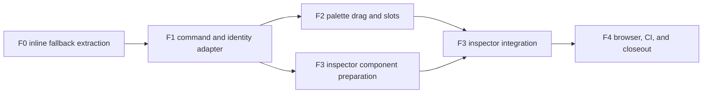

# Approval Form Builder Parity Delta Design Lock (2026-08-11)

**Status:** RATIFIED (2026-08-17 — §10 record; authorizes F0-F4 development and tests only; no merge/UAT/flag authority)
**Baseline:** `origin/main@5b31cb43496c5aaf11b4f821254ed63a345c11e1` (REFRESHED 2026-08-17 per master P0-A;
the original 2026-08-11 draft was pinned to `0287b250b`, 55 commits behind — every stale statement is corrected below)
**Parent authorities:**

- `docs/development/approval-parity-master-design-lock-20260817.md` — the program master; its §M3 names this
  delta's FB-D5/FB-D6 as the two owner-decision interfaces, and its P0-A gates this document's ratification
- `docs/development/approval-canvas-v2-interaction-design-lock-20260721.md` — **RATIFIED** (G0 record
  `approval-canvas-g0-ratify-20260815.md`, 2026-08-15; O3 Vue Flow/ELK: DEFER)
- `docs/development/approval-canvas-v2-development-plan-20260720.md`
- `docs/development/approval-canvas-data-closure-owner-handoff-20260808.md`
- `docs/development/approval-parity-execution-ledger-20260817.md` — execution truth; F4's slice ledger feeds it
  rather than duplicating it

**Scope:** close the ordinary-user form-authoring gap between the current click-to-append editor and a
DingTalk/Feishu-class palette -> form canvas -> property inspector workflow.
**Implementation / verification split:** bounded slices use the model tier in section 6; Codex independently reviews
exact heads, constructs failure probes, reruns browser and required gates, and owns the final verification record; the
human owner ratifies, merges, runs tenant UAT, and decides flag enablement.
**Runtime posture:** all approval flags remain default OFF. This document does not merge code, deploy a build, run UAT,
or enable a flag.

---

## 0. Why this delta exists

The Canvas V2 engineering line is on `main` through #4806, the residual waves #4815-#4826, the wave-3 closeout
(#4912), the G0 RATIFY record (#4914), the authoring-shell restyle (#4917 — which landed the live three-region
palette / phone-preview / inspector shell with draggable palette chips), and the parity program master lock (#4935).
That line did not deliver the complete form-builder interaction described by the now-RATIFIED 2026-07-21 interaction
lock: the shell exists, but its drop path, identity, and history integration remain incomplete.

Current `main` behavior at this refreshed baseline (each row verified at `5b31cb4349`):

| Area | Current behavior | Missing parity |
|---|---|---|
| Palette | grouped draggable chip grid (`TemplateAuthoringView.vue:254-275`, `:draggable="true"` :267); click appends via `addFieldOfType` | live drop path **always appends**: `onPreviewDrop` (:2866-2871) and even the per-row `onFieldDrop(index)` (:2921-2937) ignore the hovered slot; no exact start/between/end insertion |
| Existing fields | rows draggable + 上移 / 下移 | drop is index-based; a live palette drag hijacks the row-drop handler into an append; no semantic slots or drop preview |
| Drag state | `dataTransfer.setData('text/plain', type)` plus a component ref (:2856-2863) | payload is generic and unvalidated; the ref is cleared **only** inside the two drop handlers — there is no `dragend`/Escape/navigation/read-only clearing anywhere in the view, so a cancelled drag leaves stale state (master M2 blocker) |
| Field configuration | a right inspector pane exists showing the focused field (`template-authoring__form-inspector-pane` :321) | it renders the legacy inline control set; property edits are direct `v-model` mutation (:351, :355) outside any command/history path |
| History | `approvalFormAuthoringHistory` records field-list snapshots and focus | direct property mutation is not one committed command; history semantics are incomplete for inspector edits |
| Command layer | `approvalFormCommands` defines typed add/move/remove, opaque supplied identity, and reference-aware delete, and is collected by the required web lane | production view has **zero** imports of it — the substrate is unmounted; there is **no retype/update command** in the module (new F3 work, per master M3) |
| Identity | `addFieldOfType` calls `createEmptyFieldDraft(fields.length + 1)` (:2874/:2883); detail columns use `createEmptyDetailColumnDraft(length + 1)` (:2955-2957) | delete-middle-then-add mints an already-used suffix; the draft-level uniqueness validator turns it into a save-blocking error wall rather than silent corruption, but the UI must prevent the invalid draft |

Per master §0.2, this delta's P0 role is to **extract and harden the existing shell**, not to rebuild it. The
supersession this document originally proposed — that exact-slot palette drag stops being "optional polish" — is now
settled authority: the RATIFIED interaction lock §10.1 requires exact-slot drag, and the master lock records that this
supersedes only the older owner-handoff §6 residual. This document does not change flow-graph runtime semantics. The
request to draft or refresh this document is not itself a ratification record.

The old Draft PRs #4642-#4706 may be read as non-authoritative implementation experiments. They must not be merged or
cherry-picked as a stack onto current `main`; behavior and tests may be ported only after an exact-main review.

---

## 1. Product outcome

An ordinary business administrator can build and maintain an approval form without JSON, field IDs, or implementation
terminology:

1. Choose a component from the left palette by click, keyboard, or pointer drag.
2. Drop it into an explicit legal position in the center form canvas.
3. Select a field and configure it in the right inspector.
4. Reorder fields by semantic drag or keyboard actions with identical results.
5. Undo and redo add, remove, move, type, and committed inspector edits.
6. Save, reload, publish, compare, and restore without field identity reuse or dangling references.

The target is interaction parity, not visual cloning. MetaSheet keeps its existing field schema, approval graph,
versioning, authorization, FWB, and attachment boundaries.

---

## 2. Hard decisions

### FB-D1 - Three-region desktop information architecture

A three-region shell already exists live and ungated on this baseline (#4917: grouped palette, phone-frame preview,
focused-field inspector pane in a bespoke `form-designer` grid). FB-D1 therefore specifies the target track contract
the extracted-and-hardened builder must satisfy — it is not authorization to rebuild the shell from scratch.

At widths >= 1100 CSS px, Form mode uses one unframed workspace with stable tracks:

```text
component palette (220-260px) | form canvas (minmax(420px, 1fr)) | field inspector (300-360px)
```

- The palette is not a floating card and does not sit inside the form canvas.
- The center canvas owns field order, selection, insertion slots, starter state, and form preview summaries.
- The inspector owns configuration of the selected field. It never exposes internal field/local IDs.
- The page header and save/publish controls remain outside these tracks.

### FB-D2 - Responsive presentation

| Width | Presentation |
|---|---|
| >=1100 | fixed three-region workspace |
| 768-1099 | palette becomes a compact horizontal/side drawer; inspector is a right drawer; canvas remains primary |
| <768 | canvas first; palette opens as a bottom sheet/menu; inspector opens as a full-width drawer |

Native touch drag is not required in v1. Click/tap insertion and 上移 / 下移 remain complete alternatives. No control
may require hover to discover its label or state.

### FB-D3 - Semantic placement, never free positioning

The form has `N + 1` insertion slots for `N` fields. A slot is identified by its current neighbors, not a persisted
pixel coordinate:

```ts
type FormInsertionAnchor =
  | { kind: 'start' }
  | { kind: 'after'; localId: string }
```

The adapter resolves the anchor again immediately before mutation. If the referenced field no longer exists, the drop
is a no-op with a values-free retry message. No index captured at drag start is authoritative. F1 amends
`addFormField` to accept this anchor directly; `{ kind: 'start' }` prepends atomically and is not implemented as a
separate add-then-move pair or two history entries.

### FB-D4 - One typed command path

Palette click, palette drag, existing-field drag, keyboard move, context-menu move, and inspector delete must converge
on the same typed form-command adapter. The UI must not directly splice/filter the production field array for those
actions.

The adapter wraps the existing `approvalFormCommands` algebra and the authoring history. A value-changing successful
command produces exactly one history entry and one focus result; a value-identical boundary/no-op produces no history
entry. A rejected command produces no draft or history mutation.

### FB-D5 - Identity is opaque, stable, and never length-derived

New persistent field and detail-column IDs created by Designer 2.0 must never be derived from current list length,
maximum visible suffix, or array index. V1 uses one collision-resistant opaque identity allocator for fields, detail
columns, and their local selection IDs. The allocator has an injected deterministic test seam, produces a fresh
candidate for each retry, and checks the complete current draft before mutation. Existing loaded IDs remain
byte-identical.

**This paragraph is master-M3 owner-decision item (a), not a settled design.** The command on main today *requires*
`CompleteFormIdentityHistory` (mandatory parameter, fail-closed `identity_history_missing`; `identityConflicts`
checks candidates against history ∪ current draft). This delta proposes removing that parameter from the production
add signature, amending `addFormField`, and adding the detail-column command so the opaque allocator becomes the sole
collision authority: the command validates each generated candidate against the complete current draft; the adapter
retries a collision before mutation; it must not manufacture `complete = true` from a current-draft scan or perform
an N+1 fetch of historical versions; cross-version non-reuse is provided by the opaque allocator rather than a server
reservation API. Per master P0-A, this is a guard change that only the owner can ratify — selecting
`Identity authority (FB-D5): OPAQUE_COLLISION_RESISTANT` in §10 **is** that decision; absent it, production
integration keeps the mandatory history parameter and stays fail-closed (guards are never weakened merely to simplify
the adapter).

The existing `createEmptyFieldDraft(index)` and `createEmptyDetailColumnDraft(index)` helpers are legacy fallback
behavior, not the Designer 2.0 identity authority. F0 preserves them byte-for-byte; F1 does not change their outputs or
their existing fallback call sites. F1 instead constructs new fields/detail columns only through the new adapter and
typed commands using injected opaque identities. F4 proves that the new builder does not import or call either
length-derived helper while the feature-OFF fallback still does. This additive-only boundary prevents an unmounted F1
slice from changing the current production editor.

### FB-D6 - Reference-aware changes fail closed

- Moving a field preserves every reference because identity does not change.
- Removing a field calls `removeFormField` after enumerating every reference in the current draft: visibility,
  assignee sources, field permissions, condition rules/formulas, preserved graph data, and amount-consistency mapping.
  FWB mappings are deliberately not represented as live references to a mutable draft: they are pinned to
  `sourceTemplateVersionId`, and save/execute already require that pin to match the active template version. Publishing
  any new version therefore makes old mappings stale and requires reconfirmation independently of which fields changed.
  **This bullet is master-M3 owner-decision item (b), not a settled design.** The command on main today is
  fail-closed on a missing/incomplete `CompleteFormReferenceInventory` (`reference_inventory_missing`). This delta
  proposes narrowing the authoritative reference set to current-draft references (the six kinds
  `collectFormFieldDependencies` already covers) plus version-pinned externals — the FWB version-pin premise is
  verified true on this baseline — and removing the inventory parameter from the production delete signature while
  amending the misleading comment that implies a template-keyed FWB inventory exists. Per master M3, "production
  integration stays fail-closed on an incomplete reference inventory" until the owner ratifies this smaller complete
  set — selecting `Reference boundary (FB-D6): CURRENT_DRAFT_REFERENCES_PLUS_VERSION_PINNED_EXTERNALS` in §10 **is**
  that decision. A future same-version external reference owner must add an authoritative provider and backend
  validation before it can claim delete safety; the UI must never fabricate such a provider.
- Removing the final remaining field is rejected in `removeFormField` itself with the named
  `last_field_removal_forbidden` reason before reference evaluation. The current UI disable/early-return remains a
  convenience only; it is not the integrity boundary.
- Retyping a field runs dependency compatibility checks before mutation. V1 uses named refusal for every incompatible
  visibility rule, assignee source, condition, permission, detail mapping, record-link config, amount-consistency
  mapping, or attachment boundary. The administrator removes or edits the dependency first, then retries the type
  change. Designer 2.0 must not call the current silent `invalidateStaleRecordLinkDependencies` cleanup path.
- F3 authors the **new typed update/retype command** (it does not exist in `approvalFormCommands.ts` on this
  baseline — master M3 prices it as new command work, not a mount), extends `FormCommandFailureReason` with a named
  incompatible-type refusal, and extends `FormDependencyKind` for detail configuration, record-link configuration, and
  attachment boundary references — together covering master M3's named retype-refusal set (visibility,
  condition/formula, permission, graph, mapping, and detail-column references) with ID preservation across retype and
  exactly one history entry per logical edit. The design does not route these cases through a generic string error.
- Inspector copy uses business labels (for example, "审批步骤 2 使用此字段"), never internal locations or IDs.

### FB-D7 - Committed inspector edits participate in history

Inspector input may use a local edit buffer, but the product draft changes only on a committed edit:

- select/toggle/stepper: commit on change;
- text/textarea: commit on blur or explicit Enter where appropriate;
- options/detail rows: commit one logical add/remove/reorder/edit action;
- switching selection commits one valid dirty buffer as one history entry before changing field; an invalid buffer
  blocks the selection change with values-free business copy. Selection change never discards a dirty buffer silently.

Typing each character must not create one undo entry. Undo/redo restores field list, selected field, and all committed
field properties as one coherent snapshot.

### FB-D8 - Existing flag and fallback

The hardened exact-slot builder is part of Approval Designer 2.0 and is shown only when the existing
`approvalCanvasV2` product feature is true. **Refresh note:** the current three-region shell (#4917) is live and
ungated — `canvasV2Enabled` gates only the flow canvas on this baseline. F0 therefore extracts the CURRENT
three-region shell (grouped draggable palette, phone preview, focused-field inspector, append-only drop) into a
dedicated `ApprovalFormInlineEditor.vue`; that extracted component remains the flag-OFF implementation, byte/behavior
equivalent to today's shell, and is not evolved into the new builder. F2/F3 build `ApprovalFormBuilder.vue`
separately, and F4 performs the first production mount behind the existing flag after both halves are complete. This
delta introduces no new environment flag.

Canvas enablement does not transitively enable FWB or attachments. `AuthorableFieldType` excludes `attachment` on this
baseline, and this delta does not add it. A future attachment authoring entry requires its independent line to be
merged, enabled, and re-reviewed against this builder. Number FWB remains fail-closed.

---

## 3. Interaction contract

### 3.1 Palette

The palette lists only the current `AuthorableFieldType` allowlist. Each item has a familiar icon, business label,
click action, keyboard activation, and pointer-drag affordance.

Drag data is internal and type-limited:

```ts
type ApprovalFormDragPayload =
  | { version: 1; kind: 'palette'; fieldType: AuthorableFieldType }
  | { version: 1; kind: 'field'; localId: string }
```

- Use one application-specific MIME type; do not trust `text/plain` as a command.
- Parse through a structured validator and reject unknown versions, kinds, properties, or field types.
- Never put a persistent field ID, form value, user value, credential, or label into drag data.
- `dragend`, Escape, route change, read-only transition, and successful/failed drop clear all transient drag state.
- Read-only mode has no draggable palette or move handles.

Clicking a palette item retains the current append behavior. Exact-position non-drag insertion is provided by each
insertion slot: click/Enter/Space opens a small type menu and runs the same add command at that slot.

### 3.2 Form canvas and insertion slots

- V1 preserves the current minimum-one-field policy. The last field cannot be deleted; a newly created or historically
  empty schema is hydrated with the same starter field as the current editor. The palette remains visible beside it.
- Populated form: one slot before the first field, between every pair, and after the last field.
- During `dragover`, slots may treat presence of the application MIME type as a candidate drag and expand/highlight;
  browsers do not expose trustworthy payload content until `drop`. Full structured validation runs at `drop` before any
  command, draft, or history mutation.
- Invalid regions are not drop targets. Dropping outside a slot is a no-op.
- The selected field has a non-color-only marker and a programmatic selected state.
- Field cards show type, label, required state, and a compact configuration summary; they do not render the full
  property form inline.
- Long labels truncate visually but remain available on focus/tap and in the accessible name; hover is not required.

### 3.3 Existing-field movement

Existing-field drag payloads carry `localId`, then resolve the source and target anchors against the latest draft.
Movement calls `moveFormField`; keyboard 上移 / 下移 calls `moveFormFieldByOffset`. Both paths must produce the same
field order, focus, and history snapshot.

The move handle, not the entire field card, initiates drag. Selecting text or activating a card action must not start a
drag.

### 3.4 Inspector

The inspector renders controls by field type:

| Common | Type-specific |
|---|---|
| label, required, placeholder, visibility | select/multi-select options |
| selection and validation summary | detail columns and row bounds |
| duplicate/delete/move commands | record-link base/sheet typed pickers |
| reference/dependency summary and flow-permission link | no attachment editor in this delta |

For normal users, a newly added option receives a generated opaque value, while existing hand-authored option values
are load/save preserved and never silently regenerated. Record-link targets use existing typed pickers; no raw base,
sheet, field, user, role, or graph IDs are accepted as text. Field permissions remain edited in the flow-node inspector;
the form inspector provides a business-label link/summary instead of duplicating that authority.

Unknown or currently un-authorable field types retain the existing fail-closed policy: the whole template stays
read-only, save remains disabled, and the values-free compatibility warning is preserved. Mixed editing around an
unknown field would require a separate draft/serializer compatibility lock and is not part of F0-F4.

### 3.5 Accessibility and focus

- All palette items, insertion slots, field cards, move actions, and inspector controls are keyboard reachable.
- After add: focus/select the new field and announce its business label and position.
- After move: retain selected field and announce its new position.
- After delete: focus the next field or previous field. The last field cannot be deleted in v1.
- After undo/redo: restore the snapshot focus when the field still exists; otherwise use the same deterministic fallback.
- Desktop controls meet >=40x40 CSS px; narrow/touch controls meet >=44x44 CSS px.
- Focus indicators are visible at >=3:1 against adjacent colors; text meets >=4.5:1 where WCAG AA requires it.
- Drag is an enhancement, never the only complete authoring path.

---

## 4. Backend and persistence boundary

This delta does not add a field type or change the persisted `formSchema` shape.

1. Save/publish still passes through existing template authorization and `ApprovalProductService` form/graph
   normalization.
2. Backend unique-field-ID, visibility-cycle, reference, record-link, detail, attachment, and graph checks remain final.
3. Frontend checks improve feedback but never replace backend validation.
4. Existing template open -> no edit -> save/publish remains semantically and byte-shape compatible, excluding
   server-owned metadata.
5. FWB number mapping remains `exact_number_mapping_unavailable`; this design must not make the number production path
   reachable.
6. Canvas, FWB, attachment, durable automation, and Class A/Class B flags remain independently controlled.
7. FWB configuration remains version-pinned: the saved `sourceTemplateVersionId` must match the active version at
   confirmation/save and execution. F0-F4 do not add a template-wide automation-rule inventory endpoint and do not
   present an old-version FWB mapping as a reference to the new mutable draft.

---

## 5. Development slices

### F0 - Extract the current inline editor

**Goal:** move the current form section — at this baseline the live #4917 three-region shell (grouped draggable
palette chips, phone-frame preview, focused-field inspector pane, append-only drop, direct `v-model` property
edits) — from `TemplateAuthoringView.vue` into a focused legacy component without behavior change. This preserves the
permanent feature-OFF fallback; it is not the new builder shell.

**Expected files:**

- `apps/web/src/approvals/components/ApprovalFormInlineEditor.vue` (new)
- `apps/web/src/views/approval/TemplateAuthoringView.vue`
- focused extraction/mount tests
- `apps/web/tests/approval-form-palette-focus.test.ts`
- `apps/web/tests/approval-g5c-authoring-scenarios.test.ts` source pins for the palette and authoring-history owner
- `apps/web/tests/approval-record-link.test.ts` source pins for record-link catalog retry/failure ownership
- `apps/web/tests/approvalTemplateAuthoring.spec.ts` mounted parent-root selectors and behavior assertions
- `apps/web/tests/ui-foundation-style-guard.spec.ts` (`ApprovalFormInlineEditor.vue` joins the UF-6 target set in this
  slice)

**Gate F0:** current click-to-append, row drag reorder, buttons, record-link catalog behavior, history callbacks,
serialization, read-only mode, and feature-off path are byte/behavior equivalent. The extraction contract lists its
prop/event/injection surface explicitly and mounted tests prove it. Record-link catalog state, loading, retry, and
submit-time validation remain parent-owned because the parent save path consumes them; the extracted child receives
the required state/options and emits retry/edit intents instead of creating a second catalog owner. The child is a
synchronous descendant in the same DOM position: no lazy/async boundary, Teleport, duplicate fetch, or remount-on-edit.
This is a rendering constraint only; catalog values are never read back from the DOM. Existing parent-root mounted
selectors therefore remain discriminating. A mounted submit test proves that catalog failure still blocks the parent
save path and that a successful retry supplies that same parent-owned validation state. No new drag-in or inspector
claim.

### F1 - Production command adapter and identity authority

**Goal:** build a pure production adapter over `approvalFormCommands` and form history; add explicit start/after anchors,
eliminate length-based field/detail identity allocation, and define the current-draft reference contract. It is tested
but not production-mounted until F4, so the F1 intermediate commit cannot mix command history with legacy in-place edits.

**Expected files:**

- `apps/web/src/approvals/approvalFormAuthoringAdapter.ts` (new)
- `apps/web/src/approvals/approvalFormIdentity.ts` (new, opaque allocator with deterministic test seam)
- `apps/web/src/approvals/approvalFormCommands.ts` (anchor, identity, detail-column, and reference-contract amendments)
- `apps/web/src/approvals/detailField.ts` (additive types only if required; legacy helper output is frozen)
- command/identity/history tests

**Protected baseline, not an F1 edit target:** the existing `createEmptyFieldDraft(index)` body in
`apps/web/src/approvals/templateAuthoring.ts` and `createEmptyDetailColumnDraft(index)` body in `detailField.ts` remain
unchanged. A source/behavior pin records their baseline outputs, while a separate import/call-site test proves that the
new builder and adapter do not use them. Existing non-builder callers are not relabeled as Designer 2.0 and are not
silently migrated in this slice.

**Gate F1:** explicit start/middle/end insertion, duplicate/nonblank identity negatives, field/detail collision retry,
last-field and current-draft referenced-delete refusal, move by `localId`, replay/no-op controls, and undo/redo all
discriminate their guards. `FormCommandFailureReason` includes `last_field_removal_forbidden`, and neutralizing the
command-level minimum-one-field check makes its dedicated test fail even while the UI convenience guard remains. Source
pins prove the new adapter never calls the two legacy length-derived helpers and that their existing return values are
unchanged. No production mount and no drag UI yet.

### F2 - Palette drag and semantic insertion slots

**Goal:** add the left palette, internal drag codec, exact insertion slots, field move handle, click/keyboard alternatives,
and visual drop feedback.

**Expected files:**

- `apps/web/src/approvals/components/ApprovalFormPalette.vue` (new)
- `apps/web/src/approvals/components/ApprovalFormBuilder.vue` (new; standalone until F4)
- `apps/web/src/approvals/approvalFormDragPayload.ts` (new, pure)
- component tests
- `apps/web/verification/approval-form-builder-harness.html`,
  `apps/web/verification/approval-form-builder-harness.ts`, and
  `apps/web/verification/approval-form-builder-parity.spec.ts` (new owned real-browser harness)
- `apps/web/playwright.approval-verification.config.ts` and `.github/workflows/approval-browser-verify.yml` (new)
- `apps/web/tests/ui-foundation-style-guard.spec.ts` (palette and builder join the UF-6 target set in this slice)

**Gate F2:** every authorable field type can be clicked and dragged; before/middle/end placement is exact; stale anchor,
unknown payload, outside drop, read-only, and disabled attachment paths are no-ops/refusals; non-drag path has the same
result.

### F3 - Selected-field inspector and committed edit history

**Goal:** add a typed update/retype command and selected-field inspector, then make committed property edits undoable.
The legacy inline editor is not removed or rewritten.

**Expected files:**

- `apps/web/src/approvals/components/ApprovalFormFieldInspector.vue` (new)
- `apps/web/src/approvals/components/ApprovalFormBuilder.vue`
- `apps/web/src/approvals/approvalFormCommands.ts` (typed property update/retype surface)
- field-update command and inspector tests
- `apps/web/tests/ui-foundation-style-guard.spec.ts` (inspector joins the UF-6 target set in this slice)

**Gate F3:** common/type-specific controls, whole-template lock for unknown types, reference-aware delete/retype with
named refusal and zero silent cleanup, commit grouping, selection/focus restoration, option-value preservation, and
no-ID UI all have positive and negative controls.

### F4 - Integration, responsive/a11y, CI, and closeout

**Goal:** integrate F2/F3 into `TemplateAuthoringView.vue` for the first time behind `approvalCanvasV2`, preserve the
dedicated feature-off inline fallback, run the exact-head matrix, and publish the execution and verification records.

**Expected files:**

- responsive styles in the extracted components/view
- completed approval form-builder browser spec and owned harness from F2 (no dependency on the multitable
  conditional-formatting readiness URL)
- final required Web Tests, approval browser workflow, and `approval-web-guard` two-point reconciliation (each earlier
  slice must already wire the files/specs it introduces)
- `approval-form-builder-parity-execution-ledger-20260811.md`
- `approval-form-builder-parity-closeout-verification-20260811.md`

**Gate F4:** all gates in section 7 pass on the assembled exact head; independent Codex review has no open P1/P2;
all product flags remain OFF.

---

## 6. Dependency and ownership plan



Rules:

- `TemplateAuthoringView.vue` and `ApprovalFormBuilder.vue` have one integration owner at a time.
- F2 palette/drag-codec work and F3 inspector-component preparation may run in parallel only after F1, with disjoint
  write sets. Builder/view integration remains serial.
- F1 changes shared legacy modules additively only. It must not change the observable output of
  `createEmptyFieldDraft(index)` or `createEmptyDetailColumnDraft(index)`, nor redirect the flag-OFF inline editor to the
  new allocator/adapter. The first production use of the new identity path is the F4 feature-ON mount.
- Every slice adds its source paths and tests to `approval-web-guard` and the required Web Tests run list in the same PR;
  collection proof is not deferred to F4.
- Every extracted/new approval Vue component joins `ui-foundation-style-guard.spec.ts` `TARGET_FILES` in the introducing
  slice, so extraction cannot silently narrow the UF-6 style/colour scan.
- One isolated worktree per slice. An implementation model may not self-review or self-merge its own slice.
- Codex reviews the exact pushed head. A rebase invalidates the verdict until focused and required gates rerun.
- No PR mixes this form-builder work with flow runtime, FWB number, attachments runtime, or unrelated refactors.

Suggested implementation tier:

| Work | Model / owner |
|---|---|
| F0 extraction | Sonnet-class implementation; Opus-class review of behavior equivalence |
| F1 command/identity integrity | highest available reasoning tier (Opus-class) |
| F2 drag codec/slots | Sonnet-class implementation; Grok/Kimi adversarial interaction review |
| F3 inspector/history | highest available reasoning tier for reference/history commands; Sonnet-class component work |
| Documentation/test enumeration | Fable-class or other lightweight model, with source claims rechecked by Codex |
| Visual critique | Kimi/Grok advisory only; no authority over identity, reference, or persistence decisions |
| Exact-head adversarial review and final gate | Codex |
| Merge/UAT/flags | human owner |

---

## 7. Verification doctrine

### 7.1 Required local and CI gates

1. Pure command/identity/drag-codec/history tests.
2. Mounted palette, builder, and inspector tests with real Vue rendering.
3. Existing approval form/canvas/version/FWB/attachment focused suites.
4. `apps/web/scripts/run-required-web-tests.sh` plus `approval-web-guard` path/run-list collection proof in every
   introducing slice.
5. `pnpm --filter @metasheet/web exec vue-tsc --noEmit`.
6. `pnpm --filter @metasheet/web build`.
7. CI-equivalent Chromium workflow with an owned server, never a reused disappearing server.
8. `git diff --check` and exact-head required GitHub checks. The approval browser workflow is added to branch protection
   before F4 merge; until that owner action is visible, browser evidence is exact-head but not described as required.

### 7.2 Real-browser matrix

Run at 1440x900, 1024x768, 768x1024, and 390x844:

| ID | Scenario | Required proof |
|---|---|---|
| B1 | palette click append | correct type/label; new field selected; one history entry |
| B2 | palette drag before first | exact order; one new identity; no duplicate IDs |
| B3 | palette drag between/after | exact middle/end order; visible valid slot |
| B4 | existing field drag | same order as keyboard move; selection retained |
| B5 | invalid/outside/stale drop | zero draft/history mutation; values-free feedback where applicable |
| B6 | inspector edit | committed value persists; undo/redo restores value and focus |
| B7 | referenced delete/retype | named fail-closed refusal; no silent cleanup or dangling current-draft reference |
| B8 | read-only and feature OFF | no drag/move mutation; current fallback remains usable |
| B9 | responsive | no document horizontal overflow; canvas primary; drawer controls fit |
| B10 | keyboard/touch alternative | complete add/move/configure/save path without pointer drag |
| B11 | legacy compatibility | supported complex form round-trips; unsupported field type keeps the whole template locked and unchanged |
| B12 | attachment/number boundaries | attachment remains absent in this delta; number FWB remains unavailable |

Screenshots alone are supporting evidence. Geometry, focus, selection, order, network payload, and saved schema are
asserted from DOM/API evidence.

### 7.3 Discriminating mutations

At minimum, prove these tests turn RED when the corresponding guard is neutralized:

1. bypass drag payload allowlist;
2. use captured array index instead of re-resolved `localId`/anchor;
3. restore `fields.length + 1` identity allocation;
4. allow delete while a current-draft graph/form dependency exists;
5. mutate draft before command success/history push;
6. remove click/keyboard alternative while drag remains;
7. commit every text keystroke as a separate history entry;
8. expose persistent/local IDs in ordinary-user copy;
9. show attachment field while its authoring capability is disabled;
10. make the feature-off path render the new builder.
11. implement `{ kind: 'start' }` as append or as two history entries;
12. preserve the Designer 2.0 silent `invalidateStaleRecordLinkDependencies` cleanup.
13. allow removal of the last field while the inline fallback still enforces a minimum of one.
14. make a value-identical boundary command create a history entry, or let a value-changing command create zero/two.
15. let the Designer 2.0 adapter call either legacy length-derived helper, or change either helper's frozen output.
16. move record-link catalog ownership into the extracted child, causing a duplicate fetch or divergence from the
    parent submit-time validation state.

Each negative needs a positive control proving the operation succeeds when its one missing prerequisite is supplied.

---

## 8. Security, privacy, and reliability boundaries

- Drag payloads are untrusted input even though they originate in-page; parse and allowlist them.
- No form values, secrets, credentials, user IDs, persistent field IDs, sheet IDs, base IDs, graph keys, or raw backend
  messages enter logs, telemetry, drag payloads, DOM labels, or screenshots. The ephemeral `localId` may be used as a
  non-visible DOM key/data attribute and in the in-page field-move payload; it is never ordinary-user copy, logged, or
  persisted by this feature.
- Client hiding never replaces backend template authorization or save/publish validation.
- Unknown errors map to values-free UI copy; typed refusals may map to named business explanations.
- A failed command, failed save, route change, stale selection, or lost drag leaves no partial draft/history mutation.
- No new dependency is required for v1. Use the existing Vue/Element Plus surface and native pointer/HTML drag support;
  any library proposal requires a separate bundle/license/performance decision.

---

## 9. Definition of engineering complete

Engineering is complete only when:

1. F0-F4 are merged to `main` in dependency order or explicitly removed by owner decision.
2. Production Form mode uses the extracted builder under `approvalCanvasV2`, while feature OFF retains the current
   dedicated `ApprovalFormInlineEditor` fallback.
3. Palette click/keyboard/drag and existing-field keyboard/drag converge on the typed command adapter.
4. No production Designer 2.0 add/move/remove/retype path uses list length, captured drag index, direct array mutation,
   or silent dependency cleanup as authority.
5. Inspector commits are history-aware and reference/type changes fail closed.
6. B1-B12 and the mutation obligations pass on the exact assembled head.
7. Required Web Tests, typecheck, build, approval guard, and independent Codex review pass.
8. The execution ledger and closeout verification document exact PRs, SHAs, tests, residuals, and owner gates.

This is still not product FINAL. G0 owner ratification, merged-main rerun, real-tenant staging UAT, canary observation,
and owner flag decisions remain required by the parent handoff.

---

## 10. Owner ratification block

**Refresh note:** the original draft required two linked decisions (parent G0 + this delta). The parent G0 decision
has since been recorded — the D0 interaction lock was RATIFIED on 2026-08-15 with deltas "(none)" and O3 DEFER
(`approval-canvas-g0-ratify-20260815.md`), and the parity master lock's P0-A now names this document as the object of
its own single remaining gate. Exact-slot drag is already required authority (RATIFIED D0 §10.1 via the master's
§0.2 supersession record); what this ratification decides is the delta's command-contract choices.

One owner decision remains: `RATIFY` (or `RATIFY-WITH-DELTAS` / `REJECT`) of this refreshed delta under master
P0-A. The FB-D5 and FB-D6 enum lines below are master M3's two named interface questions — recording them is the
owner decision that resolves M3; leaving either unrecorded keeps production integration fail-closed on the
corresponding existing guard.

That decision authorizes only F0-F4 development and their tests. It does not ratify unrelated optional D7 runtime,
Vue Flow/ELK, FWB number mapping, merge, deployment, UAT, or flag enablement.

```text
Approval Form Builder Parity Delta decision
Date: 2026-08-17
Owner: zensgit — goal-set in-session instruction (2026-08-17): complete this approval-line development,
  verification, and closeout per the program documents, executing their recorded recommendations.
  Recorded by the executing session with this provenance; reversible on owner request.
Delta decision: RATIFY
Identity authority (FB-D5): OPAQUE_COLLISION_RESISTANT
Reference boundary (FB-D6): CURRENT_DRAFT_REFERENCES_PLUS_VERSION_PINNED_EXTERNALS
Feature boundary (FB-D8): APPROVAL_CANVAS_V2_EXISTING_FLAG
Notes: resolves master M3 items (a) and (b) per this document's recorded recommendations. Authorizes
  F0-F4 development and tests only. Flags remain OFF; merge/UAT/enablement stay owner-gated.
```
