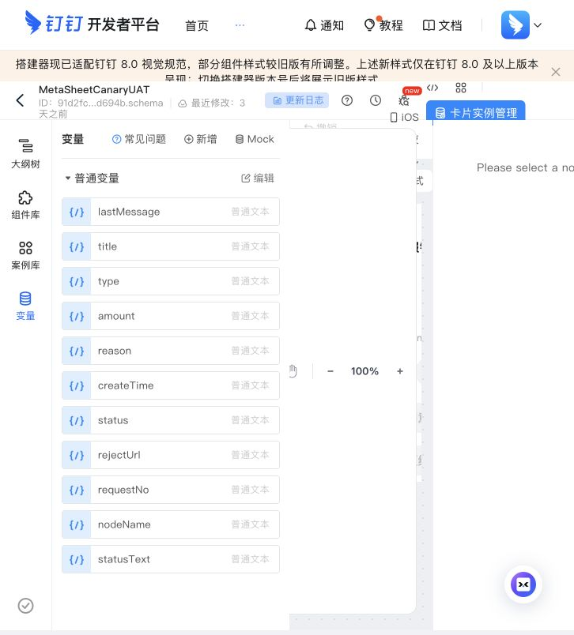
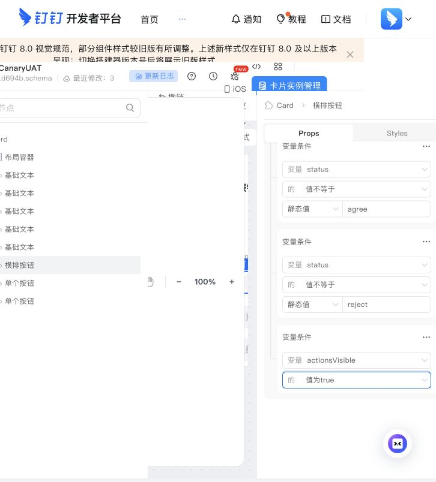
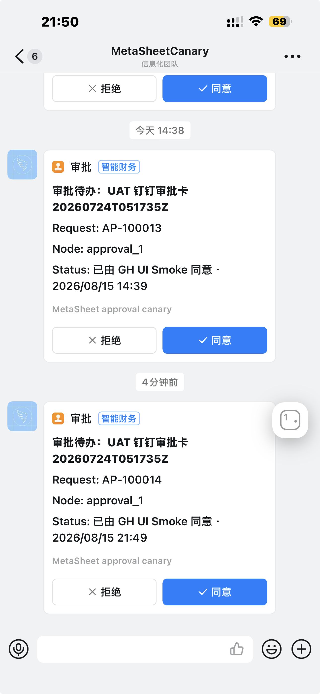

# 钉钉互动审批卡终态操作区收起实施 Runbook（2026-08-15）

> - 状态：**替代模板在平台显示已发布并完成 staging prepare / 线上有效版本与 terminal 操作区退场待新卡复验 / Stream 已安全关闭 / lifecycle flags OFF**
> - 当前 UAT 模板：`MetaSheetCanaryUAT3`
> - 当前模板 ID：`f8b8345f-485f-431c-9981-27f010bb9d2e.schema`
> - 前一替代模板：`MetaSheetCanaryUAT2`（`29f8d3b4-1012-4bcb-b78d-c82a36136148.schema`，保留历史证据，不用于下一次窗口）
> - 历史失败模板：`MetaSheetCanaryUAT`（`91d2fc02-3b33-4580-b467-e74ecc4d694b.schema`）
> - 代码落地：PR [#4916](https://github.com/zensgit/metasheet2/pull/4916)，reviewed head `dce07ecf5ad537d337153c09e17f8b5d3dd7c6e9`，merge SHA `d201aff394867d1e776d4e393a7ae71d3df45e44`

## 1. 目的与边界

本 Runbook 固化 2026-08-15 在钉钉开发者后台完成的核查、旧模板失败证据，以及 2026-08-16 复制替代模板、平台显示已发布后的 staging 准备证据；后续仍须先复核线上有效版本，再用替代模板生成的新卡完成真实 UAT。

目标行为：

- 新投放的审批卡默认显示「同意」「拒绝」。
- 审批进入 terminal `executed` 或 `stale` 状态后，卡片更新状态文案，并隐藏两个操作按钮。
- 仍可重试的中性错误、操作者未解析、链接异常或引擎拒绝场景不得隐藏按钮。

本文件不是以下事项的完成证明：

- U9 或完整 U1-U13 已通过；
- Stream 或生命周期开关已获生产 GO。

## 2. 2026-08-15 已执行的后台核查

1. 使用所属组织管理员登录钉钉开发者后台。
2. 核对当前 OAuth 应用：开放能力首页显示 `MetaSheetCanary`；应用凭证页的 Client ID 与 staging 配置一致。应用基础信息名称显示为 `sheet`，两者属于同一 App ID；本文不记录 Client ID 值。
3. 打开卡片平台：`https://open-dev.dingtalk.com/fe/card`。
4. 在「模板管理 → 模板列表」找到已发布模板 `MetaSheetCanaryUAT`，核对模板 ID。
5. 打开模板编辑器和「变量」面板。
6. 确认修改前的普通变量清单只有 `lastMessage`、`title`、`type`、`amount`、`reason`、`createTime`、`status`、`rejectUrl`、`requestNo`、`nodeName`、`statusText`；**尚无 `actionsVisible`**。
7. 经 owner 明确批准后，新增公共布尔变量 `actionsVisible`，Mock 默认值为 `true`；变量的“私有”开关保持关闭。
8. 选中同时包含「拒绝」「同意」的 `横排按钮` 共同容器。在原有 `status != agree`、`status != reject` 两个 AND 条件之后，追加第三个 AND 条件 `actionsVisible 值为 true`。
9. 当时离开编辑器并重新进入后，变量及三项显示条件仍可见，只能证明编辑器状态仍在，不能单独证明线上已发布版本包含这些修改。
10. 2026-08-15 真实 UAT 证明先前的“已发布模板原位修改”结论不成立：模板列表仍显示更新时间 `2026-08-12 19:48`，编辑器显示“最近修改：3 天之前”，均没有形成 8 月 15 日模板发布证据。后续必须由能看见该模板的创建人或应用管理员核对发布历史和有效版本。

本轮没有修改应用权限、凭证、回调地址或运行期开关，也没有发送真实测试卡片。

## 3. 截图证据

两张包含个人姓名且不承重的模板列表/编辑器全景未纳入仓库证据包；下面只保留变量、条件和终态失败三张承重截图。

### 3.1 修改前的变量清单

这张图是本轮最关键的负向证据：当前编辑器变量清单没有 `actionsVisible`。在模板完成新增、绑定和发布之前，只部署 PR #4916 仍不足以证明按钮会消失。

### 3.2 修改后的操作区显示条件

这张图记录 `横排按钮` 共同容器的最终三项 AND 条件：`status != agree`、`status != reject`、`actionsVisible 值为 true`。它证明两个操作按钮共享同一个新增守卫；不证明已部署代码已经在真实卡片上发送并呈现 `false`，该项仍须真实 UAT。

### 3.3 真实 terminal 卡片仍保留操作按钮

`AP-100014` 已显示由专用测试账号同意，MetaSheet 审批页也已进入 approved/结束状态，但卡片底部仍保留「拒绝」「同意」。这证明 callback 和审批写入成功，同时证明 terminal 操作区退场失败；本图不是完整 UAT PASS。截图上部同时出现 `AP-100013`，但本 Runbook 没有它的完整创建、投放和点击证据，因此明确排除，不用于任何 UAT 判定。

## 4. 已批准并执行的模板修改

已在 `MetaSheetCanaryUAT` 中执行：

1. 打开「变量」。
2. 新增**公共布尔变量** `actionsVisible`，默认值设为 `true`。
3. 选中包含「同意」「拒绝」的操作区；如果两个按钮没有共同容器，则分别配置两个按钮。
4. 将显示条件绑定为 `actionsVisible == true`。
5. 编辑器画布在 Mock 切换时仍同时保留条件分支组件，不能作为运行态显隐的可靠证据；因此没有把画布观感记为 PASS。
6. 变量与条件在离开并重新进入编辑器后仍存在，但 2026-08-15 UAT 证明该观察不足以证明线上模板已更新。必须补充发布历史、有效版本或模板更新时间证据后，才能把模板侧标为完成。

禁止事项：

- 不得把 `actionsVisible` 建成普通文本变量；
- 不得只绑定一个按钮；
- 不得用 `statusText` 文本内容猜测 terminal 状态；
- 不得删除或更改现有 action id：同意仍须为字面 `approve`，「拒绝」仍走既有驳回决策页深链；
- 不得在没有 owner 明确批准时点击发布。

## 5. 发布与部署顺序

严格按以下顺序执行：

1. **模板侧完成**：由有权限的创建人或应用管理员证明线上有效版本已认识 `actionsVisible`，默认 `true` 保持旧代码兼容，并记录发布/更新时间。
2. **合并 PR #4916**：仅在 exact-head 复审和 required CI 仍有效时执行。
3. **部署精确 merge SHA**：记录部署 SHA，禁止只记分支名或 `main`。
4. **只读 status**：确认部署 SHA、健康状态和相关开关；本步骤不改变开关。
5. **受控 Stream UAT 窗口**：按既有 owner/ops 程序短时开启，执行验收后关闭并重启/复核。

代码已部署，当前替代模板 `MetaSheetCanaryUAT3` 在平台显示已发布，staging 模板 ID 切换已完成；但尚无独立的发布历史/更新时间截图证明线上有效版本。下一次窗口必须先补该复核，再用 UAT3 新生成的卡片执行 UAT；旧模板产生的 `AP-100014` 以及 UAT2 的配置/prepare 记录都不能作为 UAT3 运行态通过的证据。

## 6. 代码侧合同

PR #4916 的已合并实现约定：

- 发送新卡时传 `actionsVisible: 'true'`；
- terminal `executed` 和 `stale` 更新时传 `actionsVisible: 'false'`；
- 中性、可重试或尚未判定 terminal 的路径不传该 key；
- 钉钉更新 API 的 `cardParamMap` 使用字符串值，因此 wire 值是 `'true'` / `'false'`，模板变量本身仍须定义为布尔变量。

合并前再次核查时，PR #4916 为 Ready、`autoMerge=null`、`mergeStateStatus=CLEAN`；exact head CI 为 18 success、0 pending、0 fail，另有 1 个非阻塞 skipped check。PR 于 2026-08-15 合并为 `d201aff394867d1e776d4e393a7ae71d3df45e44`。

## 7. 历史失败轮与当前 UAT3 验收

下表“历史 `MetaSheetCanaryUAT`”列只记录 2026-08-15 的 `AP-100014` 失败轮；它不能迁移为 UAT3 结果。当前 UAT3 必须使用**有效版本复核和部署 SHA 之后新生成的卡片**重新执行，所有项目均从 `NOT EXECUTED` 开始：

| 检查 | 期望 | 历史 `MetaSheetCanaryUAT` | 当前 `MetaSheetCanaryUAT3` |
| --- | --- | --- | --- |
| 新卡初态 | 「同意」「拒绝」均显示 | PASS：`AP-100014` 新卡已送达并显示两个按钮 | NOT EXECUTED |
| 正常同意 | 审批只写一次，卡面显示服务端终态，两个按钮消失 | **FAILED**：审批已 approved，卡面状态文案已更新，但两个按钮仍显示 | NOT EXECUTED |
| 重复点击/重复回调 | 无第二次审批写入，仍保持 terminal 卡面 | NOT EXECUTED | NOT EXECUTED |
| stale 收敛 | 显示真实 terminal 摘要，两个按钮消失 | NOT EXECUTED | NOT EXECUTED |
| 操作者未解析/未绑定 | 中性提示，按钮可按既有重试语义保留 | NOT EXECUTED | NOT EXECUTED |
| 引擎拒绝 | 无越权审批写入，不错误隐藏可重试操作 | NOT EXECUTED | NOT EXECUTED |
| U9 | 终态显示名来自服务端本地账号，且操作区消失 | NOT EXECUTED | NOT EXECUTED |
| U12/U13 | UAT shutdown 后无连接残留；flag OFF + 重启后 worker 不重连 | NOT EXECUTED | NOT EXECUTED |

完整 U1-U13 仍以 `approval-dingtalk-slice-b-uat-checklist-20260710.md` 为准。本 Runbook 只补充模板侧 `actionsVisible` 的实施与证据要求。

## 8. 失败与回滚

出现任一情况立即停止，不进入下一步：

- 模板 `false` 预览仍显示任一按钮；
- 模板发布后新卡无法投放；
- terminal 更新 API 报模板变量或类型错误；
- 点击同意后审批已完成但卡面按钮仍在；
- 关闭 Stream flag 并重启后 worker 仍连接；
- 无法确认 deployed SHA 或真实 callback corp anchor。

回滚顺序：

1. 关闭 Stream flag 并重启服务，确认回落 OA 路径。
2. 回滚应用部署到上一已知 SHA。
3. 仅在确认模板变更本身导致投放失败时回滚模板版本。
4. 保留 values-free 日志、delivery id 和截图；不得记录姓名、表单值、token、secret 或完整 corp id。

## 9. 部署与后续证据

2026-08-15 经 owner 明确批准后执行：

1. PR #4916 合并，merge SHA 为 `d201aff394867d1e776d4e393a7ae71d3df45e44`。
2. 主线 exact-SHA backend/web 镜像构建完成。
3. 首次 staging deploy [run 31883807607](https://github.com/zensgit/metasheet2/actions/runs/31883807607) 已把 backend/web 切到 exact SHA 并验证健康，但因发现 2 个待迁移项由 alignment gate 安全停止。
4. 安全迁移 [run 31883890995](https://github.com/zensgit/metasheet2/actions/runs/31883890995) 按“主机备份 → 临时库恢复/迁移演练 → 隔离证明 → 真实 staging 应用”完成。
5. exact-SHA deploy 重跑 [run 31884018466](https://github.com/zensgit/metasheet2/actions/runs/31884018466) PASS。
6. Stream 只读 status [run 31884073437](https://github.com/zensgit/metasheet2/actions/runs/31884073437) PASS：
   - `deployed_sha=d201aff394867d1e776d4e393a7ae71d3df45e44`
   - `deployed_sha_match=true`
   - `backend_health=true`
   - `stream_enabled=false`
   - `worker_state=disabled`
   - `lifecycle_flags_all_off=true`
   - `stream_connected=unknown`（只读 status 不把 SDK 连接状态伪造成已验证）
   - 四项 Stream 凭据/集成 ID 均未配置，因此当时尚未形成可开启的 Stream 运行态。
7. Stream prepare [run 31885179262](https://github.com/zensgit/metasheet2/actions/runs/31885179262) PASS：
   - exact deployed SHA 再次匹配；三个 lifecycle flags 仍全部 OFF；
   - 三项 GitHub secret 经临时文件传输写入，值未进入日志；
   - 从 configured corp 派生出恰好 1 个 eligible integration，关联本地用户数为 2；
   - 四项 Stream 配置均已存在；远端原子更新 staging env 后仅重启 backend，PostgreSQL/Redis 容器未变；
   - `stream_enabled=false`、`worker_state=disabled`，prepare 明确强制保持 Stream OFF。
8. prepare 后只读 status [run 31885234032](https://github.com/zensgit/metasheet2/actions/runs/31885234032) PASS：
   - `deployed_sha_match=true`、`backend_health=true`；
   - `client_id_present=true`、`client_secret_present=true`、`template_id_present=true`、`stream_integration_id_present=true`；
   - `eligible_anchor_count=1`、`linked_local_users_for_eligible_anchor_count=2`；
   - `stream_enabled=false`、`worker_state=disabled`、`lifecycle_flags_all_off=true`；
   - `stream_connected=unknown`，因为尚未获批执行 `on` 和真实 callback UAT。
9. 经 owner 批准开启 Stream UAT 窗口，[run 31885416242](https://github.com/zensgit/metasheet2/actions/runs/31885416242) PASS：
   - exact deployed SHA、唯一 eligible integration、2 个关联本地用户和三个 lifecycle flags OFF 再次通过；
   - `stream_enabled=true`、`worker_state=started`；该证据只证明 worker 启动，不把 `stream_connected=unknown` 伪装成已连接。
10. 登录 staging 后，当前账号只能访问员工考勤面；访问 `/approvals` 被重定向并显示 `Insufficient permissions`。为探测入口提交一条 values-free 考勤补卡请求后，页面显示 Pending，但钉钉未收到互动卡。该请求不能证明已触发 `approval.task_created`，也没有证明存在已发布的 `send_dingtalk_approval_card` 规则，因此 U1 记为 **BLOCKED**，不误记为发送代码 FAIL/PASS。
11. 测试请求已在员工界面撤销，Pending 从 1 回到 0；未继续执行 U2-U11，也没有真实 callback 可供 corp-anchor 判断。
12. 按停线规则执行 Stream OFF [run 31886442565](https://github.com/zensgit/metasheet2/actions/runs/31886442565) PASS：
   - `stream_enabled=false`、`worker_state=disabled`、`backend_health=true`；
   - exact deployed SHA 匹配，四项 Stream 配置仍存在，三个 lifecycle flags 仍全部 OFF；
   - 仅重启 backend，PostgreSQL/Redis 容器未变；U13 的 flag-off/worker-stop 面通过，U12 的完整 shutdown 矩阵仍未执行。

### 9.1 第二次真实 UAT 与安全关闭

2026-08-15 在补齐审批管理员、已发布审批模板和自动化规则后再次执行：

1. Stream ON [run 31888018349](https://github.com/zensgit/metasheet2/actions/runs/31888018349) PASS：exact deployed SHA 匹配，worker started，唯一 eligible integration 和两个 linked local users 仍成立，三个 lifecycle flags 全部 OFF。
2. 从已发布审批模板创建 `AP-100014`，投放台账确认 `deliveryKind=interactive_card`。
3. 受理人点击「同意」后，MetaSheet 审批进入 approved/结束状态，卡片状态文案同步为由专用测试账号同意。callback 和一次业务写入通过。
4. 同一张 terminal 卡片仍显示「拒绝」「同意」，命中停线条件；没有继续执行重复点击、stale 或其余 UAT 项。
5. Stream OFF [run 31888367830](https://github.com/zensgit/metasheet2/actions/runs/31888367830) PASS：`stream_enabled=false`、`worker_state=disabled`、`backend_health=true`、exact deployed SHA 匹配、三个 lifecycle flags 全部 OFF。
6. 钉钉官方“API 卡片数据的填写说明”明确布尔参数仍通过 `Map<String, String>` 传递，`"true"` / `"false"` 是正确 wire 形状。因此当前首查对象是线上模板版本和条件是否真正发布，而不是先修改后端为 JSON boolean。
7. 当时登录的开发者后台账号无法看见该模板。必须切换到能看见 `MetaSheetCanaryUAT` 的创建人或被授权应用管理员后，才能继续模板发布核验；本文不记录账号、组织或个人姓名。

下一次 UAT 前必须先用能管理 `MetaSheetCanaryUAT` 的钉钉账号证明：线上有效版本包含公共布尔变量 `actionsVisible` 和三项 AND 条件，且发布/更新时间晚于该配置变更。随后新建一张卡复测；不得复用 `AP-100014` 作为发布后新卡证据。

### 9.2 替代模板发布与 staging 安全准备

2026-08-16 经 owner 明确批准后执行，过程中没有开启 Stream 或任一 lifecycle flag：

1. 在钉钉卡片平台复制旧模板为 `MetaSheetCanaryUAT2`，配置公共布尔变量 `actionsVisible` 和终态操作区隐藏条件，发布后重新进入核对有效配置。
2. 新模板 ID 为 `29f8d3b4-1012-4bcb-b78d-c82a36136148.schema`。卡片签名 secret 已在 GitHub staging secret 中更新；secret 值未进入文档、日志或 artifact。
3. 发布后只读 status [run 31892590547](https://github.com/zensgit/metasheet2/actions/runs/31892590547) PASS：部署仍为 `d201aff394867d1e776d4e393a7ae71d3df45e44`，backend healthy，Stream OFF，worker disabled，lifecycle flags 全 OFF；本次 status 未提供 expected SHA，因此 `deployed_sha_match=unknown`，不把它写成 exact-SHA 匹配证明。
4. Stream prepare [run 31892679587](https://github.com/zensgit/metasheet2/actions/runs/31892679587) PASS：模板 ID 和签名 secret 以 values-free 方式写入 staging，`deployed_sha_match=true`，唯一 eligible anchor 和 2 个 linked local users 成立；prepare 强制 `stream_enabled=false`，仅重启 backend。
5. prepare 后只读 status [run 31892733785](https://github.com/zensgit/metasheet2/actions/runs/31892733785) PASS：`deployed_sha_match=true`、backend healthy、四项 Stream 配置存在、唯一 eligible anchor 和 2 个 linked local users 成立，Stream OFF、worker disabled、lifecycle flags 全 OFF。
6. 本轮没有开启 Stream、没有发送新卡、没有执行 callback。`MetaSheetCanaryUAT2` 的 terminal 按钮隐藏仍为 **NOT EXECUTED**，不能从模板发布或 prepare 推断为通过。

该轮原定使用 UAT2 的后续窗口已由下节 UAT3 发布记录取代；不得再把 UAT2 当成当前模板。

### 9.3 当前替代模板 UAT3 发布与 staging 安全准备

2026-08-16 经 owner 明确批准后执行，过程中没有开启 Stream 或任一 lifecycle flag：

1. 在钉钉卡片平台把 `MetaSheetCanaryUAT` 复制为 `MetaSheetCanaryUAT3`，新增公共布尔变量 `actionsVisible`（Mock `true`），并在「拒绝/同意」横排按钮共同容器上配置三项 AND 条件：`status != agree`、`status != reject`、`actionsVisible == true`。
2. 新模板完整 ID 为 `f8b8345f-485f-431c-9981-27f010bb9d2e.schema`，于 2026-08-16 14:26 在钉钉卡片平台显示已发布。staging GitHub secret `STAGING_DINGTALK_INTERACTIVE_CARD_TEMPLATE_ID` 已切换到该模板；模板 ID 值没有写入运行日志或 artifact。由于本证据包没有 UAT3 发布历史或晚于修改时间的模板列表截图，“平台显示已发布”不独立证明线上有效版本，下一次窗口前必须补核。
3. 平台显示发布后的只读 status [run 31931478708](https://github.com/zensgit/metasheet2/actions/runs/31931478708) PASS：backend healthy，Stream OFF，worker disabled，三个 lifecycle flags 全部 OFF；该运行不验证模板有效版本。
4. Stream prepare [run 31931539040](https://github.com/zensgit/metasheet2/actions/runs/31931539040) PASS：exact deployed SHA 为 `d201aff394867d1e776d4e393a7ae71d3df45e44`，模板 ID 以 values-free 方式写入 staging；prepare 强制保持 Stream OFF，仅重启 backend。
5. prepare 后只读 status [run 31931575188](https://github.com/zensgit/metasheet2/actions/runs/31931575188) PASS：`deployed_sha_match=true`、backend healthy、四项 Stream 配置存在，Stream OFF、worker disabled、三个 lifecycle flags 全部 OFF。
6. 本轮没有开启 Stream、没有发送新卡、没有执行 callback。UAT3 的 terminal 按钮隐藏仍为 **NOT EXECUTED**，不能从模板发布、secret 更新时间或 prepare 推断为通过。
7. 收口前再次执行只读 status [run 31937073799](https://github.com/zensgit/metasheet2/actions/runs/31937073799) PASS：部署仍为 exact SHA `d201aff394867d1e776d4e393a7ae71d3df45e44`，backend healthy，四项 Stream 配置存在，唯一 eligible anchor 和 2 个 linked local users 成立，Stream OFF、worker disabled、三个 lifecycle flags 全部 OFF；`stream_connected=unknown`，且本次仍没有发送卡片或执行 callback。

下一次窗口必须使用 `MetaSheetCanaryUAT3` 新建卡片，并按 `status -> prepare -> on -> 新卡投放 -> 人工同意 -> observe -> 重复点击 -> 按钮消失 -> off -> final status` 执行。任何失败都立即进入 `off`，不继续剩余动作。

真实 UAT 完成后，应在本文件追加而不是覆盖本轮证据：

- 一张新卡初态截图和一张 terminal 操作区消失截图；
- U9、U12、U13 以及真实 callback corp-anchor 的 values-free 结论；
- 执行人和 owner GO 记录。

## 10. 参考

- 配置人员帮助文档：`dingtalk-interactive-card-template-configuration-guide-20260815.md`
- 仓库内完整验收脚本：`approval-dingtalk-slice-b-uat-checklist-20260710.md`
- 仓库内真实企业证据包：`dingtalk-hardening-real-uat-evidence-pack-20260713.md`
- 钉钉官方说明：[API 卡片数据的填写说明](https://open.dingtalk.com/document/orgapp/instructions-for-filling-in-api-card-data)
- 钉钉官方接口文档：[更新钉钉互动卡片](https://open.dingtalk.com/document/isvapp-server/update-dingtalk-interactive-cards)
