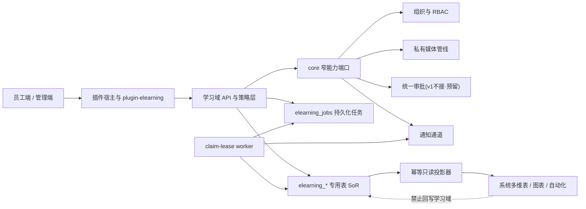

# MetaSheet 云课堂（企业学习）插件 — Design Lock（唯一 ratify 对象）

- 日期：2026-08-10
- 状态：**RATIFIED — DESIGN CONTRACT；L0–L6 PHASED IMPLEMENTATION UNPARKED；PRODUCTION ENABLEMENT PARKED**
- 本文件是本线唯一的 ratify 对象。Owner 已于 2026-08-25 明确批准将本合同内 L0–L6 整体实施设为开发目标并分阶段 unpark；该授权允许默认 OFF 的代码、迁移、feature flag、CI guard 与实施 PR。它**不授权**合并、部署、生产启用、真实客户数据访问，或任何面向真实业务环境的外部系统/服务调用（读写均含），这些动作仍须各自单独批准。禁止缩写成普通 `RATIFIED` 或将 unpark 解释为生产授权。
- Lineage（输入材料，均已 SUPERSEDED，不得独立演进）：
  - `elearning-plugin-feasibility-and-architecture-design-20260810.md`（产品 v2，本文底稿）
  - `elearning-plugin-hybrid-architecture-20260810.md`（Codex 混合架构稿，吸收其架构图/责任矩阵/投影矩阵/流程/媒体子架构/验收门）
  - 两轮独立对抗审（v1→审1：5×P1+2×P2；复审→审2：范围冻结 P1、管理范围门、ACL、抑制合同、幂等三态、**org 默认值 P1**）——全部意见已吸收，处置记录 §13。
- 基准参照：外部企业学习产品公开手册（54 篇能力蒸馏）。原始来源、品牌入口与离线镜像是**未入库研究材料**，不作为可复核路径、不构成仓库合同（审7 P2 / 审9）。功能定义以本文自身原则为准；本锁不收录竞品名称。
- ⚠️ 基线注记：写稿时检出落后 main；**ratify 前必须 rebase 至最新 main 并逐条重核**。本稿 citation 第五跳已对 `origin/main` `@22ae2a1c07`（2026-08-25）重核，见 §14-③ / §13 审10；审9 最小修订见 §13。
- 命名约定（ratify 后变更须走 design-lock amendment）：命名空间 `elearning` —— 插件 `plugin-elearning`、权限 `elearning:*`、表前缀 `elearning_`；**前端产品 feature `elearning`（单个，仅管导航/路由展示）+ 服务端 1 个 master `ELEARNING_ENABLED` + 6 个能力 flag `ELEARNING_{CONTENT,ASSIGNMENT,ASSESSMENT,INCENTIVE,ANALYTICS,MEDIA}_ENABLED`**（已裁：采用 ASSIGNMENT/ANALYTICS 命名；canonical 名单 = 此 7 个，环境变量/后端 capability payload/前端 store/测试不得出现别名）。产品显示名（审5 裁决 #9）：**员工端「学习中心」、管理端「云课堂管理」**。

---

## 0. 结论摘要

**能做，且 MetaSheet 的资产密度让它比从零做一个 LMS 便宜得多。** 组织架构（目录同步+主管标记）、审批引擎、通知发送通道、RBAC+管理范围、S3 附件安全管线（含 presign 直传先例 `files.ts:543-562`）、多维表报表底座——企业 LMS 的主要依赖项平台已有，且各有成熟先例可抄。真正要新建的是**学习域本身**：内容/指派/进度/测评/激励五个引擎，外加三块平台侧加固：

1. **视频课件管线（M 轨）**：现有文件上限 20MB/100MB，无分片/流播/转码——独立媒体轨在 core 新建（§8）；L1 先行 文章/文档/系列/外链视频（弱判定），受控 MP4 随 M 轨接入。
2. **调度不能借考勤的**：`AttendanceScheduler` 对所有插件开放注册，但默认 OFF、小时级单周期、串行、同名静默替换、leader 锁另需考勤 env（§6.5 逐条核实）——不当承重底座。自建 `elearning_jobs` due_at + claim-lease worker；**一切正确性判定在 API 路径同步裁决，调度只做异步物化**。
3. **站内信无可靠持久化实现**：`plugin_notification_history` 迁移存在（`20250924180000:105` 起）但服务是内存态（`NotificationService.ts:536-540`）——不建收件箱，「首页任务列表（SoR 生成的持久化触达面）+ 推送通道」组合。

规模警告：该 54 页手册背后是一条产品线。**必须 L0–L6 分阶段、能力 flag 默认 OFF + 需求门 + 验收门**。L1+L2 即交付可用的企业培训 MVP。2026-08-25 amendment 已授权分阶段实施，但不改变各阶段验收门与生产门禁。

## 1. 架构结论（四层）

- **事务与敏感数据：专用 PostgreSQL 表（SoR）。**
- **搜索、筛选和业务 API：插件服务层。**
- **自助报表：从专用表单向投影至系统多维表（受治理只读）。**
- **前端：通用插件宿主 `/p/plugin-elearning/*` 挂载。**
- **文件与视频：复用平台存储安全原则，独立 media 管线。**
- **审批：v1 不接（审5 裁决 #4，以发布权限+不可变版本+审计闭环）；未来接入时走窄 core 端口，不透传完整审批内部对象。**
- **后台任务：持久化到期/领取模型，正确性不依赖内存定时器。**

不选两个极端：不把高频进度事件、考试答案和台账塞进 `meta_records`；不在插件内重复建设组织、RBAC、通知通道、对象存储和报表引擎。



### 1.1 四个责任层

| 层 | 所有者 | 主要职责 | 明确不负责 |
|---|---|---|---|
| 平台 core | MetaSheet core | 认证、组织、RBAC、存储安全、窄审批端口（v1 未接入）、media 管线 | 课程完成规则、考试判分、学分规则 |
| `plugin-elearning` | 学习域 | 内容、范围、指派、进度、测评、激励、运营 API 和 UI、作业 worker | 推流、自建邮件/第三方消息通道底层 |
| 专用表 SoR | 学习域数据库 | 权威状态、不可变版本、台账、完成证据、审计 | 面向用户的自由编辑 |
| 多维表投影 | 系统读模型 | 聚合分析、视图、图表、低代码二次加工 | 回写 SoR、保存答案键、绕过管理范围 |

## 2. 对标基准蒸馏（外部企业学习产品）

### 2.1 员工端 IA（4 区）
首页（指派任务+banner+自定义导航）｜学习中心（可见范围内已发布内容，类型/分类筛选）｜知识商城（外部内容生态专属，不做）｜我的（必修/选修/我的直播间/我的授课/学习档案/学时学分排行/证书）。

### 2.2 管理端 13 模块
学习统计｜学习管理（课程/培训计划/新员工培训/线下培训/学习地图）｜混培项目｜直播管理｜考试管理（独立考试/题库练习/题库/试卷/阅卷/阅卷记录）｜调研问卷｜学分管理（设置/头衔/调整/记录）｜证书管理｜讲师管理（列表/等级）｜分类管理｜智能问答｜系统设置（通用/首页封面/首页自定义/空间资源/权限）｜开放平台。

### 2.3 承重机制（17 条）
1. **可见范围 ≠ 指派**：可见决定「能看到、能自学」；指派产生「必修义务+截止+跟踪+催学」。完成时按当时是否存在有效指派归类必修/选修。
2. **指派目标**：部门/角色/职位/个人 + 工号 xlsx 批量导入。
3. **协同设置**（对象级）：其他管理员仅得 指派/设范围/跟踪 三动词。
4. **催学升级链**：提醒学员 → 单聊部门主管 → 主管看本部门进度一键催办。
5. **新员工自动指派** + 每周统计周报。
6. **容器化测评**：容器内嵌考试/调研是打包实例，与独立考试数据不关联（本设计 copy-on-bind + revision 钉扣，§6.2）。
7. **防挂机**：视频弹窗签到（≤10 次、每次≤120s、短视频豁免、改规则不追溯）；倍速 3 档。
8. **学分行为表**：约 20 种行为，各带分值+每日上限。
9. **证书模板**：底图 + `#参数#` 占位符。
10. **学习地图**：≤10 阶段 × ≤20 任务；解锁方式；学分/证书按图或按阶段。
11. **线下培训**：动态 QR 签到/签退、报名、课时、助教、日程同步、结业发学分/证书、满意度调研。
12. **混培项目**：项目→培训班→阶段×任务；创建人/项目负责人/班主任；班级必修 ⊆ 项目范围；三维统计。
13. **考试规则面**：时长/次数/随机组卷/及格分/公布策略/指派=必考；简答人工阅卷+阅卷记录；错题本；题库练习三模式。
14. **统计 8 页** + 报表异步导出（限期保留）；个性化数据 → 基准产品走开放 API 导出，我方以聚合投影替代。
15. **首页自定义**：平台名/logo/标语/导航/封面广告位。
16. **权限**：主/子管理员超管；自定义角色 =（权限集合 + 管理范围）。
17. **存储引用守卫**：删文件先解除引用。

## 3. 范围裁决表（逐模块）

| 基准模块 | 裁决 | 理由/替代 |
|---|---|---|
| 课程管理（文章/视频/文档/系列） | ✅ L1 | 文章/文档/系列/外链视频先行；受控 MP4 随 M 轨 |
| 分类管理（多级） | ✅ L1 | 通用树 |
| 培训计划（打包+指派+跟踪+催学） | ✅ L2 | 核心闭环 |
| 新员工培训（自动指派+周报） | ✅ L5 | 挂目录 lifecycle 事件 |
| 独立考试+题库+试卷+阅卷 | ✅ L3 | 快照+revision+服务端判分 |
| 题库练习+错题本 | ✅ L3.5 | 低成本增量 |
| 调研问卷 | ✅ 已裁（审5 #6）留 L6 | 普通实名问卷复用多维表表单；匿名/高合规调查用专用模型 |
| 学分（设置/头衔/调整/记录） | ✅ L4 | append-only 台账 |
| 证书 | ✅ L4 | 模板+参数；台账为准 |
| 讲师（列表/等级） | ✅ L4~L5 简化 | 档案+引用+授课统计 |
| 学习地图 | ✅ L6 | 阶段化容器，皮肤极简 |
| 线下培训 | ✅ L6 | 动态 QR 签到插件内自建 |
| 混培项目 | ⏸ L6+ | = 地图+班级 cohort，等地图落地 |
| 直播 | ⏸ L6 适配器 | 只承诺 跳转/参与回执/回放入课；**无 provider 回执不判完成** |
| 智能问答 | ⏸ 延后 | 多维表 AI 能力线 RAG，需求门控 |
| 知识商城 | ❌ 不做 | 「申请领取」早期用插件内请求表 |
| 防挂机弹窗 | ✅ L6（地基在 L1） | 事件溯源先行，挑战为增量 |
| 视频倍速控制 | ✅ 随 M 轨 | 服务端累计按允许倍速钳制 |
| 统计 8 页+导出中心 | ✅ L5 | 读模型+异步导出+保留期 |
| 开放平台 API | 🔁 被替代 | 聚合投影 = 无代码自助报表（第一差异化卖点） |
| 首页自定义/封面 | ✅ L5 极简 | 命名/banner/导航 |
| 权限（角色+范围+协同） | ✅ L0/L2 | 平台 RBAC + 范围谓词 + 对象级协同 ACL |
| 空间资源管理 | ✅ L5 | 引用计数删除守卫 |
| 学习档案/排行 | ✅ L4/L5 | 读模型 |

## 4. 域模型（SoR，全部经 `packages/core-backend/src/db/migrations/zzzz*` 建表）

### 4.1 组织隔离前置纪律（适用所有表；含审2新 P1 修订）

- 每张 SoR/台账/事件/媒体/投影映射表携带 `org_id`（**审5 裁决 #1：org_id**，附 §14-③ 举证义务；若举证发现组织与平台租户非一一对应，直接升级为显式 `(tenant_id, org_id)` 并成文两者关系，禁止不同表混用而不成文）。
- **权威组织字段（审6 P1 锁定）**：HTTP 路径的唯一权威来源 = `req.authenticatedTenantId`（`auth/jwt-middleware.ts:101-103`@96b6416717：仅当 JWT 本身携带 tenantId 时置位）；**禁止**以 `req.user.tenantId`、全局 tenantContext、或任何可被 `x-tenant-id` 回填的取值路径作为学习域组织来源——tenant-less 旧 token 的 header 回填通道（`jwt-middleware.ts:106-108`@96b6416717：`user.tenantId = headerTenantId`，亲验）对学习域必须不可达。字段缺失 → `403 ORG_CONTEXT_REQUIRED`。worker/作业路径只使用创建时已持久化并校验过的 `job.org_id`，不重新解析请求上下文。
- **`org_id NOT NULL` 且不设数据库默认值（审2 P1）**：组织值只能由认证上下文显式写入；缺少组织上下文的写入 **fail-closed 拒绝**。`DEFAULT_ORG_ID`（= `'default'`，attendance 历史兼容模式，`zzzz20260612130000_create_attendance_schedule_dispatch_requests.ts:5,59`）**仅允许出现在显式旧数据迁移语句中，不得用于新域运行时写入**——DB 默认值会把「漏传组织」从错误变成静默写入默认组织。
- 唯一键一律按组织复合：`(org_id, source_key)`、`(org_id, user_id, behavior, ref)`、`(org_id, exam_id, user_id, attempt_no)`……
- **same-org 外键链必须整链可建（审6 P1）**：每张被引用表显式声明复合父键 `UNIQUE(org_id, id)`——本锁点名 `elearning_assignment_members`、`elearning_scope_revisions`、`elearning_scope_revision_rules`、`elearning_course_versions`；子表引用一律 `(org_id, ref_id)` → 父 `(org_id, id)` 复合 FK 且 `ON DELETE RESTRICT`。head 指针类引用用**三列复合 FK** 钉「同组织且同父对象」：`elearning_scopes(org_id, id, active_revision_id)` → `elearning_scope_revisions(org_id, scope_id, id)`（latest 同构）、`elearning_courses(org_id, id, active_version_id)` → `elearning_course_versions(org_id, course_id, id)`（latest 同构）；规则行 → revision 亦为复合 FK。**门 10 的删除负控必须在真实迁移生成的这条链上执行**（迁移过 migration-replay；任一父键/复合 FK 缺失即门失败）。
- **幂等三态语义（审2 修订）**：同组织+同 source_key+同规范化载荷（request_hash）→ 幂等重放返回原结果；同组织+同 source_key+不同载荷 → `409 IDEMPOTENCY_CONFLICT`；不同组织+同 source_key → 相互隔离各自独立成功。承载表需存 `request_hash`。
- **request_hash 规范化算法（审3 定版）**：深度排序对象键后 JSON 序列化 → SHA-256（数组保序——顺序即语义；目标人员/部门等集合语义字段先排序+去重再入哈希）；时间统一 UTC ISO-8601；字符串 trim；**null 不设全局剔除规则——先做命令级语义规范化，再执行通用 canonical JSON hash**（各命令契约先规定字段语义：PATCH/清空字段场景 null 表意、必须保留入哈希；仅当该命令显式声明「缺失 ≡ null」时才剔除 null 键）；哈希带域前缀+版本（如 `elearning.assignment.request.v1`）并落 `request_hash_version` 列——规范化算法升级时不把旧 hash 误报为 409 冲突。仓内先例：`src/multitable/automation-action-idempotency.ts` — `:1-18` Class-A 同事务 claim / Class-B 出站幂等纪律、`:28-42` `canonicalizeConfig`（deep key-sort 序列化，数组保序）、`:58-63` `deriveActionKey`（sha256 派生；key 永不从 fence/attempt/时间戳派生）。
- 请求体中的组织值不具有授权意义；主体（用户/部门/职位/角色）引用必须在同组织内解析；能做 same-org 复合外键时优先。
- 删除媒体、课程版本、试卷或证书模板前必须执行引用守卫。
- 通用字段：主键 `id`、`created_at/updated_at`（append-only 台账只追加必要时间字段）、创建者/操作者或系统 actor、适用时的 `version/status/source_key`。

### 4.2 内容与发布版本（审2 范围冻结 P1 + 审3 状态机/scope-revision P1 修订）

- `elearning_categories`（树）、`elearning_lecturers` + `elearning_lecturer_levels`。
- **范围对象三表规范化（审3 闭合，审4 消双模型）**：`elearning_scopes`（稳定 head：`active_revision_id`/`latest_revision_id`，各经三列复合 FK `(org_id, id, *_revision_id)` → revisions`(org_id, scope_id, id)` 钉同组织同 scope）+ `elearning_scope_revisions`（revision 元数据：org_id、scope_id、revision、actor_id、reason、created_at；UNIQUE(org_id, scope_id, revision) + 复合父键 UNIQUE(org_id, id)、UNIQUE(org_id, scope_id, id)——分别供规则行复合 FK 与 head 三列复合 FK）+ `elearning_scope_revision_rules`（**随 revision 不可变的规则行**：id PK、org_id、scope_revision_id、subject_type、subject_ref、include_children；索引 (org_id, scope_revision_id, subject_type, subject_ref)；**UNIQUE(org_id, id) 供完成证据建 same-org 复合外键；复合 FK `(org_id, scope_revision_id)` → revisions`(org_id, id)` ON DELETE RESTRICT**）。**运行时可见性查询走 active_revision 的规则行索引 join——审计快照与运行时查询同一存储，无 JSONB 双模型，保住方案 A「索引化 scope join」的原始理由**。改范围 = 写新 revision+规则行 + 移 active 指针，立即生效、不要求重新发布课程；旧 revision 及其规则行永不改写；被 `published_scope_revision_id` 引用的 revision、被完成证据 `scope_revision_rule_id` 外键引用的规则行及其 revision，**由 ON DELETE RESTRICT 在数据库层强制不可删（审5）——引用守卫是可执行约束，不是文档句子**。
- `elearning_courses`：head 行——分类、讲师、`scope_id`（引用 scopes head；运行时访问判定只读其 active_revision）、**`status` 只表达 head 生命周期：`active|archived|withdrawn`**、`active_version_id`/`latest_version_id` 双指针。
- `elearning_course_versions`：UNIQUE(org_id, course_id, version) + 复合父键 UNIQUE(org_id, id)、UNIQUE(org_id, course_id, id)（head 双指针经三列复合 FK 钉同组织同课程；引用方 same-org FK 走 (org_id, id)）；**`status: draft|published|retired`（审7 收口：v1 无发布审批 ⇒ 不设 in_review 态，未来审批端口立项时随之新增并列明迁移）；允许迁移仅 draft→published（发布即冻结）、published→retired（停新引用）；retired 不可逆回——重新上架 = 发新版本。版本编辑态在版本层，不在 head**；只冻结 正文引用、内容项、媒体引用、顺序、duration、完成策略版本；已发布版本不可原地修改。**新建草稿只移动 `latest_version_id`，绝不使当前 published 版本下线**——「线上版本在服务 + 新草稿在编辑」是双指针下的常态，单一状态字段无需（也不能）表达它。至多保存 `published_scope_revision_id` 作为发布时点审计指针，**绝不参与当前访问判定**。照抄审批版本冻结模式（`zzzz20260411120100:22-38` templates head 双指针 + versions 表；`:106-110` 实例钉 version_id+snapshot）。
- `elearning_course_version_items`（版本内子项）、`elearning_media`（storage_key/mime/魔数结果/size/sha256/**服务端探测时长**/status: uploading|probing|ready|rejected）。
- **访问规则（成文，审2+审3+审7 修正）**：`可访问课程 = head.status ≠ withdrawn AND ( 存在有效 assignment_member（针对某已发布版本，含已 retired 的钉住版本） OR ( head.status = active AND 当前用户命中 scope 的 active_revision ) )`（外层另有 flag/RBAC 门）。**archived 经可见范围的放行归零——新自学与续自学皆被挡，仅有效指派可继续**（审7 修正：旧公式只排 withdrawn，archived 仍会向无指派用户放行，与 archived 语义及门 15 冲突）；withdrawn 全局阻断。范围收缩阻止新自学与续自学，但不破坏有效指派——已指派必修的员工永不因范围收缩或 archived 陷入「有义务但无法学习」死锁。
- **有效指派定义**：未被显式撤销即有效；**deadline 过期 ≠ 撤销**（逾期仍可学，完成标记逾期）；终止学习义务的唯一途径是显式撤销/终止操作（带审计）。
- **archived vs withdrawn（审3 新增紧急下架语义）**：`archived` = 良性归档——停新自学入口，已指派在学者可继续，要终止须显式撤销指派。`withdrawn` = **紧急下架——违法/错误/不安全内容全局立即停止访问，含已指派在学者**；操作带操作者+理由审计，可逆（恢复 active）；对受影响指派的补救（豁免/替换课程/延期）是显式后续操作，不自动发生。
- 版本流转默认策略：指派/计划项/进度/完成证据全部钉 `course_version_id`；在学任务默认继续旧版本；「迁移到新版本」是显式、可审计操作（重置进度与否二次确认）；被指派/学习/颁证引用的版本不得物理删除（`retired` = 不再可被新指派/新计划引用，历史引用照常服务）；完成记录永远保留完成时刻版本号。

### 4.3 范围与指派

- 范围存储 = §4.2 三表规范化模型（**无独立 `elearning_scope_rules` 表**——审4 消除的双模型残留）；`subject_type` 封闭集 **all|department|position|role|user** 与 `include_children` 落在 `elearning_scope_revision_rules` 行上。position 双数据源：`users.position`（活迁移 `zzzz20260529190000_add_users_hr_profile_fields.ts:11-15`，`:15` 创建列）/ `directory_accounts.title`（`zzzz20260324150000:82-83`）——覆盖率因租户而异，启用职位指派前做数据就绪检查，未达标 UI 明示。不引用 `packages/core-backend/migrations/` legacy SQL。
- `elearning_assignments`（target/deadline/assigned_by/(org_id, source_key)+request_hash 幂等/**course_version_id**，形状抄排班派发表 `zzzz20260612130000_create_attendance_schedule_dispatch_requests.ts`）。
- `elearning_assignment_members`（**指派时点材料化事实**，source: manual|rule|import；后入部门者不自动追加——连续性由 auto_assign_rules 承担，不重写原始指派快照）。复合父键 **UNIQUE(org_id, id)**（供完成证据 same-org FK）；自身 FK `(org_id, assignment_id)` → assignments`(org_id, id)`。
- `elearning_auto_assign_rules`（部门/职位谓词 → 目标计划；周报配置）。
- 完成归类不只存 `required_at_completion` 布尔：证据行用**双可空外键**记访问依据（§4.4 审5 模型）——必修完成置 `assignment_member_id`（产生义务的指派成员行），选修完成置 `scope_revision_rule_id`（**记录服务端完成时采用的命中规则行**，经 revision 可回溯当时规则内容）；`access_basis_kind` 由非空列推导，**不作为独立真相存储**。命中多条规则时求值器取确定性首条（按规则行 id 排序）。**证明力边界（审6 P2 收窄）**：规则行证明的是「服务端按当时目录状态求值命中此规则」，不独立证明用户当时确属该部门/角色——v1 不另存成员关系快照，争议时以目录同步审计与事件时间线佐证。
- 工号 xlsx 批量导入校验抄考勤 xlsx-guard。

### 4.4 进度与完成证据

四层：
- `elearning_progress_events`：短期保留的原始 heartbeat/page/challenge 事件（按留存期裁剪，如 90 天）。
- `elearning_learning_sessions`：服务端整理的会话事实（会话钳制计算状态、challenge 簿记）。
- `elearning_completion_evidence`：**紧凑、不可变、永久或按合规周期保留**——course_version_id+内容项版本、完成策略版本、服务端核验时长/页数、有效秒数+最大位置+浏览页摘要、关键事件 digest、**访问依据双可空外键（审5 P1 修订）：`assignment_member_id uuid NULL` + `scope_revision_rule_id uuid NULL`，`CHECK ((assignment_member_id IS NOT NULL)::int + (scope_revision_rule_id IS NOT NULL)::int = 1)`，两列各建带 org_id 的 same-org 复合外键且 `ON DELETE RESTRICT`；`access_basis_kind` 由非空列推导、不独立存储**、判定时间+判定器版本。原始事件裁剪后，争议核验与重算以证据行为准；**不允许只剩无法解释的 `status=completed`**。
- `elearning_progress`：面向查询的当前 rollup（user×content×course_version_id：status/effective_seconds/max_position/completed_at/required_at_completion）。

### 4.5 测评

- `elearning_question_banks`、`elearning_questions`（稳定 ID）+ `elearning_question_revisions`（**不可变修订**：题干/选项/答案键/解析；编辑=新 revision）。
- `elearning_papers` + `elearning_paper_questions`（fixed|random；**固定 question_revision_id**）。
- `elearning_exams`（window/duration/attempts/shuffle/pass/公布策略）、`elearning_exam_attempts`（**paper_snapshot JSONB 含 revision 引用** + answers + auto/manual/total + status 机；唯一键 (org_id, exam_id, user_id, attempt_no)）。
- `elearning_grading_records`（阅卷分录=审计）、`elearning_wrong_questions`、`elearning_practice_tasks/_records`。
- 分析按 `(question_id, revision_id)` 聚合，不混版本。**答案键永不进入学员 API**；字段策略只帮 UI，不替代服务端封闭 DTO（§5.4）。

### 4.6 激励与台账

- `elearning_credit_rules`（behavior/points/daily_cap）、`elearning_credit_ledger`（append-only，unique(org_id,user,behavior,ref)）、`elearning_credit_balances`（物化派生）、`elearning_titles`、`elearning_certificates`（底图+参数版式）、`elearning_certificate_issues`（台账+序列号）。
- append-only 表：credit_ledger、certificate_issues、grading_records、notification_deliveries、（L6）签到台账。修正一律补偿分录；余额/排行/统计都是可重建派生。

### 4.7 运营

- `elearning_jobs`（kind/**occurrence_key**/ref/payload/due_at/status/lease_until/claim_worker_id/attempts/last_error；**UNIQUE(org_id, kind, occurrence_key)**）。
- `elearning_portal_config`、`elearning_export_jobs`（异步导出+过期清理+**审计字段：操作者、范围快照、查询条件、文件摘要、过期时间**）、`elearning_notification_deliveries`（redelivery-safe，形状抄 `zzzz20260611120000` 含 claim-lease 列）、`elearning_admin_scopes`、`elearning_object_acl`、`elearning_stats_daily`（聚合读模型，投影源）。

L1–L2 需 ~18 张，其余随阶段建。

## 5. 权限、范围与前端

### 5.1 权限码与角色
`elearning:read|write|grade|stats|admin`（种子迁移照抄 `zzzz20260117090000` 的 DO $$ + ON CONFLICT 范式；`elearning:admin` 语义=全局，参照 attendance 成文界定）；角色模板 `plugin_elearning_viewer|plugin_elearning_operator|plugin_elearning_admin`，由 core 迁移分别调用 `buildPluginRoleId('plugin-elearning', kind)` 与 `buildPluginPermissionCode('elearning', action)` 生成并落库——两个 helper 的 namespace 参数有意不同：角色 ID 保留插件前缀并规范化为下划线，权限码沿用已发布的 `elearning:*` 域；禁止调用会把两者强制耦合为同一 namespace 的 `buildPluginRoleSeeds`，也禁止在插件 `activate()` 中另造动态角色 ID。CJS 插件拿不到 core `rbacGuard`——照 attendance 自建 `withPermission/withAnyPermission`（`plugin-attendance/index.cjs:23575-23660` 样板）。

### 5.2 管理范围
`elearning_admin_scopes(user_id, dept_id, include_children)`；**所有管理面 详情/列表/统计/导出 查询强制携带范围谓词，默认拒绝**；列表不得返回范围外行。design-lock 评审时评估与 `delegated_role_admin_scopes` 合并。

### 5.3 对象级协同 ACL（含审2组合规则）
`elearning_object_acl`，动词封闭集 **{assign, scope, track}**（对齐基准机制 3）。组合规则成文：

```
允许操作 = RBAC 允许
        AND 操作者管理范围覆盖目标对象
        AND （操作者是对象 owner/超管 OR 对象 ACL 含该动词）
```

两层语义分开：**对象级 ACL 门**（能不能碰这个计划）+ **数据级范围过滤**（碰的时候能指派谁/看谁——指派目标集与跟踪视图始终与操作者自身管理范围求交）。ACL 不能赋予被授权者其自身没有的管理范围，不隐式包含 edit/publish/grade/export。三条负控进验收门（§12 门 14）。

### 5.4 隐私边界 = 服务端封闭 DTO
答案键、成绩、人工评语由服务端**按角色构造封闭 DTO**（学员端载荷构造时就不含这些字段）；验收直接断言**原始 HTTP JSON 与导出文件**，UI 隐藏不算。`fieldPolicies` 仅是策略登记（`PluginRbacProvisioningService.ts:130-140` 落 `plugin_field_policy_registry`，不过滤插件路由 DTO）——只作 multitable-backed 对象纵深。

### 5.5 前端
员工端（`/p/plugin-elearning/*` 起步）：首页/学习中心/我的。管理端：管理中心壳+分阶段挂菜单。组件注册进 `apps/web/src/plugins/viewRegistry.ts`（已接线；`src/view-registry.ts` 未接线勿用）。i18n 用 typed label 模块（抄 `meta-core-labels.ts:1-18` 纪律）。CI 新增 `elearning-web-guard.yml`。前端只消费后端返回的有效能力，不自行推断。

## 6. 核心引擎逻辑

### 6.1 进度引擎（事件溯源）
客户端只上报事件（start/heartbeat/page_view/challenge_ack），**永不上报 completed**。服务端去重、限速、按会话钳制累计（delta ≤ 墙钟流逝 × 允许倍速上限；乱序/重复丢弃；并行会话不叠加）。完成判据 = 版本化策略纯函数（视频按服务端探测时长；文档按页比例；外链弱判定如实标注）。达标后**单事务**写 completion_evidence + 更新 progress + 产生学分候选事件；学分服务按幂等键写台账。防挂机（L6）：heartbeat 响应下发 challenge，未按时 ack 从下发时刻暂停累计；规则变更不追溯已完成。派生链 course 级事务内同步重算、容器级异步+夜间对账，重算依据=证据行。

### 6.2 考试引擎
生命周期：create_attempt（校验窗口/次数/指派）→ 服务端物化试卷快照（随机解析、乱序、钉 revision）→ 学员拉取脱敏卷 → 按题暂存 → 提交 → 客观题自动判分 → 简答建阅卷任务（grade 权限+范围内）→ 定稿 → 按公布策略放榜。**正确性在 API 路径**：每次暂存/提交按服务端时钟校验（`submitted_at ≤ started_at + duration + 宽限` 且 ≤ deadline_at），超时同步拒绝置 expired；worker 只把过期 attempt 物化为已收卷并触发判分——**worker 停止只延迟物化，不允许超时答题**。判分后不可变，改分走审计 regrade 分录。嵌入语义 copy-on-bind + revision 钉扣（容器克隆考试实例，题目共享稳定 ID、快照钉 revision）。错题本判分事务内 upsert。反作弊诚实边界：切屏/禁复制是客户端威慑项（advisory）；服务端可信项只有时间窗、快照、次数、挑战。

### 6.3 学分与证书
行为首批：login、complete_course、complete_plan、pass_exam、submit_survey、complete_map、complete_offline、manual_adjust；分值+daily_cap。幂等：一次性 unique(org_id,user,behavior,ref)；重复性按 (org_id,user,behavior,day) 截断。头衔=阈值表；调整学分=人工分录（正负/理由/操作者）；**v1 无审批面（审5 裁决 #4）**——大额调整靠权限+审计约束，未来若需审批介入，与其他消费域一并走通用审批端口裁决。证书颁发即写台账（参数快照+序列号），渲染快照后置。

### 6.4 指派与催学
指派单（幂等三态）+ 材料化成员表；必修/选修在完成时刻固化（证据行）。催学链：到期扫描/业务事件**只写投递台账** → worker claim-lease 领取 → 调平台通道 → 回写 sent/retrying/failed（(org_id, source_key) 防重）。首页任务列表由 SoR 生成（持久化触达面），外部推送是增强通道。频控与静默时段是 L2 设计的一部分。

### 6.5 调度与作业
**为什么不用 attendanceScheduler（逐条核实）**：env 默认 OFF 时注册返回 null（`AttendanceScheduler.ts:311,323`）；全部任务共用默认小时级单周期（`:39,104`）；串行执行（`:188-199`）；同名静默替换（`:205-208`）；leader 锁另需 `ENABLE_ATTENDANCE_SCHEDULER_LEADER_LOCK`（`:334`）。

**v1 方案：插件自有 `elearning_jobs` due_at + claim-lease worker**（不动 core）：`activate()` 启动 30–60s tick、`deactivate()` 停止；多实例安全靠 claim-lease `UPDATE ... WHERE due_at <= now() AND (lease_until IS NULL OR lease_until < now()) ... RETURNING`——与考勤投递台账的 claim 列同形（`zzzz20260611120000:30-34`，仓内已验证形状）。作业类型与节奏解耦（收卷卫生分钟级/催学小时级+静默时段/周报 due_at 生成/导出即时/留存清理日级）。失败语义：attempts+last_error，超限进 dead 待运营视图。**作业身份 = UNIQUE(org_id, kind, occurrence_key)（审3 修订——(kind, ref) 不支持周期任务）**：单次作业的 occurrence_key 即业务引用（收卷 `attempt:<attempt_id>`、导出 `export:<export_job_id>`）；周期作业携带周期窗口（周报 `scope:<scope_id>:week:<ISO周>`、催学 `assignment:<id>:user:<id>:window:<窗口起点>`、留存清理 `retention:<date>`）——同一 ref 的不同周期是不同合法实例。**worker 语义 = at-least-once**：claim-lease 只防并发、不保证只执行一次（租约过期后另一实例可重执行）；真正的业务防重不靠 worker，靠效果侧——台账唯一键 / 同事务 claim（`INSERT ... ON CONFLICT DO NOTHING`）/ 出站幂等键。仓内先例：`src/multitable/automation-action-idempotency.ts:1-18`（Class-A 同事务 claim + Class-B 出站幂等键）。**正确性永不依赖 worker**。

**未来若提取通用核心端口（审5 裁决 #2：v1 不做；以下为未来提取时的最低契约）**：任务身份命名空间化（pluginId+jobName）；每任务 cadence 或按 due_at 领取，不共享全局周期；多实例 claim/lease 可安全重入；任务幂等；**注册失败可观察（不能静默返回 null 让业务误以为已生效）**；长任务不串行阻塞其他插件。

## 7. 多维表投影边界

### 7.1 三级投影矩阵

| 数据集 | v1 策略 | 说明 |
|---|---|---|
| 已发布课程目录 | 允许 | 仅公开管理字段，不含私有存储键；受 §7.3 访问二分约束 |
| 部门完成率、逾期数 | 允许 | 聚合+统计日期+来源版本，**受抑制合同约束** |
| 课程参与人数、完成率 | 允许 | 聚合指标，受抑制合同 |
| 考试通过率、分数分布 | 允许 | 聚合指标，不含个人答案，受抑制合同 |
| 学分部门汇总 | 允许 | 聚合指标，受抑制合同 |
| 个人学习档案 | v1 不投影 | 由学习域 API 按本人/管理范围返回；投影时点=审5 裁决 #5（延期，行级可见性成立后另行评审） |
| 个人成绩与评语 | v1 不投影 | 敏感个人数据 |
| attempt 答案、答案键 | **永不投影** | 安全边界 |
| 原始 heartbeat/挑战事件 | **永不投影** | 高频行为轨迹 |

### 7.2 投影不变量（T3-6 承继）
单向（多维表永不回写）；幂等（SoR 单调版本/确定性批次 upsert）；事件静默（不触发 `record.*` 自动化，直写 `meta_records` 不过事件总线——照 `approval-record-projection-service.ts` §6a）；可对账（projected_version/last_projected_at/last_error）；BEST-EFFORT（投影失败不回滚主事务，reconcile 修复，per-instance advisory lock）；隐私优先（无行级可见性证明前只投聚合/低敏数据）。系统 base 保留 owner `system:elearning-projection`，不自动向普通用户授分享。

### 7.3 投影访问二分（审2）
v1：system base **仅全局 `elearning:admin`（与平台 admin）可用**——「admin-gated」在本锁中的确切含义就是全局管理员。**部门范围管理员不直接使用多维表投影**，走插件统计页（带管理范围谓词）。让部门管理员直接用多维表的前提：行级范围控制落地，或按管理范围生成隔离投影（属审5 裁决 #5 延期范围）。

### 7.4 小样本抑制合同（审2 升格为 L5 合同，非可选）
- 受抑制指标：所有含人数/比率/分数分布的聚合行。
- 阈值：**系统硬下限 = 5（审3 定值）**；org 级 `min_group_size` 只能 ≥5 上调、不能下调；未配置即取 5——「未配置」不存在不抑制的状态。
- 小于阈值：投影行写 `suppressed` 标记且**不写数值**（不伪造 0）。**抑制在投影写入时执行**——被抑制数值根本不进 base，多维表侧任何筛选/公式都拿不到。
- 防差分主通道封堵：v1 只投影**单一部门层级**（不投父子多层级，消除父子差分通道）；时间增量行适用同一抑制。
- **诚实边界**：完整差分隐私不在 v1 范围；v1 目标是防直接读取与父子/明显差分，蓄意多查询差分攻击列为已知残余风险（R4）。
- 导出沿用同一抑制策略，不能只保护页面。
- 阈值已锁定：系统硬下限 = 5，org 只能上调；**任何修改（含硬下限本身）均须走 design-lock amendment**（审7 追补：删除「ratify 批注可覆盖」逃生口，与文首 amendment 纪律对齐）。

## 8. 媒体子架构（M 轨，core 侧）

- 私有 S3-compatible bucket；multipart/断点续传；v1 仅 MP4(H.264/AAC)。
- MIME、扩展名、魔数、sha256、**服务端 ffprobe 探测**共同校验；**探测在发布前完成，时长永不由客户端提供**。ffmpeg/ffprobe 是新部署依赖（镜像与 CI 需带上）。
- **探测失败语义（审3 收口——「拒绝」与「降级」不是同一种 fail-closed）**：探测失败的 media 停留 `rejected/not_ready`，**不得作为视频课程发布**。管理员可显式将该内容改建为外链/确认型内容——这是**新内容项 + 新完成策略**（进新草稿版本）并留审计；**禁止同一 video item 自动降级后继续发布**。
- 短 TTL 签名播放 URL，**签发前重新校验课程访问权**（§4.2 访问规则）；支持 HTTP Range；不承诺转码/多清晰度/HLS/CDN（独立立项）。
- 对象大小上限、组织总配额、未完成上传清理、孤儿对象对账均为 v1 验收项。**上限与配额必须由部署方显式配置（无默认值）；缺任一配置时媒体能力 fail-closed 不得启用（审5 裁决 #3）**——锁文不虚构统一成本数字，只锁「配额存在 + fail-closed」合同。配置与 fail-closed 立场复用 approval-attachment-s3（配置不全 values-free 503，生产不回退本地盘）。
- 直播不进媒体 SoR（§3 表）。

## 9. Owner 裁决（20260810 审5 全部落槌，无「待确认」残留）

| # | 裁决 | Owner 裁决内容 | 状态 |
|---|---|---|---|
| 1 | 组织权威边界 | 采用 `org_id` 为学习域业务隔离键；**rebase 重核时必须举证 org 与平台租户绑定无歧义，否则直接升级为 `(tenant_id, org_id)` 复合键**——不靠隐含默认组织 | ✅ ACCEPTED（附 §14-③ 举证义务） |
| 2 | 调度底座 | v1 采用插件自有 `elearning_jobs` lease worker；暂不抽象通用 core 调度器 | ✅ ACCEPTED |
| 3 | 视频能力 | 接受受限 MP4、不转码；**对象大小与组织配额必须由部署方显式配置，缺任一配置时媒体能力 fail-closed 不得启用**——锁文不虚构统一成本数字，只锁配额与 fail-closed 合同 | ✅ ACCEPTED（额度=部署配置） |
| 4 | 发布审批 | v1 不接审批；以发布权限 + 不可变版本 + 完整审计闭环；**出现第二个审批消费域时再抽通用最小权限审批端口** | ✅ ACCEPTED |
| 5 | 个人档案投影 | 延期；v1 只做满足抑制合同的聚合投影；行级可见性成立后再开放个人投影 | ✅ ACCEPTED（个人投影 DEFERRED） |
| 6 | 问卷底座 | 留 L6：普通实名问卷复用多维表表单；匿名/高合规调查使用专用模型 | ✅ DEFERRED TO L6（底座已裁） |
| 7 | SoR 承载 | 方案 A：专用学习域表作为 SoR，多维表仅作只读投影 | ✅ ACCEPTED |
| 8 | 直播 | 不进入 L1–L5；L6 只做外部直播提供方适配器，不自建推流 | ✅ ACCEPTED（适配器 DEFERRED TO L6） |
| 9 | 命名 | 内部统一 `plugin-elearning` / `elearning:*`；**员工端显示「学习中心」、管理端显示「云课堂管理」**；权限码 `elearning:stats` 与能力 flag `ELEARNING_ANALYTICS_ENABLED` 双命名空间保留 | ✅ ACCEPTED |

## 10. Feature flag 与授权

- 服务端：`ELEARNING_ENABLED` 总闸 + `ELEARNING_{CONTENT,ASSIGNMENT,ASSESSMENT,INCENTIVE,ANALYTICS,MEDIA}_ENABLED` 能力闸，**全部默认 OFF**（对齐 `src/config/flags.ts:5` 成文约定），在插件路由注册与 handler 双点 fail-closed。L6 扩展逐项独立 flag，不设总 EXTENSIONS 开关。
- **flag OFF 语义**：新写入与后台任务全部停止；读路径按阶段定义为不可见或只读；**回退语义成文——关 flag 不得留下仍在发送的催学任务**（作业排空进回退清单）。
- **后端 API 是权威执行门；前端只消费后端返回的有效能力。** flag 不是权限：过 flag 后仍必须过 RBAC、组织与管理范围检查（flag 管发布，RBAC 管授权，互不替代）。
- 前端产品 feature `elearning` 走五处联动（`config/flags.ts` → `src/routes/auth.ts buildFeaturePayload`（成文纪律：不从 admin 角色/产品模式/插件状态推断，`src/routes/auth.ts:283` 起函数；Canvas V2「never inferred」先例 `:301-303`@96b6416717）→ `stores/featureFlags.ts` → `router/types.ts:303` 封闭联合 → `guardPolicy.ts` 白名单），仅管导航/路由展示。
- **能力 payload（canonical 结构，审3）**：`GET /api/elearning/capabilities` → `{ enabled: boolean, capabilities: { content, assignment, assessment, incentive, analytics, media } }`；服务端按 master AND 各能力闸计算；前端只消费此结构，不读 env、不自行推断。
- **flag 与权限的映射示例（审3 确认）**：统计面可用 = `ELEARNING_ANALYTICS_ENABLED` AND (`elearning:stats` OR `elearning:admin`)——前者是发布能力门、后者是 RBAC 授权，分属两个命名空间；权限码保留 `elearning:stats`，不改名。

## 11. 分阶段落地（每阶段：能力 flag OFF + 需求门 + 验收门）

**实施授权 amendment（2026-08-25）**：Owner 已将本合同内 L0–L6 与 M 轨整体实施设为开发目标并分阶段 unpark。该授权只覆盖默认 OFF 的实现、测试、迁移、CI guard 与实施 PR；不等于合并、部署、生产启用、真实客户数据访问，或任何面向真实业务环境的外部系统/服务调用（读写均含）授权。实施必须按独立切片交付，先收敛 L0–L2 企业培训 MVP，再推进后续阶段；不得以“整体 unpark”为由把所有阶段并成一个大 PR。

- **L0 治理骨架**：org/tenant 键确认落迁移规范；插件双清单+空壳视图；RBAC 种子；服务端 flag 分层骨架（全 OFF）+ 前端 feature 五处联动；`elearning_jobs` worker 骨架；课程版本/完成证据/任务领取基础模型迁移；`elearning-web-guard.yml`；CJS `scripts.test` 链自带完备性守卫（照抄 `test-chain-completeness.test.cjs`）。
- **L1 内容闭环**：分类、文章/文档/外链/系列课、版本化发布、可见范围、学习中心+我的（选修）、进度事件+服务端判定+证据行、课程级统计。
- **M 轨（并行独立轨）**：分片上传+探针+presigned 播放+双配额；就绪后受控 MP4 接入。
- **L2 任务闭环**：计划（钉版本）、指派（部门/职位/角色/个人+工号导入）、必修/选修归类、跟踪、催学链（频控+静默时段）、通知台账。
- **L3 测评**：题库（+xlsx 导入）+revision、试卷、独立+嵌入考试、attempt 快照+判分、阅卷+记录、考试统计。**L3.5**：题库练习+错题本。
- **L4 激励**：学分规则+台账+上限+头衔+调整、证书模板+颁发台账、排行、学习档案。
- **L5 运营**：统计 8 页读模型+异步导出中心（审计+保留期）、新员工自动指派+周报、portal 极简自定义、空间资源管理（引用守卫）、**聚合投影（含抑制合同）**。
- **L6 扩展（已授权进入整体目标，但仍逐项过需求门）**：线下培训、学习地图、调研问卷、防挂机、混培、直播适配器、AI 问答。每项必须有独立范围、flag、验收门和 PR；未列出的扩展不在本次授权内。直播只实现 §9 已裁适配器边界；任何真实外部提供方调用、真实数据发送或付费资源启用仍须单独批准。

## 12. Ratify 验收门（16 门，全部进设计锁与测试计划）

1. **组织隔离**：跨组织读取/写入/导出必须失败；**同 source_key 跨组织互不去重、各自独立成功**（幂等三态 §4.1 全测）；**缺组织上下文的写入被拒绝，而非落入默认组织**；**tenant-less 旧 token + 伪造 `x-tenant-id` 头不得读取或写入学习域（应得 403 `ORG_CONTEXT_REQUIRED`，审6）**。**测试姿态硬约束（审9）**：组织绑定与跨组织负控必须在真实 DB 会话下执行——`RBAC_BYPASS=false` 且 `RBAC_TOKEN_TRUST=false`（覆盖 `tests/setup.integration.ts:5-8` 的套件默认），使用真实 `users`/`user_orgs` 行、正常 token 签发及 `verifyToken` 的 DB 路径。`AuthService.buildTrustedTokenUser`（`AuthService.ts:204-244`；`verifyToken` `:259-264` 在 trust 开启时于查询 users/user_orgs 前直接接受 JWT claims）**不得**作为本门夹具；trusted-token fixture 不能满足本门。
2. **版本钉扣**：已发布课程被编辑后，旧指派/进度/证据仍引用原版本；被引用版本不可物理删除。
3. **完成防伪**：客户端直接声明完成被拒绝。
4. **服务端核验输入**：媒体时长与文档页数只能由服务端核验结果参与完成判定。
5. **调度独立性**：worker 停止时超时考试仍不能继续答题（API 路径同步拒绝）。
6. **flag fail-closed**：flag OFF 时直接调 API 不能创建新数据、后台发送停止、作业排空。
7. **隐私封闭 DTO**：学员原始 API 响应（打原始 JSON）不含答案键、他人成绩或隐藏评语。
8. **投影隐私**：多维表不存在个人答案、原始学习轨迹与未经授权的个人成绩。
9. **幂等证明**：通知重投、考试收卷、学分发放、证书颁发均幂等，**且 worker at-least-once 重复执行（租约过期重领同一作业）不产生重复业务效果**（含正控——见验证纪律：断言不发生必配正控）。
10. **证据可解释且引用守卫可执行**：原始事件裁剪后，完成结果仍能由 completion_evidence 完整解释（含访问依据——选修完成能经 `scope_revision_rule_id` 指出当时命中的规则与 revision）；**数据库删除负控（审5）：删除被证据引用的 assignment_member / scope 规则行 / revision 必须被 RESTRICT 拒绝**；负控在**真实迁移生成的完整 same-org FK 链**上执行（审6：任一父键/复合 FK 缺失即门失败）。
11. **投影隔离**：投影失败不影响主事务；reconcile 确定性修复（advisory lock 下旧版本两表都不写）。
12. **媒体负控**：上传中断、重复完成、恶意 MIME、孤儿对象、**探测失败媒体不可发布且不可自动降级**各有负控。
13. **管理范围越权（审2 新增）**：同组织内超出 `elearning_admin_scopes` 的详情/统计/导出请求必须失败；列表不返回范围外行；导出记录保存 操作者/范围快照/查询条件/文件摘要/过期时间。
14. **协同 ACL 三负控（审2 新增）**：只有 track 不能指派；只有 assign 不能改范围；ACL 不能跨管理范围扩权。
15. **访问规则与死锁免疫（审2 新增，审3/审7 扩展——head 三态全覆盖正负控）**：`active`——命中范围可自学、有效指派可学（正控）；`archived`——可见范围放行归零，新自学与续自学皆被挡（负控），有效指派仍可学习完成（正控）；`withdrawn`——全局立即阻断含已指派在学者（负控）且带审计；范围收缩后无指派用户被挡、已指派用户仍可完成；**被旧指派钉住的 retired 版本仍可学习（正控），retired 仅禁止新指派/新计划引用（负控）**；新建草稿版本不使 published 版本下线。
16. **抑制合同（审2 新增）**：低于阈值的聚合行在投影与导出中均为 suppressed 无数值；未配置阈值时取系统下限而非不抑制。

## 13. 审阅吸收记录

| 轮 | 意见 | 处置 | 落点 |
|---|---|---|---|
| 审1 P1-1 | attendanceScheduler 不能当底座 | 采纳（逐条核实）；自建 lease worker；正确性移 API 路径 | §6.5、门5 |
| 审1 P1-2 | 缺不可变课程版本 | 采纳；照审批版本冻结先例 | §4.2、门2 |
| 审1 P1-3 | 组织隔离缺失 | 采纳；前置纪律+复合键 | §4.1、门1 |
| 审1 P1-4 | flag 矛盾且无服务端门 | 采纳；分层+双点 fail-closed | §10、门6 |
| 审1 P1-5 | fieldPolicies/投影非隐私边界 | 采纳；封闭 DTO+仅聚合投影 | §5.4、§7、门7/8 |
| 审1 P2 | 证据保留/ffprobe/通知措辞/position/题目修订 | 采纳 | §4.4/§8/§0/§4.3/§4.5 |
| 复审(我方) | 混合稿范围冻结错误、管理范围门、ACL、抑制、flag 命名、幂等措辞 | 审2 全部确认 | 见下 |
| 审2 裁决 | v2 为唯一底稿合并；两 DRAFT SUPERSEDED | **本文件即执行结果** | 全文 |
| 审2 §1 | 范围冻结=P1；访问规则+死锁免疫 | 采纳；scope 留 head、版本只存审计指针 | §4.2、门15 |
| 审2 §2 | 同组织管理范围门+导出审计+投影访问二分 | 采纳 | §5.2、§7.3、门13 |
| 审2 §3 | ACL 组合规则+三负控 | 采纳（两层语义细化为我方补充） | §5.3、门14 |
| 审2 §4 | 抑制从可选升 L5 合同 | 采纳（投影时抑制+单层级为我方实现补充；差分残余诚实登记） | §7.4、门16、R4 |
| 审2 §5 | flag 命名 ASSIGNMENT/ANALYTICS | 采纳，canonical 单套 | 命名约定、§10 |
| 审2 §6 | 幂等三态 | 采纳（+request_hash 列） | §4.1、门1 |
| 审2 新P1 | **org_id 不得设 DB 默认值** | 采纳；fail-closed，DEFAULT_ORG_ID 仅限旧数据迁移 | §4.1、门1 |
| 审2 | 裁决点九项全保留+两列 | 采纳 | §9 |
| 审3 确认 | 十项修订实质落稿；stats/analytics 双命名空间映射 | 映射公式成文 | §10 |
| 审3 P1-A | head/版本状态机与 scope_revisions 未闭合 | 采纳；scopes 双表、版本层四态、head 三态生命周期、双指针共存、withdrawn 紧急下架 | §4.2、门15 |
| 审3 P1-B | (kind, ref) 不支持周期任务；worker 是 at-least-once | 采纳；UNIQUE(org_id, kind, occurrence_key)+周期窗口键；业务防重靠效果侧（先例 `automation-action-idempotency.ts`） | §4.7、§6.5、门9 |
| 审3 P1-C | 探测失败「拒绝或降级」自相矛盾 | 采纳；rejected/not_ready 不可发布；显式改建=新内容项+新策略+审计；禁自动降级 | §8、门12 |
| 审3 P2-D | request_hash 无规范化算法 | 采纳；deep key-sort+SHA-256、集合排序去重、UTC、域前缀+版本+`request_hash_version`（先例亲验；null 规则与行号后经审4 修正） | §4.1 |
| 审3 P2-E | master flag 不在 canonical 名单；抑制下限未定值 | 采纳；canonical=7 flag；capabilities payload 结构成文；硬下限=5 org 只可上调 | 头部、§10、§7.4 |
| 审3 P2-F | 旧稿正文污染检索 | 采纳（选 tombstone 方案）；两旧稿正文替换为短 tombstone | 两旧稿文件 |
| 审4 P1 | scope 规则存储双模型残留（§4.2 revision JSONB vs §4.3 独立 rules 表并存） | 采纳；三表规范化（scopes / scope_revisions / scope_revision_rules），审计快照与运行时索引查询同一存储；证据统一 `access_basis_kind/ref`（选修完成可证明当时命中的 revision） | §4.2、§4.3、§4.4、门10 |
| 审4 P2 | 墓碑备份路径是伪仓库相对路径、不可验证 | 采纳；删除具体路径，改述「保存于会话审阅记录，不属于仓库合同」 | 两墓碑文件 |
| 审4 P3 | 哈希先例行号粗并；「缺失≡null」全局规则过宽 | 采纳；行号改 `:1-18/:28-42/:58-63`（亲验）；null 改命令级语义规范化先行 | §4.1、§6.5 |
| 审5 P1 | access_basis 多态引用建不了真实外键——引用守卫不可执行 | 采纳；双可空外键列 + CHECK 恰一非空 + same-org 复合 FK + ON DELETE RESTRICT；kind 由列推导不独立存储；规则行加代理 PK + UNIQUE(org_id,id)；多规则命中取确定性首条 | §4.2、§4.3、§4.4、门10 |
| 审5 裁决 | 九项 owner 裁决全部落槌（org_id+举证义务 / 插件 worker / MP4+配置强制 fail-closed / v1 无审批 / 个人投影延期 / 问卷 L6 / 方案 A / 直播 L6 / 命名+显示名） | §9 改 ACCEPTED/DEFERRED；§0/§1/§2.1/§3/§6.3/§8/头部命名同步对齐 | §9、§14 及全文 |
| 审6 P1-a | same-org FK 链父键/复合 FK 不齐——照文建不出两个已声明的证据外键 | 采纳；点名四表复合父键、head 三列复合 FK（scope+course 双 head）、规则→revision 复合 FK，整链 RESTRICT；门10 改在真实迁移链上执行 | §4.1、§4.2、§4.3、门10 |
| 审6 P1-b | 「认证上下文」未指定权威字段——tenant-less 旧 token 经 `x-tenant-id` 回填 `user.tenantId`（`jwt-middleware.ts:106-108`@775d537e 亲验） | 采纳；锁死 `req.authenticatedTenantId`（`:101-103` 仅源于 JWT 自带值）唯一权威、缺失 403 `ORG_CONTEXT_REQUIRED`、worker 只用 `job.org_id`；门1 加负控 | §4.1、门1 |
| 审6 P2 | 规则行只证明「服务端记录了命中规则」，不独立证明当时成员归属 | 采纳（选收窄措辞）；v1 不存成员快照，争议以目录审计佐证 | §4.3 |
| 审6 清理 | §5.5 笔误；四处「裁决点/另一选项」未决措辞；R1「owner 拍板」再造待决感；auth.ts 行号漂移 | 全部落稿（§6.5 笔误、§4.1/§6.5/§7.1/§7.3 已裁化措辞、R1 改部署配置、`auth.ts:294-303`→`:281,299`@775d537e）；另更正我方汇报措辞：准确说法是「§9 无待确认」而非「全文无 ⏳」——§14 的 ⏳ 是合法 ratify 待办 | §0、§4.1、§6.5、§7.1、§7.3、§10、R1 |
| 审7 P1 | archived 访问公式漏——只排 withdrawn，archived 仍经范围向无指派用户放行，与散文/门15 冲突 | 采纳；公式加 `head.status = active` 守卫；retired 钉住版本可学语义显式化；门15 改三态正负控 | §4.2、门15 |
| 审7 流程 | ratify 基线再落后（775d537e→b55c682748） | rebase 未 push 分支至 b55c682748；#4850 触碰文件与锚点零交集（亲核）；§14-③ 二跳重记 | §14-③ |
| 审7 P2×3 | 基准 tmp/ 路径不可复核；证明力前半仍称「可证明访问权」；in_review 与「v1 无审批」未闭合 | 采纳；改在线入口+未入库声明；前半改「记录服务端完成时采用的命中规则」；版本态收为 draft\|published\|retired 并列明迁移 | 文首、附录、§4.3、§4.2 |
| 审7 机械 | 「owner 可整体替换」；「审1–审5」；auth.ts 行号精度 | 改「ratify 后变更须走 design-lock amendment」；审1–审7；`auth.ts:281,299-301`@b55c6827 并注明 approvalCanvas 先例 | 文首、§10、§14 |
| 审7 追补 P2 | §7.4「owner 在 ratify 批注中覆盖硬下限」与 amendment 纪律冲突——合同逃生口 | 采纳；硬下限 5 锁定、org 只能上调，任何修改走 design-lock amendment；提交说明 six→seven | §7.4、commit message |
| 审8 机械 | 第四跳 rebase 到 `origin/main` `@96b6416717`（约 280 提交）后 citation 漂移 | 纯机械重钉，不改合同：`AuthService.resolveSessionTenantId` `:387-426`；`buildFeaturePayload` → `src/routes/auth.ts:283`（Canvas never-inferred `:301-303`）；attendance `withPermission` `:23529-23614`；`20250924180000:105`；dispatch 迁移文件名补全；`zzzz20260411120100:22-38`。裁决 #1 实质仍成立（见 §14-③）。状态仍 DRAFT | 文首、§0、§4.1、§4.2、§4.3、§5.1、§10、§14 |
| 审9 | exact-head 终检 `0eba89154b`：门1 测试假绿 P1；普通 RATIFIED 会被读成 L0 开工；锁文竞品名；`users.position` 钉 legacy SQL；审阅记录/活动 pin 未齐 | 采纳。门1加真实 DB 会话硬约束（`RBAC_BYPASS=false`/`RBAC_TOKEN_TRUST=false`，禁 trusted-token fixture）。**审9 当时**唯一合法状态 = `RATIFIED — DESIGN CONTRACT ONLY；IMPLEMENTATION PARKED`（当时不授权 L0/V0.1/代码/迁移/flag/实施 PR）。锁文去品牌化。`users.position` 改钉 `zzzz20260529190000:11-15`。§14-① 审1–审9；§4.1 活动合同 pin `@96b6416717`（历史行保留旧 SHA） | 文首、§2、§3、§4.1、§4.3、§11、门1、§13、§14、附录 |
| 审10 机械 | 第五跳刷新至 `origin/main` `@22ae2a1c07`；13 个新增提交中，活动合同锚点仅 `plugin-attendance/index.cjs` 有交集 | 纯机械重钉，不改合同：`withAnyPermission/withPermission` 样板由 `:23529-23614` 更新为 `:23575-23660`；其余承重锚点继承有效。**审10 当时的历史状态**仍为 `RATIFIED — DESIGN CONTRACT ONLY；IMPLEMENTATION PARKED` | 文首、§5.1、§14-③ |
| 2026-08-25 实施授权 amendment | Owner 将本合同内 L0–L6 与 M 轨整体实施设为开发目标并分阶段 unpark | 状态改为 `RATIFIED — DESIGN CONTRACT；L0–L6 PHASED IMPLEMENTATION UNPARKED；PRODUCTION ENABLEMENT PARKED`；允许默认 OFF 的实现与 PR，保留合并、部署、生产启用、真实数据与真实业务环境外部调用的独立批准门；L6 七项仍逐项过需求门 | 文首、§0、§11、§14-⑤ |
| 2026-08-26 角色模板勘误 amendment | §5.1 文字 ID 与其指定的 `buildPluginRoleId` 规范化结果冲突，且误留插件动态 provision 解释空间；实施核对又发现 `buildPluginRoleSeeds('plugin-elearning')` 会错误生成 `plugin-elearning:*` 权限 | 角色 ID 改为 `plugin_elearning_viewer|plugin_elearning_operator|plugin_elearning_admin`；core 迁移分别用角色 namespace `plugin-elearning` 与权限 namespace `elearning` 调两个 helper，权限码保持 `elearning:*`；禁用耦合 namespace 的 seeds helper，禁止插件激活时另造动态 ID | §5.1 |

## 14. Ratify 前置（顺序执行）

1. ✅ 全部审阅意见落稿（审1–审10，处置记录 §13）。
2. ✅ Owner 九项裁决全部落槌（审5，§9 全 ACCEPTED / DEFERRED TO L6，无「待确认」残留）。
3. ✅ 基线刷新（五跳完成；当前合并审阅树对齐 `origin/main` `@22ae2a1c07`）：第一跳 @775d537e61（20260810）——25 个锚点文件 diff 扫描仅 `index.ts`/`auth.ts` 漂移，权威组织字段钉 `jwt-middleware.ts:101-108`；第二跳 775d537e→b55c682748——仅一提交（#4850，directory 域），触碰文件与全部锚点零交集；第三跳 b55c682748→0e1e1778ba（20260811）——4 提交（#4851–#4854，staging/ops/测试基建域）触碰 17 文件，与锚点零交集。**第四跳 0e1e1778ba→96b6416717（20260824，约 280 提交）**：锚点交集为 `AuthService.ts` / `src/routes/auth.ts` / `plugin-attendance/index.cjs` / `index.ts` / `apps/web` feature store 与 `viewRegistry.ts`。机械重钉见 §13 审8。**第五跳 96b6416717→22ae2a1c07（2026-08-25，13 提交）**：活动合同锚点仅 `plugin-attendance/index.cjs` 有交集，RBAC 样板结构未变，行号重钉为 `:23575-23660`（§13 审10）；其余承重锚点继承有效：`jwt-middleware.ts:101-108`、`src/routes/files.ts:543-562`、`NotificationService.ts:536-540`、`AttendanceScheduler.ts:311,323,:39,104,:188-199,:205-208,:334`、`automation-action-idempotency.ts:1-18/:28-42/:58-63`、`PluginRbacProvisioningService.ts:130-140`、`flags.ts:5`、`zzzz20260411120100:22-38,:106-110`、`zzzz20260611120000:30-34`、`zzzz20260324150000:82-83`、`zzzz20260117090000` DO $$ + ON CONFLICT、`zzzz20260529190000_add_users_hr_profile_fields.ts:11-15` `users.position`。**裁决 #1 举证仍成立：会话租户经 `user_orgs` 活性校验解析（`AuthService.resolveSessionTenantId` `:387-426`；login 调用点 `:359`）且 `authenticatedTenantId` 仅源于 JWT 自带值（`jwt-middleware.ts:101-103`@96b6416717；header 回填只写 `user.tenantId` `:106-108`，不写 authenticatedTenantId）——org_id 单键成立，以 §4.1 权威字段锁定为强制前提。不升级为 `(tenant_id, org_id)`。**
4. ✅ scoped exact-diff 快审通过（审阅对象 `7ba7ee472d`，基线 `96b6416717`）。初始 ratify 当时状态为 **`RATIFIED — DESIGN CONTRACT ONLY；IMPLEMENTATION PARKED`**，当时不授权 L0/V0.1/代码/迁移/flag/实施 PR；该历史状态现由下列 ⑤ amendment 取代。
5. ✅ Owner 实施授权 amendment（2026-08-25）：本合同内 L0–L6 与 M 轨整体实施已分阶段 unpark；默认 OFF 的代码、迁移、flag、CI guard 与实施 PR 可推进。合并、部署、生产启用、真实客户数据访问，以及任何面向真实业务环境的外部系统/服务调用（读写均含）仍未授权。

## 15. 风险登记

- R1 视频存储与带宽：全新负载面；**配额与上限由部署 owner 在 MEDIA 启用前显式配置（缺任一配置 fail-closed，审5 #3）**；ffmpeg/ffprobe 新部署依赖。
- R2 范围蔓延：54 页手册是一条产品线；每阶段需求门是硬约束。
- R3 防作弊边界：挡得住秒完成/改状态，挡不住真人代看；文档如实声明。
- R4 个人数据合规：档案/成绩敏感；导出审计+范围过滤+保留期；聚合抑制后仍有蓄意多查询差分残余（已知边界）。
- R5 通知疲劳：频控与静默时段进 L2。
- R6 「可调用≠可承重」：`PluginServices` 声明≠运行时提供；attendanceScheduler 教训；复用宣称前机械核 启用门/节奏/并发/冲突/持久化 五项。
- R7 版本迁移运营成本：频繁改版累积多版本在学人群；显式迁移工具与版本收敛报表进 L2/L5 需求池。

## 附：基准手册页面索引
基准 = 外部企业学习产品公开手册 54 篇（研究记录另存，不进入本锁合同；离线镜像为未入库研究材料）。本锁对基准仅作能力对照，功能定义以本文自身原则为准。不收录竞品名称、品牌入口或手册 URL。
