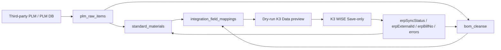

# K3 WISE Document Template Delivery Design - 2026-05-11

## Purpose

This slice turns the K3 WISE material/BOM PoC into a template-driven delivery
path without making metasheet a general ERP document editor.

The product boundary is:

- Multitable remains the cleansing and review surface.
- K3 JSON remains an adapter payload format.
- Business users configure staging tables, field mappings, and lifecycle
  policy through forms.
- Advanced users can preview the final K3 `Data` JSON, but v1 does not ask
  business users to hand-write full JSON payloads.

## Scope

Included in v1:

- K3 WISE material template.
- K3 WISE BOM template.
- Field mappings from PLM/staging fields into K3 fields.
- Unit dictionary seed for `PCS`, `EA`, and `KG`.
- K3 `Data` payload preview in dry-run and in the setup page.
- Save-only as the default lifecycle policy.

Explicitly excluded from this slice:

- Purchase orders, sales orders, stock-in documents, and other K3 documents.
- A persisted `integration_document_templates` table.
- Customer-specific Submit/Audit automation before GATE answers approve it.

## Backend Design

`plugins/plugin-integration-core/lib/adapters/k3-wise-document-templates.cjs`
is the in-plugin registry for K3 document templates.

Each template defines:

- `id`, `version`, and `documentType` for traceability.
- Relative K3 WebAPI endpoints for Save / Submit / Audit.
- `bodyKey`, currently `Data`.
- `keyField` / `keyParam` for lifecycle operations.
- A K3 target schema.
- Default field mappings and a sample source record for preview.

The K3 WebAPI adapter now loads its default `material` and `bom` object
configuration from that registry. Operator overrides still work for endpoint
paths and lifecycle options, but endpoint validation rejects absolute URLs so
object config cannot redirect writes outside the configured K3 base URL.

The adapter projects target records through the template schema before
building the Save body:

```json
{
  "Data": {
    "FNumber": "MAT-001",
    "FName": "Bolt",
    "FModel": "M6 x 20",
    "FBaseUnitID": "Pcs"
  }
}
```

Internal integration fields such as `_integration_idempotency_key`, `sourceId`,
and `revision` remain available for idempotency and feedback, but they are not
sent inside K3 `Data` unless a future adapter object explicitly opts into
pass-through body mode.

## Pipeline Design

No migration is added in this slice.

The existing contracts remain the source of truth:

- `integration_pipelines.target_object` stays `material` or `bom`.
- `integration_field_mappings` remains the cleansing rule surface.
- `pipeline.options.k3Template` records `{ id, version, documentType }`.
- `pipeline.options.target.autoSubmit` and `autoAudit` default to `false`.

Dry-run now asks the target adapter for `previewUpsert()` when available. The
pipeline runner attaches the sanitized K3 request preview to each clean record:

```json
{
  "preview": {
    "records": [
      {
        "targetPayload": {
          "Data": {
            "FNumber": "GOOD-01",
            "FName": "Good material"
          }
        },
        "targetRequest": {
          "operation": "save",
          "method": "POST",
          "path": "/K3API/Material/Save",
          "query": {
            "Token": "[redacted]"
          }
        }
      }
    ]
  }
}
```

Dry-run remains non-writing: it does not call the K3 Save endpoint, does not
write dead letters, and does not advance watermarks.

## Frontend Design

The K3 setup page adds a `K3 单据模板` section with two cards:

- K3 WISE material.
- K3 WISE BOM.

Each card renders the template-driven mapping table:

- PLM/staging source field.
- K3 target field.
- transform summary.
- required marker.

The preview button renders the final `{ "Data": ... }` JSON from the template
sample record. The preview is intentionally read-only and contains no K3
authority code, Token, password, SQL connection string, or integration
internal fields.

The page still exposes endpoint paths, SQL channel, and Submit/Audit settings
under advanced sections. Save-only remains the default; live execution still
requires an explicit checkbox.

## Data Flow



The important product rule is that cleansing remains column-oriented in
multitable. JSON is only the generated K3 envelope.

## Risk Controls

- Template endpoints must be relative paths.
- `bodyKey` defaults to `Data`.
- Template schemas must be non-empty and field names must be non-empty.
- Save-only is the default lifecycle policy.
- Submit/Audit are opt-in and still blocked operationally until customer GATE
  answers approve the workflow.
- Payload previews go through the same sanitizer path used for integration
  logs and artifacts.

## Future Expansion

After a real material+BOM customer PoC passes, the same registry can add more
document types. The next safe step is not "all K3 documents"; it is one
customer-driven template at a time with a fixture, dry-run preview, and
operator runbook update.
