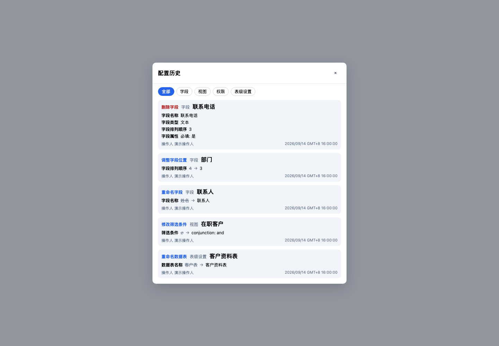
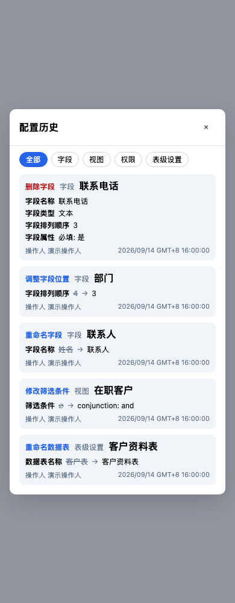

# Configuration History Verification

## Identity

Product commit `7aa8e12c8c85da2370bbf824f8e3d5f0a4464221`; main replay
`98c625b9518532dabc5692dff63d518631c5292c` onto
`c13e40769690a4ed51b3f3a7ac2f8026638f3e88`. Replay was conflict-free,
with an empty remerge-diff. Relative-main product scope stays seven files,
250 insertions / 28 deletions. Documentation/screenshots are a separate commit.

## Gates

| Gate | Result |
| --- | --- |
| Frontend: modal, migration, revert refresh, labels, client | 5 files / 114 tests PASS, including post-main replay |
| Backend: user display and main's display-rename authority | 2 files / 88 tests PASS after replay |
| Isolated PostgreSQL 15 full fresh migration | 402 migrations PASS; second replay no-op |
| Config history API, view masking, table settings masking | 3 files / 16 real-DB tests PASS; no skip |
| Web app vue-tsc and core tsc | PASS |
| Changed frontend source ESLint | PASS |
| Diff whitespace | PASS |
| Chromium component preview | 1440px and 390px, five visible operations, no horizontal modal overflow |

The DB tests use the existing integration harness with synthetic request identities;
this is not real-login browser UAT. Browser screenshots use synthetic component
props, not a deployed backend. Tests used existing installed dependencies without
changing manifests/lockfile. Sandbox initially blocked PG shared memory and
Chromium Mach ports; the same isolated commands ran successfully outside it.

## Discriminating Checks

- New UI assertions on original code: 16 failures / 25 passes.
- Replace specific update descriptions with generic update: 11 targeted failures.
- Restore AI-only create/delete renderer: two targeted failures for lost field details.
- Return null actorName: one targeted real-DB failure.
- All mutations restored; complete focused UI and DB suites passed again.
- Existing restoration preview/typed confirmation/error and AI secret-redaction
  tests are retained, as are backend entity authorization and masked-value negatives.

Terra implemented the narrow actor-name sidecar. Luna independently reviewed the
final product diff read-only: P1=0 / P2=0 / P3=0. Neither verdict is remote CI proof.

Lint boundaries: the existing modal spec has eight pre-existing no-useless-escape
errors; the backend route has a pre-existing no-extra-semi error. Unrelated lines
were not changed. Full workspace lint/test and remote exact-head CI are not
claimed by this report.

## Preview

## Delivery Boundary

Viewer-time follow-up: the existing modal suite now has 44 tests; the five-file
frontend group has 117 tests. Timezone tests run with UTC and America/New_York.
Hardcoding UTC produced two precise failures in New York; restored code passes.
The time remains the same instant: formatting uses viewer device timezone only,
while original UTC text stays in the title/datetime attributes. Invalid legacy
timestamps remain unchanged rather than being replaced with invented times.

Chromium timezone contexts independently verified the same synthetic instant:
Asia/Taipei `16:00:00 GMT+8`, UTC `08:00:00`, America/New_York `04:00:00 GMT-4`.
The original `2026-09-14T08:00:00.000Z` datetime stayed identical in all contexts.
Desktop/mobile screenshots were refreshed in Asia/Taipei; 1440px and 390px had no
horizontal overflow. Web app typecheck and changed source ESLint passed again.

Draft/HOLD publication only. No Ready, merge, flag change, dispatch, deployment,
production access or customer data. The disposable database is dropped and its
dedicated PostgreSQL process stopped after verification. Existing historical
entries without a saved snapshot cannot gain missing information from this UI fix.
