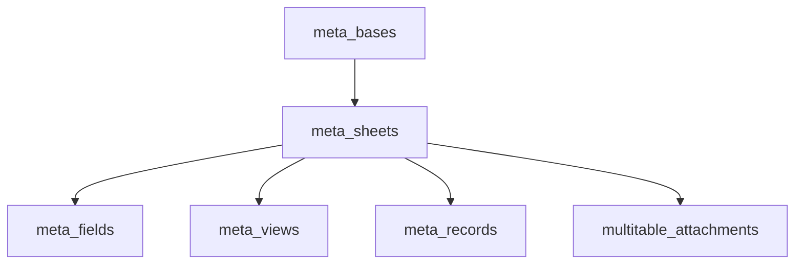

# Multitable Service Extraction Roadmap (2026-04-07)

> 文档类型：重构路线图 / 实施规划
> 日期：2026-04-07
> 范围：从 `packages/core-backend/src/routes/univer-meta.ts` 抽最小 helper，到长期维护 multitable 的阶段化方案
> 关联主题：after-sales C-min / C-full、multitable 长期维护、plugin 与 core-backend 边界

## TL;DR

`univer-meta.ts` 已经成为 multitable 的单体路由内核，继续把新能力直接堆进去会放大维护成本。当前最合适的路线不是先做完整 service 化，也不是让业务插件直接写 `meta_*` SQL，而是先在 backend 内部建立最小 seam：`provisioning.ts`、`loaders.ts`、`access.ts`。after-sales installer 的 C-min 应作为第一个消费者，只真实创建 `installedAsset` 对象的最小字段集；随后再按 `attachment -> record -> query -> permission` 的顺序继续拆分。

---

## 1. 背景与问题定义

### 1.1 当前事实

- `packages/core-backend/src/routes/univer-meta.ts` 已经承载 multitable 的主要读写逻辑。
- 该文件内部同时包含：
  - 元数据创建：`/bases`、`/sheets`、`/fields`、`/views`
  - 记录读写：`/records`
  - 附件上传/下载/删除：`/attachments`
  - 权限判断、字段只读判断、视图解析、attachment summary、lookup/link/rollup 辅助逻辑
- 现有 helper 虽然已经存在，但仍全部内联在 route 文件中，例如：
  - `ensureLegacyBase`
  - `loadSheetRow`
  - `loadFieldsForSheet`
  - `tryResolveView`
  - `resolveRequestAccess`
  - `deriveCapabilities`
- 当前没有可供插件直接依赖的 `context.api.multitable`，也没有独立的 multitable backend service。

### 1.2 当前风险

如果不先建立 backend 内部边界，后续会同时出现两类技术债：

1. 新 multitable 能力继续堆进 `univer-meta.ts`，路由文件继续膨胀。
2. 业务插件为了自救，开始直接操作 `meta_bases` / `meta_sheets` / `meta_fields` / `meta_views`，把平台内部 schema 知识扩散到插件层。

这两条路径都会让未来的 multitable 长期维护更贵。

### 1.3 当前时机为什么合适

- after-sales installer 刚好需要“建 base / 建 sheet / 建 field”能力。
- `app.manifest.json` 已经声明 `installedAsset` 的 `backing: "multitable"`。
- 当前尚未把 `meta_*` schema 知识写进 after-sales 插件，边界还来得及放对。
- `univer-meta.ts` 内已经有天然可抽的 helper 形状，重构成本可控。

---

## 2. 目标与非目标

### 2.1 目标

本路线图同时服务两个目标：

1. 给 after-sales C-min 提供一条不污染插件边界的真实 multitable 落地路径。
2. 为 multitable 的长期维护建立稳定目录、抽取顺序与验收标准。

### 2.2 非目标

本路线图明确不做以下事情：

- 不在本阶段重写整个 `univer-meta.ts`
- 不先做完整 `MultitablePermissionService`
- 不把插件变成 `meta_*` 表的直接操作者
- 不通过 backend 自调自身 HTTP 的方式复用 multitable route
- 不把现有 `packages/core-backend/src/services/view-service.ts` 强行扩展为 `meta_views` service
- 不把 after-sales C-min 扩大成“完整售后模板全部对象 + 全部视图 + 全部自动化”

---

## 3. 当前结构盘点

### 3.1 现有 multitable 元数据模型

当前 multitable 主要围绕以下表组织：

- `meta_bases`
- `meta_sheets`
- `meta_fields`
- `meta_views`
- `meta_records`
- `multitable_attachments`

关系概念上可理解为：



### 3.2 `univer-meta.ts` 中已经存在的可抽边界

当前可以较低风险抽出的块包括：

- provisioning 相关
  - `ensureLegacyBase`
  - 创建 sheet 的 SQL 片段
  - 创建 field 的 SQL 片段
- loaders 相关
  - `loadSheetRow`
  - `loadFieldsForSheet`
  - `tryResolveView`
- access 相关
  - `resolveRequestAccess`
  - `deriveCapabilities`

### 3.3 暂时不宜优先抽出的块

以下块复杂度更高，不适合在第一步就动：

- 全量 query/read 路径
- lookup / rollup / link 复合查询路径
- records patch 的所有联动写逻辑
- 全量附件生命周期

这些能力后面要拆，但不应该先拆。

---

## 4. 推荐目录结构

建议在 backend 内新增目录：

```text
packages/core-backend/src/multitable/
  provisioning.ts
  loaders.ts
  access.ts
  field-codecs.ts
  attachment-service.ts         # 后续阶段
  record-service.ts             # 后续阶段
  query-service.ts              # 后续阶段
  permission-service.ts         # 远期按需
```

### 4.1 目录职责

- `provisioning.ts`
  - 负责创建 base / sheet / field
  - 是 after-sales installer 的第一消费者目标
- `loaders.ts`
  - 负责 sheet / field / view 等基础加载
- `access.ts`
  - 负责能力推导、只读判断、基础访问控制
- `field-codecs.ts`
  - 负责字段类型映射、property 规范化、select/link/lookup/rollup 配置清洗

### 4.2 边界原则

- route 文件只保留 `req/res` 协调和 HTTP 错误映射
- `meta_*` schema 只允许 backend 内核层访问
- plugin 只依赖 adapter 接口或 backend 内部 helper，不直接写 SQL

---

## 5. 阶段化路线

### 5.1 M0：建立最小 seam

### 目标

在不做大重构的前提下，先把最稳定的通用能力从 `univer-meta.ts` 抽出。

### 交付

- 新增 `packages/core-backend/src/multitable/provisioning.ts`
- 新增 `packages/core-backend/src/multitable/loaders.ts`
- 新增 `packages/core-backend/src/multitable/access.ts`
- `univer-meta.ts` 改为调这些 helper，而不是继续内联新 SQL

### 最小 API 形状

`provisioning.ts` 建议先只暴露：

- `ensureLegacyBase(query)`
- `ensureSheet({ query, baseId, sheetId, name, description })`
- `ensureFields({ query, sheetId, fields })`

`loaders.ts` 建议先暴露：

- `loadSheetRow(query, sheetId)`
- `loadFieldsForSheet(query, sheetId)`
- `tryResolveView(pool, viewId)`

`access.ts` 建议先暴露：

- `resolveRequestAccess(req)`
- `deriveCapabilities(permissions, isAdminRole)`

### 验收标准

- 新 multitable 能力不再直接新增内联 SQL 到 `univer-meta.ts`
- `provisioning.ts` 已可被 route 或 installer 复用
- 至少有 helper-level unit test 覆盖上述 3 个文件

### 5.2 M1：after-sales C-min 接入 provisioning seam

### 目标

让 after-sales installer 成为 `provisioning.ts` 的第一个真实消费者。

### 范围

- 不做完整售后模板安装
- 只让 after-sales installer 对 `installedAsset` 执行真实 multitable 创建
- views / records / attachments / automations / notifications 全部继续留在 C-full 或后续阶段

### 推荐实现

- plugin 内保留 adapter 接口
- production adapter 调用 backend 内部 `provisioning.ts`
- unit test 继续注入 fake adapter

### 字段策略

C-min 不应引入临时性的伪业务字段。推荐的最小持久字段集：

- `assetCode: string`
- `serialNo: string`（可选）

不建议把以下字段当作 C-min 的“占位字段”：

- `id`
- `created_at`
- `updated_at`
- 纯展示用途但不进入最终设计的泛化字段

### 验收标准

- after-sales installer 不直接访问 `meta_*`
- `runInstall()` 真实建出 `installedAsset` 对应 sheet 和字段
- 现有 installer unit tests 继续通过
- 新增 1-2 个 integration tests 验证 provisioning helper 与真实 DB 契约

### 5.3 M2：抽 attachment 与 record 写路径

### 目标

把最容易出错、最容易复制粘贴的写路径从 route 中移出。

### 顺序

1. `attachment-service.ts`
2. `record-service.ts`

### 为什么 attachment 先于 record

- 边界更清晰
- 与 storage、上传、删除、副作用更集中
- record 写路径和 attachment 校验存在依赖关系

### 验收标准

- 附件上传/删除/序列化逻辑不再主要驻留在 route handler
- record create / patch 的字段校验、只读判断、attachment id 校验开始走 service

### 5.4 M3：抽 query/read 路径

### 目标

把 multitable 的查询复杂度从 route 文件搬到内核 service。

### 产物

- `query-service.ts`

### 负责内容

- 视图读取
- filter / sort / search
- link summary
- lookup / rollup 计算
- attachment summaries

### 风险说明

这是整体路线里最重的一步，必须晚于 M0 / M1 / M2。否则会把“建立正确边界”演变成“同时重写读路径和写路径”。

### 验收标准

- 列表读取和视图读取主逻辑不再主要留在 route 中
- query service 有独立 integration tests 覆盖典型 view/filter/sort 场景

### 5.5 M4：权限服务化

### 目标

只有当 multitable ACL 真正复杂化时，才把 `access.ts` 升格为完整 service。

### 触发条件

以下任一条件满足时，再考虑 `permission-service.ts`：

- 字段级 ACL 大幅增加
- 对象级 / 记录级 ACL 成为稳定需求
- project-scoped ACL 正式进入 multitable
- route / service 中重复出现多套能力计算逻辑

### 当前建议

当前不要优先做 `permission-service.ts`。先有 `access.ts` 即可。

---

## 6. 推荐优先级

长期维护 multitable 的推荐顺序如下：

1. `provisioning.ts`
2. `loaders.ts`
3. `access.ts`
4. `attachment-service.ts`
5. `record-service.ts`
6. `query-service.ts`
7. `permission-service.ts`

这个顺序的核心原则是：

- 先建立“新功能必须经过的 backend seam”
- 再收敛高频写路径
- 最后处理最复杂的读路径和 ACL

---

## 7. 与 after-sales 的对应关系

### 7.1 after-sales C-min

after-sales C-min 不应该成为插件直接写 multitable schema 的入口。它应该承担两件事：

1. 验证 `provisioning.ts` 的边界是否够用
2. 为后续 C-full 与更多业务模板建立正确的 backend seam

### 7.2 after-sales C-full

C-full 再继续往下走时，建议顺序是：

1. 补充 blueprint 来源
2. 扩展 `installedAsset` 完整字段
3. 增加更多 multitable-backed 对象
4. 补视图 provisioning
5. 接自动化、通知、审批桥接

### 7.3 after-sales 不该做的事

- 不把 `meta_*` SQL 写进插件
- 不绕过 backend helper 直接操作 multitable 内部表
- 不通过 backend 自调 HTTP 的方式复用 `/api/multitable/*`

---

## 8. 测试策略

### 8.1 总体原则

保持测试金字塔，不把所有责任压到 integration test。

### 8.2 推荐分层

- unit tests
  - 锁住 installer 的业务分支、错误码、账本语义
  - 锁住 provisioning helper 的入参校验和幂等行为
- integration tests
  - 锁住 provisioning helper 与真实 `meta_*` schema 的契约
  - 锁住 route 与 helper 的装配行为

### 8.3 不推荐的策略

- 不建议把 multitable 全量行为复制到 fake 中
- 不建议完全放弃 unit tests 改成只跑 integration

---

## 9. PR 切分建议

建议按 4 个 PR 切：

1. `refactor(multitable): extract provisioning/loaders/access helpers`
2. `feat(after-sales): wire installer to provisioning helper (C-min)`
3. `refactor(multitable): extract attachment and record services`
4. `refactor(multitable): extract query service`

如果权限复杂度后续真的上来，再补：

5. `refactor(multitable): introduce permission service`

---

## 10. 硬规则

从本路线开始，建议团队固定以下规则：

1. 不再让插件直接访问 `meta_*` 表。
2. 不再往 `univer-meta.ts` 新增核心 SQL，除非只是转调新 helper。
3. 不把 `packages/core-backend/src/services/view-service.ts` 作为 `meta_views` 的承载点。
4. 每抽出一层 helper / service，就补对应的 unit test 和 integration test。
5. 新的 multitable 写入能力优先进入 `packages/core-backend/src/multitable/`。

---

## 11. 阶段验收表

| 阶段 | 核心交付 | 不该发生的事 | 通过标准 |
|---|---|---|---|
| M0 | `provisioning.ts` / `loaders.ts` / `access.ts` | 继续把新 helper 散写在 route 中 | 新功能通过 helper 接入 |
| M1 | after-sales C-min 走 provisioning helper | plugin 直接写 `meta_*` | installer 能真实建 `installedAsset` |
| M2 | attachment / record service | record 写路径继续复制粘贴 | 写路径逻辑从 route 中收敛 |
| M3 | query service | 在 route 中继续扩 filter/sort/query 复杂度 | 读路径主要逻辑迁到 query service |
| M4 | permission service（按需） | 过早做大 ACL 重构 | 仅在 ACL 复杂度上升时引入 |

---

## 12. 结论

当前最稳的路线不是：

- 让 after-sales 插件直接写 multitable SQL
- 先做完整的 multitable 大重构
- 一开始就优先做 permission service

当前最稳的路线是：

1. 先从 `univer-meta.ts` 抽出最小 backend seam：`provisioning.ts`、`loaders.ts`、`access.ts`
2. 让 after-sales C-min 成为 `provisioning.ts` 的第一个消费者
3. 再按 `attachment -> record -> query -> permission` 的顺序推进长期维护

这样既能解决眼前的 after-sales 安装器问题，也不会把 multitable 的长期技术债继续扩散到插件层。
