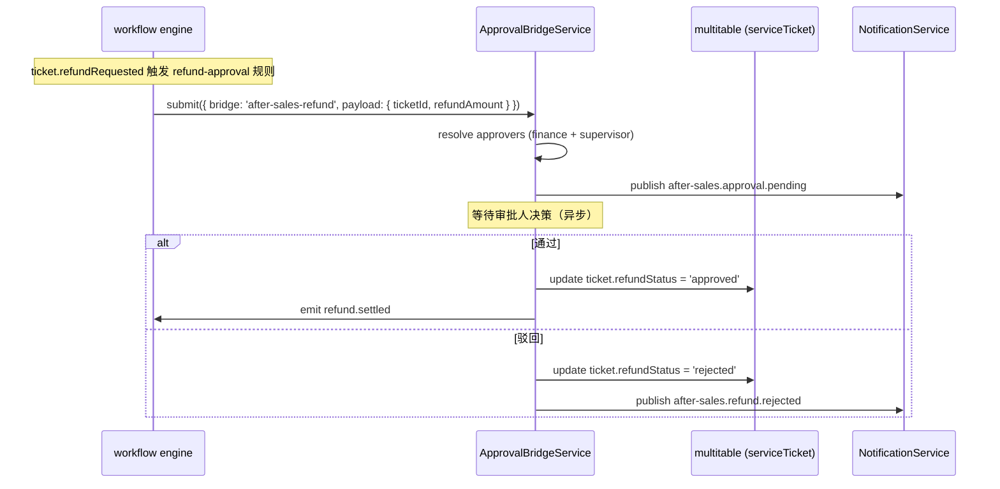
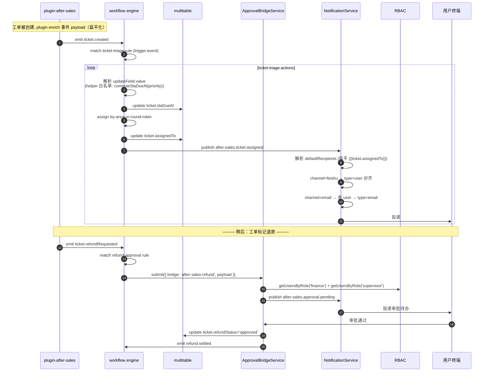

# 自动化 / 权限 / 通知设计 (platform-automation-permission-notification-design-20260407)

> **文档类型**：横切能力设计 / Pre-Implementation Design
> **日期**：2026-04-07
> **范围**：v1 `AutomationRuleDraft` / `RolePermissionMatrix` / `NotificationTopicSpec` 的运行时语义、注册幂等契约、recipient 解析约定、channel/type 对齐规则
> **来源词典**：2026-04-07 接口词典 v1.0（locked）
> **配套交付**：本文档为 5 份设计稿之 #3，前置 #1 / #2，后置 #4 `platform-project-creation-flow-design-20260407.md`、#5 `platform-project-builder-and-template-architecture-design-20260407.md`

## TL;DR

v1 自动化是**声明式描述**，运行时仍由 workflow 引擎执行；人工审批走 `ApprovalBridgeService`，禁止在 workflow 中实现审批节点；权限走现有 RBAC `resource:action`；通知走 `NotificationService`，channel 锁定为 `email / webhook / feishu`（无 `inApp`）。**三类注册（自动化规则、通知主题、角色绑定）必须按稳定 key 幂等 upsert**，这是 #2 "账本仅记终态 + 崩溃后可安全重试 enable" 承诺在运行时的必要条件。recipient 解析：`{{...}}` 只取**扁平**上下文字段（禁链式），`role:<slug>` 按角色展开，最终必须落为 `NotificationRecipient[]`；channel 与 recipient type 严格对齐（`feishu→user` / `email→email` / `webhook→webhook`），不匹配项跳过并写 warning。

---

## 1. 核心目标与非目标

### 1.1 v1 目标

- 把 `AutomationRuleDraft` / `RolePermissionMatrix` / `NotificationTopicSpec` 三类声明式类型的运行时语义写死
- 定义三类注册的**幂等契约**，让 #2 的"账本仅终态 + 安全重试"承诺在运行时自洽
- 定义 recipient 解析约定，消除 #1 §6 留下的字符串语义空白
- 定义 channel/type 对齐规则，对齐 `NotificationService.ts:263` 实际能力
- 锁死"退款 / 赔付审批走 `ApprovalBridgeService`"的强约束

### 1.2 v1 非目标

- ❌ 不重写 workflow 引擎；`AutomationRuleDraft` 只是声明式描述，运行时由现有 workflow 服务翻译执行
- ❌ 不在 workflow 中实现人工审批节点；退款 / 赔付必须通过 `ApprovalBridgeService`
- ❌ 不引入 scoped RBAC（`after_sales:write@projectId=...` 是 v2）
- ❌ 不引入新 notification channel；`inApp` 是 v2 通知中枢目标
- ❌ 不引入通用表达式引擎；helper 白名单见 #2 §7
- ❌ 不做记录级 RBAC（行级权限是 v2 及以后）

### 1.3 依赖的仓库现状与薄适配层契约

本文档引用的几个服务调用（`NotificationService.publish(...)` / `ApprovalBridgeService.submit(...)` / topic 注册 / bridge 注册）**不是仓库现成 API**，而是 v1 需要由 plugin-after-sales 内部实现的**薄适配层契约**。对照关系：

| 文档中引用的调用形态 | 现有仓库 API | 薄适配层职责 |
|---|---|---|
| `NotificationService.publish({ topic, payload })` | 仓库现有是 `NotificationService.send(...)` / `sendTemplate(...)`（参考 `packages/core-backend/src/types/plugin.ts:1067`） | plugin-after-sales 内部包一个 `publish(topic, payload)` helper：从内部 topic 注册表中取出 channels + defaultRecipients，按 §7 解析为 `NotificationRecipient[]`，再调现有 `send` |
| `NotificationService` topic 注册 | 仓库当前**没有**通用 topic 注册机制 | plugin-after-sales 维护一张**内部** topic 注册表（内存 map 或 jsonb 列），在 install 时由安装器按 §4.1 稳定 key upsert |
| `ApprovalBridgeService.submit({ bridge, payload })` | 现状见 `packages/core-backend/src/services/ApprovalBridgeService.ts:112`（形态与本文档描述略有差异） | plugin-after-sales 包一个 `submitRefundApproval(ticketId, amount)` helper，把参数翻译为现有 bridge API 的入参形态 |
| `ApprovalBridgeService` bridge 注册 + resolver/callback | 仓库有 bridge 体系，但注册 API 形态不同 | plugin-after-sales 在 `activate` 阶段按现有 bridge API 注册，回调路由内部映射到本文档描述的 `onApproved` / `onRejected` 语义 |

**薄适配层存在的意义**：让 `AutomationRuleDraft.actions` 中的 `submitApproval` / `sendNotification` 等声明式动作有稳定的运行时目标，同时**不要求**改动核心服务。v2 若统一到平台原语时，本层可被替换，但 `AutomationRuleDraft` / `NotificationTopicSpec` 的 blueprint 层契约不变。

**强约束**：

- 薄适配层必须物理位于 `plugins/plugin-after-sales/` 内
- **不得**修改 `packages/core-backend/src/services/NotificationService.ts` 或 `ApprovalBridgeService.ts` 的对外接口
- 薄适配层代码"够用即可"；如果出现大量业务逻辑或超过数百行，说明设计越界，应重新审视

下文所有对 `NotificationService.publish` / topic 注册 / `ApprovalBridgeService.submit` / bridge 注册 的引用，一律指上表中的薄适配层契约形态。

## 2. AutomationRuleDraft 运行时语义

### 2.1 trigger 结构

```ts
trigger: {
  event: string                      // 例 'ticket.created'
  filter?: Array<{
    field: string                    // 事件 payload 中的扁平字段名
    operator: 'eq' | 'in'
    value: unknown
  }>
}
```

**事件命名约定**：`<domain>.<object>.<verb>` 三段式，段与段之间用 `.` 分隔；**单段内部**若为多词使用 lowerCamelCase（如 `refundRequested` / `assignedSupervisor`），单词段直接小写（如 `ticket` / `assigned`）。售后 v1 使用的事件集合：

| event | 触发时机 | 必备扁平 payload |
|---|---|---|
| `ticket.created` | 工单落库成功 | `ticket.id`, `ticket.priority`, `ticket.source`, `ticket.customerId` |
| `ticket.assigned` | `assignedTo` 字段首次被写入 | `ticket.id`, `ticket.assignedTo`, `ticket.assignedSupervisor` |
| `ticket.overdue` | 定时器扫描 `slaDueAt < now` | `ticket.id`, `ticket.status`, `ticket.priority`, `ticket.assignedTo`, `ticket.assignedSupervisor` |
| `ticket.refundRequested` | 工单 `refundAmount` 非空且审批未发起 | `ticket.id`, `ticket.refundAmount`, `ticket.requestedBy` |
| `approval.pending` | `ApprovalBridgeService` 发起新审批后 | `approval.id`, `approval.bridge`, `approval.ticketId` |
| `followup.due` | 定时器扫描 `FollowUp.scheduledAt < now && status='pending'` | `followUp.id`, `followUp.ticketId`, `followUp.followedUpBy` |

**事件 payload 必须扁平**：所有嵌套字段（如 `ticket.assignedSupervisor`）由 plugin-after-sales 在事件发出前 **enrich**，不允许在 `filter` / `recipient` 中做链式取值（见 §6）。

### 2.2 filter 语义

- `operator: 'eq'` → `payload[field] === value`
- `operator: 'in'` → `Array.isArray(value) && value.includes(payload[field])`
- 多个 filter 之间为 **AND** 关系；不支持 OR（v2 再议）
- `field` 只能是扁平路径，**不允许** `ticket.customer.name` 等链式

### 2.3 conditions（v1 留空）

v1 不使用 `conditions` 字段。蓝图中应写 `"conditions": []`，安装器校验时如发现非空则写 warning 并忽略该字段。v2 才启用运行时条件（与 filter 的区别：filter 基于事件 payload，conditions 基于运行时数据库查询结果）。

### 2.4 actions（4 种）

```ts
actions: Array<
  | { type: 'updateField'; field: string; value: unknown }
  | { type: 'assign'; assigneeRule: string }
  | { type: 'submitApproval'; bridge: string }
  | { type: 'sendNotification'; topic: string }
>
```

各动作语义：

#### 2.4.1 `updateField`
- `field`：被触发事件所属对象的字段路径（扁平）
- `value`：字面量或 helper 白名单调用（见 #2 §7）
- 执行时：workflow 引擎直接写 multitable 对象字段
- 失败：写执行日志，不回滚前序动作

#### 2.4.2 `assign`
- `assigneeRule`：由 plugin-after-sales 提供的分派策略字符串，v1 白名单仅含：
  - `'by-area-or-round-robin'`（按客户地区分派，无地区则轮询）
- 其他值 → 安装器校验时写 warning，运行时跳过该 action
- 执行时：解析策略 → 查询候选技师 → 写入目标对象的 `assignedTo` 字段

#### 2.4.3 `submitApproval`
- `bridge`：`ApprovalBridgeService` 已注册的 bridge 标识
- v1 模板使用的 bridge 白名单仅含：
  - `'after-sales-refund'`
- 执行时：workflow 引擎调用 `ApprovalBridgeService.submit({ bridge, payload, initiator, tenantId })`
- **强约束**：此类 action 是 v1 **唯一**的人工节点入口；workflow 引擎不得实现任何其他形式的人工审批

#### 2.4.4 `sendNotification`
- `topic`：已在同 blueprint `notifications` 段注册的 `NotificationTopicSpec.topic`
- 执行时：workflow 引擎调用 `NotificationService.publish({ tenantId, topic, payload })`
- recipient 展开发生在 NotificationService 内部（见 §6）
- **v1 无 `webhook` action**：对外回调走 `sendNotification` + `topic.channels = ['webhook']`，DSL 更干净；`callWebhook` / `invokeConnector` 是 v2

### 2.5 enabled 开关

- `enabled: false` 的规则**仍然注册**到 workflow 引擎，但触发时立即跳过
- 安装器把 enabled 状态同步到 workflow 规则的 active 标志

## 3. 退款审批：ApprovalBridgeService 强约束

### 3.1 bridge 注册

- plugin-after-sales 在 `activate` 阶段向 `ApprovalBridgeService` 注册 bridge `after-sales-refund`
- 注册信息包括：
  - `bridge: 'after-sales-refund'`
  - `displayName: '售后退款 / 赔付审批'`
  - `approverResolver`: 返回 `finance` + `supervisor` 两个角色的用户集合
  - `onApproved`: 回调 → 更新工单 `refundStatus = 'approved'` → 触发 `refund.settled` 事件
  - `onRejected`: 回调 → 更新工单 `refundStatus = 'rejected'` → 通知发起人
- 注册必须**幂等**（见 §4）

### 3.2 运行时路径



### 3.3 禁止的替代实现

以下做法在 v1 **严禁**：

- ❌ 在 workflow 的 action 列表中手动编排 "wait-for-user-decision" 节点
- ❌ 把审批状态存在 workflow 实例内存中
- ❌ 在 `AutomationRuleDraft.actions` 中直接写 `assignApprover` / `waitForApproval` 类 action
- ❌ 绕开 `ApprovalBridgeService` 直接写工单 `refundStatus` 字段（除 bridge 回调路径外）

## 4. 注册幂等契约 ⭐

**这是 v1 的核心横切约束**，由 #2 §4.5 "账本仅记终态" 与 §6.5 "安装器不持中间态" 的承诺倒逼：如果三类注册不是幂等 upsert，崩溃后重试 enable 会产生重复规则 / 重复 topic / 重复权限绑定，违背 #2 的可重试承诺。

### 4.1 三类注册的稳定 key

| 注册类型 | 稳定 key | upsert 语义 |
|---|---|---|
| AutomationRule | `(tenantId, appId, rule.id)` | 同 key 存在 → 覆盖 `trigger / filter / actions / enabled`；不存在 → 新建 |
| NotificationTopic | `(tenantId, topic)` | 同 key 存在 → 覆盖 `event / channels / defaultRecipients`；不存在 → 新建 |
| RolePermissionBinding | `(tenantId, role, permission)` | 同 key 存在 → noop；不存在 → 新建 |
| FieldPolicyBinding | `(tenantId, role, objectId, field)` | 同 key 存在 → 覆盖 `visibility / editability`；不存在 → 新建 |
| ApprovalBridge | `(tenantId, bridge)` | 同 key 存在 → 覆盖 resolver / 回调引用；不存在 → 新建 |

### 4.2 实现要求

- 若底层服务（workflow / NotificationService / RBAC / ApprovalBridgeService）原生支持 upsert → 直接调用
- 若底层服务只提供 create / update / delete → 安装器的翻译层实现 "check-then-update-or-insert" 模式
- 翻译层必须把"查找 + 写入"包在**同一事务**内，防止并发 enable 产生重复
- 查找与写入的 key 必须与 §4.1 的稳定 key 完全一致，**不得**使用自增主键或随机 UUID 作为识别条件

### 4.3 并发 enable 的防护

理论上两个并发 enable 请求都可能穿过 #2 §5.1 的账本检查（因为账本此时无行）。防护层级：

1. **账本层**：`plugin_after_sales_template_installs` 的 `UNIQUE (tenant_id, app_id)` 唯一约束是最后一道兜底——第二个并发请求的 UPSERT 会得到冲突错误，前端收到 `already-installed`
2. **注册层**：§4.1 的稳定 key upsert 保证即使两个请求都注册了同一规则，也只落一条
3. **建表层**：multitable 的建表接口如果不幂等，第二个请求会失败并进入 warnings；这不是灾难，因为第一个请求的建表已经成功了

这三层共同保证：**并发 enable 不会产生脏数据**，只会让其中一个请求得到 `already-installed` 错误。

### 4.4 与 #2 的互锁关系

| #2 承诺 | #3 对应幂等 |
|---|---|
| 账本仅记终态 | 重试前必然无"进行中"行可参考；重试必须把注册全跑一遍，必须幂等 |
| 安装器不持中间态 | 崩溃后内存状态丢失；重试只能依赖稳定 key 识别已注册项 |
| reinstall = 增量补齐 | 增量补齐的底层机制就是 §4.1 的 upsert |
| 并发 enable 安全 | 账本唯一约束 + 注册层幂等 = 双保险 |

**如果任一类注册不支持 §4.1 的稳定 key upsert**，则必须在 #2 §4.5 的"仅终态"承诺上打补丁，或在 plugin-after-sales 中实现该类注册的"先删后建"清理逻辑。v1 选择强制实现 upsert，不打补丁。

## 5. RolePermissionMatrix 运行时语义

### 5.1 六角色详表

| slug | 中文标签 | 默认 permissions |
|---|---|---|
| `customer_service` | 客服 | `after_sales:read`, `after_sales:write` |
| `technician` | 技师 | `after_sales:read`, `after_sales:write` |
| `supervisor` | 主管 | `after_sales:read`, `after_sales:write`, `after_sales:approve` |
| `finance` | 财务 | `after_sales:read`, `after_sales:approve` |
| `admin` | 管理员 | `after_sales:read`, `after_sales:write`, `after_sales:approve`, `after_sales:admin` |
| `viewer` | 只读 | `after_sales:read` |

### 5.2 permission 语法

- v1 格式：`<resource>:<action>`
- `resource` v1 固定为 `after_sales`
- `action` v1 枚举：`read` / `write` / `approve` / `admin`
- **严禁**在 v1 中出现 `after_sales:write@projectId=...` 这类 scoped 语法——那是 v2

### 5.3 fieldPolicies 运行时语义

`fieldPolicies` 仅作用于前端字段渲染层，**v1 不在 API 层裁剪列**（参考 `packages/core-backend/src/routes/univer-meta.ts:1086 / 3133`）。

```ts
fieldPolicies?: Array<{
  objectId: string                   // 'serviceTicket'
  field: string                      // 'refundAmount'
  visibility: 'visible' | 'hidden'   // hidden → 前端隐藏渲染
  editability: 'editable' | 'readonly'  // readonly → 前端禁用编辑控件
}>
```

### 5.4 v1 唯一 fieldPolicy 示例：refundAmount

| 角色 | visibility | editability |
|---|---|---|
| `finance` | `visible` | `editable` |
| `admin` | `visible` | `editable` |
| `supervisor` | `visible` | `readonly` |
| `customer_service` | `hidden` | `readonly` |
| `technician` | `hidden` | `readonly` |
| `viewer` | `hidden` | `readonly` |

**强约束**：

- `hidden` 仅影响前端字段渲染；后端 API 仍返回该列
- 数据导出（CSV / Excel）默认遵循 fieldPolicy，但可由 `admin` 角色显式勾选"包含隐藏字段"绕过
- 日志、审计、搜索索引**不受** fieldPolicy 影响（v1 审计面向 admin / finance / supervisor，默认可见）
- v2 才考虑列级 API 裁剪

### 5.5 角色分配的源头

- v1 不提供"把用户加入某角色"的 UI；角色分配走现有 RBAC 服务的管理端
- 模板安装只定义"角色 → 权限"映射，**不**定义"用户 → 角色"映射
- plugin-after-sales 假设租户管理员已通过现有 RBAC 管理端完成用户-角色分配

## 6. NotificationTopicSpec 运行时语义

### 6.1 topic 命名约定

- 格式：`<appId>.<domain>.<event>`
- 售后 v1 使用的 4 个 topic：
  - `after-sales.ticket.assigned`
  - `after-sales.ticket.overdue`
  - `after-sales.approval.pending`
  - `after-sales.followup.due`
- topic 是稳定 key 的一部分（见 §4.1）；改名等价于删旧建新，v1 应避免

### 6.2 channels 锁定枚举

```ts
channels: Array<'email' | 'webhook' | 'feishu'>
```

**强约束**：与 `packages/core-backend/src/services/NotificationService.ts:263` 已注册的渠道对齐。**禁止**在 v1 中出现：

- ❌ `inApp`（v2 通知中枢目标）
- ❌ `sms`（尚未在 NotificationService 注册）
- ❌ `dingtalk` / `wework` / `slack` 等（v2 connector 扩展）

如未来 `NotificationService` 新增 channel，必须先升级接口词典到 v1.1 再更新本文档。

### 6.3 defaultRecipients 是模板层描述，不是运行时入参

**这是 v1 最容易被误解的一条**。

- `NotificationTopicSpec.defaultRecipients: string[]` 是**模板蓝图层**的字符串描述，由安装器透传到 `NotificationService` 的 topic 注册调用
- 运行时 `NotificationService.publish()` **实际吃的是** `NotificationRecipient[]`，而不是字符串数组
- 两者之间的转换（字符串 → `NotificationRecipient[]`）由 `NotificationService` 在发送时完成，具体规则见 §6.4
- 参考：`packages/core-backend/src/services/NotificationService.ts` 与 `packages/core-backend/src/types/plugin.ts:1120`

**安装器的职责**：只把 `defaultRecipients: string[]` 原样注册给 topic，**不**解析占位符、**不**展开 role slug、**不**做 channel/type 检查。所有解析与校验发生在发送时。

## 7. recipient 解析约定 ⭐

**这是 v1 必须写死的核心章节**，填补 #1 §6 留下的字符串语义空白。

### 7.1 输入 / 输出类型

- **输入**：`defaultRecipients: string[]`（模板层字符串数组）+ 事件 payload（已预填为一层命名空间结构，见 §7.4）
- **输出**：`NotificationRecipient[]`，形如 `{ id: string; type: 'user' | 'email' | 'webhook'; metadata?: Record<string, unknown> }`（参考 `packages/core-backend/src/types/plugin.ts:1120`）
- 其中 `id` 字段承载**投递地址**：`type='user'` 时是系统用户 id、`type='email'` 时是邮箱地址、`type='webhook'` 时是 URL；`metadata` 可选，用于携带渠道特定参数（飞书 card 模板 id、邮件模板变量等）

### 7.2 字符串语法：三种形态

| 形态 | 语法 | 示例 | 解析行为 |
|---|---|---|---|
| 模板变量 | `{{fieldName}}` | `{{ticket.assignedTo}}` | 从事件 payload 中读取**扁平**字段；找到 → 生成一个 recipient；找不到 → 跳过并写 warning |
| 角色引用 | `role:<slug>` | `role:finance` | 通过 RBAC 服务查询该租户该角色的所有用户；为空 → 跳过并写 warning |
| 字面量 | 其他所有字符串 | `admin@example.com` / `user_123` | 原样作为投递地址传入，不做解析 |

### 7.3 模板变量的严格约束

- **只支持一层命名空间取值**：`{{ticket.assignedTo}}` 允许（`payload.ticket` 是一层命名空间，`assignedTo` 是其中的标量字段），`{{ticket.customer.contactPhone}}` **禁止**（需要二次嵌套查找 `customer` 对象内的字段）
- 识别正则：`/^\{\{\s*([a-zA-Z_][a-zA-Z0-9_]*)\.([a-zA-Z_][a-zA-Z0-9_]*)\s*\}\}$/`（严格两段式：`<namespace>.<field>`）
- **点号数量**必须恰好为 1（`ticket.assignedTo` 允许，`ticket.assignedTo.name` 禁止，`assignedTo` 也禁止——必须带命名空间前缀）
- 违反链式约束 → 跳过该占位符 + 写 warning `"chained recipient template not supported: {{...}}"`

### 7.4 上下文扁平化是 plugin 侧的职责

- plugin-after-sales 在发出任何事件**之前**必须先 enrich payload，把所有通知可能用到的关联字段预填为**一层命名空间下的扁平标量**
- 具体约定：事件对象按 `{ <namespace>: { <flatField>: scalar, ... } }` 组织，命名空间之下**只允许扁平标量或 id，不允许二次嵌套对象**

  ```ts
  // ✅ 允许：一层命名空间 + 其下全为标量
  {
    ticket: {
      id: 'tk_001',
      priority: 'urgent',
      assignedTo: 'user_42',           // 用户 id（标量）
      assignedSupervisor: 'user_88',   // plugin 预先 enrich 的标量
      customerId: 'cust_003',          // 关联 id（标量）
    }
  }

  // ❌ 禁止：命名空间之下出现嵌套对象
  {
    ticket: {
      customer: { id: 'cust_003', name: '...' },           // 禁止
      assignedTo: { id: 'user_42', supervisor: 'user_88' } // 禁止
    }
  }
  ```

- 这一约束与 #1 §6 把 `{{ticket.assignedTo.supervisor}}` 改写为 `{{ticket.assignedSupervisor}}` 的理由一致
- 如果未来需要新字段，**先**扩展 plugin 的 enrichment 逻辑 **再**在模板中引用

### 7.5 `role:<slug>` 展开规则

- `slug` 必须是已知角色之一（见 §5.1 六角色表）
- 展开 = 查询 RBAC 服务：`getUsersByRole(tenantId, slug)`，返回 user id 列表
- 若列表为空 → 跳过 + 写 warning `"no users found for role: <slug>"`，不阻断通知发送
- 展开后的每个 user id 进入下一步 channel/type 对齐检查

### 7.6 channel / type 严格对齐 ⭐

解析出的 user id / 字面量必须与 topic 的每个 channel 做**类型匹配**，生成对应的 `NotificationRecipient`：

| channel | 合法 recipient.type | 含义 | 不匹配处理 |
|---|---|---|---|
| `feishu` | `'user'` 仅限 | 需要内部 user id（作为飞书身份解析的起点） | 跳过 + warning `"feishu channel requires type=user"` |
| `email` | `'email'` 仅限 | 需要 email 地址（可由 user id 解析得到） | 跳过 + warning `"email channel requires resolvable email"` |
| `webhook` | `'webhook'` 仅限 | 需要 webhook URL（字面量） | 跳过 + warning `"webhook channel requires webhook URL"` |

### 7.7 解析链完整示例

输入：
```json
{
  "topic": "after-sales.ticket.overdue",
  "channels": ["email", "feishu"],
  "defaultRecipients": ["{{ticket.assignedTo}}", "{{ticket.assignedSupervisor}}"]
}
```

事件 payload（已扁平）：
```json
{
  "ticket": {
    "id": "tk_001",
    "assignedTo": "user_42",
    "assignedSupervisor": "user_88"
  }
}
```

解析步骤：

1. 扫描 `defaultRecipients` → 识别两个 `{{...}}` 占位符
2. 从 payload 取值 → `user_42` / `user_88`（均为 user id）
3. 对每个 channel 做类型对齐（生成 `NotificationRecipient` 时 `id` 字段承载投递地址，见 §7.1）：
   - `feishu` 需要 `type = 'user'` → `user_42` / `user_88` 直接满足 → 生成两条 `{ id: 'user_42', type: 'user' }` 与 `{ id: 'user_88', type: 'user' }`
   - `email` 需要 `type = 'email'` → 查 user 表取邮箱 → 生成两条 `{ id: '<user_42.email>', type: 'email' }` 与 `{ id: '<user_88.email>', type: 'email' }`
4. 最终 `NotificationRecipient[]` = 4 条（2 user + 2 email）
5. `NotificationService` 按 channel 分发投递

### 7.8 warning 汇总

所有解析期 warning 不阻断发送，也不进入模板安装账本，而是写到通知发送日志表（由 `NotificationService` 现有日志机制承担）。

## 8. 安装时 vs 运行时 分工矩阵

| 动作 | 安装时（InstallerOrchestrator） | 运行时（workflow / NotificationService / RBAC） |
|---|---|---|
| 解析 blueprint | ✓ | ✗ |
| 注册自动化规则 | ✓ 调 workflow service upsert | ✗ |
| 注册通知 topic | ✓ 调 NotificationService upsert | ✗ |
| 注册 role → permission | ✓ 调 RBAC upsert | ✗ |
| 注册 bridge 回调 | ✓ 调 ApprovalBridgeService upsert | ✗ |
| 解析 helper 白名单 `{{computeSlaDueAt(priority)}}` | ✗（仅校验白名单命中） | ✓（workflow 执行 action 时） |
| 展开 recipient 占位符 | ✗（仅字符串透传） | ✓（NotificationService 发送时） |
| 执行 channel/type 对齐 | ✗ | ✓ |
| enrich 事件 payload 扁平化 | ✗ | ✓（plugin 发事件前） |
| 调 ApprovalBridgeService.submit | ✗ | ✓（workflow 执行 submitApproval action 时） |

**设计原则**：安装时只做"声明注册"，运行时才做"解释执行"。这让安装成为纯幂等的写入操作，运行时行为完全由 payload + 当前数据库状态决定。

## 9. 运行时联动 Mermaid



## 10. v1 → v2 升级承诺

### 10.1 稳定 key 的向前兼容

- 自动化稳定 key 从 `(tenantId, appId, rule.id)` 扩展为 `(tenantId, appId, projectId, rule.id)`；v1 数据的 `projectId` 填伪值 `${tenantId}:after-sales`
- topic 稳定 key 从 `(tenantId, topic)` 扩展为 `(tenantId, projectId, topic)`
- 角色绑定稳定 key 从 `(tenantId, role, permission)` 扩展为 `(tenantId, projectId, role, permission)`
- bridge 稳定 key 从 `(tenantId, bridge)` 扩展为 `(tenantId, projectId, bridge)`

v2 扩展都是"追加列"而非"改列"，v1 数据可原地升级。

### 10.2 API 列裁剪承诺

- v2 引入列级 API 裁剪时，`fieldPolicies.visibility = 'hidden'` 将从"仅 UI 层"升级为"同时裁剪 API 返回列"
- v1 调用方的代码**不需要**为此做兼容性判断；升级后原本能读到 `refundAmount` 的前端组件会开始收不到该字段（对 hidden 角色而言），这是预期行为
- v2 同时提供一个 admin-only 的 `?includeHidden=true` 查询参数用于审计

### 10.3 helper 白名单扩展

- v2 可新增 helper 函数（如 `computeFollowUpDate(completedAt)` / `getSupervisor(userId)`）
- v2 必须保持 v1 已有 helper 的签名与返回值不变
- v2 不得引入通用表达式引擎

### 10.4 channel 扩展

- v2 新增 `inApp` channel；v1 模板的 topic 不自动获得 `inApp`，需显式升级蓝图
- v2 通知中枢为 `inApp` 提供统一收件箱；v1 的 `email / webhook / feishu` 通路不变

## 11. 实施者开工自检表

### 11.1 四大禁区

- ❌ **不重写 workflow 引擎**：`AutomationRuleDraft` 只是声明式描述，运行时由现有 workflow 服务翻译执行；严禁在本次实施中引入新的规则引擎 / 状态机框架
- ❌ **不在 workflow 中实现人工审批节点**：退款 / 赔付必须走 `ApprovalBridgeService`；workflow action 列表中严禁出现 `waitForApproval` / `assignApprover` 等同义词
- ❌ **不做非幂等注册**：三类注册（自动化 / 通知 topic / 角色绑定）必须按 §4.1 的稳定 key upsert；严禁使用自增主键 / 随机 UUID 作为识别条件
- ❌ **不解析 recipient 占位符于安装时**：安装器只把 `defaultRecipients: string[]` 原样透传给 `NotificationService`；所有展开发生在发送时

### 11.2 细项 checklist

- [ ] `AutomationRuleDraft.trigger.event` 使用三段式 `<domain>.<object>.<verb>` 命名
- [ ] `trigger.filter` 的 `field` 是扁平字段名，无链式（无 `.` 或仅 1 个 `.`）
- [ ] `conditions` 留空数组（v1 不使用）
- [ ] `actions` 只使用四种 type 之一：`updateField / assign / submitApproval / sendNotification`
- [ ] `assign.assigneeRule` 在 v1 白名单内（`by-area-or-round-robin`）
- [ ] `submitApproval.bridge` 在 v1 白名单内（`after-sales-refund`）
- [ ] `sendNotification.topic` 对应同 blueprint 已声明的 topic
- [ ] 自动化注册按 `(tenantId, appId, rule.id)` upsert
- [ ] 通知 topic 注册按 `(tenantId, topic)` upsert
- [ ] 角色绑定按 `(tenantId, role, permission)` upsert
- [ ] FieldPolicy 按 `(tenantId, role, objectId, field)` upsert
- [ ] ApprovalBridge 按 `(tenantId, bridge)` upsert
- [ ] 注册翻译层使用同事务的 "check-then-update-or-insert"
- [ ] 事件 payload 在 plugin 发出前已 enrich 为扁平结构
- [ ] 扁平字段命名（如 `ticket.assignedSupervisor`）与 #1 §6 通知表一致
- [ ] recipient 解析器只识别 `{{...}}` / `role:<slug>` / 字面量三种形态
- [ ] recipient 解析器对链式 `{{a.b.c.d}}` 返回 warning 并跳过
- [ ] channel `feishu` 只接受 `type='user'` 的 recipient
- [ ] channel `email` 只接受 `type='email'` 的 recipient
- [ ] channel `webhook` 只接受 `type='webhook'` 的 recipient
- [ ] channel / type 不匹配 → 跳过 + warning，不阻断整条通知
- [ ] `fieldPolicies.visibility = 'hidden'` 只在前端生效，后端 API 不裁剪
- [ ] 六角色 slug 使用英文：`customer_service / technician / supervisor / finance / admin / viewer`
- [ ] `after_sales:write@projectId=...` 类 scoped 语法不出现
- [ ] 所有新增 channel / topic / role / bridge 名称先进接口词典 v1.1 再写代码

---

## 附：本文档触发的词典补丁记录

本文档对接口词典 v1.0 做以下**非破坏性**补充，不改字段名 / 类型 / 可选性，仅明文化现有字段的运行时语义。词典版本**不升级**，仍为 v1.0。

| 补丁类型 | 内容 | 位置 |
|---|---|---|
| `AutomationRuleDraft.trigger.event` 命名约定 | 三段式 `<domain>.<object>.<verb>`，扁平 payload | §2.1 |
| `AutomationRuleDraft.conditions` v1 语义 | 必须为空数组，非空则 warning 后忽略 | §2.3 |
| `assign.assigneeRule` v1 白名单 | 仅 `by-area-or-round-robin` | §2.4.2 |
| `submitApproval.bridge` v1 白名单 | 仅 `after-sales-refund` | §2.4.3 |
| 三类注册稳定 key 列表 | 自动化 / topic / role / fieldPolicy / bridge 各一行 | §4.1 |
| `fieldPolicies` 运行时语义 | UI-only，API 不裁剪；数据导出可绕过（admin）；日志/审计不受影响 | §5.3 |
| `NotificationTopicSpec.channels` 锁定枚举 | `email / webhook / feishu`，禁 `inApp / sms / dingtalk` 等 | §6.2 |
| `NotificationTopicSpec.defaultRecipients` 透传语义 | 模板层字符串，运行时解析 | §6.3 |
| recipient 三形态语法 | `{{...}}` / `role:<slug>` / 字面量 | §7.2 |
| recipient 模板变量深度约束 | 点号数量 ≤ 1，禁链式 | §7.3 |
| recipient channel/type 对齐矩阵 | feishu→user / email→email / webhook→webhook | §7.6 |

**未触发词典版本升级**：本文档未新增字段类型、未改 `AutomationRuleDraft` / `RolePermissionMatrix` / `NotificationTopicSpec` 的字段名或类型或可选性。词典版本仍为 **v1.0**。
