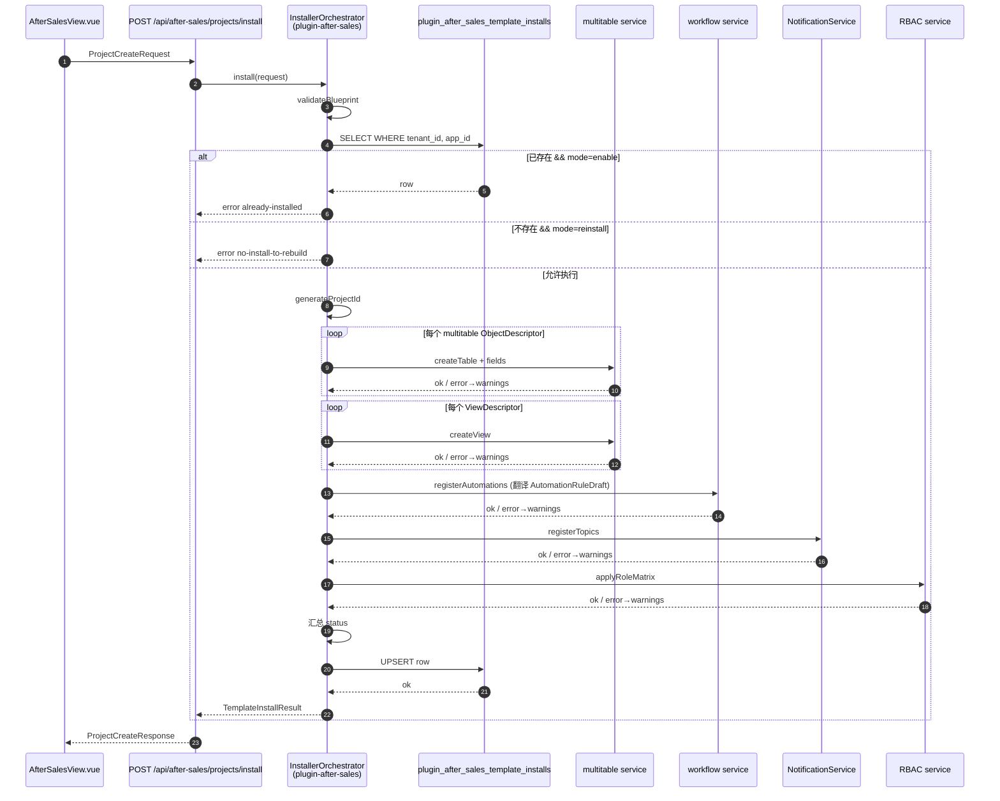

# 对象模型与模板安装器设计 (platform-object-model-and-template-installer-design-20260407)

> **文档类型**：平台抽象与执行器设计 / Pre-Implementation Design
> **日期**：2026-04-07
> **范围**：v1 项目模板蓝图类型、模板安装器编排、账本表、reinstall / partial / 幂等语义、helper 白名单、v1→v2 升级承诺
> **来源词典**：2026-04-07 接口词典 v1.0（locked）
> **配套交付**：本文档为 5 份设计稿之 #2，前置 #1 `after-sales-project-template-design-20260407.md`，后置 #3 `platform-automation-permission-notification-design-20260407.md`

## TL;DR

本文档锁定 `ProjectTemplateBlueprint` / `TemplateInstallRequest` / `TemplateInstallResult` 的字段与语义；定义 v1 账本表 `plugin_after_sales_template_installs`（由核心 migration 创建，插件运行时通过 `context.api.database` 访问）；把安装器定位为**薄壳编排器**（逐表调现有 multitable API），非统一 BlueprintInstaller 平台服务；锁死 v1 **幂等键** `(tenant_id, app_id)`、**reinstall = 增量补齐不删数据**、**partial = 进首页 + 顶部状态条 + 重新安装按钮**、**helper 白名单仅含 `computeSlaDueAt(priority)`**；明确 v1→v2 的无损演进路径。

---

## 1. 核心目标与非目标

### 1.1 v1 目标

- 为"项目模板"定义一份**可序列化、可审计、可 diff** 的蓝图类型
- 把蓝图**安全、幂等、增量**地落成 multitable 对象 / 视图 / 自动化 / 通知 / 角色绑定
- 把 reinstall / partial / 幂等键 / 报告引用等边界情况写死，让实施者无需二次决策
- 为未来 v2 多实例留出无损演进路径（所有 v1 代码都能原地升级）

### 1.2 v1 非目标（非常重要）

以下能力**不在 v1 范围**，文档中不得出现与其矛盾的表述，实施者也不得私自实现：

- ❌ 不做统一 `BlueprintInstaller` 平台服务；安装器是 plugin-after-sales 内部的薄壳编排器
- ❌ 不引入新的 multitable 批量创建 API；逐表调用现有接口即可，接受 N 秒级耗时
- ❌ 不要求跨对象强事务；步骤级失败通过 warnings 与 partial 状态表达
- ❌ 不做 marketplace / sandbox / scoped CoreAPI / workspaceId / organizationId
- ❌ **不做通用表达式引擎**；helper 必须走白名单（详见 §8）
- ❌ 不引入 `project_id` 列；v2 才加（详见 §12）
- ❌ 不改 `packages/core-backend/src/db/types.ts`（多线冲突热区）
- ❌ 不引入"插件自管 migration runner"这一当前不存在的能力

## 2. ProjectTemplateBlueprint 字段清单与约束

本节是接口词典 v1.0 的**详细扩写**，不新增字段，仅补充约束与示例。

### 2.1 顶层结构

```ts
interface ProjectTemplateBlueprint {
  id: string                          // kebab-case slug, 必须匹配 /^[a-z][a-z0-9-]*$/
  version: string                     // semver, 必须匹配 /^\d+\.\d+\.\d+$/
  displayName: string                 // 人类可读名
  appId: string                       // 必须等于某个已声明 app.manifest.json 的 boundedContext.code
  objects: ObjectDescriptor[]         // 至少 1 个
  views: ViewDescriptor[]             // 可为空数组
  automations: AutomationRuleDraft[]  // 可为空数组
  roles: RolePermissionMatrix[]       // 可为空数组
  notifications: NotificationTopicSpec[]  // 可为空数组
  configDefaults: Record<string, unknown>  // 蓝图默认值的快照（对售后模板即 AfterSalesTemplateConfig）
}
```

### 2.2 ObjectDescriptor 约束

- `id`：kebab-case 或 camelCase 均可，必须在同一 blueprint 内唯一
- `backing`：`'multitable' | 'service' | 'hybrid'`，v1 模板安装器只创建 `multitable` backing 的对象；`service` / `hybrid` 对象由插件自身服务层管理，模板不代创建
- `fields`：至少包含 `id` + 1 个业务字段；每个 `FieldDescriptor.type` 必须是词典锁定的 10 种规范类型之一
- `primaryViewId`：如指定，必须在同 blueprint 的 `views` 数组中存在

### 2.3 FieldDescriptor.reference 约束

- `link` / `lookup` / `rollup` 字段必须声明 `reference`
- `reference.objectId` 必须满足以下之一：
  - 等于同 blueprint 中某个 `ObjectDescriptor.id`
  - 等于特殊值 `'user'`（表示系统用户表），此时必须同时指定 `refKind: 'user'`
- **严禁**跨 blueprint 引用（v1 不支持）

### 2.4 ViewDescriptor 约束

- `type` v1 默认模板只使用 `grid / kanban / calendar / gallery / form` 五种；`gantt` 允许但不推荐；`timeline` 在 core view-service 未暴露（`packages/core-backend/src/services/view-service.ts:12`），v1 禁用
- `config` 为 `Record<string, unknown>`，v1 不强约束 schema；推荐字段：
  - `groupBy`（kanban 必填）
  - `dateField`（calendar 必填）
  - `filter`（grid 可选）
  - `sort`（grid / kanban 可选）

### 2.5 蓝图 JSON 片段示例（售后默认模板的 objects 段节选）

```json
{
  "id": "after-sales-default",
  "version": "0.1.0",
  "displayName": "售后默认模板",
  "appId": "after-sales",
  "objects": [
    {
      "id": "serviceTicket",
      "name": "工单",
      "backing": "multitable",
      "fields": [
        { "id": "id", "name": "ID", "type": "string", "required": true },
        { "id": "ticketNo", "name": "工单号", "type": "string", "required": true },
        { "id": "priority", "name": "优先级", "type": "select", "required": true,
          "options": ["low", "normal", "high", "urgent"], "default": "normal" },
        { "id": "assignedTo", "name": "处理人", "type": "link", "required": false,
          "reference": { "objectId": "user", "refKind": "user" } }
      ],
      "primaryViewId": "ticket-board"
    }
  ]
}
```

## 3. TemplateInstallRequest / TemplateInstallResult

本节扩写词典 v1.0 的 A 节第 2/3 类型。

### 3.1 TemplateInstallRequest 字段语义

| 字段 | 类型 | v1 语义 |
|---|---|---|
| `tenantId` | `string` | 当前请求的租户 id，由路由中间件从 `TenantContextData.tenantId` 注入 |
| `appId` | `string` | v1 固定 `'after-sales'` |
| `projectId` | `string?` | **v1 忽略客户端传值**，安装器内部重置为 `${tenantId}:${appId}` |
| `blueprint` | `ProjectTemplateBlueprint` | 完整蓝图对象，由插件打包发货（v1 不支持用户上传自定义蓝图） |
| `mode` | `'enable' \| 'reinstall'` | 见 §8 与 §9 |

### 3.2 TemplateInstallResult 字段语义

| 字段 | 类型 | v1 语义 |
|---|---|---|
| `projectId` | `string` | v1 = `${tenantId}:${appId}` |
| `status` | `'installed' \| 'partial' \| 'failed'` | 见下方状态表 |
| `createdObjects` | `string[]` | 本次调用**新建**的 multitable 对象 id 列表；reinstall 时仅列新增项，不列已存在项 |
| `createdViews` | `string[]` | 同上语义 |
| `warnings` | `string[]` | 人类可读的告警字符串；用于首页状态条展示 |
| `reportRef` | `string?` | 指向账本表的行 id（UUID），前端可用于拉取详细报告 |

### 3.3 status 三态语义表

| 状态 | 触发条件 | 用户可进入首页 | 状态条 |
|---|---|---|---|
| `installed` | 核心对象 + 视图 + 自动化 + 通知 + 角色**全部**创建/更新成功 | ✓ | 无 |
| `partial` | 核心对象（见本节定义）就绪；**但**部分视图 / 自动化 / 通知 / 角色失败，warnings 非空 | ✓ | 橙色状态条 + "重新安装" 按钮 |
| `failed` | 核心对象创建失败（账本仍写入 status='failed'，留下行供 current 查询）；或账本写入操作本身失败（chicken-and-egg，不留行） | ✗ | 红色错误页 + 重试按钮；重试 mode 由前端按 current.status 决定：账本有行（status='failed'）→ `mode='reinstall'`；账本无行（ledger-write-failed）→ `mode='enable'`。详见 #5 §6.2 / §6.3 |

**核心对象定义（售后模板）**：`customer` / `installedAsset` / `serviceTicket` / `serviceRecord` 四者均创建成功。`partItem` / `followUp` 失败不阻断，仅 warnings。

### 3.4 `already-installed` 是错误码，不是状态

**重要**：`mode = 'enable'` 且账本已存在 `(tenant_id, app_id)` 行时，安装器**立即返回 `already-installed` 错误码**，**不进入** §3.3 的三态流程。该错误不是 `partial`，也不是 `failed`，而是"调用方调用时机不对"的语义，不写新的账本行、不触发任何 DDL / DML。前端应提示用户"已启用"并引导进入首页；**不**应再次触发 enable，**不**应自动降级为 reinstall——那需要用户显式点击"重新安装"按钮。

## 4. 账本表 `plugin_after_sales_template_installs`

### 4.1 归属与创建方式

- **逻辑归属**：插件拥有（`plugin-after-sales`），命名空间 `plugin_after_sales_*`，与 multitable 元数据 `meta_*` 命名隔离
- **物理创建**：由核心 migration 创建，路径 `packages/core-backend/src/db/migrations/zzzz20260408xxxxxx_create_plugin_after_sales_template_installs.ts`，遵循仓库既有 `zzzz<timestamp>_<verb>_<subject>.ts` 命名约定
- **不进入** `packages/core-backend/src/db/types.ts`（该文件是多线冲突热区），类型定义留在 plugin-after-sales 自身的 TS 源码中
- **运行时访问**：插件通过 `context.api.database.query` / `transaction` 直接执行 SQL，不依赖 Kysely schema codegen

### 4.2 表结构

| 列 | 类型 | 约束 | 说明 |
|---|---|---|---|
| `id` | `uuid` | PK, default gen_random_uuid() | 行主键，即 `reportRef` |
| `tenant_id` | `text` | NOT NULL | 与 `TenantContextData.tenantId` 对齐 |
| `app_id` | `text` | NOT NULL | v1 固定 `'after-sales'` |
| `project_id` | `text` | NOT NULL | v1 = `${tenant_id}:after-sales`（伪值）；v2 = 真值 |
| `template_id` | `text` | NOT NULL | `'after-sales-default'` |
| `template_version` | `text` | NOT NULL | 蓝图 semver |
| `mode` | `text` | NOT NULL, CHECK IN ('enable','reinstall') | 本次安装模式 |
| `status` | `text` | NOT NULL, CHECK IN ('installed','partial','failed') | |
| `created_objects_json` | `jsonb` | NOT NULL DEFAULT '[]' | `string[]` |
| `created_views_json` | `jsonb` | NOT NULL DEFAULT '[]' | `string[]` |
| `warnings_json` | `jsonb` | NOT NULL DEFAULT '[]' | `string[]` |
| `last_install_at` | `timestamptz` | NOT NULL DEFAULT now() | reinstall 时更新 |
| `created_at` | `timestamptz` | NOT NULL DEFAULT now() | |
| `display_name` | `text` | NOT NULL DEFAULT '' | 项目展示名（来自 `ProjectCreateRequest.displayName`），供 `ProjectCurrentResponse` 返回；详见 #5 §5.2.1 / §11.5 |
| `config_json` | `jsonb` | NOT NULL DEFAULT '{}' | `AfterSalesTemplateConfig` 序列化快照，供 reinstall 与首页状态恢复使用；详见 #5 §5.2.1 / §11.5 |

### 4.3 索引

- **v1 唯一索引**：`UNIQUE (tenant_id, app_id)`，即每租户每应用至多一行
- **v2 演进**：唯一索引扩展为 `(tenant_id, project_id)`；v1 既有行的 `project_id` 列已经填了真形态伪值，v2 migration 仅 `DROP INDEX ... ; CREATE UNIQUE INDEX ... ON (tenant_id, project_id)` 即可，**无数据回填**

### 4.4 访问模式（插件运行时）

```ts
// 伪代码：插件内部 helper，不进 core db/types.ts
async function loadInstallLedger(tenantId: string, appId: string) {
  const sql = `
    SELECT id, project_id, template_version, status, warnings_json, last_install_at
    FROM plugin_after_sales_template_installs
    WHERE tenant_id = $1 AND app_id = $2
    LIMIT 1
  `
  return context.api.database.query(sql, [tenantId, appId])
}
```

### 4.5 账本生命周期：仅记录终态

**账本表的 `status` 列合法值严格限定为 `installed | partial | failed` 三态**。v1 **不引入** `pending` / `installing` / `rolling-back` 等中间态；安装器在步骤 1-10 执行过程中**不预写**账本行，只在步骤 11 的汇总完成后一次性 UPSERT。

这一设计的结果：

- 任何中途崩溃（进程退出 / DB 连接断开 / OOM）→ 账本维持旧值（或无行）→ 调用方按 §5.1 幂等规则安全重试 `enable`
- v1 **无须**实现"恢复半成品安装"的特殊路径
- v1 **无须**引入"插件自管 migration runner"这一当前仓库不存在的能力
- 安装报告的可审计性完全由账本行的终态快照承载，不需要额外的事件流或状态机存储

## 5. v1 幂等键与 v2 演进

### 5.1 v1 幂等键

- **键**：`(tenant_id, app_id)`
- **查询点**：每次 `TemplateInstallRequest` 入口必须先查账本
- **分支**：
  - 账本无行 + `mode = 'enable'` → 走首次安装
  - 账本无行 + `mode = 'reinstall'` → 错误 `no-install-to-rebuild`
  - 账本有行 + `mode = 'enable'` → 错误 `already-installed`（返回既有 `reportRef`，前端引导用户进首页）
  - 账本有行 + `mode = 'reinstall'` → 走增量补齐

### 5.2 v2 演进点

| v1 | v2 |
|---|---|
| `(tenant_id, app_id)` 唯一 | `(tenant_id, project_id)` 唯一 |
| 1 租户 × 1 应用 = 1 行 | 1 租户 × 1 应用 × N 项目 = N 行 |
| `project_id` 列为伪值 | `project_id` 列为真值 |
| 查询代码 `WHERE tenant_id = ? AND app_id = ?` | 查询代码 `WHERE tenant_id = ? AND app_id = ? AND project_id = ?` |

**v1 实施期的 SQL 编写规则**：所有涉及本账本或 after-sales 业务表的查询，必须通过一个 `getProjectId(tenantId, appId)` helper 获取 projectId 字符串，**不得** 把"只用 tenant_id 过滤"写进 SQL 的硬编码习惯。当前 helper 恒返回伪值；v2 升级时只需改 helper 一个点。

## 6. v1 安装器定义

### 6.1 定位

安装器 = **plugin-after-sales 内部的薄壳编排器**，不是平台级服务。它：

- 物理位置：`plugins/plugin-after-sales/` 内部 TS 源码（或 CJS，与当前 `index.cjs` 同级）
- 依赖：`context.api.database` / `context.api.http` / 调用已有 multitable / workflow / NotificationService / RBAC 的公开 API
- **不依赖**：任何尚不存在的平台运行时能力

### 6.2 职责顺序（11 步）

| 步骤 | 动作 | 失败行为 |
|---|---|---|
| 1 | `validateBlueprint` | 语法错误 → 立即 failed，不写账本 |
| 2 | `loadInstallLedger` | DB 连接失败 → failed |
| 3 | 根据 mode 与账本行决定分支（见 §5.1） | 违约 → 对应错误码 |
| 4 | `generateProjectId = ${tenantId}:${appId}` | - |
| 5 | `createMultitableObjects`：逐对象调 multitable 现有创建 API | 核心对象失败 → 仍走步骤 11 写入账本 (status='failed'，createdObjects 记录已成功的部分)，再返回 failed；非核心对象失败 → warnings 继续 |
| 6 | `createViews`：逐视图调 multitable 视图创建 API | 全部失败 → warnings，不阻断 |
| 7 | `registerAutomations`：把 `AutomationRuleDraft[]` 翻译为 workflow service 可接受的注册调用 | 单条失败 → warnings |
| 8 | `registerNotificationTopics`：调用 `NotificationService` 注册 topic | 单条失败 → warnings |
| 9 | `applyRoleMatrix`：把 `RolePermissionMatrix[]` 通过 RBAC 服务落为角色-权限绑定 | 单条失败 → warnings |
| 10 | 汇总 `status`：核心对象就绪 && warnings 为空 → installed；否则 partial | - |
| 11 | `writeLedger`：UPSERT 一行到账本表 | 写入失败 → failed 并退回，给用户可见错误 |

### 6.3 步骤 5 的"核心对象"定义

见 §3.3。`customer / installedAsset / serviceTicket / serviceRecord` 四者任一失败即 failed，不走 partial。

### 6.4 为什么是薄壳，不是统一服务

- 当前仓库没有统一的 blueprint 运行时；强造一个会触动 `index.ts:719` 的 CoreAPI 注入链路（多线冲突热区）
- 售后是第一份模板，还没到"抽象统一"的时机；抽象的条件是至少出现 2-3 份相似模板
- v2 若证明需要统一，可以把 plugin-after-sales 内部的编排器下沉到 `packages/core-backend/src/services/template-installer.ts`，接口不变（即 `TemplateInstallRequest` → `TemplateInstallResult`），对 plugin 无破坏性

### 6.5 安装器不持有中间态

安装器在**进程内内存**维护各步骤结果（`createdObjects` / `createdViews` / `warnings` 等）；**不**在账本表预写"进行中"状态。执行过程中的任何崩溃都不污染账本，调用方可按 §5.1 幂等规则安全重试。这与 §4.5 "仅记录终态"互为佐证——二者共同保证 v1 不需要引入插件 migration runner 或跨步骤事务管理器。

## 7. 模板表达式约定（v1 Helper 白名单）⭐

**本节是 v1 的关键约束**，由 #1 的 §5.1 ticket-triage 的 `"{{computeSlaDueAt(priority)}}"` 使用场景逼出。

### 7.1 v1 表达式规则

`AutomationRuleDraft.actions` 中 `updateField.value` 的合法取值：

1. **字面量**：`string` / `number` / `boolean` / `null` / ISO8601 日期字符串
2. **Helper 调用**：`"{{helperName(arg1,arg2,...)}}"` 形式，且 `helperName` 必须在 v1 白名单中

**严禁**：
- 通用模板引擎（Jinja / Liquid / Handlebars / Mustache / lodash.template）
- 链式取值（`{{a.b.c}}`）
- 运行时函数组合（`{{f(g(x))}}`）
- 用户可注入的 helper 名

### 7.2 v1 Helper 白名单

**v1 白名单只有 1 项**：

| Helper | 签名 | 返回 | 依赖 | 时机 |
|---|---|---|---|---|
| `computeSlaDueAt(priority)` | `priority: 'low' \| 'normal' \| 'high' \| 'urgent'` | ISO8601 日期字符串 | 当前租户的 `AfterSalesTemplateConfig.defaultSlaHours` / `urgentSlaHours` | **自动化执行时**（不是安装时） |

计算规则：
- `priority ∈ {low, normal, high}` → `now + defaultSlaHours` 小时
- `priority = 'urgent'` → `now + urgentSlaHours` 小时

### 7.3 实现位置

`computeSlaDueAt` 是 **plugin-after-sales 服务端**的纯函数，由自动化执行引擎（workflow service）在解释 `updateField.value` 字符串时：

1. 正则识别 `/^\{\{\s*([a-zA-Z_][a-zA-Z0-9_]*)\((.*?)\)\s*\}\}$/`
2. 查白名单 → 命中 `computeSlaDueAt` → 调用其实现
3. 未命中 → 把字符串当字面量处理，并写一条 warning 到执行日志

### 7.4 安装器的校验职责

`validateBlueprint` 步骤必须扫描所有 `AutomationRuleDraft.actions[].value`，对形如 `"{{...}}"` 的字符串执行白名单检查；未命中的记入 warnings，但**不阻断** enable（v1 容忍蓝图包含未知占位符，以便后续手工修复）。

### 7.5 v2 演进提示

v2 可以扩展 helper 白名单（如 `computeFollowUpDate(completedAt)` / `getSupervisor(userId)`），但**白名单机制本身不变**——永远没有通用表达式引擎。

### 7.6 recipient 解析不在本文档展开

`NotificationTopicSpec.defaultRecipients` 中的 `{{...}}` / `role:<slug>` 占位符**不是**本节模板表达式系统的一部分——它们在通知服务层解释，与自动化 `updateField.value` 走完全不同的代码路径。**通知收件人模板解析约定见 #3 `platform-automation-permission-notification-design-20260407.md`**，本文档不作展开。

**强约束**：安装器**不**解析 `defaultRecipients` 中的占位符，只做字符串透传到 `NotificationService` 的 topic 注册调用；占位符到 `NotificationRecipient[]` 的展开发生在通知发送时，由通知服务层负责。

## 8. reinstall 语义

**reinstall = 增量补齐，不删数据。**

### 8.1 允许的动作

- 创建账本中未记录 `createdObjects` 的 ObjectDescriptor：按首次安装流程建表与字段
- 已存在对象中**补充缺失字段**：通过 multitable 的字段追加 API 添加；不修改已有字段的 type / required / options
- 创建账本中未记录 `createdViews` 的 ViewDescriptor：按首次安装流程建视图
- 注册账本中未记录的 `AutomationRuleDraft` / `NotificationTopicSpec` / `RolePermissionMatrix` 条目
- 更新账本行的 `last_install_at` / `warnings_json` / `created_objects_json` / `created_views_json`

### 8.2 禁止的动作

- ❌ DROP TABLE / DELETE FROM / TRUNCATE
- ❌ ALTER COLUMN 改字段类型
- ❌ 删除视图 / 自动化 / 通知主题 / 角色绑定
- ❌ 覆盖用户自定义的视图 config（如果视图 id 已存在，跳过并写 warning）
- ❌ 重置 `project_id` 列（该列 v1 伪值不变，v2 才涉及真值，且 v2 由独立 migration 处理）

### 8.3 冲突处理

- 字段名冲突且类型不同 → warnings，不改数据
- 视图 id 已存在 → warnings，不动视图
- 自动化 id 已存在 → warnings，不覆盖规则

### 8.4 reinstall 后的 status

- 所有本次 diff 的新增项均创建成功且 warnings 为空 → `installed`
- 存在 warnings 或部分非核心新增项失败 → `partial`
- 账本写入失败 → `failed`

## 9. partial 语义

### 9.1 用户体验

- 安装器返回 `status = 'partial'` + 非空 `warnings` + `reportRef`
- 前端 `AfterSalesView.vue` 根据 `installResult.status` 渲染首页顶部状态条：
  - 背景色：橙色（`#f59e0b` 系）
  - 文案：`"部分组件安装未完成 (N 条告警)"`
  - 右侧两个按钮：`"查看详情"`（打开 reportRef 指向的报告弹窗） / `"重新安装"`（触发 `mode: 'reinstall'`）

### 9.2 重新安装行为

- 调用方再次 POST `TemplateInstallRequest`，`mode = 'reinstall'`
- 安装器走 §8 的增量补齐路径
- 成功后：
  - 账本 `status` 更新为 `installed`
  - `last_install_at` 刷新
  - `warnings_json` 重写为空数组（如确实全部修复）
  - 前端状态条消失

### 9.3 partial 是非阻塞状态

**强约束**：partial 下用户**可以**使用已就绪的核心对象（创建工单、服务记录等）。状态条只是提示，不是模态阻断。这一点必须在 `AfterSalesView.vue` 的实现中明确。

## 10. 安装器时序图 (Mermaid)



## 11. v1 → v2 升级承诺

### 11.1 数据层承诺

- v1 安装器创建的所有 multitable 表，**未来 v2 给它们加 `project_id` 列**时，回填值统一为 `${tenantId}:after-sales`
- v1 账本表 `plugin_after_sales_template_installs` 的 `project_id` 列已经是真形态，v2 无需回填
- v2 对账本表的唯一索引变更是纯 DDL（DROP + CREATE INDEX），无数据迁移

### 11.2 代码层承诺

v1 实施期的**查询与写入代码**必须遵守：

- **禁止**：`SELECT ... FROM after_sales_xxx WHERE tenant_id = ?`（硬编码只按租户过滤，没有任何 projectId 过滤挂点）
- **强制**：所有涉及 after-sales 业务表的查询全部走 plugin 内部的 service helper（如 `TicketRepository.findByProject(...)` / `CustomerRepository.findByProject(...)`）。在 v1，service helper 接收 `projectId` 参数**但内部直接吞掉它**——因为 v1 没有 `project_id` 列，SQL 只按 `tenant_id` 过滤；在 v2，同一个 helper 的实现升级为在 SQL 中追加 `AND project_id = ?`。调用方代码 v1/v2 完全一致：

  ```ts
  // 调用方 v1 与 v2 零改动:
  const projectId = getProjectId(tenantId, 'after-sales')
  const rows = await ticketRepository.findByProject(tenantId, projectId, filter)
  ```

**关键约束**：v1 SQL 中**不得直接出现**硬编码的 `WHERE tenant_id = ?`；所有 tenant / project 过滤逻辑集中在 service helper 这一层，由它"吞掉" projectId 参数。v2 升级时只改 service helper 内部的 SQL 拼接（1 个文件），调用方零改动。这是 v1 为 v2 留出的唯一可控扩展点。

### 11.3 Helper 层承诺

`computeSlaDueAt` 的签名在 v1/v2 保持不变；v2 可新增其他 helper，但不能修改既有 helper 的参数顺序或返回类型。

## 12. 实施者开工自检表

### 12.1 四大禁区（硬性红线）

以下 4 条是 v1 的**硬性禁区**，代码 review 发现任一条即打回，不得以"先这样再优化"为由突破：

- ❌ **不改 `packages/core-backend/src/db/types.ts`**：该文件是多线冲突热区；本期所有类型声明留在 plugin-after-sales 自身的 TS 源码中
- ❌ **不发明 plugin migration runner**：当前仓库没有插件自管 migration 的运行时能力；账本表必须走核心 migration 目录 `packages/core-backend/src/db/migrations/` 创建，不得在 plugin activate 阶段动态建表
- ❌ **不把 reinstall 写成删表重建**：reinstall 严格只做增量补齐（见 §8）；代码中不得出现 `DROP TABLE` / `DELETE FROM` / `TRUNCATE` 关键字，也不得用 `CREATE TABLE IF NOT EXISTS` 配合先查后删的变通写法
- ❌ **不把 helper 白名单扩成通用表达式系统**：v1 白名单只含 `computeSlaDueAt(priority)` 一个；严禁引入 Jinja / Liquid / Handlebars / Mustache / lodash.template / eval / Function(...) 类运行时

### 12.2 细项 checklist

实施者在动手写代码前，逐项打勾：

- [ ] Blueprint 中所有 `FieldDescriptor.type` 使用 10 种规范类型之一（`string / number / boolean / date / formula / select / link / lookup / rollup / attachment`）
- [ ] 识别类字段（`customerCode` / `assetCode` / `serialNo` / `partNo` / `ticketNo`）全部使用 `string`
- [ ] `select` 字段仅用于有限枚举，并在 `options` 中列齐
- [ ] 所有 `link` 字段的 `reference.objectId` 要么是同 blueprint 的对象 id，要么是 `'user'` 且 `refKind: 'user'`
- [ ] `AutomationRuleDraft.actions` 中 `updateField.value` 只包含字面量或白名单 helper 调用
- [ ] `NotificationTopicSpec.channels` 无 `inApp`
- [ ] `NotificationTopicSpec.defaultRecipients` 中的 `{{...}}` 仅取扁平上下文字段
- [ ] 账本表创建 migration 放在 `packages/core-backend/src/db/migrations/`，命名 `zzzz20260408xxxxxx_create_plugin_after_sales_template_installs.ts`
- [ ] **不**往 `packages/core-backend/src/db/types.ts` 追加类型
- [ ] 插件运行时访问账本表走 `context.api.database.query`，不引入新 ORM 依赖
- [ ] 查询代码使用 `getProjectId(tenantId, appId)` helper 而不是硬编码 `WHERE tenant_id = ?`
- [ ] 安装器失败时的错误码在客户端可见，至少区分 `already-installed` / `no-install-to-rebuild` / `validation-failed` / `core-object-failed` / `ledger-write-failed` 五类
- [ ] partial 状态下首页顶部状态条的"重新安装"按钮已实现，且点击后 POST `mode: 'reinstall'`
- [ ] reinstall 路径的代码中**不存在** `DROP TABLE` / `DELETE FROM` / `TRUNCATE` 关键字
- [ ] reinstall 遇到字段类型冲突时只写 warning，不改数据
- [ ] 核心对象定义（`customer / installedAsset / serviceTicket / serviceRecord`）与 #1 §3 对齐
- [ ] `computeSlaDueAt(priority)` 实现放在 plugin-after-sales 服务层，作为纯函数

---

## 附：本文档未触发词典升级

本文档未新增字段类型、未改公共契约字段名、未改默认值、未改 HTTP 契约。仅对已有类型做约束扩写与实现语义固化。词典版本仍为 **v1.0**。
