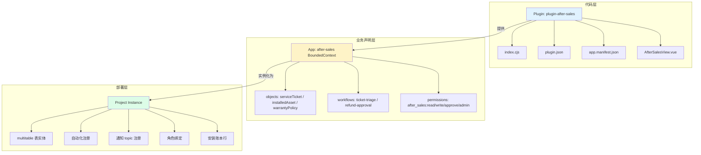
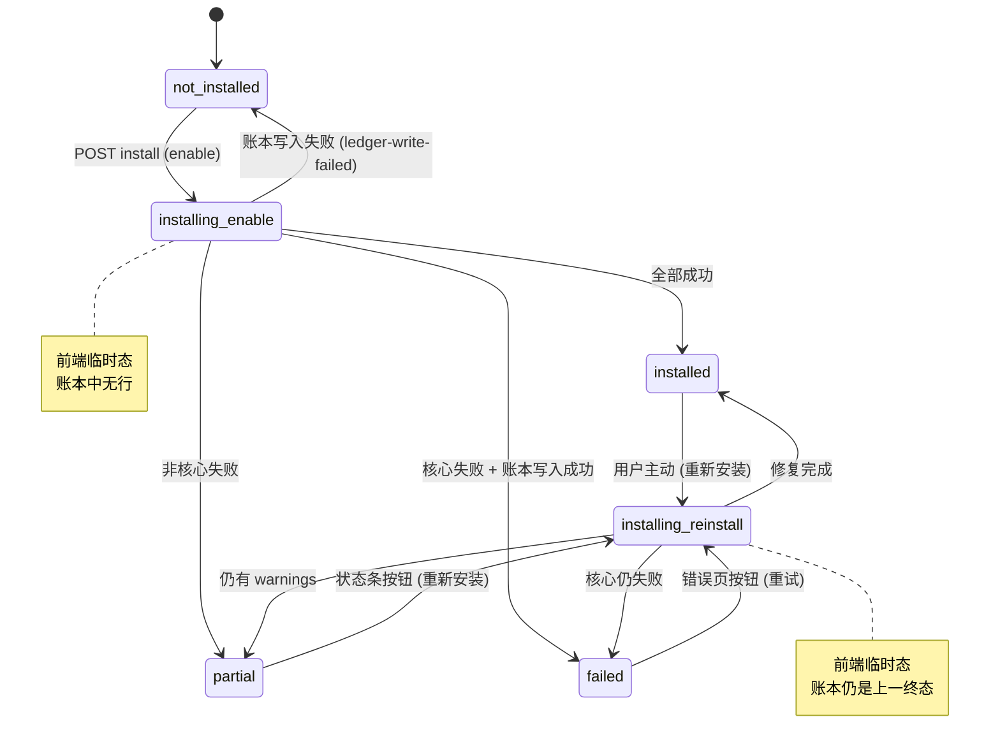
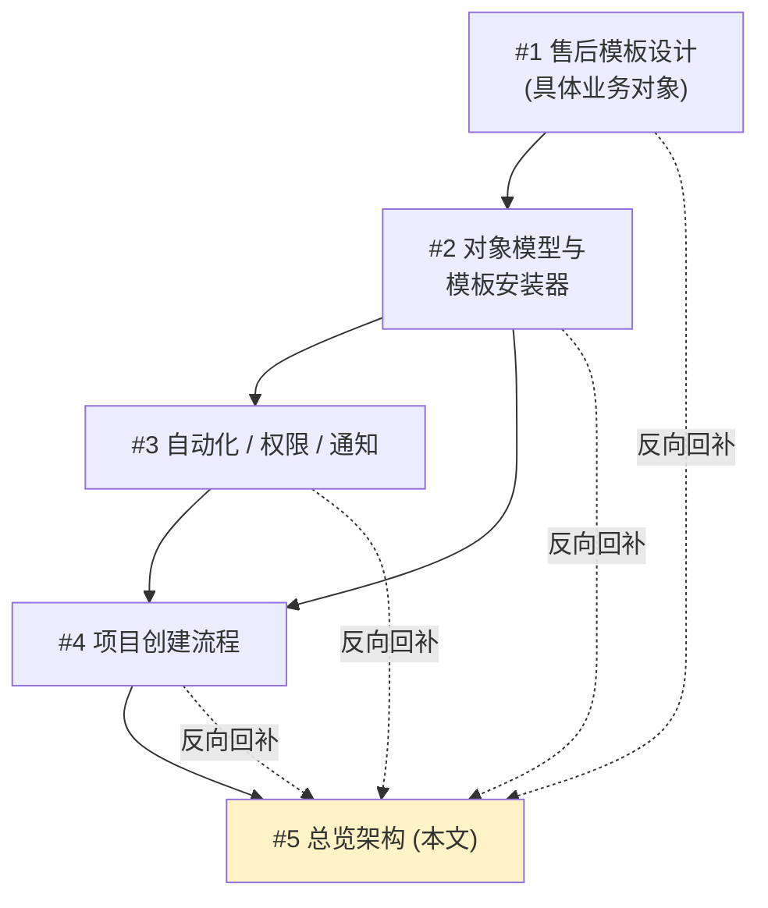

# 平台项目构建器与模板架构设计 (platform-project-builder-and-template-architecture-design-20260407)

> **文档类型**：架构总览 / 总收口
> **日期**：2026-04-07
> **范围**：Plugin / App / Project 三层模型；v1/v2 正式定义；全局术语规范；全局接口索引；全局状态机（含 failed 重试规则）；非目标；v1→v2 升级承诺；5 份文档之间的依赖关系
> **来源词典**：2026-04-07 接口词典 v1.0（locked）
> **配套交付**：本文档为 5 份设计稿之 #5（总收口），前置 #1 / #2 / #3 / #4

## TL;DR

锁定 **Plugin / App / Project 三层模型**：Plugin 是代码交付物，App 是 manifest 中的业务声明，Project 是部署层实例。**v1 = 业务子域**（每租户每应用恰好一个 Project），**v2 = 多实例项目**（每租户每应用 N 个 Project）。v1 接口已经预留 `projectId` 字段（取伪值 `${tenantId}:${appId}`），v2 升级是纯 additive。本文档汇总 5 份设计稿的全局接口索引、全局状态机（首次给出"failed 重试走 reinstall"的规范规则）、非目标列表（首次明文"v1 不承诺步骤级进度"）与 v1→v2 升级承诺，并指明对前 4 份文档需要回补的小修订点。

---

## 1. 引言：为什么需要这套架构

### 1.1 现状与缺口

仓库内已经存在 4 个售后插件起点文件：

- `plugins/plugin-after-sales/plugin.json`
- `plugins/plugin-after-sales/app.manifest.json`
- `plugins/plugin-after-sales/index.cjs`
- `apps/web/src/views/AfterSalesView.vue`

这 4 个文件证明 MetaSheet2 的微内核可以承载新的业务插件，但**没有**回答以下问题：

1. 如果要让"售后"作为一个**模板**被一键启用、被增量重装、被多次实例化，需要哪些抽象？
2. 售后的"对象 / 视图 / 自动化 / 通知 / 角色"声明应该走什么形态进入安装器？
3. "项目"在 v1 和 v2 中分别是什么？
4. 如何在不改核心服务（multitable / workflow / approvals / NotificationService / RBAC / db/types.ts）的前提下完成上述能力？
5. 5 份设计文档之间的术语、接口、状态语义如何保持一致？

### 1.2 本套设计的边界

- **写文档，不写代码**：5 份 Markdown 是本轮的全部交付物
- **不动核心服务对外接口**：所有新能力以 plugin-after-sales 内部薄壳 + 核心 migration 的形式实现
- **v1 子域 / v2 多实例**：v1 接口预留 projectId 字段，v2 升级是纯 additive
- **5 份文档形成闭环**：本文档作为总收口，任何后续不一致以本文档为准

## 2. 三层模型

### 2.1 概念定义

| 层 | 名称 | 物理形态 | 职责 | 类比 |
|---|---|---|---|---|
| 1 | **Plugin（插件）** | 代码包，在仓库内的 `plugins/<name>/` 目录 | 提供代码、HTTP 路由、前端组件、生命周期钩子 | npm package |
| 2 | **App / BoundedContext（应用）** | manifest 文件中的声明（`app.manifest.json` 的 `boundedContext` 段） | 业务能力声明：bounded context 边界、对象列表、工作流、权限、集成 | npm package 的 `package.json` |
| 3 | **Project（项目）** | 模板安装器在某租户下创建的一组 multitable 对象 + 自动化 + 通知 + 角色绑定 | 真正承载业务数据的部署实例 | npm 包安装到某项目后产生的 node_modules 实例 |

### 2.2 三层关系



### 2.3 v1 与 v2 在三层模型中的位置

| 层 | v1 状态 | v2 演进 |
|---|---|---|
| Plugin | 1 个代码包 | 同 v1 |
| App | 1 个 manifest 声明 | 同 v1 |
| **Project** | 每租户每 App 恰好 **1 个**实例 | 每租户每 App 可有 **N 个**实例 |

**只有 Project 层在 v1/v2 之间发生形态变化。** Plugin 与 App 层的代码与声明都不需要 v2 改动。

## 3. v1 / v2 正式定义

### 3.1 v1 = 业务子域

> **v1 Project = 某租户内某 BoundedContext 的唯一业务子域实例。**
> 每租户 × 每 BoundedContext = 恰好 1 个 Project；
> projectId 取**伪值** `${tenantId}:${appId}`，由安装器在服务端生成；
> 用户感知：启用了一个业务模块。

### 3.2 v2 = 多实例项目

> **v2 Project = 同一 BoundedContext 在同一租户内可创建的多个独立实例。**
> 每租户 × 每 BoundedContext = N 个 Project；
> projectId 由用户在创建时分配的真值；
> 用户感知：创建了多个项目（如"华东售后" / "华南售后"）。

### 3.3 v1 接口预留 projectId

v1 所有契约层（`ProjectCreateRequest` / `TemplateInstallRequest` / `ProjectCurrentResponse` / `TemplateInstallResult`）都已经**预留** projectId 字段。v1 服务端固定生成伪值，v2 由用户输入分配真值。**这是 v1 为 v2 留出的零成本扩展点**——v2 升级不需要改任何对外契约的字段名或字段顺序。

## 4. 全局术语规范

| 术语 | v1 中含义 | v2 中含义 | 红线 |
|---|---|---|---|
| Plugin / 插件 | 代码交付物 | 同 v1 | 不要把 Plugin 写成"项目" |
| App / BoundedContext / 应用 | manifest 中的业务声明 | 同 v1 | 不要把 App 写成 plugin id 或 project id |
| Project / 项目 | 唯一业务子域实例 | 多实例之一 | v1 不要写成"完全独立运行时" |
| Template / 模板 | 项目蓝图（如 `after-sales-default`） | 同 v1 | 不要和 App 混 |
| projectId | 伪值 `${tenantId}:${appId}` | 真值 `proj_xxxx` | v1 章节中不能写成用户可见 |
| Workspace / 工作空间 | **不允许出现** | v2 才引入 | 出现在 v1 章节就是 bug |
| organizationId | **不允许出现** | v2 才引入 | 同上 |
| workspaceId | **不允许出现** | v2 才引入 | 同上 |
| projectId-scoped RBAC | **不允许出现** | v2 才引入 | v1 写成 `after_sales:write@projectId=...` 是 bug |

### 4.1 v1 章节红线（grep 验收用）

5 份文档写作和 review 时，下列字符串**不应出现在 v1 范畴的描述里**：

- `workspaceId` / `workspace_id` / `Workspace` （除非明确标注 v2）
- `organizationId` / `organization_id` / `Organization`
- `inApp` 渠道（除非明确标注 v2）
- `BlueprintInstaller` 平台服务（除非作为 v2 演进目标）
- `通用表达式引擎` / `表达式引擎`
- `plugin migration runner` / `插件迁移运行时`
- `scoped CoreAPI` / `capability scope`
- `marketplace` / `应用市场`（除非作为 v2 目标）
- `sandbox 隔离` / `Sandbox`（除非作为 v2 目标）
- `/api/p/:projectId/`（v1 路由前缀）
- `after_sales:write@projectId=` （v2 scoped 权限语法）

## 5. 全局接口索引

本节是 5 份文档共享的**真理源**。所有公共类型在此罗列并指向其详细定义文档。如发现任何文档中的字段定义与本节冲突，**以本节为准**。

### 5.1 蓝图与安装契约（详见 #2）

```ts
interface ProjectTemplateBlueprint { /* §2 of #2 */ }
interface ObjectDescriptor       { /* §2.2 of #2 */ }
interface FieldDescriptor        { /* §2.3 of #2 */ }
interface ViewDescriptor         { /* §2.4 of #2 */ }
interface TemplateInstallRequest { /* §3.1 of #2 */ }
interface TemplateInstallResult  { /* §3.2 of #2 */ }
```

### 5.2 项目创建契约（详见 #4，本文档对 ProjectCurrentResponse 做修订）

```ts
interface ProjectCreateRequest   { /* §4.1 of #4 */ }
interface ProjectCreateResponse  { /* §4.2 of #4 */ }
```

#### 5.2.1 ProjectCurrentResponse —— 修订并锁定

**v1 ProjectCurrentResponse 锁定形态**（取代 #4 §2.3 的旧版）：

```ts
interface ProjectCurrentResponse {
  status: 'not-installed' | 'installed' | 'partial' | 'failed'
  projectId?: string                          // status ∈ {installed, partial, failed} 时返回
  displayName?: string                        // 修订新增：同上条件
  config?: AfterSalesTemplateConfig           // 修订新增：同上条件
  installResult?: TemplateInstallResult       // status ∈ {installed, partial, failed} 时返回
  reportRef?: string                          // 同上
}
```

**修订原因**：让 `current` 接口成为售后首页的**完整状态数据源**。原先的版本缺少 `displayName` 与 `config`，但 #4 §6.2 的 reinstall 流程描述"从 current 响应中取" `displayName` 与 `config` 作为重装请求体——两处不一致。修订后两边一致：current 接口在已安装态下返回完整 displayName 与 config，前端在 partial 恢复时直接使用而无需依赖本地缓存。

**status 与字段返回的对照**：

| status | projectId | displayName | config | installResult | reportRef |
|---|---|---|---|---|---|
| `not-installed` | ✗ | ✗ | ✗ | ✗ | ✗ |
| `installed` | ✓ | ✓ | ✓ | ✓ | ✓ |
| `partial` | ✓ | ✓ | ✓ | ✓ | ✓ |
| `failed` | ✓ | ✓ | ✓ | ✓ | ✓ |

**字段来源**：`displayName` / `config` 来自首次成功安装时存入账本的字段。这要求**账本表新增 2 列**：`display_name` (text) 与 `config_json` (jsonb)。这两列在 v1 必须由 #2 §4.2 的账本 schema 补齐（见 §11 回补清单）。

### 5.3 横切能力契约（详见 #3）

```ts
interface AutomationRuleDraft    { /* §2 of #3 */ }
interface RolePermissionMatrix   { /* §5 of #3 */ }
interface NotificationTopicSpec  { /* §6 of #3 */ }
interface NotificationRecipient  { /* §7.1 of #3 */ }
interface AfterSalesTemplateConfig { /* §3 of #1 / §7 of #1 默认值表 */ }
```

### 5.4 一致性验收规则

任何后续 PR 修改任一文档中的上述类型，必须**同步**：

1. 更新本文档 §5 的索引描述
2. 跨 5 份文档 grep 比对字段名 / 类型 / 可选性，全文一致
3. 如修改了字段语义，必须同时更新所有引用文档的相应章节

## 6. 全局状态机

### 6.1 项目级 status 枚举

v1 项目状态来源于账本表的 `status` 列：

- `not-installed`：账本无行
- `installed`：账本有行且 status='installed'
- `partial`：账本有行且 status='partial'
- `failed`：账本有行且 status='failed'

**注意**：`installing` 不是持久化状态。前端在 `POST install` 等待响应期间临时显示"安装中"UI，但账本表中**永不出现** `installing` 行（这是 #2 §4.5 "仅记录终态" 的要求）。

### 6.2 安装请求 mode 与 current.status 的合法组合 ⭐

**这是 v1 的规范来源**，跨 #2 / #4 都引用本表。如其他文档与本表不一致，**以本表为准**。

| 当前 current.status | 允许的 mode | 安装器分支 | 不允许的 mode → 错误 |
|---|---|---|---|
| `not-installed` | `enable` | 首次安装（步骤 5-11） | `reinstall` → 404 `no-install-to-rebuild` |
| `installed` | `reinstall` | 增量补齐（v1 通常是 noop） | `enable` → 409 `already-installed` |
| `partial` | `reinstall` | 增量补齐失败项 | `enable` → 409 `already-installed` |
| `failed` | `reinstall` | 重试核心对象创建（账本行已存在，所以走 reinstall 路径） | `enable` → 409 `already-installed` |

**核心规则**：
- `enable` **仅**用于首次安装（current = not-installed）
- `reinstall` 用于所有"账本已有行"的场景，包括 `installed` / `partial` / `failed`
- 用户的"重试"按钮（failed 错误页）和"重新安装"按钮（partial 状态条）**都触发 `mode: 'reinstall'`**
- 不存在"自动从 enable 降级到 reinstall"的逻辑；mode 必须由前端明确传入

### 6.3 failed 必须留下账本行 ⭐

为了让 §6.2 的 `failed` 行可被 `current` 接口查询到，**安装器在所有失败路径上都必须先尝试写入账本行 (status='failed')，再返回错误**。

**唯一例外**：账本写入操作本身失败（chicken-and-egg：`ledger-write-failed` 错误），此时 current 返回 `not-installed`，重试走 `enable` 路径。

具体行为：

| 失败位置 | 是否写账本 | current 后续返回 | 重试 mode |
|---|---|---|---|
| 步骤 1 校验 (`validation-failed`) | ❌ 不写（因为这是 plugin bug 不是用户问题） | `not-installed` | `enable` |
| 步骤 5 核心对象创建失败 (`core-object-failed`) | ✅ 写 `status=failed`，`createdObjects` 记录已成功的部分 | `failed` | `reinstall` |
| 步骤 6-10 任一非核心步骤失败（partial 形态） | ✅ 写 `status=partial`，warnings 非空 | `partial` | `reinstall` |
| 步骤 11 账本 UPSERT 自身失败 (`ledger-write-failed`) | ❌ 写不进去 | `not-installed` | `enable` |
| 全部步骤成功 | ✅ 写 `status=installed` | `installed` | `reinstall`（用户主动） |

**这一节是 #2 §3.3 / §6.2 / §4.5 的隐含规则的正式写出**。#2 §3.3 与 §6.2 需要按本节回补一致表述（见 §11 回补清单）。

### 6.4 状态转换图



### 6.5 retry 流程统一规范

| 触发位置 | 当前 current.status | 触发的 install mode | 用户文案 |
|---|---|---|---|
| 启用引导页"启用"按钮 | `not-installed` | `enable` | "启用售后" |
| 错误页"重试"按钮 | `failed` | **`reinstall`** | "重试安装" |
| 状态条"重新安装"按钮 | `partial` | `reinstall` | "重新安装" |
| 已安装首页（无 UI 入口） | `installed` | （无） | （无） |

**关键修订**：原 #4 §2.2 步骤 7c 的"重试"按钮触发 `enable` 是错的——会被 §6.2 拦截为 `already-installed`。**正确做法是触发 `reinstall`**。这一规则需要回补到 #4 §2.2 / §4.3 / §11（见 §11 回补清单）。

## 7. 非目标（Non-Goals）

以下能力**不在 v1 范围**。任何文档若提及这些能力为 v1 可用，均为错误。

### 7.1 平台基础设施类

- ❌ **marketplace（应用市场）**：v1 没有应用列表与第三方上架；plugin-after-sales 是静态预装的
- ❌ **sandbox（插件沙箱隔离）**：当前 `packages/core-backend/src/core/plugin-sandbox.ts:8` 是 NoopSandbox，无真隔离能力
- ❌ **scoped CoreAPI**：当前 `packages/core-backend/src/index.ts:719` 直接注入完整 CoreAPI，没有按 plugin 切片的能力
- ❌ **plugin migration runner**：当前没有插件自管 migration 的运行时；账本表必须走核心 migration 目录创建
- ❌ **workspaceId / organizationId**：当前 `packages/core-backend/src/db/sharding/tenant-context.ts:19-28` 只承载 `tenantId`，没有 workspace 槽位

### 7.2 抽象与通用能力类

- ❌ **统一 BlueprintInstaller 平台服务**：v1 安装器是 plugin-after-sales 内部的薄壳，不是平台级服务
- ❌ **通用表达式引擎**：v1 helper 走白名单机制（v1 唯一白名单项是 `computeSlaDueAt(priority)`）
- ❌ **通用规则引擎 / 工作流重写**：v1 自动化是声明式描述，运行时仍由现有 workflow 服务执行
- ❌ **通用通知中枢 + inApp 渠道**：v1 通知 channel 锁定为 `email / webhook / feishu`
- ❌ **multitable 批量创建 API**：v1 安装器逐表调现有创建接口，接受 N 秒级耗时

### 7.3 用户体验类

- ❌ **步骤级安装进度可视化** ⭐：同步 HTTP 在响应返回前无法报告分步进度。v1 安装期 UI 仅显示单一文案"正在初始化售后模板..."；**不承诺**进度条或步骤列表。步骤级可视化留给 v2 异步任务模型。
- ❌ **多项目切换器**：v1 主导航只显示"售后"一个菜单项
- ❌ **单项目卸载按钮**：v1 卸载 = 关停整个 plugin-after-sales；不提供"删除单项目"按钮
- ❌ **应用配置回滚 / 历史版本**：v1 reinstall 不保存历史快照
- ❌ **模板用户自定义**：v1 用户不能上传自定义蓝图；`templateId` 白名单只有 `'after-sales-default'`

### 7.4 RBAC 与数据治理类

- ❌ **project-scoped RBAC**：v1 权限只有 `after_sales:write` 形态，不支持 `after_sales:write@projectId=xxx`
- ❌ **API 列裁剪**：v1 fieldPolicies.hidden 只在前端隐藏，API 仍返回该列
- ❌ **行级权限**：v1 没有"客服只能看到自己负责的工单"这类记录级 RBAC
- ❌ **数据导出权限细分**：v1 导出权限走 admin 角色统一控制
- ❌ **审计日志按项目隔离**：v1 审计日志全租户合一

### 7.5 数据迁移类

- ❌ **multitable 表加 project_id 列**：v1 multitable schema 不变；project_id 是 v2 演进
- ❌ **跨对象事务**：v1 安装器不要求跨对象强事务，失败通过 warnings + partial 表达
- ❌ **自动 reinstall 于版本升级**：v1 plugin 升级后不会自动 reinstall；需用户手动点"重新安装"

## 8. v1 → v2 升级承诺

### 8.1 接口字段层

| 字段 | v1 形态 | v2 演进 | 兼容性 |
|---|---|---|---|
| `ProjectCreateRequest.projectId` | 服务端忽略 | 服务端尊重客户端传值 | 字段名不变，向前兼容 |
| `ProjectCurrentResponse.projectId` | 伪值 | 真值 | 字段名不变 |
| `TemplateInstallRequest.projectId` | 服务端覆盖 | 服务端使用客户端传值 | 字段名不变 |
| `TemplateInstallResult.projectId` | 伪值 | 真值 | 字段名不变 |
| `ProjectCurrentResponse.displayName` / `.config` | 已存在（本文档 §5.2.1 锁定） | 同 v1 | 无变更 |

**v1 调用方代码 0 行修改即可使用 v2 接口。**

### 8.2 路由层

| 场景 | v1 路由 | v2 路由 |
|---|---|---|
| 前端主页 | `/p/plugin-after-sales/after-sales` | `/p/after-sales/:projectId/home` |
| 后端安装 | `POST /api/after-sales/projects/install` | `POST /api/after-sales/projects` |
| 后端查状态 | `GET /api/after-sales/projects/current` | `GET /api/after-sales/projects/:projectId` |
| 后端业务数据 | `GET /api/after-sales/tickets` | `GET /api/after-sales/tickets?projectId=...` 或 `/api/p/:projectId/after-sales/tickets` |

v2 路由是**纯 additive**：v1 路由不会被废弃，但新功能只在 v2 路由上提供。

### 8.3 数据库层

| 维度 | v1 形态 | v2 演进 |
|---|---|---|
| 多维表对象 | 仅 `tenant_id` 过滤 | 追加 `project_id` 列，回填 `${tenantId}:after-sales` |
| 账本表唯一索引 | `(tenant_id, app_id)` | 升级为 `(tenant_id, project_id)` |
| RBAC 角色绑定 | `(tenantId, role, permission)` | 追加 projectId 形成 `(tenantId, projectId, role, permission)` |
| 通知 topic 注册 | `(tenantId, topic)` | 追加 projectId |
| 自动化规则注册 | `(tenantId, appId, rule.id)` | 追加 projectId |

**v2 升级是 schema 追加列 + 回填值**，不删数据、不改既有列。`getProjectId(tenantId, appId)` helper（#2 §11.2 强制约束）是 v1 → v2 升级的唯一可控扩展点。

### 8.4 能力扩展层

| 能力 | v1 形态 | v2 演进 |
|---|---|---|
| Helper 白名单 | 只有 `computeSlaDueAt` | 可新增 helper，但 v1 已有的不改签名 |
| 通知 channel | `email / webhook / feishu` | 新增 `inApp`（通知中枢） |
| API 列裁剪 | 不裁剪，前端 UI 隐藏 | fieldPolicies.hidden 升级为 API 层裁剪 |
| 模板白名单 | 只有 `after-sales-default` | 允许多个模板共存，可加用户自定义 |

### 8.5 跨版本不变量

以下不变量在 v1 / v2 都成立，**绝不打破**：

- AutomationRuleDraft / RolePermissionMatrix / NotificationTopicSpec 的字段名和类型
- ObjectDescriptor / FieldDescriptor / ViewDescriptor 的字段名和类型
- 10 种规范字段类型（`string / number / boolean / date / formula / select / link / lookup / rollup / attachment`）
- 6 个角色 slug（`customer_service / technician / supervisor / finance / admin / viewer`）
- helper 白名单只能加不能改
- 通知 channel 枚举只能加不能改
- 安装器的 `mode='enable'` 与 `mode='reinstall'` 的语义边界

## 9. 5 份文档之间的依赖关系

### 9.1 写作顺序与依赖方向



**说明**：文档按 #1 → #5 顺序写作，先具体后抽象；但写作过程中后续文档对前面文档的修订**反向回补**到前面文档。本文档（#5）作为总收口，整理所有跨文档的不一致并指明回补方向。

### 9.2 文档职责矩阵

| 文档 | 主要职责 | 输出锁定的关键类型 / 规则 |
|---|---|---|
| #1 | 售后业务模板的具体声明 | 6 个对象的字段表、5 个默认视图、3 条自动化、4 个通知主题、6 个角色、7 个默认值 |
| #2 | 对象模型抽象与安装执行 | `ProjectTemplateBlueprint` / `TemplateInstallRequest` / `TemplateInstallResult` / 账本表 schema / 安装器步骤 / reinstall 语义 / partial 语义 / helper 白名单机制 |
| #3 | 横切能力的运行时语义 | `AutomationRuleDraft` 详细 / `RolePermissionMatrix` 详细 / `NotificationTopicSpec` 详细 / recipient 解析约定 / channel/type 对齐 / 注册幂等契约 |
| #4 | 用户路径与 HTTP 契约 | `ProjectCreateRequest/Response` / `ProjectCurrentResponse` / 状态条 UX / partial 恢复路径 / v1 路由清单 |
| #5 | 架构总览与全局收口 | 三层模型 / v1/v2 定义 / 全局术语 / 全局接口索引 / 全局状态机 / 非目标 / v1→v2 升级承诺 |

### 9.3 跨文档引用规则

- 任何接口字段定义以 §5 全局接口索引为准
- 任何状态机语义以 §6 全局状态机为准
- 任何"v1 不做什么"以 §7 非目标为准
- 任何 v1→v2 升级路径以 §8 升级承诺为准
- 如其他文档与本文档冲突，**以本文档为准**，并按 §11 提交回补 PR

## 10. 实施者总览 checklist

### 10.1 跨文档共同的四大禁区

- ❌ **不改 `packages/core-backend/src/db/types.ts`**
- ❌ **不发明 plugin migration runner**
- ❌ **不引入通用表达式引擎**
- ❌ **不引入 `/api/p/:projectId/...` 路由前缀**

### 10.2 高层架构 checklist

- [ ] Plugin / App / Project 三层在代码组织和文档表述中都清晰区分
- [ ] v1 项目语义是"业务子域"，每租户每应用唯一
- [ ] projectId 在所有契约层都有字段位置，但 v1 服务端固定生成伪值
- [ ] 不在 v1 章节出现 workspaceId / organizationId / inApp / scoped CoreAPI 等 v2 概念
- [ ] 所有失败路径都尽量留下账本行（status='failed'），让 current 接口可查询
- [ ] failed 状态的"重试"按钮触发 `mode='reinstall'`，不是 `enable`
- [ ] partial 状态条的"重新安装"按钮触发 `mode='reinstall'`
- [ ] enable 仅用于 current=not-installed
- [ ] 安装期 UI 只显示单一文案，不承诺步骤级进度
- [ ] `ProjectCurrentResponse` 在 installed/partial/failed 状态下返回完整 `displayName` + `config`
- [ ] 账本表 schema 包含 `display_name` 与 `config_json` 列
- [ ] v1 → v2 升级是 additive：列追加、字段追加、helper 追加、channel 追加，**绝不**修改既有
- [ ] `getProjectId(tenantId, appId)` helper 是 v1 SQL 查询的唯一 projectId 接入点
- [ ] 所有 service helper 接收 projectId 参数，v1 内部"吞掉"它，v2 升级时单文件改造

## 11. 对前 4 份文档的回补清单 ⭐

本节列出本文档（#5）的全局规则与前 4 份文档的不一致点，及对应的回补动作。**这些回补是 5 份文档形成闭环的必要条件**，应在本文档定稿后立即执行。

### 11.1 回补到 #4

| 章节 | 原文问题 | 回补动作 |
|---|---|---|
| `#4 §2.3` ProjectCurrentResponse 定义 | 缺 `displayName` / `config` 字段 | 按 §5.2.1 更新类型定义 |
| `#4 §2.2` 步骤 7c 的"重试"按钮 | 写"再次触发步骤 5"（即 enable），与 §6.2 冲突 | 改为"触发 `mode: 'reinstall'`"，与状态机一致 |
| `#4 §2.2` 步骤 6 安装期文案 | 暗示可以"列出当前步骤" | 改为"显示单一文案 '正在初始化售后模板...'"；删除"从 response 消息体可选拉取"表述 |
| `#4 §11` AfterSalesView 状态机草图 | retry-install 分支语义不明 | 注明 retry → reinstall（不是 enable） |
| `#4 §4.3` 错误码表 | `failed` 后的重试默认走 enable | 注明 failed 后重试 mode 必须由前端按 current.status 决定 |
| `#4 §6.2` reinstall request body | "从 current 响应中取" `displayName` / `config` | 与 §5.2.1 修订后的 ProjectCurrentResponse 一致即可，无需额外文案 |

### 11.2 回补到 #2

| 章节 | 原文问题 | 回补动作 |
|---|---|---|
| `#2 §3.3` partial / failed 三态表 | failed 行写"必须重试 enable" | 改为"必须重试 reinstall（除 ledger-write-failed 例外）"，并指向 #5 §6.2 |
| `#2 §6.2` 步骤 5 失败处理 | 写"核心对象失败 → failed"但未说明账本仍要写入 | 补一句"核心对象失败 → 仍需走步骤 11 写入账本，status='failed'，createdObjects 记录已成功的部分"；ledger-write-failed 是唯一例外 |
| `#2 §4.2` 账本表 schema | 缺 `display_name` / `config_json` 列 | 补上两列；migration 文件命名按 §11.4 给出的 zzzz 时间戳约定 |

### 11.3 回补到 #3

无强制回补项。#3 已经通过本轮 4 次微调与本文档一致。

### 11.4 回补到 #1

无强制回补项。#1 是最具体的业务文档，与本文档抽象层级正交。

### 11.5 账本表 schema 升级（重要）

由于 §5.2.1 给 `ProjectCurrentResponse` 加了 `displayName` 与 `config` 字段，账本表必须能持久化这两个值。修订后的账本表 schema：

| 列 | 类型 | 约束 | 说明 |
|---|---|---|---|
| ...（原 13 列保持不变） | | | 见 #2 §4.2 |
| `display_name` | `text` | NOT NULL DEFAULT '' | 用户输入的项目展示名（v1 由 ProjectCreateRequest.displayName 提供） |
| `config_json` | `jsonb` | NOT NULL DEFAULT '{}' | `AfterSalesTemplateConfig` 序列化值 |

migration 文件路径建议：`packages/core-backend/src/db/migrations/zzzz20260408xxxxxx_create_plugin_after_sales_template_installs.ts`，将这两列直接写入初始 schema（不是后续 alter migration），因为 v1 还没有任何已部署的 v0 版本。

### 11.6 5 份文档定稿后的最终一致性验收

按本文档 §5.4 一致性验收规则，最后一次跨文档 grep 比对：

- [ ] `ProjectCreateRequest` 字段在 #4 / #5 一致
- [ ] `ProjectCurrentResponse` 字段在 #4 (回补后) / #5 一致
- [ ] `TemplateInstallRequest` / `TemplateInstallResult` 在 #2 / #5 一致
- [ ] `AutomationRuleDraft` / `RolePermissionMatrix` / `NotificationTopicSpec` 在 #3 / #5 一致
- [ ] `AfterSalesTemplateConfig` 在 #1 / #3 / #4 / #5 一致
- [ ] failed → reinstall 规则在 #2 (回补后) / #4 (回补后) / #5 一致
- [ ] 账本表 schema 在 #2 (回补后) / #5 一致
- [ ] 非目标列表中 v1 不做的能力在所有文档中无矛盾表述

---

## 附：词典版本与本文档定位

本文档对接口词典 v1.0 做以下**补充**：

- `ProjectCurrentResponse` 增加 `displayName?` / `config?` 字段（从 #4 的本地契约提升为词典级类型）
- 账本表新增 `display_name` / `config_json` 两列（属于实现层 schema，不进词典正文）
- failed → reinstall 的状态机规则正式化（属于行为契约，不改字段定义）

这些**不改任何已有字段名 / 类型 / 可选性**。词典版本仍为 **v1.0**。

本文档作为 5 份设计稿的总收口，**任何后续文档级修订必须先更新本文档**，再更新被影响的 #1-#4 文档。本文档是 v1 设计阶段的"宪法"。
