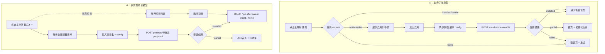

# 项目创建流程设计 (platform-project-creation-flow-design-20260407)

> **文档类型**：用户流程与 HTTP 契约设计 / Pre-Implementation Design
> **日期**：2026-04-07
> **范围**：v1 用户从应用市场到售后首页的完整路径、`ProjectCreateRequest` / `ProjectCreateResponse` 契约、partial 恢复路径、二次启用行为、卸载行为、v1/v2 对照
> **来源词典**：2026-04-07 接口词典 v1.0（locked）
> **配套交付**：本文档为 5 份设计稿之 #4，前置 #1 / #2 / #3，后置 #5 `platform-project-builder-and-template-architecture-design-20260407.md`

## TL;DR

v1 用户路径"选择售后应用 → 点击启用 → 模板初始化 → 进入售后首页"走同步安装链路，全程在秒级完成。`ProjectCreateRequest` 的 `projectId` 字段被客户端原样透传但**服务端忽略**，安装器固定生成 `${tenantId}:after-sales`。二次启用命中 `already-installed` 错误并引导进入首页；partial 状态下首页顶部显示橙色状态条，用户点击"重新安装"触发 `mode: 'reinstall'`。v1 卸载 = 关停整个应用；v2 才有"删除单个项目"。所有路由保持 `/api/after-sales/...` 风格，**v1 不引入** `/api/p/:projectId/...` 前缀。

---

## 1. 核心目标与非目标

### 1.1 v1 目标

- 定义用户从零到拥有可用售后系统的完整路径
- 锁定 `ProjectCreateRequest` / `ProjectCreateResponse` HTTP 契约
- 定义二次启用、partial 恢复、卸载三类边界行为的用户可见结果
- 与 #2 的安装器语义、#3 的运行时语义形成闭环

### 1.2 v1 非目标

- ❌ 不做异步安装队列；v1 安装是同步 HTTP 请求，秒级返回
- ❌ 不做多租户应用市场；v1 入口是 plugin-after-sales 静态注册的主导航项
- ❌ 不做"创建多个项目"流程；v1 每租户每应用只有一个实例
- ❌ 不引入 `/api/p/:projectId/...` 路由前缀；v1 路由风格与现有 `/api/after-sales/...` 保持一致
- ❌ 不做 v1 项目级卸载；v1 卸载等价于"关停整个 plugin-after-sales 应用"

## 2. v1 用户路径（详细步骤）

### 2.1 前提

- 租户管理员（`admin` 角色）已登录
- plugin-after-sales 已在后端 activate（`/api/after-sales/app-manifest` 可访问）
- 目标租户的 `plugin_after_sales_template_installs` 账本**无行**（首次安装）

### 2.2 步骤序列

| 步骤 | 用户动作 | 前端行为 | 后端行为 |
|---|---|---|---|
| 1 | 点击主导航"售后" | 加载 `/p/plugin-after-sales/after-sales` 路由，渲染 `AfterSalesView.vue` | - |
| 2 | 组件挂载 | `onMounted` 调 `GET /api/after-sales/projects/current` 判断安装状态 | 查账本，返回 `{ status: 'not-installed' }` |
| 3 | 首次进入，显示"启用"引导页 | 渲染"售后应用尚未启用"卡片 + 模板概览（来自 `/api/after-sales/app-manifest`）+ "启用"按钮 | - |
| 4 | 点击"启用" | 弹出确认对话框，展示 `AfterSalesTemplateConfig` 默认值 + 允许开关调整 | - |
| 5 | 确认启用 | POST `/api/after-sales/projects/install` with `mode: 'enable'` + config | 安装器执行 11 步流程（#2 §6），同步返回 `TemplateInstallResult` |
| 6 | 安装期间 | 显示满屏 `InstallingOverlay`，固定文案"正在初始化售后模板..."；**不承诺**步骤级进度（同步 HTTP 在响应返回前拿不到分步进度，见 #5 §7.3） | - |
| 7a | 安装成功 (status='installed') | 跳转到售后首页，默认视图为 ticket-board；无状态条 | - |
| 7b | 安装 partial (status='partial') | 跳转到售后首页，首页顶部显示橙色状态条（见 §5） | - |
| 7c | 安装 failed (status='failed') | 停留在错误页，展示错误码 + "重试"按钮（按 #5 §6.2 / §6.5 状态机：当账本已有 failed 行时，重试触发 `mode='reinstall'`，**不是** `enable`） | - |

### 2.3 步骤 3 的 current 状态判断

`GET /api/after-sales/projects/current` 返回体（v1 契约，**以 #5 §5.2.1 为准**）：

```ts
interface ProjectCurrentResponse {
  status: 'not-installed' | 'installed' | 'partial' | 'failed'
  projectId?: string                          // status ∈ {installed, partial, failed} 时返回
  displayName?: string                        // 同上条件
  config?: AfterSalesTemplateConfig           // 同上条件
  installResult?: TemplateInstallResult       // 同上条件
  reportRef?: string                          // 同上条件
}
```

`displayName` 与 `config` 在已安装态下返回，让 current 接口成为首页状态的**完整**数据源——前端在 partial 恢复时直接使用，无需依赖本地缓存。

- `not-installed`：账本无行 → 展示启用引导页
- `installed`：账本有行且 status='installed' → 直接进首页
- `partial`：账本有行且 status='partial' → 进首页 + 顶部状态条
- `failed`：账本有行且 status='failed' → 展示错误页 + "重试"按钮（按 #5 §6.2 状态机，重试触发 `mode='reinstall'`）

### 2.4 为什么步骤 5 是同步调用

- v1 安装器走逐表 multitable 创建，6 对象 + 5 视图 + 3 自动化 + 4 通知 + 6 角色 + 4 字段策略 ≈ 28 个写入操作
- 单次耗时预期 2-10 秒，在同步 HTTP 承受范围内
- 同步调用让前端状态机极简：loading → result 两态
- v2 若对象数量激增，可迁移到异步任务 + 进度推送；v1 不值得提前优化

## 3. v2 用户路径（简述，供对照）

| 步骤 | v2 行为 |
|---|---|
| 1 | 点击主导航"售后 ▸ +" 或进入应用市场 |
| 2 | 展示"创建售后项目"表单：项目名、负责区域、初始配置 |
| 3 | 提交 → POST `/api/after-sales/projects` with 真实 `projectId` |
| 4 | 后端生成真 `projectId`，走多实例安装 |
| 5 | 返回后跳转到 `/p/after-sales/:projectId/home` |
| 6 | 主导航"售后 ▸ 华东售后 / 华南售后"两级展示 |

**v1/v2 的用户感知差异**：v1 是"启用一个业务模块"，v2 是"创建一个项目实例"。这一差异在本文档的 §10 Mermaid 对照图中可视化。

## 4. HTTP 契约

### 4.1 ProjectCreateRequest

```ts
interface ProjectCreateRequest {
  templateId: string              // v1 固定 'after-sales-default'
  projectId?: string              // v1 服务端忽略；v2 真值
  displayName: string             // v1 仅用于状态条/日志展示，不进入路由或权限作用域
  config: AfterSalesTemplateConfig
}
```

**v1 字段语义**：

| 字段 | v1 处理 | v2 处理 |
|---|---|---|
| `templateId` | 校验必须等于 `'after-sales-default'`，否则 400 | 允许多个模板 |
| `projectId` | **服务端忽略客户端传值**，内部重置为 `${tenantId}:after-sales`；即使客户端不传也不报错 | 服务端生成真值并返回 |
| `displayName` | 只用于日志与状态条；不影响路由、权限、数据隔离 | 同时用作项目切换器的显示名 |
| `config` | 传入 `TemplateInstallRequest.blueprint.configDefaults` 的运行时覆盖值 | 同 v1 |

### 4.2 ProjectCreateResponse

```ts
interface ProjectCreateResponse {
  projectId: string                     // v1 = `${tenantId}:after-sales`
  appId: string                         // v1 固定 'after-sales'
  routes: {
    home: string                        // v1 = '/p/plugin-after-sales/after-sales'
    apiBase: string                     // v1 = '/api/after-sales'
  }
  installResult: TemplateInstallResult  // 详见 #2 §3
}
```

### 4.3 错误响应

v1 安装 API 的错误响应遵循统一格式：

```ts
interface ProjectCreateError {
  error: {
    code: string                  // 见下表
    message: string               // 人类可读
    details?: Record<string, unknown>
  }
}
```

| error.code | HTTP 状态 | 触发条件 | 前端处理 |
|---|---|---|---|
| `already-installed` | 409 | `mode='enable'` 且账本已有行 | 提示"售后已启用"，自动跳转到首页 |
| `no-install-to-rebuild` | 404 | `mode='reinstall'` 但账本无行 | 展示错误提示，引导用户先点"启用" |
| `validation-failed` | 400 | blueprint 语法错误 | 展示错误详情，这是实施者 bug，用户不应遇到 |
| `core-object-failed` | 500 | 核心 multitable 对象创建失败 | 展示错误详情 + "重试"按钮（按 #5 §6.2，前端按 current.status 决定 mode：failed → reinstall） |
| `ledger-write-failed` | 500 | 账本 UPSERT 失败 | 展示错误详情 + "重试"按钮（账本无行 → mode='enable'） |
| `invalid-template-id` | 400 | `templateId` 不在白名单 | 视为前端 bug，展示通用错误 |

**重试 mode 选择规则**（详见 #5 §6.5）：

| 当前 current.status | 重试 mode |
|---|---|
| `not-installed`（账本无行） | `enable` |
| `failed`（账本有行） | `reinstall` |
| `partial`（账本有行） | `reinstall` |

前端**不能**为 failed 状态硬编码 enable，否则会被后端 §6.2 拦截为 `already-installed`。

### 4.4 HTTP 路由一览（v1）

| 方法 | 路径 | 说明 |
|---|---|---|
| `GET` | `/api/after-sales/health` | 已有（`plugins/plugin-after-sales/index.cjs`），返回 plugin 健康 |
| `GET` | `/api/after-sales/app-manifest` | 已有，返回 app.manifest.json 内容 |
| `GET` | `/api/after-sales/projects/current` | **新增**，返回当前租户的安装状态（§2.3） |
| `POST` | `/api/after-sales/projects/install` | **新增**，触发安装器（§2.2 步骤 5） |

**v1 只新增 2 个路由**，均在 plugin-after-sales 内部，不触动核心路由层。所有新路由都走现有的 `context.api.http.addRoute` 注册机制。

### 4.5 路由风格演进承诺

- **v1**：`/api/after-sales/projects/install`（与现有 `/api/after-sales/*` 风格一致）
- **v2**：`/api/after-sales/projects` + 项目级操作通过查询参数或 POST body 中的 `projectId` 识别；或最终演进为 `/api/p/:projectId/after-sales/...`
- **不在 v1 引入 `/p/:projectId` 前缀**：引入它需要改动核心路由中间件注入 projectId 到上下文，这是 v2 的 Phase 1B 工作

## 5. 页面与状态清单

### 5.1 页面列表（v1）

| 页面 ID | 路由 | 承担状态 | 主要组件 |
|---|---|---|---|
| `after-sales-enable-guide` | `/p/plugin-after-sales/after-sales` (when not-installed) | 展示模板概览 + 启用按钮 | 现有 `AfterSalesView.vue` 扩展 |
| `after-sales-enable-confirm` | 弹窗（不独立路由） | 展示 `AfterSalesTemplateConfig` + 确认按钮 | 新建 `EnableConfirmDialog.vue` |
| `after-sales-installing` | 全屏覆盖层（不独立路由） | 安装期进度显示 | 新建 `InstallingOverlay.vue` |
| `after-sales-home` | `/p/plugin-after-sales/after-sales` (when installed/partial) | 售后主页 + 5 默认视图入口 | 现有 `AfterSalesView.vue` 重构 |
| `after-sales-failed` | `/p/plugin-after-sales/after-sales` (when failed) | 错误页 + 重试按钮 | `AfterSalesView.vue` 的错误分支 |
| `after-sales-warnings-modal` | 弹窗（不独立路由） | 展示 warnings 详情 | 新建 `WarningsDetailModal.vue` |

所有页面 / 弹窗都在 `apps/web/src/views/` 或其子目录，不改全局路由注册。

### 5.2 partial 状态条（§2.2 步骤 7b 产物）

**位置**：售后主页（`after-sales-home`）最顶部

**外观**：

```
┌──────────────────────────────────────────────────────────────────┐
│ ⚠ 部分组件安装未完成（N 条告警）        [查看详情]  [重新安装]     │
└──────────────────────────────────────────────────────────────────┘
```

- 背景色：橙色（推荐 Element Plus `--el-color-warning` 或 `#f59e0b`）
- 图标：警告三角（`Warning` icon）
- 文案：`"部分组件安装未完成（${warnings.length} 条告警）"`
- 右侧两个按钮：
  - `"查看详情"`：打开 `after-sales-warnings-modal` 弹窗，展示 warnings 数组内容
  - `"重新安装"`：触发 §6 的恢复路径

**关键约束**：

- 状态条**不阻断**首页交互；用户可以正常创建工单、查看视图、使用已就绪的功能
- 状态条**不是模态**；只是在视图顶部占一条横幅
- partial → installed 成功后状态条自动消失；reinstall 失败则更新告警数

## 6. partial 恢复路径

### 6.1 用户交互

1. 用户点击状态条的"重新安装"按钮
2. 前端弹出确认对话框："确定重新安装？不会删除已有数据"（确认文案明示安全性）
3. 用户确认 → POST `/api/after-sales/projects/install` with `mode: 'reinstall'`
4. 前端展示 `InstallingOverlay`（与首次安装共用组件）
5. 后端走 #2 §8 的增量补齐流程
6. 返回 `TemplateInstallResult`：
   - `status: 'installed'` → 状态条消失，首页刷新
   - `status: 'partial'` → 状态条保留，`warnings` 刷新为本次结果
   - `status: 'failed'` → 不应发生（reinstall 不触碰核心对象），若发生则展示错误弹窗并保留原状态条

### 6.2 reinstall 调用的 request body

```ts
{
  templateId: 'after-sales-default',
  displayName: '<原 displayName>',  // 从 current 响应中取
  config: <原 config>               // 从 current 响应中取，或允许用户调整
}
```

注意：v1 reinstall 请求**不传 projectId**（因为服务端会忽略），也**不允许**修改 `templateId`（后端校验）。`displayName` 与 `config` 可选，未传时保持账本中的原值。

### 6.3 "重新安装"的防误触保护

- 按钮必须二次确认
- 每次 reinstall 都刷新账本 `last_install_at`，便于审计
- 连续点击"重新安装"之间有 3 秒冷却（前端节流），防止并发请求
- 后端账本 `UNIQUE(tenant_id, app_id)` 约束作为最终防护

## 7. 二次启用行为（已启用应用的重复点击）

### 7.1 场景

用户 A 已启用售后；用户 B（同租户）首次进入售后菜单。此时用户 B 不应被引导到"启用"页，而应直接看到已启用的售后主页。

### 7.2 流程

1. 用户 B 点击主导航"售后"
2. 前端调 `GET /api/after-sales/projects/current`
3. 返回 `status: 'installed'` → 前端直接跳转到售后主页
4. **不显示**启用引导页

### 7.3 异常场景：用户强行调 install API

（理论上不会发生，但作为安全网）

- 用户通过开发者工具或 curl 发起 `POST /api/after-sales/projects/install` with `mode: 'enable'`
- 后端查账本发现已有行
- 返回 409 + `error.code = 'already-installed'`
- **不执行**任何 DDL / DML（见 #2 §3.4）

### 7.4 同一用户重复点击"启用"按钮

- 前端按钮在第一次点击后立即 disable 并展示 loading
- 即使双击也只发送一个请求
- 响应返回前不允许重复点击

## 8. 卸载行为

### 8.1 v1 卸载

**v1 卸载 = 关停整个 plugin-after-sales 应用**。

- 触发方式：租户管理员在"应用管理"页（由平台侧提供，不是本 plugin 提供）关停 plugin-after-sales
- 关停动作：调用现有 plugin 生命周期的 `deactivate` 接口
- 对数据的影响：**不删数据**。所有 multitable 表、账本行、角色绑定都保留
- 用户感知：主导航"售后"菜单项消失；直接访问 `/p/plugin-after-sales/after-sales` 返回 404

**v1 不提供"卸载按钮"**，因为项目与应用是 1:1 关系，"卸载"语义等价于"关停插件"。

### 8.2 v1 卸载后重新启用

- 重新 activate plugin-after-sales → 主导航"售后"菜单恢复
- 用户点击"售后" → `GET /api/after-sales/projects/current` 返回 `installed`（账本还在）→ 直接进入首页
- **不需要**重新执行安装流程
- 历史数据完整保留

### 8.3 v2 卸载

| 粒度 | 动作 | 对数据影响 |
|---|---|---|
| 单项目 | 删除单个项目实例 | 删除该项目的 multitable 记录（带 `project_id` 过滤），保留其他项目 |
| 整个应用 | 关停 plugin-after-sales | 同 v1：不删数据 |

v2 单项目卸载在 v1 不实现，不留退化 API。

## 9. v1 / v2 创建流程对照 (Mermaid 泳道图)



## 10. 路由表达规则（v1/v2 对照）

| 场景 | v1 路由 | v2 路由 |
|---|---|---|
| 前端主页 | `/p/plugin-after-sales/after-sales` | `/p/after-sales/:projectId/home` |
| 后端安装 | `POST /api/after-sales/projects/install` | `POST /api/after-sales/projects` |
| 后端查当前状态 | `GET /api/after-sales/projects/current` | `GET /api/after-sales/projects/:projectId` |
| 后端业务数据 | `GET /api/after-sales/tickets?...` | `GET /api/p/:projectId/after-sales/tickets?...` 或 `GET /api/after-sales/tickets?projectId=...` |

**v1 实施时的强约束**：

- 路由字符串中**不出现** `:projectId` 占位符
- 路由 handler 中**不调用**任何"从请求中解析 projectId 注入 tenant context"的中间件
- projectId 派生只发生在 service helper 层（见 #2 §11.2 修订版）

这些约束保证 v1 代码可以在 v2 引入 projectId 中间件时做**纯 additive** 扩展。

## 11. 与 plugin-after-sales 起点文件的映射

| 起点文件 | v1 扩展动作 |
|---|---|
| `plugins/plugin-after-sales/index.cjs` | 新增 2 个 HTTP 路由：`POST /api/after-sales/projects/install` / `GET /api/after-sales/projects/current`。原有 `/health` / `/app-manifest` 保持不变 |
| `plugins/plugin-after-sales/app.manifest.json` | 不动 |
| `apps/web/src/views/AfterSalesView.vue` | 从"manifest 卡片展示页"重构为"多态首页"：根据 current 响应的 status 分支渲染启用引导页 / 安装进度 / 首页 + 状态条 / 错误页 |

重构后 `AfterSalesView.vue` 的状态机：

```
                 ┌────────────────┐
  onMounted ───> │  fetch current │
                 └──────┬─────────┘
                        │
       ┌────────────────┼──────────────────┬───────────────┐
       ▼                ▼                  ▼               ▼
   not-installed   installed           partial          failed
       │                │                  │               │
       ▼                ▼                  ▼               ▼
   enable-guide     home (clean)      home + bar       error-page
       │                                   │               │
       ▼                                   ▼               ▼
   enable-confirm                    reinstall btn    retry btn
       │                                   │               │
       ▼                                   ▼               ▼
   POST install        POST install        POST install
   mode=enable         mode=reinstall      mode=reinstall   ◀── 注意：failed 重试也走 reinstall
       │                   │                   │
       └───────────┬───────┴───────────────────┘
                   ▼
              installing overlay (单一文案)
                   │
                   ▼
       按响应 status 重新分支
```

**关键修订**：failed 错误页的"重试"按钮触发 `mode='reinstall'`，不是 `enable`——因为 #5 §6.3 要求 failed 状态下账本已有行（status='failed'），enable 会被拦截为 `already-installed`。

## 12. 实施者开工自检表

### 12.1 四大禁区

- ❌ **不引入 `/api/p/:projectId/...` 前缀**：v1 路由完全走 `/api/after-sales/...` 风格；引入前缀需要改核心路由中间件，是 v2 Phase 1B
- ❌ **不在路由 handler 中解析 projectId 到上下文**：projectId 仅在 service helper 内部派生，见 #2 §11.2
- ❌ **不在 v1 实现"卸载单项目"**：v1 卸载 = 关停整个应用；"删除单项目"是 v2
- ❌ **不允许 `mode='enable'` 走 reinstall 分支做"智能升级"**：必须严格命中 `already-installed` 错误；用户的"重新安装"是显式的 reinstall 点击，不是自动降级

### 12.2 细项 checklist

- [ ] `AfterSalesView.vue` 首次渲染调 `/api/after-sales/projects/current`，根据 status 分支
- [ ] `not-installed` 状态渲染"启用"引导页 + 模板概览
- [ ] `installed` 状态直接渲染首页，不再显示启用按钮
- [ ] `partial` 状态渲染首页 + 顶部橙色状态条
- [ ] `failed` 状态渲染错误页 + "重试"按钮
- [ ] "启用"按钮点击后弹出确认对话框，展示 `AfterSalesTemplateConfig` 默认值
- [ ] 确认对话框中的 config 可编辑（`enableWarranty` 等开关 + `defaultSlaHours` 等数值）
- [ ] 确认后 POST `/api/after-sales/projects/install` with `mode: 'enable'`
- [ ] 安装期显示 `InstallingOverlay`（可复用）
- [ ] 同步响应后按 `installResult.status` 分支
- [ ] 状态条"查看详情"打开 `WarningsDetailModal`
- [ ] 状态条"重新安装"触发二次确认 + POST `install` with `mode: 'reinstall'`
- [ ] 重新安装请求不传 `projectId` 字段（或传空字符串）
- [ ] "重新安装"按钮有 3 秒前端冷却节流
- [ ] 后端对 `mode='enable'` 且账本已有行 → 返回 409 `already-installed`
- [ ] 后端对 `mode='reinstall'` 且账本无行 → 返回 404 `no-install-to-rebuild`
- [ ] 前端收到 `already-installed` → 提示 + 自动跳转首页
- [ ] 前端收到 `no-install-to-rebuild` → 引导用户先点"启用"
- [ ] 前端收到 `core-object-failed` / `ledger-write-failed` → 错误详情 + 重试
- [ ] `ProjectCreateRequest.projectId` 字段即使被前端传入也不影响服务端行为
- [ ] `ProjectCreateRequest.displayName` 只用于日志与状态条展示，不进入路由或权限
- [ ] v1 前端代码中**不出现** `/p/:projectId` / `/projects/:projectId` 等 v2 路由字面量
- [ ] 卸载 v1 = 关停整个 plugin-after-sales；**不**在首页提供"卸载项目"按钮
- [ ] 重新 activate plugin 后主导航"售后"菜单自动恢复，历史数据完整保留

---

## 附：本文档未触发词典升级

本文档未新增字段类型、未改公共契约字段名、未改默认值、未改 HTTP 契约字段。仅对 `ProjectCreateRequest` / `ProjectCreateResponse` 做字段语义扩写，并新增 `ProjectCurrentResponse` 作为 v1 状态查询契约。词典版本仍为 **v1.0**。

`ProjectCurrentResponse` 已被 #5 §5.2.1 提升为**全局接口索引项**（含 `displayName?` / `config?` 修订），但**未升级词典版本**——补充字段不构成 breaking change。本文档 §2.3 的类型定义以 #5 §5.2.1 为准。
