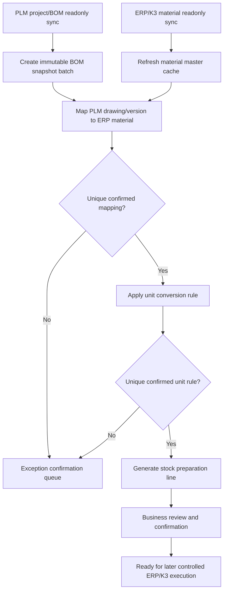

# Stock Preparation MVP Design

> **治理交叉引用(审阅补记 2026-07-07)**:本 MVP 设计叠加在已落地的备料 C0-C6 链之上
> (templates / target-provisioning / option-sync / bom-expansion / conflict-planner+policies /
> apply-writer / table-actions,均在 plugin-integration-core)。**C4 apply/write(ERP/K3 实写)
> 维持 owner-gated 未授权(#2253)**——本文各 Delivery Phase 的任何"生成/写回"表述均指
> multitable 内部表操作,不构成对外部写门的解锁;外部写解锁须 owner 显式批准并走其自身阶梯。


Date: 2026-07-07

## Purpose

This document defines the first usable MVP for stock preparation. The MVP should
let a customer bring PLM project/BOM data and ERP/K3 material data into
MetaSheet, normalize the material relationship, calculate stock preparation
lines, and leave all uncertain rows in an explicit manual confirmation state.

The first milestone is read-first and confirmation-driven. It must not depend on
ERP writes, K3 Save/Submit/Audit, or automatic material creation.

## MVP Goal

The MVP closes this business loop:

```text
PLM project and BOM readonly sync
-> project BOM snapshot
-> ERP/K3 material readonly sync
-> PLM drawing/version to ERP material mapping
-> unit conversion from design unit to issue unit
-> stock preparation line generation
-> exception confirmation
-> reusable mapping and conversion rules
```

## In Scope

- Import or sync PLM projects and BOMs in readonly mode.
- Import or sync ERP/K3 material master data in readonly mode.
- Store project BOM snapshots by sync batch instead of overwriting older BOMs.
- Map `PLM drawing number + PLM version` to `ERP material code + ERP material internal id`.
- Support version-sensitive and version-insensitive material matching policies.
- Support design-unit to production-issue-unit conversion.
- Generate stock preparation lines only from confirmed BOM snapshots, material mappings, and unit rules.
- Preserve abnormal rows in a manual confirmation queue.
- Reuse manually confirmed material mappings and unit conversion rules in later runs.
- Show both PLM source quantities and ERP issue quantities in the stock preparation table.

## Out Of Scope For MVP

- Automatic ERP material creation.
- Automatic ERP material code modification.
- K3 Save, Submit, Audit, or production writes.
- Recursive uncontrolled BOM expansion without snapshot boundaries.
- Raw SQL authoring from the UI.
- Hiding or overwriting PLM source data to match ERP convenience fields.
- Treating AI or fuzzy matching as final approval without a human confirmation step.

## Core Entities

### 1. Project Table

Purpose: one row per PLM project or production project that may produce stock
preparation lines.

Suggested fields:

| Field | Meaning |
| --- | --- |
| `project_id` | Internal MetaSheet project id |
| `source_project_no` | Project number from PLM or customer source |
| `project_name` | Project name |
| `source_system` | PLM, manual, imported file, or other source |
| `project_status` | active, paused, closed, archived |
| `last_sync_run_id` | Latest sync run |
| `last_synced_at` | Latest sync time |
| `owner` | Business owner or implementation owner |

### 2. PLM BOM Snapshot Batch Table

Purpose: each sync creates a batch. Old batches stay immutable so changes can be
compared.

Suggested fields:

| Field | Meaning |
| --- | --- |
| `snapshot_batch_id` | BOM snapshot batch id |
| `project_id` | Project id |
| `source_system` | PLM source connection |
| `source_bom_id` | Source BOM identifier, redacted in external reports |
| `snapshot_version` | Incrementing snapshot version |
| `sync_run_id` | Sync run id |
| `snapshot_status` | draft, active, superseded, rejected |
| `created_at` | Snapshot creation time |
| `created_by` | System or operator |

### 3. PLM BOM Snapshot Line Table

Purpose: immutable source BOM line data from PLM. Keep PLM values as received.

Suggested fields:

| Field | Meaning |
| --- | --- |
| `snapshot_line_id` | Snapshot line id |
| `snapshot_batch_id` | Snapshot batch id |
| `parent_drawing_no` | PLM parent drawing number |
| `parent_version` | PLM parent version |
| `child_drawing_no` | PLM child drawing number |
| `child_version` | PLM child version |
| `bom_level` | BOM hierarchy level |
| `path_key` | Stable path key for diffing |
| `design_qty` | Quantity from PLM |
| `design_unit` | Unit from PLM |
| `line_status` | normal, added, changed, removed, incomplete |
| `source_fingerprint` | Hash/fingerprint for diffing |

### 4. ERP/K3 Material Master Table

Purpose: readonly ERP material master cache for matching and stock preparation.

Suggested fields:

| Field | Meaning |
| --- | --- |
| `erp_material_id` | Internal MetaSheet material row id |
| `erp_material_code` | ERP material code |
| `erp_material_internal_id` | ERP/K3 internal material id |
| `erp_material_name` | ERP material name |
| `erp_spec` | ERP material specification/model |
| `base_unit` | ERP base unit |
| `inventory_unit` | ERP inventory unit |
| `issue_unit` | ERP production issue unit |
| `unit_group` | ERP unit group |
| `material_status` | enabled, disabled, archived |
| `last_synced_at` | Latest sync time |

### 5. Material Mapping Table

Purpose: map PLM drawing/version to ERP material code/internal id.

This table is part of the MVP and should be treated as a core business table.

Suggested fields:

| Field | Meaning |
| --- | --- |
| `mapping_id` | Mapping id |
| `plm_drawing_no` | PLM drawing number |
| `plm_version` | PLM version |
| `plm_material_name` | PLM material name if available |
| `plm_spec` | PLM specification if available |
| `erp_material_code` | ERP material code |
| `erp_material_internal_id` | ERP/K3 internal material id |
| `erp_material_name` | ERP material name |
| `erp_spec` | ERP specification |
| `version_policy` | drawing_and_version, drawing_only, category_rule, manual |
| `match_status` | matched, pending_confirm, multi_candidate, not_found, version_conflict |
| `match_method` | exact, normalized, historical_reuse, rule, manual |
| `confidence` | Numeric confidence for ranking only |
| `is_active` | Whether this mapping is active |
| `confirmed_by` | Confirmation user |
| `confirmed_at` | Confirmation time |
| `notes` | Business notes |

Matching priority:

1. Active historical mapping.
2. Exact match between PLM drawing number and ERP material code.
3. Normalized exact match, such as whitespace/case/separator normalization.
4. Version policy match.
5. Name/spec assisted candidate ranking.
6. Manual confirmation.

The system must not generate final stock preparation lines when the mapping is
missing, ambiguous, or version-conflicted.

### 6. Unit Conversion Rule Table

Purpose: convert PLM design units into ERP issue units.

Suggested fields:

| Field | Meaning |
| --- | --- |
| `conversion_rule_id` | Rule id |
| `plm_unit` | Unit from PLM/design BOM |
| `erp_issue_unit` | ERP/K3 production issue unit |
| `conversion_factor` | Multiplier from design unit to issue unit |
| `scope_type` | material, category, generic |
| `scope_key` | Material code, material category, or generic key |
| `loss_rate` | Optional loss rate |
| `rounding_rule` | none, ceil, floor, nearest, pack_size |
| `minimum_issue_qty` | Optional minimum issue quantity |
| `source` | ERP, manual, default_rule |
| `requires_confirmation` | Whether the rule must be confirmed before use |
| `is_active` | Whether the rule is active |
| `effective_from` | Effective start time |
| `effective_to` | Effective end time |
| `confirmed_by` | Confirmation user |
| `confirmed_at` | Confirmation time |

Rule priority:

1. Material-level rule.
2. Material-category rule.
3. Generic unit rule.
4. Exception queue if no unique rule exists.

### 7. Stock Preparation Line Table

Purpose: business-facing preparation rows for confirmation and later execution.

Suggested fields:

| Field | Meaning |
| --- | --- |
| `stock_prep_line_id` | Stock preparation line id |
| `project_id` | Project id |
| `snapshot_batch_id` | Source BOM snapshot batch |
| `snapshot_line_id` | Source BOM line |
| `parent_drawing_no` | PLM parent drawing number |
| `child_drawing_no` | PLM child drawing number |
| `child_version` | PLM child version |
| `erp_material_code` | ERP material code after mapping |
| `erp_material_internal_id` | ERP/K3 internal material id after mapping |
| `design_qty` | PLM source quantity |
| `design_unit` | PLM source unit |
| `conversion_factor` | Applied conversion factor |
| `loss_rate` | Applied loss rate |
| `issue_qty_raw` | Calculated issue quantity before rounding |
| `issue_qty_final` | Final issue quantity after rounding/minimum rule |
| `issue_unit` | ERP production issue unit |
| `mapping_status` | copied from material mapping result |
| `unit_status` | converted, pending_confirm, missing_rule, conflict |
| `prep_status` | draft, ready, held, confirmed, cancelled |
| `exception_count` | Count of linked exceptions |
| `created_from_run_id` | Generation run id |

The stock preparation line must show both source and calculated quantities:

```text
PLM design quantity + PLM design unit
ERP issue quantity + ERP issue unit
```

### 8. Exception Confirmation Table

Purpose: all uncertain rows are visible and actionable instead of being dropped.

Suggested fields:

| Field | Meaning |
| --- | --- |
| `exception_id` | Exception id |
| `project_id` | Project id |
| `snapshot_batch_id` | Snapshot batch |
| `snapshot_line_id` | Optional BOM line |
| `stock_prep_line_id` | Optional stock preparation line |
| `exception_type` | missing_mapping, multi_candidate, unit_missing, unit_conflict, bom_changed, missing_child_bom, invalid_qty |
| `severity` | info, warning, blocking |
| `status` | open, resolved, ignored, deferred |
| `message` | Human-readable explanation |
| `resolution_action` | mapping_confirmed, unit_rule_confirmed, accepted_change, manual_hold |
| `resolved_by` | User |
| `resolved_at` | Time |

## Business Flow



## BOM Change Handling

Every PLM sync creates a new snapshot batch. A later sync must not overwrite the
previous active snapshot.

The diff engine should detect:

- Added child line.
- Removed child line.
- Quantity change.
- Unit change.
- Version change.
- Parent-child path change.
- Missing child BOM or incomplete child structure.
- Source line fingerprint change.

Handling policy:

- Keep old stock preparation lines tied to their original snapshot.
- Generate candidate stock preparation lines from the latest selected snapshot.
- If the project already has confirmed preparation lines, mark changed lines as
  `held` until the user accepts the new snapshot/diff.
- If a child component changes to a new drawing/version but its child BOM is not
  available yet, create a blocking exception `missing_child_bom`.

## Material Mapping Policy

PLM and ERP identifiers should not be assumed equal.

The MVP supports two common customer policies:

| Policy | Meaning |
| --- | --- |
| `drawing_and_version` | PLM drawing + version maps to a distinct ERP material |
| `drawing_only` | PLM versions share one ERP material code |

The policy may be configured per material category or per mapping row. When the
policy is unknown, the row must enter manual confirmation.

Do:

- Preserve PLM drawing number and version.
- Preserve ERP material code and internal id.
- Store the confirmed relationship in the material mapping table.
- Reuse confirmed mappings on later projects and BOM snapshots.

Do not:

- Treat PLM drawing number as ERP material code by default.
- Drop version information.
- Generate final preparation lines from ambiguous candidates.
- Create ERP material codes automatically in the MVP.

## Unit Conversion Policy

PLM design unit and ERP production issue unit may differ. The MVP must preserve
both and calculate issue quantity through a rule.

Formula:

```text
design_qty * conversion_factor = base_issue_qty
base_issue_qty * (1 + loss_rate) = issue_qty_raw
round(issue_qty_raw, rounding_rule, minimum_issue_qty) = issue_qty_final
```

If no unique active rule exists, the line enters the exception queue.

Examples of supported rule types:

- One design unit to one issue unit.
- Length/area/weight conversions.
- Pack-size rounding.
- Minimum issue quantity.
- Material-specific loss rate.

## Sync And Generation Runs

Each major action should create a run record:

- PLM project sync.
- PLM BOM sync.
- ERP/K3 material sync.
- Material mapping auto-match.
- Unit conversion auto-match.
- Stock preparation generation.
- Manual resolution apply.

Suggested run fields:

| Field | Meaning |
| --- | --- |
| `run_id` | Run id |
| `run_type` | plm_sync, erp_material_sync, mapping_match, unit_match, prep_generate |
| `status` | running, succeeded, failed, partial |
| `started_at` | Start time |
| `finished_at` | Finish time |
| `input_shape` | Values-free input summary |
| `result_shape` | Values-free result summary |
| `created_by` | User or system |

External reports should use values-free shapes only, such as counts and status
flags. Do not include raw PLM/K3/ERP rows.

## Frontend MVP

Recommended views:

1. Project stock preparation workspace.
2. BOM snapshot and diff view.
3. Material mapping confirmation view.
4. Unit conversion confirmation view.
5. Stock preparation line view.
6. Exception queue.

Minimum UI behavior:

- Show snapshot batch and generation run clearly.
- Show PLM source fields and ERP mapped fields side by side.
- Show design quantity/unit and issue quantity/unit side by side.
- Allow bulk confirmation only when rows have the same rule/mapping reason.
- Keep blocking exceptions visible.
- Prevent final confirmation when mapping or unit status is unresolved.

## Bridge Agent And Data Source Boundary

Bridge Agent can provide readonly data source objects such as material, BOM
header, and BOM child. It should be treated as the safe data acquisition layer,
not as a business-rule engine.

Recommended split:

- Bridge Agent: local readonly access, allowlisted objects, schema/sample shape.
- Integration pipeline: sync external source objects into staging/multitable.
- Stock preparation service: snapshot, diff, mapping, conversion, generation.
- Multitable UI: manual confirmation and business review.

For multiple ERP/PLM databases, register separate data source connections or
Bridge Agent instances. Do not hide multiple database boundaries inside one
business table.

## Safety Requirements

- Do not print or export passwords, tokens, shared secrets, authority codes, SQL
  connection strings, private config ids, host identifiers, tenant identifiers,
  raw request/response payloads, or raw PLM/K3/ERP rows.
- Do not provide raw SQL entry points.
- Do not execute production writes from this MVP.
- Do not retry write-like actions automatically.
- Do not silently discard duplicates, missing mappings, or unit conflicts.
- Keep old snapshots immutable.

## Acceptance Criteria

- A PLM BOM can be synced into an immutable snapshot batch.
- ERP/K3 material master data can be synced readonly.
- The system can auto-match obvious PLM drawing/version to ERP material
  candidates and mark ambiguous rows as pending.
- A user can confirm a material mapping and the mapping is reused in later runs.
- The system can convert design quantity/unit into ERP issue quantity/unit using
  confirmed rules.
- Missing or conflicting unit rules create blocking exceptions.
- Stock preparation lines show both PLM source quantities and ERP issue
  quantities.
- A BOM change creates a new snapshot and a diff instead of overwriting the old
  snapshot.
- Generation does not produce final ready lines for unresolved mappings, unit
  conflicts, missing child BOM, or invalid quantities.
- Values-free run summaries can be posted to issues or used for support without
  exposing customer data.

## Suggested Delivery Phases

### Phase 1: Tables And Manual Flow

- Create multitable templates for the core entities.
- Allow manual/imported PLM BOM snapshot data.
- Allow manual/imported ERP material master data.
- Support manual material mapping and unit conversion confirmation.
- Generate stock preparation lines from confirmed data.

### Phase 2: Readonly Sync

- Connect PLM project/BOM readonly source.
- Connect ERP/K3 material readonly source.
- Add sync run records.
- Add snapshot diff.

### Phase 3: Auto-Match And Exceptions

- Add material auto-match rules.
- Add unit conversion auto-match rules.
- Add exception queue and bulk resolution.

### Phase 4: Operational Hardening

- Add Bridge Agent/data source status visibility.
- Add values-free smoke evidence.
- Add audit logs and role permissions.
- Add export/import templates for customer implementation.

## Open Decisions

- Which PLM fields are the canonical drawing number and version fields for each
  customer source?
- Does the customer treat PLM version as ERP-material-distinguishing for all
  materials, or only for selected categories?
- Which ERP/K3 field should be treated as production issue unit when base unit,
  stock unit, and issue unit differ?
- What rounding rules and minimum issue quantities are required by material
  category?
- Should stock preparation line confirmation happen by project, by BOM snapshot,
  or by production order?
- Which exceptions are blocking versus warning for the first customer rollout?
