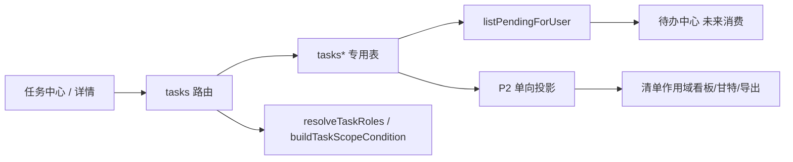

# MetaSheet 任务功能线 — Design Lock（PROPOSED）

- 日期：2026-09-17
- 状态：**PROPOSED — 不是已 ratify 的锁**。本件是 M1 的输入。不构成 DDL 应用、PR 合并或生产开关授权。三者各自需要 owner 亲写 GitHub comment。
- **基线 SHA**：`bb77ca5f2ce3c2825265ec8877861d367d017ead`（本 head 相对 `origin/main` 的 merge-base）
- 计划输入：`task-feature-development-plan-20260915.md` v5，MD5 `f74e172840d2aa2502216d0dd8dff867`（PROPOSED 计划，不等于 ratify）
- 普查：`docs/development/task-feature-census-20260917.md`
- 骨架：照 `docs/development/elearning-plugin-design-lock-20260810.md` 的 §0–§15 编号。**§8 不重排**（计划 v5 多处按「锁 §4 / 锁 §12」引用）。
- 实现者不得批准自己的安全结论。§13-9 / §13-10 / §13-11 / §13-12 标「未裁」。§13-5 随 §13-11 落槌，单独未裁亦阻断 M2。

---

## 0. 结论摘要

可以对标飞书「任务」的**实体层**，但不整体对标。飞书任务 = 三层（审阅件 v2）：

1. **任务实体**（四角色视角、多负责人全部/任一完成、完成/重启、子任务五层、逐任务角色、任务中心、逾期红点）——本 SHA 双语法扫描下没有 `tasks`/`task_*` 建表（复现见普查 §3），要新建。
2. **任务清单**（字段、看板/甘特/仪表盘、评论、附件、动态）——组件可复用；分析投影与交互编辑必须分路。
3. **IM 原生层**——不对标。

任务是**实体**（被创建、持久化）；待办是**投影**（不落表）。任务系统是待办中心的一个来源，两线并行，只在 PendingItem 接口交汇（交接件 §一/§二）。

权威数据在任务域专用表。org 来源合同定为 `req.authenticatedTenantId`（本 SHA `packages/core-backend/src/auth/jwt-middleware.ts:101-104`）。非 admin 可达需要三件事：① `permissions` seed（是 ② 的 FK 前置，见 `20250924190000_create_rbac_tables.ts:105-115` `role_permissions_permission_code_fkey` `ON DELETE CASCADE`）；② 非 admin 角色 `role_permissions` 带 `tasks:*`；③ `user_namespace_admissions` 行。**②③ 缺一 403**；无 ① 插 ② ⇒ SQLSTATE 23503，不是 403。码名见 §13-10c **未裁**。feature flag `TASKS_ENABLED === 'true'`，默认 OFF。`TASKS_*` 源码读与 GH manifest 义务见 §10（有期限推迟，不是豁免）。

本锁 **PROPOSED**。M2 实体核心（DDL/路由/前端）要等 M1 ratify **且** §13-9 / §13-10 / §13-11 / §13-12 落槌。§13-5 随 §13-11 落槌，单独未裁亦阻断 M2。

---

## 1. 架构结论

- **SoR**：PostgreSQL 专用表 `tasks` / `task_assignees` / `task_followers` / `task_events`（P0-A），后续清单/评论/附件/投影表按 §4。
- **纯函数边界**：`packages/core-backend/src/tasks/` 只放无 I/O 纯函数（含 `task-lock-keys.ts` 只生成键）。DB 在 `src/services/task-*.ts`，路由在 `src/routes/tasks*.ts`。三把任务锁的**取锁**在 `src/db/task-advisory-locks.ts`（§6.4），不进 `src/tasks/`。
- **不进 DI**（`di/identifiers.ts` 只登记平台服务）；router 工厂仍接 `injector` 以取 `ICollabService`。
- **投影（P2）**：单向只读到多维表；交互编辑 emit → 任务 API → reconcile。
- **不选**：任务 = 多维表的一种 sheet 类型；复用审批 `/pending` 与 `/pending-count` 的谓词分叉；登记 `table-classification.cjs`。



---

## 2. 对标基准蒸馏（飞书任务 26 篇）

语料：离线 html 26 篇，目录 `~/Documents/Codex/2026-09-15/ni-ne/outputs/feishu-tasks-offline/articles/*.html`。**行号口径（可执行，以普查脚本为规范）**：去 `script`/`style`，按块元素拆行，`strip`，去空行，得到非空渲染列表；`《篇》:N` = 该列表的**绝对行号**（1-indexed）。**不是** html 源码行，也**不是** `data-line-index`。一行脚本见普查「飞书离线语料行号口径」（先 `export ARTICLE` / `export N`，再跑脚本）。IM/文档/独立窗口/外部联系人/飞书项目同步：**不对标**。

承重机制（P0 必须进锁）：

1. 四种角色视角 + 已完成 + 全部（《查看和编辑任务》:13-16 四视角、:17 默认未完成可切、:19 已完成、:21 全部）。
2. 多负责人 + 全部/任一完成（《添加任务负责人》:14-15）。
3. 创建人「仅我完成 / 为所有负责人完成」（《完成与重启任务》:20）；父完成不级联子（同篇 :19）。:21-23 是 IM 场景，不对标。all 模式重启「重启我的 / 重启全部」= `scope=self|all`（同篇 :35）；:38 为 IM 注，按 :21-23 同法切分、不对标。
4. 子任务含根五层（《使用子任务》:7）、设父/转独立双端编辑权（:10-11）。父候选排除子孙是对语料「排除子任务」（:30）的**自有加强**（排除全部子孙，不只直接子任务）。
5. 创建人默认为负责人之一，可移除；零负责人合法（《添加任务负责人》:10 默认负责人、:12 可删减；《查看和编辑任务》:15）。
6. 截止日期 vs 具体时间点；提醒缺省 −30min / 当天 18:00（《创建任务》:19-20）。
7. 红点口径逾期 / 逾期或今天 / 可关（《使用任务红点标记》:14 / :15-16、《任务设置》:15-16；闭集与 `all_open` 分工见 §13-4）。
8. 关注人只读（《快速上手任务》:45）+ 评论加附件（《在任务中添加附件》:28-29）+ 附件评论通知（同篇 :30）+ 收完成/重启/删除通知（《关注任务》:13）+ 可移除自己上传的附件（《在任务中添加附件》:37）。冲突见 §13-23。
9. 清单归档不改变任务可见性（《使用任务清单》:67）。
10. 可见 ≠ 等我处理（自有设计，承交接件）。

---

## 3. 范围裁决表

| 模块 | 裁决 | 期次 |
|---|---|---|
| 任务实体 / org / 四视角 / 完成重启 / pending | ✅ 做 | P0-A / M2 |
| 前端 `/tasks` `/tasks/:id` / 红点轮询 / 422 引导 | ✅ 做 | P0-A / M2 |
| 子任务树 / 评论 / 删除退出 | ✅ 做 | P0-B / M3 |
| 清单 / 分组 / 提醒 outbox / 事件通知 / socket | ✅ 做 | P1 / M4 |
| 重复 / 附件 / 里程碑依赖 / 投影+交互 / 自定义字段 | ✅ 做 | P2 / M5 |
| IM 原生（消息转任务、会话列表、文档内嵌、独立窗口、小组件、外部联系人、飞书项目） | ❌ 不做 | 不排期 |
| 清单「申请权限→所有者同意」 | ❌ | P1 用直接分享 |
| 站内通用收件箱 | ❌ | 待办中心线 |
| 甘特关键路径/整条拖动/着色/联动 | ❌ | 多维表线 |
| 新表 DML 普查闸 | ⏸ | §13-36 未做则门表不得写「CI 会抓到」 |

---

## 4. 域模型（SoR；live 迁移进 `packages/core-backend/src/db/migrations/zzzz*`——**本文件不授权写迁移**）

迁移命名：`zzzz<晚于本 SHA 最晚文件 zzzz20260916120000 的时间戳>_<snake>.ts`。引用迁移带完整文件名。`down()` 逆序镜像 `up()`。`users.id` 是 text，人员列用 text。

### 4.1 非空约束两类（**已定，来源 计划 v5 §2**）

- **任务域生成 id 列**（`tsk_…` / `tlst_…` / `tcmt_…`，不含 `org_id` / `created_by`）：锚定 `CHECK (col ~ '^[!-~]+$' AND col !~ '__' AND col !~ '^_' AND col !~ '_$')`。id **生成格式**（服务端生成）`^(tsk|tlst|tcmt)_[A-Za-z0-9]+$`。写路径前导 `_` / 尾随 `_` ⇒ **422**（门 10 两格）。`org_id` / `created_by` 只留 `CHECK (col ~ '^[!-~]+$')`，不加 `__` / 前导 `_` / 尾随 `_` 三合取。（计划 v5 无此四合取 CHECK，偏离见 §9。）
- **用户文本**（`title` / `name`）：`CHECK (btrim(col) <> '')` + 应用层 Unicode 归一（NFC、去 White_Space 与 U+200B/U+200C/U+200D/U+FEFF 后非空）。**禁止**把 `[!-~]` 用在可能出现中文的列。正例「备料复核」；反例 `''`（CHECK）、`'\t'` / `'  \n '` / `'　'` / 零宽（应用层）。

（交接件 §四.3 曾写用户文本也用 `[!-~]`；与计划 v5 冲突，**以计划为准**，记偏离。）

### 4.2 表（草案；ratify 前不建）

P0-A：`tasks`（含日期四列 + `time_zone` + 派生 `due_at`；`completion_mode` in `all|any`；`depth` 0..4；软删；`version`）、`task_assignees`（PK `(task_id,user_id)`；零负责人合法；**公式** `all` 判定 = `EXISTS(assignee) AND NOT EXISTS(uncompleted)`——零行 ⇒ 公式为假、不判 done。**「创建人 complete ⇒ done」是锁新增**，权威来源 = complete handler 写 `tasks.status='done'`，不经该公式；见 §9 / 门 3 `all×0`。**创建期语义**：省略 `assignees` 字段 ⇒ 插入 creator 一行；显式 `assignees: []` 替换默认行（零负责人）；显式非空数组 = 只插入所列用户（可含或不含 creator）。计划 v5 无此字段，§9 偏离）、`task_followers`、`task_events`。

`task_events.event_type` 闭集（**已定一次写全 CHECK，来源 计划 v5 §2.3**；新增词 = 新 DDL + owner 合并授权，与 §13-8 一致）：`created / title_changed / description_changed / due_changed / start_changed / remind_changed / assignee_added / assignee_removed / follower_added / follower_removed / completion_mode_changed / self_completed / self_reopened / completed / completed_by_any / reopened / deleted / left / parent_set / parent_cleared / commented / attachment_added / attachment_removed / field_value_changed / list_added / list_removed / group_changed / milestone_set / milestone_cleared / dependency_added / dependency_removed / recurrence_set / recurrence_cleared / recurrence_spawned`。

`task_list_events.event_type` 闭集（同来源）：`created / renamed / archived / unarchived / owner_transferred / member_added / member_removed / member_role_changed / item_added / item_removed / group_created / group_renamed / group_deleted / field_bound / field_unbound`。

权限码三名 `tasks:read|write|admin` 是建议名（§13-10c **未裁**）；seed 三行是否插入、是否绑 `role_permissions` 见 §13-10，**裁定前不得把三码当已交付**。

P0-B：`task_comments`（照 `zzzz20260822120000_create_approval_comments.ts` 形；无 resolved）。

P1：`task_lists` / `task_list_members` / `task_list_items` / `task_groups` / `task_group_items` / `task_list_events` / `task_user_settings` / `task_notification_deliveries`。

P2：`task_dependencies` / `task_attachments` + `task_attachment_purge_intents` + row-delete 触发器 / `task_fields` / `task_list_field_bindings` / `task_field_values` / `task_record_projection` PK `(list_id, task_id)` 无 FK。

索引最小集（**已定，来源 计划 v5 §2.2**；建表迁移内一次建全）：`idx_tska_user (task_assignees.user_id)`、`idx_tskf_user (task_followers.user_id)`、`idx_tsk_org_status (tasks.org_id, status) WHERE deleted_at IS NULL`、`idx_tsk_creator (tasks.created_by) WHERE deleted_at IS NULL`、`idx_tsk_parent (tasks.parent_id) WHERE parent_id IS NOT NULL`、`idx_tsk_due (tasks.due_at) WHERE due_time IS NOT NULL AND status='open' AND deleted_at IS NULL`、`idx_tsk_due_date (tasks.due_date) WHERE due_time IS NULL AND status='open' AND deleted_at IS NULL`、`idx_tski_task (task_list_items.task_id)`、`idx_tske_task_time (task_events.task_id, occurred_at DESC)`、`idx_tcmt_task_time (task_comments.task_id, created_at)`；outbox 三条同形。不按 `archived_at` 过滤 pending/四视角。

### 4.3 org 归属（**已定 1a，来源 计划 v5 §2.4**；其余见 §13-1）

- `tasks.org_id` 来源合同 = `req.authenticatedTenantId`（`packages/core-backend/src/auth/jwt-middleware.ts:101-104` @ 本 SHA）。不用 `req.user.tenantId`（同文件 `:106-109` 会被 `x-tenant-id` 回填）。
- 写路径：claim 缺失一律 **422**，不 fallback、不写 `'default'`。产生点在 **handler 内**，位于 `authenticate` + `rbacGuard('tasks', …)` **之后**（缺 org 的已认证且已过 RBAC 的请求才 422）。`deriveApprovalInstanceOrgId` 不得作兜底（门 1 覆盖）。
- 读路径：视角闭集 `V = {assigned, following, created, delegated, any_role}`。`tasks.org_id = :orgId` **只由** `buildTaskScopeCondition` **单点发射**；`buildTaskPendingCondition` / `listPendingForUser` / `V` 五值路由不得自行写 org 子句。`orgId` 空 ⇒ 空列表 + `degraded: true, reason: 'org_missing'`；谓词抛错 ⇒ `reason: 'predicate_error'`。只有 `org_missing` 触发 session-org 引导。挂载先 `GET /api/tasks/context`。
- `task_comments` / `task_events` 不设 org 列。
- 残留披露（任务域不加固，见 §13-1d）。**`RBAC_OPTIONAL` 谓词（定义唯一；复制处必须逐字 `process.env.RBAC_OPTIONAL === '1'`）**：`RBAC_OPTIONAL_ON := (process.env.RBAC_OPTIONAL === '1')`。机核：下列三处身份必须各恰一行含逐字 `process.env.RBAC_OPTIONAL === '1'`——(1) 本定义句（§4.3）、(2) setup 守卫描述（§5.2.1 ②）、(3) §13-1d。`grep -n "process.env.RBAC_OPTIONAL === '1'" docs/development/task-feature-design-lock-20260917.md` 输出恰好这三行。负控：删 (2) 或 (3) 该字面 ⇒ 行数 ≠ 3。计划「未设置」改为本谓词，偏离见 §9。三读点字面即此：`namespace-admission.ts:9`、`service.ts:17`（真用点 `:25` / `:63` / `:101` `allowDegradation`，不是日志行 `:105`）、`permissions.ts:21`。`namespace-admission.ts:346` 是降级后果行，不是旗读点。专属 config `env.RBAC_OPTIONAL: ''`、setup 守卫、门 2/13/16 行尾均用同一谓词（为真则抛 / 本门红）。`RBAC_TOKEN_TRUST` **三处读点、两条轴**：`rbac.ts:12`（**装载期**常量，无 `NODE_ENV` 约束）；`AuthService.ts:171-175`（**调用期**读，且合取 `NODE_ENV !== 'production'`）；`security/auth-runtime-config.ts:84`（生产告警，不授权）。承重通道见 §5.2.1 ② / 门 16。trust-off 支：`req.user.permissions` 来自 `AuthService.resolveRbacProfile`（`:748` `listUserPermissions`：`user_permissions` ∪ `role_permissions` ∪ `users.permissions` jsonb，再按 admission 过滤）；`rbac.ts:78` 先于 `:94` / `:101`。

### 4.4 日期与时区（**已定，来源 计划 v5 §2.6**）

四列 + `time_zone`（带任一日期才必填，IANA）+ 派生 `due_at`。IANA 校验函数 = `isValidIanaTimeZone`（`packages/core-backend/src/multitable/automation-timezone.ts:54`）。这是**任务域对多维表域的运行期依赖**（import 纯函数，不经多维表路由）。`due_at` 每次写入由服务层重算：有 `due_time` ⇒ `(due_date, due_time)` 在 `time_zone` 下的瞬时；全天（`due_time IS NULL`）⇒ `due_date` 在 `tasks.time_zone` 下 **23:59:59.999** 的瞬时（计划 v5 §2.6；只供投影与排序，逾期判定仍走规则 3 的 `due_date` 比较）。

逾期 / 「今天」三条规则（查看者日期语义）。SQL 定义（**已定，来源 计划 v5 §2.6**）：

```
viewerToday = (now() AT TIME ZONE :viewerTz)::date
viewerNextMidnight = ((viewerToday + 1)::timestamp AT TIME ZONE :viewerTz)
```

1. 定时 overdue = `due_at < now()`（与 viewerTz 无关）。
2. 定时 overdue_or_today = `due_at < viewerNextMidnight`（查看者当地次日零点瞬时）。
3. 全天 overdue = `due_date < viewerToday`；overdue_or_today = `due_date <= viewerToday`。

查看者时区：请求头 `x-viewer-time-zone`；服务端用 `isValidIanaTimeZone`（同上 `:54`）校验，**非法或缺失回退任务自身 `time_zone`**。显示：全天 floating 不换算日期。`resolveReminderTimeZone`（`packages/core-backend/src/multitable/automation-date-reminder.ts:36`）**未导出**，任务域无法直接调用。`computeDateReminderOccurrence`（`:241`）在 `:246-252` 前置检查（空值 / `NaN`）**之后**于 `:253` 调用它；传入的 `tasks.time_zone` 必须在**写入时**已经 `isValidIanaTimeZone` 校验过。写入非法 `time_zone` ⇒ 422（门 8）。

`remind_at` 缺省（P1，**已定算法，来源 计划 v5 §5-13 / §2.6**；`task_user_settings` 表本身见 §13-7）：创建未显式给 `remind_at` 时**先**按用户 `default_remind_policy`（无该表/无行 = policy 缺省）；有 `due_time` ⇒ `due_at − 30min`（任务域自算纯函数；`due_time` 在 00:00–00:29 跨日回退到前一日）；全天（`due_time IS NULL`）⇒ `due_date` 在 **`tasks.time_zone`** 下的 18:00，经 `computeDateReminderOccurrence(due_date, {timeOfDay:'18:00', offsetDays:0, timezone: tasks.time_zone}, {floating:true})`（函数定义 `packages/core-backend/src/multitable/automation-date-reminder.ts:241`）。不用查看者时区。区分依据是四列，不是从 `timestamptz` 反推。P0-A 派生函数在 policy 缺省时即可单测两支；读 `task_user_settings` 要等该表落地（§13-7）。

---

## 5. 权限与前端

### 5.1 RBAC（结构；豁免集/角色 seed 见 §13-10 **未裁**）

非 admin 可达需要三件事：① `permissions` seed；② 非 admin 角色在 `role_permissions` 带 `tasks:*`；③ `user_namespace_admissions(namespace='tasks', enabled=true)`。**②③ 缺一 403**。① 是 ② 的 FK 前置（`packages/core-backend/src/db/migrations/20250924190000_create_rbac_tables.ts:105-115` 约束名 `role_permissions_permission_code_fkey` `REFERENCES permissions(code) ON DELETE CASCADE`）；无 ① 插 ② ⇒ SQLSTATE **23503**，不是 403；先插再删 ① 则 CASCADE 连 ② 一起删，与「缺②」同格。守卫路径不读 `permissions` 目录表。`user_permissions` 直授与 `users.permissions` jsonb **在 `tasks` 不在 `controlledNamespaces` 时**过不了准入（`:345` 先返回 false）。**条件不成立的反例 = 门 16 判别格**：角色已带 `tasks:write` ⇒ namespace 在 `controlledNamespaces`，此时直授或 jsonb 含 `tasks:read` / `*:*` 会在 trust-off 下经 `resolveRbacProfile:748` → `listUserPermissions` 三路 ∪ 后走 `rbac.ts:78`，两姿态同 200。给 `admin` 绑码零增益。码名 `tasks:read|write|admin` 是 §13-10c **建议**，裁定前不得当已交付。

`deriveDelegatedAdminNamespace`（`packages/core-backend/src/rbac/namespace-admission.ts:102-108`，调用点同文件 `:196-199`）把 `*_admin` 角色名（例 `tasks_admin`）派生的 namespace 写入 `controlledNamespaces`。`tasks` 经 `:133-137` + `:11-38` 是受控资源，该通道对任务域为活。查询是 `LEFT JOIN role_permissions`（`:182-186`），零 `role_permissions` 行也成立。

**admission 行仍必需**（`:347` `return admissions.get(normalizedNamespace)?.enabled === true`；其前 `:344` admin 短路、`:345` 不在 `controlledNamespaces` ⇒ false、`:346` 是表不可用时的降级，不是旗读点）。本通道**没有**绕过 ③。

它实际做的是让 namespace 凭**角色名**进入 `controlledNamespaces`，而不是凭 `role_permissions` 派生（`:200-203`）。削弱 ①② 中哪一件，取决于 `rbacGuard` 另一合取项的权限码校验，**裁 §13-10b 前必须补普查**，本锁不另写未证断言。§13-10b 裁 seed 时必须知情：seed `tasks_admin` 形角色名会走这条通道。本锁不把该通道收成第四件「事」，也不在 §13-10 未裁前关闭它。

`tasks` **不在** `NON_NAMESPACED_PERMISSION_RESOURCES`（本 SHA `packages/core-backend/src/rbac/namespace-admission.ts:11-38`）。验收非 admin 定义：`req.user.role/roles` 不含 admin **且** `user_roles` 无 `role_id='admin'`。

资源面 `rbacGuard('tasks', …)`；实例面 `none` ⇒ 与「不存在」逐字节相同的 values-free 404。`rbacGuard` 自身抛错 500 是已知平台行为，任务线不改中间件。

### 5.2 前端路由与导航（**已定，来源 计划 v5 §4**；§13-37/38/39 缺省按此执行）

- 路由 `/tasks`、`/tasks/:id`；`apps/web/src/router/appRoutes.ts` 懒加载 + `permissions: ['tasks:read']`（码名是 §13-10c **建议**，未裁前这是占位，不是已交付 seed）。
- **route meta × 权限门耦合（后果已写死）**：`guardPolicy.ts:221-225` 的路由权限门**先于**焦点白名单运行；`isRoutePermitted`（`apps/web/src/router/routeAccess.ts:26-31`）对 `meta.permissions` 取 **every**。`useAuth.ts:548-556`：`snapshot.isAdmin` 或 `roles.includes('admin')` **短路可达**；非 admin 且快照无 `tasks:read` ⇒ **一律 redirect 回家**，与「路由不存在」同形。计划 `guardPolicy.ts:29` 现为 `:34`（已漂对照）。门 22 行为 spec 计分，**不在** §13-10 阻断名单（§11）。§11 真机冒烟仍标前置：§13-10 落槌 **且** 权限快照带该码；未满足不计入冒烟，但不阻断门 22。
- **§13-37 缺省**：两张焦点白名单都不加 `/tasks`。入口只加默认壳分支（与 `canUseApprovals` 同形），`attendanceFocused` / `plmWorkbenchFocused` 不渲染。
- **§13-38 缺省乙**：不加 `requiredFeature: 'tasks'`，不改 `router/types.ts` / `guardPolicy.ts`。`canUseTasks` + `GET /api/tasks/context` 普通 404 渲染「任务功能未启用或当前服务不支持」。**404 不断言 `TASKS_ENABLED` 的值**。推荐不是启用授权。
- 引导流三触发：context `orgId===null` / 读 `org_missing` / 写 422。`predicate_error` 不进引导。
- 红点：常驻 `<span data-testid="tasks-todo-badge" :data-state :data-count>` 三态；不照抄审批 `applyCount(0)`。
- 真 fetch，不复制审批 `USE_MOCK`。
- 助手模块 `apps/web/src/tasks/` + `views/tasks/`。

### 5.2.1 真库接线①②③④（**已定 ①②④，来源 计划 v5 §8-1**；第 ③ 点 required 承载见 §13-12 **未裁**。标题不再写「三点」：正文四项。）

每个 `tests/integration/task-*.db.test.ts` 必须 ①②③ 齐，缺一即 skip 形状绿（交接件 §四.5）。④ 是发现式枚举，本文件不进 exclude、不进逐文件 run-list。

① **exclude 逐文件字面量**：加进 `packages/core-backend/vitest.config.ts` 的 `test.exclude`。任务条目必须是逐文件字面量，**不得用 glob**。验法：排除后 no-DB 配置对该路径报 **`No test files found`，不是 skipped**。e2e glob 本 SHA 在 **`:1812`**（计划写的 `:1782` **已漂**、上一轮写的 `:1797` **已漂**，现为 `elearning-media-quota.db.test.ts`）。

② **独立证据 lane**：形状照 `.github/workflows/approval-realdb-comments.yml`：`workflow_dispatch` + `pull_request`（paths，**不加 `branches:`**，`:45-47`）+ `push main`；**不声明 `merge_group`** 仅在 lane 保留 paths 时成立（`:41`）；job 级 `DATABASE_URL`（postgres:16）+ `EXPECT_DB: '1'`（`:99`）；`MIGRATION_EXCLUDE` 标准 6 项（`:129` 逗号列表；`MIGRATION_EXCLUDE_TRACKING.md` 文案 union 为 7，新迁移不加进去）；`vitest --config vitest.integration.config.ts run <整文件> --reporter=verbose`（`:136`；verbose 是判据：lane 绿后从日志读出收集用例数写进 PR body，零收集的绿无效 `:133-135`）；测试顶部 `EXPECT_DB` 哨兵（`packages/core-backend/tests/integration/approval-sequential-mode.db.test.ts:14`）。

本 SHA 副作用（必须点名，**不得沿用**）：`packages/core-backend/vitest.integration.config.ts:21` `setupFiles: ['./tests/setup.integration.ts']`；`packages/core-backend/tests/setup.integration.ts:7` `process.env.RBAC_BYPASS = 'true'`，`:8` `process.env.RBAC_TOKEN_TRUST = 'true'`。

真正产生反事实 200 的通道分两支：

- **trust-on**：`AuthService.buildTrustedTokenUser`（`:203-243`）：`trustTokenClaimsEnabled()`（`:171-176`，**调用期**读且合取 `NODE_ENV !== 'production'`）为真时**不读库**，把 token `perms` 写成 `req.user.permissions`（`:234`）与 `perms`（`:242`），由 `rbac.ts:77-83` 消费。
- **trust-off**：`:206` 恒 null，走 DB。`req.user.permissions` = `resolveRbacProfile:748` → `listUserPermissions`（`user_permissions` ∪ `role_permissions` ∪ `users.permissions` jsonb，再 admission 过滤）。`rbac.ts:78` 先于 `:94` / `:101` 决定。门 16 判别格必须钉直授/jsonb 为空，否则两姿态同 200。

`rbac.ts:85-91` 与 `:77-83` 共用同一准入合取且 `perms === permissions`，在真实装配下不可能于 `:77-83` 失败后成功 ⇒ `:12` 模块常量**不是**承重读点。专属 config 的理由是：**装载序**确定（config `env` + `setupFiles` 均在模块装载前）+ `PRODUCT_MODE` + 同形先例；不是「模块常量套件顶部改不了」。检出路径三层：① wiring 静态钉 config `RBAC_TOKEN_TRUST: 'false'`；② setup 守卫 `!== 'false'` 则抛；③ 判别格在 TRUST 泄漏时翻转。不得写「只由判别格检出」。

任务鉴权门禁用专属 config，照 `packages/core-backend/vitest.elearning-pilot-auth.config.ts:28-33` 与 `tests/elearning-pilot-auth/setup.ts` 先例：

- `packages/core-backend/vitest.tasks-auth.config.ts`：`setupFiles: ['./tests/tasks-auth/setup.ts']` + `env: { RBAC_BYPASS: 'false', RBAC_TOKEN_TRUST: 'false', PRODUCT_MODE: 'plm-workbench', RBAC_OPTIONAL: '', TASKS_ENABLED: 'true' }`（均在模块装载前生效）；`include` 钉 `tests/tasks-auth/tasks-auth-gate.ts`；**不得**指向 `tests/setup.integration.ts`。`TASKS_ENABLED: 'true'` 照先例 `tests/elearning-pilot-auth/setup.ts:57-61`：关时 router 工厂返回 `null`（锁 §10），请求 404，对照格 200 不可达。
- `packages/core-backend/tests/tasks-auth/setup.ts`：**整块照抄**先例 `tests/elearning-pilot-auth/setup.ts:68-76` 三条守卫，再加第四条（`RBAC_OPTIONAL_ON`）与 `TASKS_ENABLED` 守卫，各自 `throw`，均在顶部赋值**之后**：`:68-70` `RBAC_BYPASS !== 'false'`、`:71-73` `RBAC_TOKEN_TRUST !== 'false'`、`:74-76` `PRODUCT_MODE !== 'plm-workbench'`、第四条 `process.env.RBAC_OPTIONAL === '1'`（即 `RBAC_OPTIONAL_ON`，§4.3 唯一谓词）则抛、`TASKS_ENABLED !== 'true'` 则抛。缺任一条，门 16 不成立。缺 `DATABASE_URL` 则抛、拒绝 skip-shaped green。本切片不落该文件，不钉已删副本的行号。三读点皆为**模块装载常量**，夹具层不得设无效。
- 接线测试 `packages/core-backend/tests/unit/tasks-auth-ci-wiring.test.ts`：静态钉住 config/setup（对照 `scripts/ops/elearning-v01-auth-ci-wiring.test.mjs:74-93`）。断言强度：① 唯一性 `matchAll(...).length === 1`（禁止只 `toMatch` 存在）；② 钉五条守卫文本（先例三条 + `RBAC_OPTIONAL_ON` + `TASKS_ENABLED`）且位于赋值之后；③ **禁自指**（不得 `endsWith('/tests/unit')`），改读 `packages/core-backend/vitest.config.ts` 断言 `test.exclude` 不含本 wiring 文件。M2 验收还必须含先例 `:71` `existsSync(GATE)` 与两条 workflow 断言 `:108-118`（install 前执行 wiring）及 `:120-168`（20.x 真库整文件步，含 `:167` `stepAt > migrateAt`）。后者待 §13-12 裁 required 承载；本切片**不改** `plugin-tests.yml`。
- `RBAC_BYPASS` 在 `packages/core-backend/src` **零读点**（读者是 `plugins/plugin-attendance` 与 ops）；config/setup 仍钉 `'false'` 以对齐先例，**形状钉不构成门 16 判据**。门文件不得在 setup 之后运行期改写 `RBAC_TOKEN_TRUST`。

上列四件（config / setup / wiring / `tasks-auth-gate.ts`）**M2 与 `tasks-auth-gate.ts` 同 PR 落**。本切片（M0 / PR-0）**不落**这些文件，保持 docs-only。

② 的「paths、不加 `branches:`、不声明 `merge_group`」是 **paths 保留时**的已定形状。若 §13-12 裁 (b)，该形状在裁 (b) 的 PR 上被取代（去 paths、声明 `merge_group`、四步 POST-append），不是本锁提前落槌 (b)。

③ **点名哪个 required context 真正执行该文件**。独立 lane 只是证据。**(a)/(b) 由 §13-12 裁，本锁不落槌**。db 门 required 格见 §12 门 2/9/13/17 行尾「required 承载: TBD（§13-12 未裁）」。

④ **发现式覆盖枚举（已定，来源 计划 v5 §8-1 ④）**：自建 `task-ci-coverage-enumeration.test.ts`（`readdirSync`）：磁盘 `task-*.db.test.ts` 集合 = `vitest.config.ts` `test.exclude` 中匹配 `^tests/integration/task-.*\.db\.test\.ts$` 的条目 = 证据 lane 文件清单，**三者相等**；**每个磁盘文件源文本含** `assert-rbac-optional-off` import 说明符。各配扫描负控（集合非空、正则未失效，照 `packages/core-backend/tests/unit/approval-ci-coverage-enumeration.test.ts:579-581`；删任一文件该 import 行 ⇒ ④ 红）。本文件**不**进 `test.exclude`、**不**进任何逐文件 run-list。中间集合不得拿整个 exclude 数组比（本 SHA exclude 行首路径条目 400 / glob 3；naive 数组体引号 456 / 含 `*` 5）。**非空负控与 import 负控自首个 `task-*.db.test.ts` 落地的 PR 起武装**；此前 **NOT RUN**、不计分（空集上 `length > 0` 恒红，无判别力）。计划 §8-10 写 db/web lane 都断言 OPTIONAL；web lane 无后端三读点，不装该 import（§9 偏离）。

承载：`.github/workflows/plugin-tests.yml` `test` job 的 `Run core-backend tests` 步（本 SHA `:842-844`，`pnpm --filter @metasheet/core-backend test`）。该步**无** `if: matrix.node-version`，矩阵两腿（18.x 与 20.x）都会跑到该文件。**required context 只认 `test (20.x)`**（workflow 自述 `:532-533`；2026-09-19 `gh api repos/zensgit/metasheet2/branches/main/protection` required contexts 含 `test (20.x)`，**不含** `test (18.x)`）。不得把 `test (18.x)` 写成 required 承载的一半。

与 §13-12 的关系：**不是无关**。④ 的三集合谓词不覆盖 required run-list。若 §13-12 裁 **(a)**（整文件加进 `plugin-tests.yml` `test` job run-list），该 run-list 是**第四集合**，必须在裁 (a) 的那个 PR 把 ④ 扩成四集合相等；裁 (a) 前不得声称 ④ 已覆盖 required 执行。若裁 **(b)**，④ 的三集合维持，但 ② 的 paths 形状被 (b) 取代，须同 PR 改 ② 正文。审批对物 `approval-ci-coverage-enumeration.test.ts` 今天由同一 `:842-844` 步执行。④ 自身 verbose 收集数：该步绿后从日志读出收集用例数写进 PR body，零收集的绿无效（与 ② 同一判据）。

本切片 docs-only：不改 `vitest.config.ts` exclude、不建 `task-*.db.test.ts`、不改 `plugin-tests.yml`、不落 `vitest.tasks-auth.config.ts` / `tests/tasks-auth/setup.ts` / wiring / `tasks-auth-gate.ts`。四件形状见上，M2 同 PR 落。

### 5.3 前端两点接线（**已定，来源 计划 v5 §8-2**）

新 spec 必须两处齐才不是 skip-shaped green：

① `.github/workflows/tasks-web-guard.yml`：paths 型（`apps/web/src/tasks/**`、`apps/web/src/views/tasks/**`、`apps/web/tests/tasks*.spec.ts`、`apps/web/src/router/guardPolicy.ts`、`apps/web/src/App.vue`、workflow 自身），`push main` 同 paths，**不声明 `merge_group`**。不抄 `.github/workflows/attendance-web-guard.yml:2-3` 的无 paths 形状。**step 行**必须逐文件写出 `apps/web/tests/tasks….spec.ts`（不得在 step 用 glob）。形状：`pnpm --filter @metasheet/web exec vitest run apps/web/tests/tasksFoo.spec.ts … --reporter=verbose`。

② token 加进 `apps/web/scripts/run-required-web-tests.sh` 的 `exec npx vitest run …` 行（本 SHA 在 **`:1186`**，计划写的 `:1069` **已漂**；执行者 = always-on 必需 job `web-tests`，`.github/workflows/web-tests.yml:77`）。双向碰撞检查覆盖 vitest 实际收集的人口（不只 `apps/web/tests`）：

- 正向：`find apps/web -path '*/node_modules' -prune -o -name '*.spec.ts' -print -o -name '*.test.ts' -print | grep -c -- '<token>'` **= 1**
- 反向：`find apps/web -path '*/node_modules' -prune -o -name '*.spec.ts' -print -o -name '*.test.ts' -print | grep -- '<token>' | grep -c 'apps/web/verification/'` **= 0**（Playwright 用例；命中即红，不是「扫描人口包含 verification」）
- 两条命令输出写进 PR body

本切片 docs-only，不改这两处。

### 5.4 五段部署链（**已定，来源 计划 v5 §8-3**）

合并 → 构建 → 发布 → 部署 → 迁移是五个独立动作，不自动串联。

1. **合并**进 main 只触发 `.github/workflows/docker-build.yml` 的 build job **构建**（`:4-8`；`paths-ignore: ['docs/**','output/**']`）。通则：`paths-ignore` **命中时**不触发 build；diff 含 `packages/**`（或任何非豁免路径）的 PR 合进 main **会**跑 build。本 PR-0 为 docs-only，命中豁免。
2. **发布镜像是 dispatch 门**：`publish_images` 步骤要 `publish_preflight.verified == 'true'`（`:111`），其上游 `publish_authorization.publish_requested`（`:96`）由 `scripts/ops/docker-publish-preflight.mjs:19` 决定：`if (context.eventName !== 'workflow_dispatch') return { publish: false }`。
3. **生产部署 job** 仅在 `workflow_dispatch && inputs.deploy_production == true && github.ref == 'refs/heads/main' && needs.build.outputs.published == 'true'` 时运行（`:120-122`）。`published` 只能由同一次 dispatch 的发布步骤置真。
4. 因此 prod 上线必须在**同一次 dispatch 同时给** `publish_images: true` 与 `deploy_production: true` 两个 input；只给后者会得到静默跳过的 deploy。staging 由 window-runner 部署，需 owner 指令。
5. **迁移**只在该 deploy job 的「Remote deploy」步骤内执行（`.github/workflows/docker-build.yml:484-488`，容器内 `node packages/core-backend/dist/src/db/migrate.js`，带 `MIGRATE START/END` 标记）。生产迁移与生产部署同门。

含 DDL 的 PR body 首段写明：本 PR 合并后**不会**自动到达生产，迁移**不会**自动应用；`down()` 是否验证过。新迁移默认在 CI 跑，不加进 `MIGRATION_EXCLUDE`。

---

## 6. 核心引擎

### 6.1 谓词一份真相、两种形态、一条从属链（**已定骨架，来源 计划 v5 §3**）

- `task-access.ts`：`resolveTaskRoles`（行级，能力取并集，读 `TASK_ROLE_ABILITY`，**不进列表读路径**）+ `buildTaskScopeCondition`（只产 SQL，**列表读路径**）+ `taskMatchesView(row, me, view)`（TS 侧视角谓词，**正控期望行集**用它，不把「可见性」当判据）。
- **`TASK_ROLE_ABILITY`** 只服务 `can()` / `resolveTaskRoles`，**不进** `GET /api/tasks` / `/pending` / `/pending-count` 读路径。门 19 探针**不以该表为 mutation 目标**。
- **TS 侧视角谓词** `taskMatchesView`（`delegated` 的 TS 对应物在此定义）。ambient `A = { meInAssignees, meInFollowers, createdByMe, othersAssigned }`。行是否应收：

| view | 应收 iff |
|---|---|
| `assigned` | `meInAssignees` |
| `following` | `meInFollowers` |
| `created` | `createdByMe` |
| `delegated` | `createdByMe ∧ othersAssigned` |
| `any_role` | 上四者 OR |

`s` 与 ambient 一致：`creator ∈ s ⇔ createdByMe`，`assignee ∈ s ⇔ meInAssignees`，`follower ∈ s ⇔ meInFollowers`；`none` ⇒ 三旗全假。`othersAssigned` 每格钉死（`delegated` / `any_role` 依赖它）。期望行集 = 夹具里 `taskMatchesView=true` 的行，**不是** `resolveTaskRoles` 的能力并集。
- **SQL 读路径**：`buildTaskScopeCondition` 按 view 发射与上表逐行同构的臂（`assigned` → `EXISTS task_assignees`；`following` → `task_followers`；`created` → `created_by=:me`；`delegated` → `created_by=:me AND EXISTS (assignee ≠ me)`；`any_role` → OR）。`buildTaskPendingCondition` 只派生 `view:'assigned'`。
- **门 19 网格按里程碑分层**：
  - **M2 子集**：`S_M2 = {{creator},{assignee},{follower},{none},{creator,assignee},{creator,follower},{assignee,follower},{creator,assignee,follower}}`；`V` 同上五值。`I_M2 = S_M2 × V`（40）。身份序列化 `s` = 角色名升序 `+` 连接（`assignee+creator`），`v` = view 名。**表列映射**：用例名 `gate19|<s>|<v>` 三列 = 前缀 `gate19` / `s` / `v`。抽取（武装后；`LC_ALL=C sort`）：

```bash
grep -oE 'gate19\|[^|]+\|[^|"'\'' ]+' tests/integration/task-*.db.test.ts | LC_ALL=C sort
sed -n '/^```i-m2$/,/^```$/p' docs/development/task-feature-design-lock-20260917.md | grep '^gate19|' | LC_ALL=C sort
```

两路输出 `diff` 必须空。漏格：删一个用例名 ⇒ diff 非空 ⇒ 红。锁内清单（40 行，`LC_ALL=C` 序）：

```i-m2
gate19|assignee|any_role
gate19|assignee|assigned
gate19|assignee|created
gate19|assignee|delegated
gate19|assignee|following
gate19|assignee+creator|any_role
gate19|assignee+creator|assigned
gate19|assignee+creator|created
gate19|assignee+creator|delegated
gate19|assignee+creator|following
gate19|assignee+creator+follower|any_role
gate19|assignee+creator+follower|assigned
gate19|assignee+creator+follower|created
gate19|assignee+creator+follower|delegated
gate19|assignee+creator+follower|following
gate19|assignee+follower|any_role
gate19|assignee+follower|assigned
gate19|assignee+follower|created
gate19|assignee+follower|delegated
gate19|assignee+follower|following
gate19|creator|any_role
gate19|creator|assigned
gate19|creator|created
gate19|creator|delegated
gate19|creator|following
gate19|creator+follower|any_role
gate19|creator+follower|assigned
gate19|creator+follower|created
gate19|creator+follower|delegated
gate19|creator+follower|following
gate19|follower|any_role
gate19|follower|assigned
gate19|follower|created
gate19|follower|delegated
gate19|follower|following
gate19|none|any_role
gate19|none|assigned
gate19|none|created
gate19|none|delegated
gate19|none|following
```

夹具每格一行任务 T。ambient 三旗由 s 决定。`othersAssigned`：若 `v ∈ {delegated, any_role}` 且 `creator ∈ s` 则 **true**（否则 delegated 恒空），其余格 **false**。期望行集 ∈ `{{T}, ∅}`：

| s \ v | assigned | following | created | delegated | any_role |
|---|---|---|---|---|---|
| `none` | ∅ | ∅ | ∅ | ∅ | ∅ |
| `assignee` | {T} | ∅ | ∅ | ∅ | {T} |
| `follower` | ∅ | {T} | ∅ | ∅ | {T} |
| `creator` | ∅ | ∅ | {T} | {T} | {T} |
| `assignee+follower` | {T} | {T} | ∅ | ∅ | {T} |
| `assignee+creator` | {T} | ∅ | {T} | {T} | {T} |
| `creator+follower` | ∅ | {T} | {T} | {T} | {T} |
| `assignee+creator+follower` | {T} | {T} | {T} | {T} | {T} |
  - **清单角色格**绑首个清单 PR，§12 尾 **NOT RUN**。
- `buildTaskPendingCondition` **必须由** `buildTaskScopeCondition({view:'assigned'})` 派生，不得自行发射角色臂。
- **错误契约两族（已定，来源 计划 v5 §3 / §7-8）**：允许列表谓词抛错 ⇒ 空列表 + `degraded`；投影 deny 集合查询失败 ⇒ **抛出**，绝不返回空 deny 集。
- PendingItem（**已定，来源 计划 v5 §3 + 交接件 §二③**）：无截止日五键 `source/id/title/href/updatedAt`；有截止日六键（多 `dueAt`）；无截止日省略键，不填 null/空串。**不带正文**（投影不搬运内容；响应体不含 `description` / `description_rich` 等正文字段）。`source` 经 `TASK_PENDING_SOURCE` 常量，P0-A 先 `'task'`（§13-35）。签名比交接件多 `orgId`。

### 6.2 完成判定（规则；对称性见 §13-9）

**创建期语义**：省略 `assignees` 字段 ⇒ 插入 creator 一行；显式 `assignees: []` 替换默认行（零负责人）；显式非空数组 = 只插入所列用户（可含或不含 creator）。`all`：所有负责人 `completed_at` 非空且至少一行。零行不判 done。`any`：任一行完成即任务 done。**`any×{0}`**：无 assignee 行 ⇒ any 谓词不能使任务变 done。**零负责人**任务仅创建人可 complete / reopen（计划 v5 §5-7）；创建人 complete ⇒ done（不经 assignee 行）。`all` 模式重启范围 `scope=self|all`（计划 v5 §5-3；语料《完成与重启任务》:35 产品面；:38 为 IM 注，按 :21-23 同法切分、不对标）。可见 ≠ 等我处理：all 模式下我已完成他人未完成 ⇒ 仍 open、在「我负责的」，**不在** pending/红点，记 `self_completed`。

不变量：`status='open' AND completion_mode='any'` ⇒ 不存在非空 `completed_at`。与门 3 `any×n` **同命题**（任一行非空 ⇒ 任务 done，故 open 状态下不存在非空行）。**无独立门**；全称执行点 = 门 3 存活格每次 complete/reopen 后断言该不变量。该不变量在 `all`（部分人已 `completed_at`）切到 `any` 的瞬间可被打破，除非切模式事务按 §13-9 重算（any 置同一时刻 / 清零 / 拒绝切换）。§13-9 **未裁**，本不变量在切模式格 **不是已定闭合**；门 3 的**增删人格与切模式格**同受 §13-9 阻断，必须等 §13-9 落槌后才能声称不变量成立。P0 创建后未切模式、**不调用增删人 API** 的 any 路径仍受该不变量约束。n≥2 夹具：`POST /api/tasks` 的 `assignees[]` 或 harness 直发 SQL 播种；二者都不走增删人 API。

候选（**不是已定**；随 §13-9 落槌，计划 v5 §5-4）：`all→any` 且已有任一 `completed_at` 非空 ⇒ 立即 done。其余 §5-4 三条（删人删行；加人新行 `completed_at NULL`，all 已 done 加人 ⇒ 回 open；any→all 保留各人记录、已 done 维持）同批，本锁不提前抄成已定。

### 6.3 树不变量（P0-B）

`depth` 0..4（含根五层）。无环。设父/转独立双端 `can('edit')` + 同 org；失败 404。父候选排除自身及子孙。父完成不级联子。

### 6.4 锁协议与锁序

**provenance 分层**：键单点与三键字符串 = 计划 v5 §5-5；helper 文件位置与三导出名 = 闸判据（§9 / 报告 §4 登记偏离）。

结构变更按 org 串行化，**取锁后重读**。任务域三把键的取锁写法**唯一**如下，与 §1「`src/tasks/` 无 I/O」共存：

- **键生成**（纯函数、无 I/O）：`packages/core-backend/src/tasks/task-lock-keys.ts` — `taskStructureLockKey(orgId)` / `taskProjectionLockKey(listId, taskId)` / `tasksSchedulerLeaderLockKey()`，分别生成 `task-structure:<orgId>` / `task-projection:<listId>:<taskId>` / `tasks-scheduler:leader`。
- **取锁**（有 I/O）：`packages/core-backend/src/db/task-advisory-locks.ts` 导出 `acquireTaskStructureLock` / `acquireTaskProjectionLock` / `acquireTasksSchedulerLeaderLock`。三者签名均 `(query, …ids)`，体内 `query('SELECT pg_advisory_xact_lock(hashtext($1))', [key])`，`key` 只来自上一模块。

**任务域禁令作用域**：`packages/core-backend/src/{tasks,services,routes,multitable,db}` 下任务域源文件不得手写 `pg_advisory_xact_lock(hashtext(` 字面量（登记的 helper 三行除外）。**测试 harness / 门 6 夹具直发 SQL 不受此禁令**（连接 1 持锁路线，见门 6）。

顺序：structure → canonical fence → projection。**中间步随 §7 / P2 一并裁**（任务投影 `meta_sheets` 行与 `system_kind='task_projection'` 的 sheetId 产生点未定，M2 锁序证据不得依赖该步）。若某 lane 仍调用 `fenceWriterEntry`（`canonical-sheet-fence.ts:204`；先 `acquireCanonicalSheetFence`，再 `assertNoActiveWriterBlock` `:191`；审批先例 `:244`），该 lane **必须** `MULTITABLE_ENABLE_WRITER_FENCE=true`。负控：flag 关时该步不取锁（`:209` 首行 return），**不得作锁序证据**。该步不进三键集合。reconcile **不**在结构锁事务内。调度 leader 不与前两把共存于同一事务。

`pg_locks` 键匹配（写死）：`locktype='advisory'` 且 `classid` = 高 32 位、`objid` = 低 32 位、**`objsubid=1` 表示一参形**（`pg_advisory_xact_lock(bigint)`；两参形为其他值）。**排他在 `mode`**（`ExclusiveLock`），不在 `objsubid`。`hashtext` 为负时 `classid = 4294967295`。等待列名：`wait_event_type = 'Lock'` **且** `wait_event = 'advisory'`。**settle 时序**：连接 2 发出取锁后，第三连接轮询 `pg_stat_activity` 直至该两列稳定或 deadline，再读 `pg_locks`；禁止在 wait 列仍空时判正控失败。未阻塞时该判别式零行（正控）。

锁序控件（包装器记录 rank、故意反序必抛）**P2 前 NOT RUN**：包装器名 / 抛出点 / lane 随首个结构变更并发 PR 裁。交叉移动见门 6（不依赖该包装器）。

---

## 7. 投影边界（P2；键与 deny 契约已定）

- PK `(list_id, task_id)`。零清单任务不进投影。
- 记录 id `rec_tsk_<listId>__<taskId>`。parse 规则：先剥固定前缀 `rec_tsk_`（不匹配即拒绝），再取**剩余串**首个 `__`（左侧 listId，右侧 taskId）。`parseTaskProjectionRecordId` 往返；失败拒绝编辑，不猜 listId。写路径 422 负控：listId 含 `__`；id 前导 `_`；id 尾随 `_`。
- 锁键 `task-projection:<listId>:<taskId>`（含 `__` 只致过度串行化，与 id 单射不同等对待）。
- **deny 查询失败必抛**（已定）。TS/SQL 一致性方案见 §13-11。
- **任务投影读路径与 deny 加载点**：**未定，挂 §13-11 owner 裁**。候选仅两种：复用 `loadDeniedRecordIds` 的新 sibling / 独立读路径。本锁**不得自行发明**第二条读路径。该函数**不得**照 `packages/core-backend/src/multitable/permission-service.ts:1272-1279` 形吞表缺失错。§13-11 落定前，门 9 在任务线上标 **NOT RUN**。
- 交互 `canEdit` = 清单级 edit/owner（已定，计划 §7-9）。版本用映射行 `projected_version`，不采用 emit 携带的投影记录 version。
- **`SYSTEM_SHEET_KINDS`（计划 §7-7）**：计划写 `system-sheet-predicate.ts:39-42`，本 SHA **已漂**到 `:68-72`；计划写 `history-trust-checkpoint.ts:82-85`，本 SHA **已漂**到 `:82-86`。两处各自声明同一数组。首个任务投影 PR 必须两处都加 `'task_projection'`，并断言两处集合相等。本锁 **P2 前推迟**（§9）；不在 M2 门表计分。任务投影 `meta_sheets.system_kind` / sheetId 产生点随该 PR 裁，此前门 6 中间步不算锁序证据。

---

## 8. 媒体子架构（M 轨）

N/A:本线无媒体轨。

---

## 9. Owner 裁决表

结构性约束：「不适用默认前进」**只在本表内有效**。§13 正文出现该措辞而本表无对应行 ⇒ 锁自相矛盾，不得 ratify。

| # | 题 | 状态 |
|---|---|---|
| 已定·约束 | 两类非空（§4.1）、日期三规则（§4.4）、锁协议锁序（§6.4）、投影复合键、deny 两族（§6.1 / §7） | 已定，来源计划 v5；ratify 时可改。**偏离**：计划无任务域生成 id 四合取 CHECK；① 改 FK 前置；**「创建人 complete ⇒ done」是锁新增**；**创建期语义**：省略 `assignees` 字段 ⇒ 插入 creator 一行；显式 `assignees: []` 替换默认行（零负责人）；显式非空数组 = 只插入所列用户（可含或不含 creator）。计划无此字段。§6.4 helper 位置/导出名来自闸判据；中间步与锁序控件随 P2 裁 |
| 已定·接线 | 两点接线（§5.3）；真库 ① exclude 逐文件字面量；发现式覆盖枚举④（§5.2.1 ④ 三集合 + OPTIONAL import）；五段部署链（§5.4）；专属 tasks-auth 形状（§5.2.1 ②；**M2 落文件**） | 已定，来源计划 v5 §8-10。**偏离**：计划 §8-10 写 db/web lane 都断言 OPTIONAL；web 无后端三读点，web lane 不装 `assert-rbac-optional-off`。计划「未设置」改为谓词 `=== '1'` |
| required context 活体 | `test (20.x)` 是否 required | **不是已定冻结**。以 §5.2.1 ④ 带日期的 `gh api …/protection` 实读为准；M2 接线 PR 必须重读 protection，不得抄本锁日期 |
| 已定·产品缺省 | 导航/引导（§5.2）、PendingItem 五/六键+不带正文、§13-37/38/39 缺省 | 已定，来源计划 v5 |
| 真库接线②形状 | paths、不加 `branches:`、不声明 `merge_group`（§5.2.1 ②） | **paths 保留时已定**。若 §13-12 裁 (b)，该形状被 (b) 取代，不是本行提前落槌 (b) |
| §13-5 | 谓词两形态与从属链 (a)/(b)/(c) | **未裁**；随 §13-11 同批落槌；**不适用默认前进** |
| §13-9 | 完成/重启对称性（增删人 / 切模式重算） | **未裁**（阻断门 3 增删人格与切模式格；P0 未切模式、未增删人的 any 路径不受阻） |
| §13-10 | RBAC 豁免集 / `tasks_user` seed / 码名 | **未裁** |
| §13-12 | 真库测试 required 承载（§5.2.1 ③ 的 (a)/(b)） | **未裁** |
| §13-11 | 任务投影读路径与 deny 加载点（门 9 前置） | **未裁**；**不适用**「其余 §13 默认前进」 |
| `TASKS_*` 与 GH manifest | 章程 `AGENTS.md:68` 落地；计划 v5 无此条。正文在 **§10** 与 **§12 门 18**（不是 §13 三十九题之一）。义务推迟到首个引入 `TASKS_*` 源码读的 PR，届时同 PR 扩 `globalHistoryFlagsInSource()` 并补 manifest。本锁**不**把「无需登记」结为已定豁免。 | **未裁**（有期限推迟，不是豁免；无 owner 亲写豁免 comment） |
| §13-1c | 跨 org 负责人/关注人 | **未设独立验收门**（仅建议；不由门 1 覆盖） |
| 门 19 投影端 | 计划 `:116` 三端含投影 | **偏离**：§13-5/§13-11 未裁前投影端不算入 |
| `SYSTEM_SHEET_KINDS` | 计划 §7-7 两处加 `'task_projection'` + 集合相等 | **推迟**到首个任务投影 PR（§7） |
| 其余 §13 | 建议答案见 §13 | 待 M1 逐条 comment 或默认前进 |

---

## 10. Feature flag 与 RBAC

- `TASKS_ENABLED === 'true'`（精确字符串）。关时 router 工厂返回 `null`，`packages/core-backend/src/index.ts` `if (router) this.app.use(router)` 跳过。
- P1：`TASKS_SCHEDULER_ENABLED` / `TASKS_NOTIFICATION_DELIVERY_WORKER_ENABLED` / `TASKS_NOTIFICATION_DINGTALK_WORK_NOTIFICATION_ENABLED`，默认 OFF。
- **flag 与 Global-History manifest（有期限推迟，不是豁免；§9 未裁行）**：provenance = `AGENTS.md:68`；**计划 v5 无此条**。`scripts/ops/global-history-flag-manifest.test.mjs` 的源真相只从 `MULTITABLE_[A-Z_0-9]+` 与 `ELEARNING_*_ENABLED` 推导（`:143-151`）；`NON_GH_PREFIXES` / `NON_GH_EXACT` 只过滤前一支（`:144-147`），`ELEARNING` 支不过滤。今天对 `TASKS_*` **零覆盖**：把键写进 manifest 会落 phantom（`:168-172`）；登排除列表也对任一断言零差别。

  **义务**：推迟到**首个**在 `packages/core-backend/src` 引入 `TASKS_*` 源码读的 PR。该 PR **必须同 PR** 把 `globalHistoryFlagsInSource()` 扩到 `TASKS_*_ENABLED`（或等价源真相）并补 `scripts/ops/global-history-flag-manifest.mjs` 条目。负控见 §12 门 18。M0 源码无 `TASKS_*` 读，本切片不改 `test.mjs`。本锁**删除**「既不登记也无需登排除列表」作为已定陈述。无 owner 亲写豁免 comment 前，不得把该章程义务结为永久豁免。
- 生产启用是独立 owner 授权，不等于本锁 ratify。
- 路由挂载：审批段之后（本 SHA `packages/core-backend/src/index.ts:1791` `this.app.use(approvalsRouter({`；计划写的 `:1642` / `:1763-1777` **已漂**，上一轮 `:1785` **已漂**）。静态子路径先于 `/:id`。真起服务器打一遍。计划 `AGENTS.md:48-50` **已漂**（本 SHA 该段是备料优先级，不是两点接线）。

---

## 11. 分阶段

| 里程碑 | 交付 | 进入 | 退出 |
|---|---|---|---|
| M0 | 普查 + 本 PROPOSED 锁 | 计划被认可 | 本 PR-0 Draft；39 题建议答案；两轮闸另走 |
| M1 | owner comment ID | 本锁 | §13-9 / §13-10 / §13-11 / §13-12 落槌。§13-5 随 §13-11 落槌，单独未裁亦阻断 M2 |
| M2 | PR-1 实体+最小前端（含 DDL，Draft，不应用不合并） | M1 | 门表（按 §12 尾计分；NOT RUN / 不进计分的门**不得计为通过**；门 9 未解除 NOT RUN 前 M2 **不得退出**）+ **门 22 必须计分**（不在 §13-10 阻断名单）+ 非 admin 真机**冒烟**（只作可达性记录；前置 = §13-10 落槌 **且** 权限快照带 `tasks:read`；未满足不计入冒烟）+ **独立合并授权 comment** |
| M3–M5 | P0-B / P1 / P2 | 上一 PR 合并授权 | 同形 |

---

## 12. Ratify 验收门

### 12.0 九项前置（门 1 与门 16 **同一份数据**；字母编号，避免与门号撞车）

a. `users` 行 `is_active` 且 `activation_status='activated'`（`AuthService.ts:273`；`user-activation.ts:77`）。夹具 `role ≠ 'disabled'`。
b. `user_orgs` 一行 `is_active` 且 `org_id` 等于 token `tenantId` claim（`:387-405`）。
c. token 不带 `sid`，或带 `sid` 且该会话活跃（`:282-288`）。
d. 未 revoke（`:277`）。
e. **写路由约束（仅写对照格适用）**：该格必须是写路由（读路由 `orgId` 空时 degraded 200）。读格（门 1 真隔离、门 16 判别格）标 **不适用**。
f. 专属 config/setup `TASKS_ENABLED='true'`（先例 setup.ts:57-61）。关时 404。
g. 路由已挂载（审批段之后，§10）。
h. 最小合法请求体（缺字段 4xx 与 403 不同形）。
i. `must_change_password=false`（`jwt-middleware.ts:83-99`）。

1. org 写路径无 claim ⇒ 422；读路径 `org_missing` / `predicate_error`；不写 `'default'`。前置清单（§12.0 a–i）**逐条**标适用 / 故意否定 / 不适用。**写格 RBAC 前置**：须先过 `rbacGuard('tasks','write')`（422 在 RBAC **之后**的 handler，§4.3）。**读格 RBAC 前置**：DB 授 `tasks:read` + admission（trust-off）。harness：专属 `vitest.tasks-auth.config.ts` `include` 钉 `tests/tasks-auth/tasks-auth-gate.ts`（本门格落该文件，不放宽 include）。lane env：`RBAC_OPTIONAL_ON` 为真则本门红。`deriveApprovalInstanceOrgId` 不得兜底由本门覆盖；§13-1c **未设独立门**（§9）。**§13-10 阻断范围 = 门 1 整体**（本门所有格都经 `rbacGuard`；`org_missing` / `predicate_error` 读格同样先过 `rbacGuard('tasks','read')`，不存在无码可达）。

   **无 claim 写格**：a 适用；**b 故意否定**（无 claim / 无匹配 `user_orgs`）——该格 422 须**同时**满足已过 `rbacGuard('tasks','write')`，同夹具换有效 org 得 **200** 反证；c、d、f–i 适用；**e 适用**（写路由）。
   **跨 org 写格**：a 适用；**b 故意否定**；c、d、f–i 适用；**e 适用**。
   **对照格（有效 org 写 200）**：a–d、f–i 适用；**e 适用**。
   **真隔离读格**（先跑正控）：未 mutation 时读路由 **200** 且行集**只含 org A 且非空**。A/B 两行除 `org_id` 外同形：`status='open'`、夹具用户 `task_assignees` 行且 `completed_at IS NULL`、`due_at`/`due_date` 使默认 pending 谓词（`view=assigned` 派生）为真——即**去掉 org 子句后** `view=any_role` 与 `/pending` **每个读面都会选中 A 和 B**。B 行只能 harness 直发 SQL 播种。然后断言两读面不含 B。负控删 `tasks.org_id = :orgId` 后，对 **any_role 面**与 **/pending 面分别**证红。a–d、f–i 适用；**e 不适用**（读格，与门 16 判别格同一标注）。与 §13-1c 关系：B 行是测试播种的同用户跨 org **任务行**，不是产品写路径上的跨 org 负责人/关注人；§13-1c 仍由 owner 裁。
2. 非 admin：**②③ 齐全 + ① 已作为 FK 前置存在 ⇒ 200**（正控；夹具 `role_id` **不得**以 `_admin` 结尾）。403 格逐字节断言响应体 `{ error: 'Insufficient permissions' }`（`packages/core-backend/src/rbac/rbac.ts:108`）。负控三格**各用独立用户**（`listUserPermissions` 按 `userId` 缓存，`RBAC_CACHE_TTL_MS` 默认 60000；禁止三格共用一行用户而不 `invalidateUserPerms`）。缺 ②、缺 ③，各 **403**（响应体逐字 `{ error: 'Insufficient permissions' }`）；第三格（码面）：角色 `role_permissions` **只有**同 namespace 另一码（建议 `tasks:write`，不得 `tasks:*`）、**无**所需码、admission 行在 ⇒ **403**，拒绝点 `packages/core-backend/src/rbac/service.ts:44-61`。第三格钉 token **不带** `perms`（本门 `TRUST='true'`）。与门 16 相反：门 16 在 `TRUST='false'` 下**要** token 带 DB 未授予的 `tasks:read`；本门禁止 perms。排除 `*:*`、`user_permissions` 直授、`users.permissions` jsonb。一格 provisioning 前置：无 ① 插 ② 须**直接 SQL INSERT**，断言 SQLSTATE **23503** 且 `constraint === 'role_permissions_permission_code_fkey'`。**直授+admission 仍 403**：任何角色不带 `tasks:*` 任一码 **且** 无 `_admin` 形角色名；机制 = `controlledNamespaces` 不含 `'tasks'`（`:345`）。码名与 seed 待 §13-10 裁；**§13-10 落槌前本门不进验收计分**。required 承载: TBD（§13-12 未裁）。harness：`setup.integration.ts:8` `TRUST='true'`。lane env：`RBAC_OPTIONAL_ON` 为真则本门红。执行点：每个 `task-*.db.test.ts` import `assert-rbac-optional-off.ts`（`=== '1'` 则抛）；**不改** `setup.integration.ts`。
3. 完成判定网格。增删人格与切模式格同受 §13-9 **未裁**阻断（见 §6.2）。**存活六格**（创建后未切模式、**不调用增删人 API**）。通道（harness 播种若用，必须在任何 complete/reopen **之前**）：
   - `all×0`：`POST /api/tasks` 显式 `assignees: []`。创建后断言 `COUNT(task_assignees)=0`。期望：公式不判 done；仅创建人可 complete/reopen；创建人 complete ⇒ handler 写 `status='done'`。
   - `any×0`：同通道。创建后 `COUNT=0`。any 谓词无行可完成 ⇒ 不判 done；创建人 complete ⇒ done。
   - `all×1`：`POST` 省略 `assignees`。创建后 `COUNT=1` 且该行 `user_id=creator`。该行 `completed_at` 非空 ⇔ done。
   - `any×1`：同 `all×1` 通道与计数。
   - `all×n`（n≥2）：`POST` 显式 `assignees: [u1, …, un]`（或 harness SQL 在 complete **之前**播种）。创建后 `COUNT=n`。部分完成夹具与门 4 反格共用。
   - `any×n`：同 `all×n` 通道与计数。任一行非空 ⇒ done。
4. 可见 ≠ pending。**反格构造**（与门 3 `all×n` 部分完成**同一夹具**）：`all` 模式、我已完成、至少另一负责人未完成 ⇒ `GET /api/tasks?view=assigned` **含**该任务，`GET /api/tasks/pending` 与 `/pending-count` **不含**，红点不计。正格：我未完成 ⇒ pending 含。
5. PendingItem：**必须有夹具**，空列表不能单独过门。无截止日：响应恰五键 `source/id/title/href/updatedAt`，无 `dueAt`。有定时：恰六键，`dueAt` = `due_at` 的 ISO-8601 timestamptz。有全天：恰六键，`dueAt` = `due_date` 在 `tasks.time_zone` 下 23:59:59.999 的瞬时 ISO（§4.4）。**跨时区格（服务端字节）**：同一全天任务，请求头 `x-viewer-time-zone` 分别为 `Pacific/Kiritimati`（UTC+14）与 `Pacific/Pago_Pago`（UTC−11）时，响应 `dueAt` **逐字节相同**（不随查看者时区换算）。**禁止**写「显示日期」。mutant：实现把全天 `dueAt` 改按查看者时区换算 ⇒ 本格红。`href` = `/tasks/${taskId}`（绝对路径，无 origin、无 query；**待办中心锁 ratify 后以该锁为准**）。两夹具响应体都不含正文字段。
6. 树 depth 0..4、无环。交叉移动：两独立连接各开事务。**连接 1 持锁路线 = 测试 harness 直发** `SELECT pg_advisory_xact_lock(hashtext($1))`（参数 = `taskStructureLockKey(orgId)`），**不**经 `acquireTaskStructureLock`。联立结论：§6.4 禁令只约束任务域生产源码；harness / 本门夹具 SQL 不受禁令，故 mutation helper 取锁行**不破坏**连接 1 持锁。连接 1 不提交。`pg_locks` 键匹配见 §6.4（`classid`/`objid` + 负 hashtext 时 `classid=4294967295`）。**正控**（连接 2 阻塞）：`wait_event_type='Lock'` **且** `wait_event='advisory'`，且 `pg_locks` 对该键有 `granted=false` 行；未阻塞时该判别式**零行**。`pg_blocking_pids(pid1)` 空只记 sanity。**负控**：`cp` 备份 `task-advisory-locks.ts`，注释 `acquireTaskStructureLock` 体内取锁行，`cmp` 证 mutation 已落地（不得 `git checkout --` 还原未提交实现）。被计时对象 = **生产操作**（经 helper 的结构变更调用）在有界 deadline 内**返回**——不计被删的那一行 SQL。此时连接 1 事务仍开（第三连接先断言 pid1 对该键 `granted=true`），`pg_locks` 无该键 `granted=false` 行。测完 `cp` 恢复。
7. 锁键单点（锁序控件见 §6.4，P2 前 NOT RUN，不在本门标题）。扫描根 × 里程碑（`find` + bash；grep exit 2 / zsh nomatch 红）：

| 根 | 里程碑 | 扫描? | 要求文件数 ≥ 1? |
|---|---|---|---|
| `src/tasks` | M2 首个任务源码 PR | 是（该 PR 起） | 是（`find … -name '*.ts' \| wc -l` 的行数 ≥ 1） |
| `src/services/task-*` | M2 同上 | 是 | 是（同上单位） |
| `src/routes/tasks*` | M2 同上 | 是 | 是 |
| `src/db/task-*` | M2 同上 | 是 | 是 |
| `src/multitable/task-*` | P2 首个投影 PR | 是（该 PR 起） | 是（该 PR 起） |
| 上列根在对应 PR 之前 | — | 否 | 否 |

POSIX ERE：`pg_advisory_xact_lock[[:space:]]*\([[:space:]]*hashtext[[:space:]]*\(`。**登记允许集合**：`acquireTaskStructureLock` / `acquireTaskProjectionLock` / `acquireTasksSchedulerLeaderLock`。命中行 → 导出名：该文件内命中行向上、最近的**仅** `export async function NAME` 或 `export function NAME`（不含 `export const NAME =`）。谓词：**命中多重集** = 每个登记导出**恰一次**、总数 3。正控：同一 ERE 对 `approval-record-projection-service.ts` 必命中（本 SHA `:246`）。负控：已扫描根内插入第四处字面量或删一处登记导出 ⇒ 多重集 ≠ `{那三个名字各 1}` ⇒ 红。M2 源码 PR 前整门 **NOT RUN**；`src/multitable/task-*` 根 P2 前 **NOT RUN**。
8. **A 支**（只保留这一支，不混抄 B）：`now=2026-09-15T12:30Z`。夹具任务 `time_zone='Asia/Shanghai'`。定时 `due_time` 非空、`due_at = 2026-09-15T18:00:00Z`。护栏（直接谓词）：夹具 tz 的 `viewerNextMidnight` ≤ 钉死 `due_at` < UTC 的 `viewerNextMidnight`（`15T16:00Z ≤ 18:00Z < 16T00:00Z`，成立）。夹具 tz 与 UTC **本地日期相同属预期**。该 now 下全天两规则与定时 overdue 对两 tz **同值，不计入本负控证据**。正控甲：`x-viewer-time-zone: Not/AZone` ⇒ 与显式传 `Asia/Shanghai` 逐字节相同。正控乙：不带头 ⇒ 同上。负控：fallback 改 `'UTC'` 后两格必红。写入非法 IANA `time_zone` ⇒ **422**。写入/判定侧边界六格（`now=12:30Z`，规则 2 以 Asia/Shanghai `NM=15T16:00Z`）：规则 1 `due_at=12:29:59Z` 真 / `12:30:00Z` 假；规则 2 `15:59:59Z` 真 / `16:00:00Z` 假；规则 3 `due_date=2026-09-14` overdue 真、`2026-09-15` overdue 假但 overdue_or_today 真、`2026-09-16` 皆假。
9. deny 注错（**§13-11 落定前本门在任务线上 NOT RUN**）。正控：未注错投影读 `status === 200`，可见行非空、被拒行不在。注入点：§13-11 裁定的**任务** deny 加载函数（不是审批 `loadApprovalProjectionDeniedRecordIds`）；该函数**不得**照 `permission-service.ts:1272-1279` 形吞表缺失错。`:1277` rethrow 与 `:1288` 无捕获冒泡是审批路径**先例**，不是本门注入点。负控甲：deny 查询**抛错** ⇒ 整个投影读失败，HTTP **500**。负控乙：deny 集合被注成空集或反相 ⇒ 正控「被拒行不在」断言**必须红**（HTTP 仍 200，属泄漏格）。**禁止**写「注空集 ⇒ 500」。**禁止**仅 `expect(status).not.toBe(200)`。required 承载: TBD（§13-12 未裁）。
10. **M2 可测子集**（本门 M2 计分）：标题正控「备料复核」过；四格必须 **422**：`'\t'`、`'  \n '`、U+3000、零宽（U+200B/U+200C/U+200D/U+FEFF）。负控：停掉归一函数（`cp` 备份）后空白四格不再 422 ⇒ 红。CHECK `btrim(col) <> ''` 只拦空串。`[!-~]` 不在 title/name。
    **P2 子集**（§12 尾 **NOT RUN**，绑首个投影/id 写路径 PR）：id 两格 422（前导 `_`、尾随 `_`）；投影写回 `recordId` 解析失败 422，产生处 = `parseTaskProjectionRecordId`（§7）。
11. 前端两点接线；flag OFF 与零任务不同形；404 不断言开关。
12. 前端引导三触发 + `predicate_error` 不引导。取证 = **组件 spec**（可 stub `hasPermission`）；不是真机。真机冒烟见 §11，带 §13-10 + 权限快照前置。
13. 真起服务器静态路径；非 admin 打通一条任务路由（正控依赖门 2 的 ②③ 齐全）。**§13-10 落槌前本门不进验收计分**（见 §12 尾）。required 承载: TBD（§13-12 未裁）。本门所在 harness 信任姿态：`tests/setup.integration.ts:8` `TRUST='true'`。lane env：`RBAC_OPTIONAL_ON` 为真则本门红（执行点同门 2）。
14. 含 DDL 的 PR 首段标明未应用未合并；遵守 §5.4 五段部署链（合并≠发布≠部署≠迁移）。
15. 生产源码注释不点名其他线符号。
16. 任务鉴权门禁用专属 `packages/core-backend/vitest.tasks-auth.config.ts`（`env` 块 + `setupFiles` 均在模块装载前把 `RBAC_TOKEN_TRUST`/`RBAC_BYPASS` 设为 `'false'`、`RBAC_OPTIONAL: ''`、`TASKS_ENABLED: 'true'`；**不得** `setupFiles` 指向 `tests/setup.integration.ts`）。理由：装载序 + `PRODUCT_MODE` + 同形先例（`vitest.elearning-pilot-auth.config.ts:28-33`）。承重通道是 `AuthService.buildTrustedTokenUser`（`:203-243`），不是 `rbac.ts:12`。trust-off 下 `:206` `return null` **先于** `:211-213` 空集早返回，故 token `perms` **惰性**，与下列 DB 前置不冲突。`tenantId` claim 只作 `resolveSessionTenantId`（`:387-405`）入参。`RBAC_TOKEN_TRUST` 三处读点见 §4.3。`RBAC_BYPASS` 在 `packages/core-backend/src` 零读点，形状钉不构成判据。四件 **M2 与 `tasks-auth-gate.ts` 同 PR 落**。M2 验收含先例 `:71` `existsSync(GATE)` 与 `:108-118` / `:120-168`（含 `:167` migrate 顺序）。门文件**不得**在 setup 之后运行期改写 `RBAC_TOKEN_TRUST`。lane env：`RBAC_OPTIONAL_ON` 为真则本门红（§4.3 谓词；专属 setup 第四条守卫即执行点）。

两格对照（码名建议 `tasks:read` / `tasks:write`，仍 §13-10c **未裁**）。403 格逐字节 `{ error: 'Insufficient permissions' }`（`rbac.ts:108`）。

**TRUST 期望对照**（同一夹具、只翻 `RBAC_TOKEN_TRUST`）：

| 格 | `TRUST='false'`（本门 harness） | `TRUST='true'`（门 2 harness） |
|---|---|---|
| 判别格（需 `tasks:read` 的路由） | **403** | **200** |
| 对照格（需 `tasks:write` 的写路由） | **200** | **200** |

检出路径**三层**（不得写「只由判别格检出」）：① wiring 静态钉 config `RBAC_TOKEN_TRUST: 'false'`；② setup 守卫 `!== 'false'` 则抛；③ 判别格在 TRUST 泄漏时 403→200。对照格两姿态都是 200，翻转无判别力。与门 2 相反：门 2 在 TRUST='true' 下要 **no-perms**；本门在 TRUST='false' 下要 **perms 在场**（DB 未授予的 `tasks:read`）。

两格夹具必须写全 **§12.0 九项前置 a–i**（与门 1 同一份；缺一则自检句失效）。`roles` claim 非空且不含 `admin` 是 **TRUST-on 短路前置**（`rbac.ts:69`），**不在**九项清单。判别格：a–d、f–i 适用，**e 不适用**（读路由，与门 1 真隔离读格同一标注）。对照格：a–i 适用（**e 适用** = 写路由）。

注记：trust-off 下 `:206` 恒 null，claim 只作 `resolveSessionTenantId` 入参。`perms` 惰性。trust-off 下 `req.user.permissions` = `resolveRbacProfile:748` → `listUserPermissions` 三路 ∪。

- **判别格**（缺任一项 ⇒ 两姿态同 200）：非 admin；`user_roles` 一行且 `role_id` 不以 `_admin` 结尾；`role_permissions` **只有** `tasks:write`（无 `tasks:read` / `tasks:*` / `*:*`）；`user_permissions` **无** `tasks:*` / `*:*`；`users.permissions` jsonb **无** `tasks:*` / `*:*`；admission 行在；① 已 seed 两行；token `sub` 是夹具用户；token 带 `tenantId` claim；token **带** `perms: ['tasks:read']`；token `roles` 非空且不含 admin；专属 config 下请求需 `tasks:read` 的路由 ⇒ **403**。
- **对照格**：同一夹具请求需 `tasks:write` 的**写**路由 ⇒ **200**。

自检：「对照格不是 200 则判别格无效」。对照格非 200 先核 §12.0 九项再判门不成立。诊断清单：①② 用三元组 `(status, error.code, error.message)` 区分（code 同为 `UNAUTHORIZED`）；③④ 钉全形；⑤–⑧ 用 `(status, —)`。
① `(401, 'UNAUTHORIZED', 'Missing Bearer token')` 全形 `{ ok:false, error:{ code:'UNAUTHORIZED', message:'Missing Bearer token' } }`（`jwt-middleware.ts:156`）；
② `(401, 'UNAUTHORIZED', 'Invalid token')` 全形 `{ ok:false, error:{ code:'UNAUTHORIZED', message:'Invalid token' } }`（`:75-77` / `:117-118`）；
③ `403` `{ ok:false, error:{ code:'PASSWORD_CHANGE_REQUIRED', message:'Password change required' } }`（`:91-97`）；
④ `403` `{ error: 'Insufficient permissions' }`（`rbac.ts:108`，无 `ok` 信封）；
⑤ `(404, —)` 未挂载 / flag 关（router 工厂 null，§10）；
⑥ `(400, —)` `express.json` 体解析失败（`index.ts:1697`）；
⑦ `(413, —)` 体过大（同 `:1697` `limit: '10mb'`）；
⑧ `(422, —)` org 缺失（rbacGuard 之后的 handler）。② 完全缺失且 token 无 perms 的夹具在两姿态同形 403，**不得充当信任面证据**。夹具层不得使 `RBAC_OPTIONAL_ON`。**§13-10 落槌前本门不进验收计分**。
17. 真库接线齐备：①（no-DB 对 `task-*.db.test.ts` 报 `No test files found`，不是 skipped）+ ②（lane 绿后从 verbose 日志读出**收集用例数 == 展开后静态计数**，写进 PR body）+ ④（三集合相等、扫描负控、正则未失效；④ 自身收集数 == 展开后静态计数；承载 `.github/workflows/plugin-tests.yml:842-844`；required 是否含 `test (20.x)` 以 §5.2.1 ④ 带日期实读为准，M2 接线 PR 重读）。④ 非空负控自首个 `task-*.db.test.ts` PR 起武装，此前 **NOT RUN** 不计分。③ 的 required 承载: TBD（§13-12 未裁）。**.each 计数规则**：展开后静态计数 = 无 table 的 `it(` / `test(` 数 + 每个 `it.each` / `test.each` 的表行数（不含表头）。含 `.each` 的文件必须在 PR body 写出展开表行数；未写或收集数 ≠ 展开后计数 ⇒ 本门红。不禁用 `.each`（本 SHA `tests/integration/*.db.test.ts` 260 文件中 13 个使用）。**门 17 只证执行发生，不证行为。**
18. **首个**在 `packages/core-backend/src` 引入 `TASKS_*` 源码读的 PR 必须同 PR 扩 `globalHistoryFlagsInSource()` 覆盖 `TASKS_*_ENABLED` 并补 `scripts/ops/global-history-flag-manifest.mjs` 条目。负控：删掉该正则扩展（mutation `cp` 备份）后 `pnpm verify:global-history-flag-manifest:test` 必须红。本门在 M0（无源码读）不适用；从该 PR 起适用。
19. 谓词从属链（计划 v5 §3 `:116`）。M2 身份集合 `I_M2` 见 §6.1。正控：`GET /api/tasks?view=v` 的行集 **等于** `taskMatchesView(row, me, v)=true` 的夹具行（钉 ambient），**不比** `resolveTaskRoles` 可见性。每格 ambient：`othersAssigned` 对 `{creator}` 的 `delegated`/`any_role` 钉 `true`（否则 delegated 恒空）；其余格钉与 `s` 一致的三旗。
    **探针①**（读路径 mutation，不以 `TASK_ROLE_ABILITY` 为目标）：只改 `buildTaskScopeCondition` 的 `assigned` 臂一处。正控端集合 = mutation 端集合 = `{ GET /api/tasks?view=assigned, GET /api/tasks/pending, GET /api/tasks/pending-count }`。未改三端绿（行集 = TS 谓词）；改后三端同红。
    **探针②**：同探针①（assignee 臂即读路径）；不另开第二目标。
    漏格：上条两路 `LC_ALL=C sort` 输出 `diff` 非空 ⇒ 红。投影端待 §13-11，不算入。
20. `src/tasks/` 无 I/O。**操作定义**（合取）：(A) 无 `db/` 相对导入（下条 ERE 零命中）；(B) 无执行器形参、无 `.query(` 调用（ERE `\.query\(|FenceQuery|:\s*QueryFn` 零命中）。(A) 正控三形见下。(B) 正控三形：`.query(` → `PluginRegistry.ts:800` `this.database.query(`；`FenceQuery` → `recovery-archive-source-pin.ts:1` `import type { FenceQuery }`；`:\s*QueryFn` → `approval-departure-transfer-dispatch.ts:24` `query?: QueryFn`（不是 `:9` `type QueryFn`，该形无冒号前缀、本 ERE 不命中）。

```bash
find packages/core-backend/src/tasks -name '*.ts' | wc -l
```

武装后该命令输出 **≥ 1**（单位：`.ts` 文件行数）。目录不存在时：`find` 写 stderr、`wc` 印 `0`、管道 exit 0——**不得**把这条当 GNU grep exit 2。zsh nomatch 红。M0 目录不存在 ⇒ 本门 **NOT RUN**。

```bash
grep -R -E --include='*.ts' --include='*.js' --include='*.cjs' \
  'from[[:space:]]+['\''"](\.\./)+db/|require\(['\''"](\.\./)+db/|import\(['\''"](\.\./)+db/' \
  packages/core-backend/src/tasks
```

(A) 零命中。目录不存在时：**GNU grep 对缺失路径 exit 2**（本锁以 GNU 为准；武装后目录必须存在，缺失仍红）；macOS grep 常见 exit 1。**与 §6.4 联立**：`task-lock-keys.ts` 只生成键；取锁 I/O 在 `src/db/task-advisory-locks.ts`。(A) 正控：`from` → `session-registry.ts:2`；`require(` → `workflow.ts:183`；`import(` → `ObservabilityManager.ts:335`。

```bash
grep -R -E --include='*.ts' --include='*.js' --include='*.cjs' \
  '\.query\(|FenceQuery|:\s*QueryFn' \
  packages/core-backend/src/tasks
```

(B) 零命中。缺失路径同 (A)：GNU exit 2。自首个 `src/tasks/*.ts` PR 起武装。
21. 前端发现式枚举。三集合各一条可 diff 命令（`LC_ALL=C sort`；token **即文件名**，必须匹配 `^tasks.*\.spec\.ts$`）：
    - D：`find apps/web/tests -maxdepth 1 -name 'tasks*.spec.ts' -print | sed 's|.*/||' | LC_ALL=C sort`
    - T：`sed -n '1186p' apps/web/scripts/run-required-web-tests.sh | tr ' ' '\n' | grep -E '^tasks.*\.spec\.ts$' | LC_ALL=C sort`
    - G：只抽 **step 行**（含 `vitest run`、不含 `paths:`）：`awk '/vitest run/{p=1} p{print} /reporter=/{exit}' .github/workflows/tasks-web-guard.yml | grep -oE 'apps/web/tests/tasks[^[:space:]*]+\.spec\.ts' | sed 's|.*/||' | LC_ALL=C sort`
    `diff <(D) <(T)` 与 `diff <(T) <(G)` 皆空。**paths glob 正负控**（字符类；yml 未建时用 stdin 可跑）：

```bash
printf '%s\n' 'apps/web/tests/tasksFoo.spec.ts' 'apps/web/tests/tasks*.spec.ts' | grep -oE 'apps/web/tests/tasks[^[:space:]*]+\.spec\.ts'
```

正控抽 `tasksFoo.spec.ts`；glob 行因 `*` 被 `[^[:space:]*]` 排除、零抽取。负控：把字符类改成 `[^[:space:]]` 则 glob 行也被抽 ⇒ 本命令必须红于「只抽逐文件」。yml 武装后：`grep -oE 'apps/web/tests/tasks[^[:space:]*]+\.spec\.ts' .github/workflows/tasks-web-guard.yml` 对 `on.paths` 的 `tasks*.spec.ts` 零抽取；step 误写 glob ⇒ G 仍零而 D 非空 ⇒ diff 红。**自首个前端 spec PR 起武装**；此前 NOT RUN。
22. `guardPolicy` 行为 spec（**必须计分，不在 §13-10 阻断名单**）。本 PR 必须同时满足的承载：① `run-required-web-tests.sh:1186` token（即 `tasks*.spec.ts` 文件名）；② `web-tests.yml:77` 执行该脚本；③ 门 21 的 D=T=G 三件（含 step 逐文件、paths glob 零抽取）。**断言对象**：spec `import` `appRoutes` 后取出 `path==='/tasks'` 的记录。**比较投影**：`requiresAuth === true`、`permissions` 深等于 `['tasks:read']`、`'requiredFeature' in meta === false`。`title` / `titleZh` 按惯例**必须存在且为非空字符串**（本门不断言具体文案）。`input.meta` 每格用该投影；`input.path` 默认 `'/tasks'`（`isElearningFocusExactPath` `:234` / `:243` 为假）。
    - allow 格（**stub** `hasPermission`）：`attendanceFocused=false ∧ plmWorkbenchFocused=false`，`hasPermission('tasks:read')=true` ⇒ `{ action:'allow' }`。
    - redirect 格（**stub**）：同焦点钉，`hasPermission=false` ⇒ `{ action:'redirect', target: ctx.resolveHomePath() }`。
    - 焦点-attendance 格（**stub**，`hasPermission=true`）：`path='/tasks'`、`attendanceFocused=true` ⇒ `{ action:'redirect', target:'/attendance' }`（`/tasks` 非 `isElearningFocusExactPath`）。
    - 焦点-plm 格（**stub**，`hasPermission=true`）：`path='/tasks'`、`plmWorkbenchFocused=true` ⇒ `{ action:'redirect', target:'/plm' }`。
    - 焦点反格（**stub**）：`path='/attendance'`、`attendanceFocused=true`、`hasPermission=true` ⇒ `{ action:'allow' }`。
    - admin 格（**真实** `useAuth.hasPermission` 驱动 `buildRouteGuardContext`）：钉 `snapshot.isAdmin=true`、`permissions=[]`、`path='/tasks'`、两焦点 false ⇒ allow。负控：在**该夹具**上删 `useAuth.ts:553` 后跑本格 ⇒ **必须红**（实证：admin 短路消失、`permissions=[]` 使 `isRoutePermitted` 失败）。

门 2/9/13/17 行尾的 TBD 未裁前不得声称「门全绿」。**§13-10 落槌前门 1 整体 / 2 / 13 / 16 不进验收计分。** 非 admin 真机冒烟只作可达性记录。**门 22 必须计分**（承载含门 21 三件）。门 3 增删人/切模式格被 §13-9 阻断。门 9 任务线 NOT RUN 至 §13-11。**NOT RUN 按子集粒度**：门 7 的 `src/multitable/task-*` 根、门 10 P2 子集、门 19 清单角色格、门 17 ④、门 21 整门（无 spec 时）、锁序控件（§6.4）——未到里程碑的子集不计分，已武装子集照计。**不得以已武装子集报「门通过」**（门下仍有 NOT RUN 子集则该门不得计为通过）。门 18 M0 不适用。门 16 四件 M2 同 PR 落。

---

## 13. 锁必答题（39 题，一题不删）

> owner 第三/四轮已定案条款照计划 v5 抄为已定。§13-9、§13-10、§13-11、§13-12 **未裁**，只给建议+代价。§13-11 **不适用**「其余 §13 默认前进」（本表行见 §9；§13-5 随 §13-11 同批，单独未裁亦阻断 M2）。

### L0

**1. org 归属**
- **1a** `tasks.org_id` = `req.authenticatedTenantId`。**已定，来源 计划 v5 §2.4**。依据：`packages/core-backend/src/auth/jwt-middleware.ts:101-104`。
- **1b** 建议：多组织用户先 `POST /api/auth/session-org`，请求不另带 orgId。依据：计划 §2.4 (a)；避免第二 org 来源。
- **1c** 建议：不允许跨 org 负责人/关注人。依据：org 列是隔离键；跨 org 会变成第二数据源。
- **1d** 建议：接受 `RBAC_TOKEN_TRUST` / `RBAC_OPTIONAL` 两条残留不加固。任务鉴权门禁用专属 config（门 16 两格对照：TRUST off 时 403/200，on 时 200/200）。`RBAC_OPTIONAL` 谓词见 §4.3（定义唯一；复制处必须逐字 `process.env.RBAC_OPTIONAL === '1'`）。`RBAC_TOKEN_TRUST` 三处读点、两条轴：`rbac.ts:12`（装载期，无生产禁用）；`AuthService.ts:171-175`（调用期 + `NODE_ENV !== 'production'`）；`security/auth-runtime-config.ts:84`（生产告警，不授权）。生产环境下信任通道本就关闭。依据：计划 §2.4 披露。
- **1e** 本地普查已做（零活跃成员 68/115 @ Homebrew `metasheet_v2`；生产 UNCLEAR）。是否 M2 前回填生产 **请 owner 裁**。建议：M2 不回填生产，只在引导流渲染「未加入组织」。

**2. 创建人默认负责人**
建议：默认写入 `task_assignees`；同请求可移除自己；零负责人合法；不进任何人 pending；红点归属随 badge_scope 仍为零。**部分已定（零负责人合法、默认插入）来源 计划 v5 §2.1 / §5-10**；红点归属请裁。

**3. 角色叠加**
建议：能力取并集，无优先序。**已定方向，来源 计划 v5 §5-8**。

**4. 红点口径**
建议：默认 `overdue`；用户可配的 `badge_scope` 闭集为 `off` / `overdue` / `overdue_or_today`（计划 v5 §2.1 CHECK；语料《使用任务红点标记》:14 / :15-16、《任务设置》:15-16）。`all_open` 只是 `buildTaskPendingCondition` 的 scope 参数（计划 v5 §3 `/pending` 传 `all_open`），**不是** `badge_scope` 列值。count 与 list 同函数不同参数。**已定方向，来源 计划 v5 §2.1 / §3**。

**5. 谓词两形态与从属链**
建议：采用计划名字与形状；pending 由 scope assigned 派生；投影侧建议 (a) 共用同一份 WHERE 文本生成器。**骨架已定，来源 计划 v5 §3**；(a)/(b)/(c) 与 §13-11 一并裁。本项与 §13-11 同为 owner 裁项，未裁前**不适用**默认前进（§9 表已有本行；§13-5 随 §13-11 落槌，单独未裁亦阻断 M2）。

**6. 设父/转独立**
双端授权 + 跨 org 禁止 + 父候选排除子孙。**已定，来源 计划 v5 §5-5**。

**7. per-user 设置实体**
建议：建 `task_user_settings`（P1）。表本身是**建议**（不是未裁）。`remind_at` 缺省算法已定（§4.4），无该表时按 policy 缺省两支跑。不建则每日提醒无扇出来源。

**8. `event_type`**
**已定，来源 计划 v5 §2.3**：P0-A 一次写全 CHECK（词表见计划 §2.3）。新增词 = 新 DDL + owner 合并授权。与 §4.2 一致，不再标「建议」。

**9. 完成/重启对称性**
建议：any 模式其余人 `completed_at` 置同一时刻并记 `completed_by_any`；any 重启 = 全部；增删人/切模式按计划 §5-4。**规则已写进计划 §5-2/3/4，请 ratify 时确认 any 置位**。§6.2 不变量在 `all`（部分完成）→ `any` 切模式瞬间依赖本条重算；**未裁前增删人格与切模式格不得声称不变量闭合**。

**10. RBAC（未裁）**
- **10a** 建议：**不**把 `tasks` 加入 `NON_NAMESPACED_PERMISSION_RESOURCES`（保持受控）。代价：非 admin 可达要「角色授码 + 逐用户准入」两步 runbook；**②③ 缺一即 403**（§15 R10 仍 OPERATIVE 的支）+ 徽标常驻三态缓解。加入豁免 = 全员可达合同变更，与 approvals 同档。不得再写「① 缺失即 403」。
- **10b** 建议：不 seed `tasks_user`（stock-prep 先例零自动）。代价：每个租户要手工绑角色。seed 则要写清绑哪些角色、是否自动 admission。告知 owner：`deriveDelegatedAdminNamespace`（`packages/core-backend/src/rbac/namespace-admission.ts:102-108,:196-199`）让 namespace 凭角色名进 `controlledNamespaces`；**admission 行仍必需（`:347`）**。削弱 ①② 中哪一件待普查（§5.1）。seed `tasks_admin` 形角色名会走这条通道。
- **10c** 建议三码名 `tasks:read/write/admin`。P0-A **不得**把三码当已交付 seed（§4.2）。
- **本条未裁；M2 不得写「所有活跃用户可用」。**

**11. 投影撤权 TS/SQL**
建议：(a) 共用 WHERE 文本生成器 + deny 失败必抛。不选 (b) 存 `visibleUserIds`（与「撤权不等同步」冲突）。
**请 owner 裁**（本条已入未裁四题，见 §9 表；**不适用**默认前进）：任务投影读路径与 deny 加载点 = 复用 `loadDeniedRecordIds` 的新 sibling，或独立读路径。**不得自行发明**第二条读路径。该函数**不得**照 `permission-service.ts:1272-1279` 形吞表缺失错。本条落定前门 9 任务线 **NOT RUN**。

**12. §8-1 ③ required 承载（未裁）**
- **(a)** 整文件加进 `.github/workflows/plugin-tests.yml` `test` job run-list。代价：s6a pin 重算（`plugins/plugin-integration-core/lib/sealed-export/vectors/s6a-package-provenance-pins.json:90` 钉住该文件）+ 与在飞 PR 串行化。本切片禁止改该文件。裁 (a) 时 ④ 必须扩成**四集合**相等（三集合 + 该 run-list）。
- **(b)** 任务 db lane 去 `paths`、声明 `merge_group`、四步 POST-append。代价：lane 须先单独合进 main 才有同名 job；在飞 PR 要 rebase 才出现 context。裁 (b) 时 §5.2.1 ② 的「保留 paths、不声明 merge_group」形状被本项取代。
- 建议：倾向 (b)，避免动 s6a。**未裁；§12 门 2/9/13/17 行尾「required 承载: TBD（§13-12 未裁）」未裁前不得声称门全绿。**

### L1

**13. `remind_at` 缺省** — **已定算法，来源 计划 v5 §5-13 / §2.6**：先 `default_remind_policy`；缺省则定时 `due_at − 30min`（含 00:00–00:29 跨日回退）、全天 = `due_date` 在 `tasks.time_zone` 下 18:00（`computeDateReminderOccurrence` + floating），不用 viewerTz。见 §4.4。
**14. 清单归档** — **已定，来源 计划 v5 §5-11**（归档权 created_by ∪ edit/owner；不改变任务状态/可见性）。
**15. `created_by` vs `owner_id`** — **已定方向，来源 计划 v5 §2.1**：created_by 不可变；owner 可转，原 owner 降 edit。
**16. 自定义字段** — 建议 org 定义 + 清单绑定 + 任务值；建/改/删权 = 清单可编辑者。
**17. 个人分组** — 建议 `task_groups.scope='user'`。
**18. 重复任务** — **已定方向，来源 计划 v5 §5-12**。
**19. 通知扇出** — creator ∪ assignee ∪ follower ∪ list_member 排除 actor；`recipient_role` 闭集。**已定方向，来源 计划 v5 §5-14 / §2.1**。
**20. 里程碑/依赖** — 建议 P2（计划已排 P2）。
**21. complete/reopen 幂等键** — 建议 `(task, actor, version)`；冲突 409 + 当前版本。
**22. 「我分配的」** — 建议 `created_by = me AND EXISTS assignee ≠ me`。请裁创建人默认在列时是否同时落「我负责的」。
**23. follower 能力冲突** — 建议取「只读+评论+退出」，不取清单可阅读者兼关注人可编辑（《使用任务清单》:40 vs 《在任务中添加附件》:23；口径见 §2 抬头）。
**24. 附件 mime/大小** — 不默认继承审批五项/20MB；请裁。建议先闭集小白名单 + 低于审批上限。
**25. 深度含根** — **已定 0..4，来源 计划 v5 §2.1 / §5-5**。
**37. 焦点白名单** — **缺省不加 `/tasks`，来源 计划 v5 §4 / owner 第三轮 #7**。
**38. requiredFeature 甲/乙** — **缺省乙，来源 计划 v5 §4**。推荐不是启用授权。
**39. attendanceFocused 入口** — **缺省不出现，来源 计划 v5 §4**。

### L2

**26. org admin 对任务可见性** — 建议：org admin 不自动看见全部任务；走 RBAC 三件事 + 角色。避免第二可见性通道。
**27. 软删保留期与硬删** — 建议：P0 只软删；硬删作业必须先验 purge intent 入队（附件 P2）。保留期请裁，建议 30 天起。
**28. 限额** — 建议 P0 先软限额（assignee/follower 各 50，depth 已有 CHECK）；硬限额请裁。
**29. 分页** — 建议 P0-A `limit/offset` + 上限 100；总数返回；cursor 留 P1。
**30. socket 扇出** — 建议按 user 房间；P0-A 完成/指派/重启 emit；关注人 P1 收通知后再扩。
**31. 投影 sweep** — 建议照审批 5 分钟量级；最大滞后承诺请裁，建议不写 SLA 数字只写「sweep 周期可配、默认保守」。
**32. `KanbanView.vue` 示例卡片** — 建议只改文案为中性「示例卡片」。该文件属多维表线：其注释里**不得出现任何 tasks 域符号**（`tasks` / `task_*` / `TASKS_*` 等），否则会触发他线普查钉。不在该文件注释里写「非任务实体」或本线表名。
**33. i18n** — 建议 `tasks/labels.ts` + 一条 CJK/EN spec。
**34. 跨任务动态页** — 建议 P1 清单动态走 `task_list_events`；跨任务「动态」页可后置。
**35. `PendingItem.source`** — 建议 P0-A `'task'`，单点常量；待办中心锁裁后只改一处。
**36. 任务域 DML 普查闸** — 建议 M2–M4 不建；诚实声明任务表不在 attendance 分母。若建是新工作。

---

## 14. Ratify 前置（顺序）

1. 本 PROPOSED 锁经两轮独立对抗闸（Claude；实现者自扫绝对量词 ≠ 自批）。
2. Owner 对每条「需 owner ratify」句亲写 comment ID（格式「owner comment \<id\> on PR \<N\>」）。锁文文字编辑本身不算。
3. **§13-9 / §13-10 / §13-11 / §13-12 必须落槌** 才进入 M2。§13-5 随 §13-11 落槌，单独未裁亦阻断 M2。
4. rebase 至当时 `origin/main` 并重跑普查锚点。机械清单，**任一不符不得 ratify**（本轮不 rebase；下列「origin/main 已漂」是 2026-09-19 实读，ratify 前必须再核）：
   - (a) `plugin-tests.yml` 行号锚点：本 merge-base 普查 `:302` 为 `:1655`（`approval-comments.db.test.ts`）；origin/main 已漂到 **`:1659`**。`:532-533` / `:842-844` 本 SHA 仍成立，ratify 前重开。
   - (b) s6a pin `plugins/plugin-integration-core/lib/sealed-export/vectors/s6a-package-provenance-pins.json:90`：本 merge-base `5902a850c3d254c20b0caf330b21da896703648265ae7a588b973f793727a0cf`；origin/main 已漂到 **`b37a589feff9ee45b804ab6936947053f4e813480bd69c7dfd4973f0a4790ba6`**（报告 / 普查必须同步）。
   - (c) 基线 SHA = 当时 `git merge-base HEAD origin/main`；`vitest.config.ts` `'tests/e2e/**'`、`index.ts` `approvalsRouter`、`run-required-web-tests.sh` `exec npx vitest run` 三处行号必须当场 `sed -n` / `grep -n`。
   - (d) **非穷举**（两遍导出；任一遍漏核不得声称「锚点已全核」）。两遍均逐条 `sed -n` / `grep -n` 重核。本清单 (a)(b)(c) 与两遍导出都不是全量。漂移 token 的正向作用域：每个 token 的 `grep -n` 结果**排除**下方 `drift-exempt` fenced block 整块（清单行、命令行、期望句、R23 均收进该块）后，必须仍 ≥1 条含「已漂」。**禁止** `grep -v` 短语。每 token 正控 = 排除后命中 ≥1；负控 = 删该 token 的正文对照句 ⇒ 该 token 排除后命中 = 0。

```drift-exempt
ms2-tasks-m0-d14
tokens:
:1782
:1069
:1763-1777
:1642
AGENTS.md:48-50
guardPolicy.ts:29
system-sheet-predicate.ts:39-42
history-trust-checkpoint.ts:82-85
:1785
:1797
共句:
- system-sheet-predicate.ts:39-42 与 history-trust-checkpoint.ts:82-85 同在 §7 SYSTEM_SHEET_KINDS 句；删该句则两 token 同时 0。
- :1642 与 :1763-1777 与 AGENTS.md:48-50 与 :1785 同在 §10 路由挂载句；删该句则四 token 同时 0。
- :1782 与 :1797 同在 §5.2.1 ① e2e glob 句；删该句则两 token 同时 0。
其余 token 各有独立对照句。
R23: 计划行号相对冻结基线已漂（对照句见正文）。
per-token: 块外 grep -nF '<token>' | 含「已漂」≥1
```

```bash
LOCK=docs/development/task-feature-design-lock-20260917.md
# ① 带路径形
grep -oE '[A-Za-z0-9_./-]+\.(ts|js|cjs|mjs|yml|yaml|md|vue|sh|json):[0-9]+(-[0-9]+)?' "$LOCK" | sort -u
# ② 裸 :N 形（反引号包裹的 :digits；printf 给出反引号，避免 markdown 吞分隔符）
grep -oE "$(printf '\140'):[0-9]+(-[0-9]+)?" "$LOCK" | sort -u
```
5. 含 DDL 的后续 PR 另需独立合并授权 comment；本锁 ratify ≠ 合并 ≠ `TASKS_ENABLED` 生产开。

---

## 15. 风险登记

沿用计划 v5 §11 R1–R22，**R10 逐句求值**（不是整条除外）：「① 缺失即 403」失效（① 是 FK 前置，无 ① 插 ② ⇒ 23503，见 §5.1）；**「②③ 缺一即 403」OPERATIVE**；**「静态绿、真机全 403」在漏 ② 或 ③ 时 OPERATIVE**；**「徽标常驻标记节点三态」缓解项 OPERATIVE**。§13-10a 只引用仍 OPERATIVE 的支。本普查追加：

- **R23** 计划行号相对冻结基线已漂（对照句见正文；token 清单见 §14-4 (d) `drift-exempt` 块）。实现必须以本 SHA 重核，不抄实行号。
- **R24** 本地 `user_orgs` 活跃多成员 = 0，生产分布 UNCLEAR；引导流 (a)(c) 必须在无多组织夹具下仍可测 (c)。
- **R25** 本地库未跑全迁移；不得把本地计数当生产证据。
