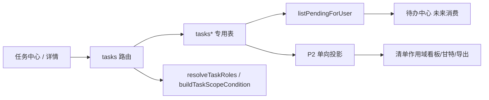

# MetaSheet 任务功能线 — Design Lock（PROPOSED）

- 日期：2026-09-17
- 状态：**PROPOSED — 不是已 ratify 的锁**。本件是 M1 的输入。不构成 DDL 应用、PR 合并或生产开关授权。三者各自需要 owner 亲写 GitHub comment。
- **基线 SHA**：`c6679d0f6990572139fd604c7cfe6f6427d47aa7`（写成时 `origin/main`）
- 计划输入：`task-feature-development-plan-20260915.md` v5，MD5 `f74e172840d2aa2502216d0dd8dff867`（PROPOSED 计划，不等于 ratify）
- 普查：`docs/development/task-feature-census-20260917.md`
- 骨架：照 `docs/development/elearning-plugin-design-lock-20260810.md` 的 §0–§15 编号。**§8 不重排**（计划 v5 多处按「锁 §4 / 锁 §12」引用）。
- 实现者不得批准自己的安全结论。§13-10 / §13-12 标「未裁」。

---

## 0. 结论摘要

可以对标飞书「任务」的**实体层**，但不整体对标。飞书任务 = 三层（审阅件 v2）：

1. **任务实体**（四角色视角、多负责人全部/任一完成、完成/重启、子任务五层、逐任务角色、任务中心、逾期红点）——本 SHA 双语法扫描下没有 `tasks`/`task_*` 建表（复现见普查 §3），要新建。
2. **任务清单**（字段、看板/甘特/仪表盘、评论、附件、动态）——组件可复用；分析投影与交互编辑必须分路。
3. **IM 原生层**——不对标。

任务是**实体**（被创建、持久化）；待办是**投影**（不落表）。任务系统是待办中心的一个来源，两线并行，只在 PendingItem 接口交汇（交接件 §一/§二）。

权威数据在任务域专用表。org 来源合同定为 `req.authenticatedTenantId`（本 SHA `jwt-middleware.ts:101-104`，`sed -n '101,104p'`）。非 admin 可达需要三件事（权限码 seed + 非 admin 角色 `role_permissions` 带 `tasks:*` + `user_namespace_admissions` 行）。feature flag `TASKS_ENABLED === 'true'`，默认 OFF。

本锁 **PROPOSED**。M2 实体核心（DDL/路由/前端）要等 M1 ratify **且** §13-10 / §13-12 落槌。

---

## 1. 架构结论

- **SoR**：PostgreSQL 专用表 `tasks` / `task_assignees` / `task_followers` / `task_events`（P0-A），后续清单/评论/附件/投影表按 §4。
- **纯函数边界**：`packages/core-backend/src/tasks/` 只放无 I/O 纯函数。DB 在 `src/services/task-*.ts`，路由在 `src/routes/tasks*.ts`。
- **不进 DI**（`di/identifiers.ts` 只登记平台服务）；router 工厂仍接 `injector` 以取 `ICollabService`。
- **投影（P2）**：单向只读到多维表；交互编辑 emit → 任务 API → reconcile。
- **不选**：任务 = 多维表的一种 sheet 类型；复用审批 `/pending` 与 `/pending-count` 的谓词分叉；登记 `table-classification.cjs`。

---

## 2. 对标基准蒸馏（飞书任务 26 篇）

语料：`~/Documents/Codex/2026-09-15/ni-ne/outputs/feishu-tasks-offline/articles/*.html`（26 篇）。IM/文档/独立窗口/外部联系人/飞书项目同步：**不对标**。

承重机制（P0 必须进锁）：

1. 四种角色视角 + 已完成 + 全部（《查看和编辑任务》）。
2. 多负责人 + 全部/任一完成（《添加任务负责人》:14-15）。
3. 创建人「仅我完成 / 为所有负责人完成」；父完成不级联子（《完成与重启任务》:19-23）。
4. 子任务含根五层、设父/转独立双端编辑权、父候选排除子孙（《使用子任务》:1,10-11,30）。
5. 创建人默认为负责人之一，可移除；零负责人合法（《添加任务负责人》:4；《查看和编辑任务》:15）。
6. 截止日期 vs 具体时间点；提醒缺省 −30min / 当天 18:00（《创建任务》:19-20）。
7. 红点口径逾期 / 逾期或今天 / 可关（《任务设置》《使用任务红点标记》）。
8. 关注人只读+评论+收通知（《关注任务》；冲突见 §13-23）。
9. 清单归档不改变任务可见性（《使用任务清单》:64/67）。
10. 可见 ≠ 等我处理（自有设计，承交接件）。

---

## 3. 范围裁决表

| 模块 | 裁决 | 期次 |
|---|---|---|
| 任务实体 / org / 四视角 / 完成重启 / pending | ✅ 做 | P0-A / M2 |
| 前端 `/tasks` `/tasks/:id` / 红点轮询 / 422 引导 | ✅ 做 | P0-A / M2 |
| 子任务树 / 评论 / 删除退出 | ✅ 做 | P0-B / M3 |
| 清单 / 分组 / 提醒 outbox / 事件通知 / socket | ✅ 做 | P1 / M4 |
| 重复 / 附件 / 里程碑依赖 / 投影+交互 / 自定义字段 | ✅ 做 | P2 / M5 |
| IM 原生（消息转任务、会话列表、文档内嵌、独立窗口、小组件、外部联系人、飞书项目） | ❌ 不做 | 不排期 |
| 清单「申请权限→所有者同意」 | ❌ | P1 用直接分享 |
| 站内通用收件箱 | ❌ | 待办中心线 |
| 甘特关键路径/整条拖动/着色/联动 | ❌ | 多维表线 |
| 新表 DML 普查闸 | ⏸ | §13-36 未做则门表不得写「CI 会抓到」 |

---

## 4. 域模型（SoR；live 迁移进 `packages/core-backend/src/db/migrations/zzzz*`——**本文件不授权写迁移**）

迁移命名：`zzzz<晚于本 SHA 最晚文件 zzzz20260916120000 的时间戳>_<snake>.ts`。引用迁移带完整文件名。`down()` 逆序镜像 `up()`。`users.id` 是 text，人员列用 text。

### 4.1 非空约束两类（**已定，来源 计划 v5 §2**）

- **ASCII 标识符**（`tsk_…` / `tlst_…` / `tcmt_…` id、`org_id`、`created_by` 等）：锚定 `CHECK (col ~ '^[!-~]+$')`。
- **用户文本**（`title` / `name`）：`CHECK (btrim(col) <> '')` + 应用层 Unicode 归一（NFC、去 White_Space 与 U+200B/U+200C/U+200D/U+FEFF 后非空）。**禁止**把 `[!-~]` 用在可能出现中文的列。正例「备料复核」；反例 `''`（CHECK）、`'\t'` / `'  \n '` / `'　'` / 零宽（应用层）。

（交接件 §四.3 曾写用户文本也用 `[!-~]`；与计划 v5 冲突，**以计划为准**，记偏离。）

### 4.2 表（草案；ratify 前不建）

P0-A：`tasks`（含日期四列 + `time_zone` + 派生 `due_at`；`completion_mode` in `all|any`；`depth` 0..4；软删；`version`）、`task_assignees`（PK `(task_id,user_id)`；零负责人合法；`all` 判定 = `EXISTS(assignee) AND NOT EXISTS(uncompleted)`）、`task_followers`、`task_events`（event_type 词表一次写全 CHECK，§2.3 计划原文）、权限码 seed 三行 `tasks:read|write|admin`（**不**自动插 `role_permissions`，除非 §13-10b 裁 seed）。

P0-B：`task_comments`（照 `zzzz20260822120000_create_approval_comments.ts` 形；无 resolved）。

P1：`task_lists` / `task_list_members` / `task_list_items` / `task_groups` / `task_group_items` / `task_list_events` / `task_user_settings` / `task_notification_deliveries`。

P2：`task_dependencies` / `task_attachments` + `task_attachment_purge_intents` + row-delete 触发器 / `task_fields` / `task_list_field_bindings` / `task_field_values` / `task_record_projection` PK `(list_id, task_id)` 无 FK。

索引最小集与 `event_type` 词表：**已定，来源 计划 v5 §2.2 / §2.3**。不按 `archived_at` 过滤 pending/四视角。

### 4.3 org 归属（**已定 1a，来源 计划 v5 §2.4**；其余见 §13-1）

- `tasks.org_id` 来源合同 = `req.authenticatedTenantId`（`jwt-middleware.ts:101-104` @ 本 SHA；`sed -n '101,104p' packages/core-backend/src/auth/jwt-middleware.ts`）。不用 `req.user.tenantId`（`:106-109` 会被 `x-tenant-id` 回填）。
- 写路径：claim 缺失一律 **422**，不 fallback、不写 `'default'`。`deriveApprovalInstanceOrgId` 不得作兜底。
- 读路径：`listPendingForUser(userId, orgId)` 与四视角都带 `tasks.org_id = :orgId`；`orgId` 空 ⇒ 空列表 + `degraded: true, reason: 'org_missing'`；谓词抛错 ⇒ `reason: 'predicate_error'`。只有 `org_missing` 触发 session-org 引导。挂载先 `GET /api/tasks/context`。
- `task_comments` / `task_events` 不设 org 列。
- 残留披露：`RBAC_TOKEN_TRUST`、`RBAC_OPTIONAL`（`namespace-admission.ts:9,:346`）任务域不加固，见 §13-1d。lane 前置断言 `RBAC_OPTIONAL` 未设置。

### 4.4 日期与时区（**已定，来源 计划 v5 §2.6**）

四列 + `time_zone`（带任一日期才必填，IANA，`isValidIanaTimeZone`）+ 派生 `due_at`。

逾期 / 「今天」三条规则（查看者日期语义）：

1. 定时 overdue = `due_at < now()`（与 viewerTz 无关）。
2. 定时 overdue_or_today = `due_at < viewerNextMidnight`（查看者当地次日零点瞬时）。
3. 全天 overdue = `due_date < viewerToday`；overdue_or_today = `due_date <= viewerToday`。

查看者时区：`x-viewer-time-zone`，缺省回退任务 `time_zone`。显示：全天 floating 不换算日期。

`remind_at` 缺省（P1，§13-13）：有 `due_time` ⇒ `due_at − 30min`（`due_time` 在 00:00–00:29 跨日回退）；全天 ⇒ 当地 18:00。

---

## 5. 权限与前端

### 5.1 RBAC（结构；豁免集/角色 seed 见 §13-10 **未裁**）

非 admin 可达需要三件事，缺一 403：① `permissions` seed；② 非 admin 角色在 `role_permissions` 带 `tasks:*`；③ `user_namespace_admissions(namespace='tasks', enabled=true)`。`user_permissions` 直授与 `users.permissions` jsonb 过不了准入。给 `admin` 绑码零增益。

`tasks` **不在** `NON_NAMESPACED_PERMISSION_RESOURCES`（本 SHA `:11-38`）。验收非 admin 定义：`req.user.role/roles` 不含 admin **且** `user_roles` 无 `role_id='admin'`。

资源面 `rbacGuard('tasks', …)`；实例面 `none` ⇒ 与「不存在」逐字节相同的 values-free 404。`rbacGuard` 自身抛错 500 是已知平台行为，任务线不改中间件。

### 5.2 前端路由与导航（**已定，来源 计划 v5 §4**；§13-37/38/39 缺省按此执行）

- 路由 `/tasks`、`/tasks/:id`；`appRoutes.ts` 懒加载 + `permissions: ['tasks:read']`。
- **§13-37 缺省**：两张焦点白名单都不加 `/tasks`。入口只加默认壳分支（与 `canUseApprovals` 同形），`attendanceFocused` / `plmWorkbenchFocused` 不渲染。
- **§13-38 缺省乙**：不加 `requiredFeature: 'tasks'`，不改 `router/types.ts` / `guardPolicy.ts`。`canUseTasks` + `GET /api/tasks/context` 普通 404 渲染「任务功能未启用或当前服务不支持」。**404 不断言 `TASKS_ENABLED` 的值**。推荐不是启用授权。
- 引导流三触发：context `orgId===null` / 读 `org_missing` / 写 422。`predicate_error` 不进引导。
- 红点：常驻 `` 三态；不照抄审批 `applyCount(0)`。
- 真 fetch，不复制审批 `USE_MOCK`。
- 助手模块 `apps/web/src/tasks/` + `views/tasks/`。

### 5.3 前端两点接线（**已定，来源 计划 v5 §8-2**）

新 spec 必须：(1) `.github/workflows/tasks-web-guard.yml`（paths 型，**不声明 `merge_group`**）；(2) `run-required-web-tests.sh` 的 `exec` 行 token（本 SHA 在 **:1186**，不是计划写的 :1069）。双向碰撞检查人口含 `apps/web/verification/`。本切片 docs-only，不改这两处。

---

## 6. 核心引擎

### 6.1 谓词一份真相、两种形态、一条从属链（**已定骨架，来源 计划 v5 §3**）

- `task-access.ts`：`resolveTaskRoles`（行级，角色可叠加、能力取并集）+ `buildTaskScopeCondition`（只产 SQL 文本与参数，不执行）。
- `buildTaskPendingCondition` **必须由** `buildTaskScopeCondition({view:'assigned'})` 派生，不得自行发射角色臂。
- **错误契约两族（已定，来源 计划 v5 §3 / §7-8）**：允许列表谓词抛错 ⇒ 空列表 + `degraded`；投影 deny 集合查询失败 ⇒ **抛出**，绝不返回空 deny 集。
- PendingItem（**已定，来源 计划 v5 §3**）：无截止日五键 `source/id/title/href/updatedAt`；有截止日六键（多 `dueAt`）；无截止日省略键，不填 null/空串。`source` 经 `TASK_PENDING_SOURCE` 常量，P0-A 先 `'task'`（§13-35）。签名比交接件多 `orgId`。

### 6.2 完成判定（规则；对称性见 §13-9）

创建时默认插入 creator 的 assignee 行（同请求可移除）。`all`：所有负责人 `completed_at` 非空且至少一行。零行不判 done。`any`：任一行完成即任务 done。可见 ≠ 等我处理：all 模式下我已完成他人未完成 ⇒ 仍 open、在「我负责的」，**不在** pending/红点，记 `self_completed`。

不变量：`status='open' AND completion_mode='any'` ⇒ 不存在非空 `completed_at`。

### 6.3 树不变量（P0-B）

`depth` 0..4（含根五层）。无环。设父/转独立双端 `can('edit')` + 同 org；失败 404。父候选排除自身及子孙。父完成不级联子。

### 6.4 锁协议与锁序（**已定，来源 计划 v5 §5-5**）

结构变更按 org 串行化 `pg_advisory_xact_lock(hashtext('task-structure:'+orgId))`，**取锁后重读**。键只由 `src/tasks/task-lock-keys.ts` 生成：

- `task-structure:<orgId>`
- `task-projection:<listId>:<taskId>`
- `tasks-scheduler:leader`

顺序：structure → canonical fence → projection。reconcile **不**在结构锁事务内。调度 leader 不与前两把共存于同一事务。任务域调用点不得手写 `pg_advisory_xact_lock(hashtext(` 字面量。

验收：真实路径取锁序列单调为正；故意反序为负控（包装器必须抛）。交叉移动反例：恰一方成功、终态无环。

---

## 7. 投影边界（P2；键与 deny 契约已定）

- PK `(list_id, task_id)`。零清单任务不进投影。
- 记录 id `rec_tsk_<listId>__<taskId>`；`parseTaskProjectionRecordId` 往返；失败拒绝编辑，不猜 listId。
- 锁键 `task-projection:<listId>:<taskId>`。
- **deny 查询失败必抛**（已定）。TS/SQL 一致性方案见 §13-11。
- 交互 `canEdit` = 清单级 edit/owner（已定，计划 §7-9）。版本用映射行 `projected_version`，不采用 emit 携带的投影记录 version。

---

## 8. 媒体子架构（M 轨）

N/A:本线无媒体轨。

---

## 9. Owner 裁决表

| # | 题 | 状态 |
|---|---|---|
| 已定抄入 | 两类非空、日期三规则、锁协议锁序、投影复合键、deny 两族、两点接线、五段部署链、导航/引导、PendingItem 五/六键、§13-37/38/39 缺省 | 已定，来源计划 v5；ratify 时可改 |
| §13-10 | RBAC 豁免集 / `tasks_user` seed | **未裁** |
| §13-12 | 真库测试 required 承载 | **未裁** |
| 其余 §13 | 建议答案见 §13 | 待 M1 逐条 comment 或默认前进 |

---

## 10. Feature flag 与 RBAC

- `TASKS_ENABLED === 'true'`（精确字符串）。关时 router 工厂返回 `null`，`index.ts` `if (router) this.app.use(router)` 跳过。
- P1：`TASKS_SCHEDULER_ENABLED` / `TASKS_NOTIFICATION_DELIVERY_WORKER_ENABLED` / `TASKS_NOTIFICATION_DINGTALK_WORK_NOTIFICATION_ENABLED`，默认 OFF。新 flag 必须登记 `scripts/ops/global-history-flag-manifest`。
- 生产启用是独立 owner 授权，不等于本锁 ratify。
- 路由挂载：审批段之后（本 SHA `index.ts:1785-1788` 之后）；静态子路径先于 `/:id`。真起服务器打一遍。

---

## 11. 分阶段

| 里程碑 | 交付 | 进入 | 退出 |
|---|---|---|---|
| M0 | 普查 + 本 PROPOSED 锁 | 计划被认可 | 本 PR-0 Draft；39 题建议答案；两轮闸另走 |
| M1 | owner comment ID | 本锁 | §13-10 / §13-12 落槌 |
| M2 | PR-1 实体+最小前端（含 DDL，Draft，不应用不合并） | M1 | 门表 + 非 admin 真机 + **独立合并授权 comment** |
| M3–M5 | P0-B / P1 / P2 | 上一 PR 合并授权 | 同形 |

---

## 12. Ratify 验收门（编号；db 门 required 承载 §13-12 裁前写 TBD）

1. org 写路径无 claim ⇒ 422；读路径 `org_missing` / `predicate_error`；不写 `'default'`。
2. 非 admin 三件事缺一 403；直授+admission 仍 403。
3. 完成判定网格 any/all × 增删人 × 切模式 × {0,1,n}。
4. 可见 ≠ pending（self_completed 正反）。
5. PendingItem 五键/六键；`dueAt` 不得为 null/空串。
6. 树 depth 0..4、无环、交叉移动恰一成功。
7. 锁键单点 + 锁序正/负控。
8. 日期三规则固定 `now=2026-09-15T12:30Z` 三格。
9. deny 注错 ⇒ 投影读非 200 且零行外泄。
10. 标题「备料复核」过；`[!-~]` 不在 title。
11. 前端两点接线；flag OFF 与零任务不同形；404 不断言开关。
12. 前端引导三触发 + `predicate_error` 不引导。
13. 真起服务器静态路径；非 admin 打通一条任务路由。
14. 含 DDL 的 PR 首段标明未应用未合并；五段部署链。
15. 生产源码注释不点名其他线符号。
16. lane 断言 `RBAC_OPTIONAL` 未设置。

门 2/9/13 的 **required 绿** 在 §13-12 裁定前不得声称。

---

## 13. 锁必答题（39 题，一题不删）

> owner 第三/四轮已定案条款照计划 v5 抄为已定。§13-10、§13-12 **未裁**，只给建议+代价。

### L0

**1. org 归属**
- **1a** `tasks.org_id` = `req.authenticatedTenantId`。**已定，来源 计划 v5 §2.4**。依据：`jwt-middleware.ts:101-104`。
- **1b** 建议：多组织用户先 `POST /api/auth/session-org`，请求不另带 orgId。依据：计划 §2.4 (a)；避免第二 org 来源。
- **1c** 建议：不允许跨 org 负责人/关注人。依据：org 列是隔离键；跨 org 会变成第二数据源。
- **1d** 建议：接受 `RBAC_TOKEN_TRUST` / `RBAC_OPTIONAL` 两条残留不加固；任务 lane 断言后者未设。依据：计划 §2.4 披露。
- **1e** 本地普查已做（零活跃成员 68/115 @ Homebrew `metasheet_v2`；生产 UNCLEAR）。是否 M2 前回填生产 **请 owner 裁**。建议：M2 不回填生产，只在引导流渲染「未加入组织」。

**2. 创建人默认负责人**
建议：默认写入 `task_assignees`；同请求可移除自己；零负责人合法；不进任何人 pending；红点归属随 badge_scope 仍为零。**部分已定（零负责人合法、默认插入）来源 计划 v5 §2.1 / §5-10**；红点归属请裁。

**3. 角色叠加**
建议：能力取并集，无优先序。**已定方向，来源 计划 v5 §5-8 / §13-3 建议**。

**4. 红点口径**
建议：默认 `overdue`；用户可配 `overdue_or_today` / `all_open` / `off`；count 与 list 同函数不同参数。**已定方向，来源 计划 v5 §3 / §13-4**。

**5. 谓词两形态与从属链**
建议：采用计划名字与形状；pending 由 scope assigned 派生；投影侧建议 (a) 共用同一份 WHERE 文本生成器。**骨架已定，来源 计划 v5 §3**；(a)/(b)/(c) 与 §13-11 一并裁。

**6. 设父/转独立**
双端授权 + 跨 org 禁止 + 父候选排除子孙。**已定，来源 计划 v5 §5-5**。

**7. per-user 设置实体**
建议：建 `task_user_settings`（P1）。不建则每日提醒无扇出来源。

**8. `event_type`**
建议：P0-A 一次写全 CHECK（计划 §2.3 词表）。新增词 = 新 DDL + owner 合并授权。

**9. 完成/重启对称性**
建议：any 模式其余人 `completed_at` 置同一时刻并记 `completed_by_any`；any 重启 = 全部；增删人/切模式按计划 §5-4。**规则已写进计划 §5-2/3/4，请 ratify 时确认 any 置位**。

**10. RBAC（未裁）**
- **10a** 建议：**不**把 `tasks` 加入 `NON_NAMESPACED_PERMISSION_RESOURCES`（保持受控）。代价：非 admin 可达要「角色授码 + 逐用户准入」两步 runbook；漏一步则静态绿、真机全 403（R10）。加入豁免 = 全员可达合同变更，与 approvals 同档。
- **10b** 建议：不 seed `tasks_user`（stock-prep 先例零自动）。代价：每个租户要手工绑角色。seed 则要写清绑哪些角色、是否自动 admission。
- **10c** 建议三码名 `tasks:read/write/admin`。
- **本条未裁；M2 不得写「所有活跃用户可用」。**

**11. 投影撤权 TS/SQL**
建议：(a) 共用 WHERE 文本生成器 + deny 失败必抛。不选 (b) 存 `visibleUserIds`（与「撤权不等同步」冲突）。

**12. §8-1 ③ required 承载（未裁）**
- **(a)** 整文件加进 `plugin-tests.yml` `test` job run-list。代价：s6a pin 重算（`s6a-package-provenance-pins.json:90` 钉住该文件）+ 与在飞 PR 串行化。本切片禁止改该文件。
- **(b)** 任务 db lane 去 `paths`、声明 `merge_group`、四步 POST-append。代价：lane 须先单独合进 main 才有同名 job；在飞 PR 要 rebase 才出现 context。
- 建议：倾向 (b)，避免动 s6a。**未裁；裁定前 §0/§12 db 门写 TBD，不得声称门全绿。**

### L1

**13. `remind_at` 缺省** — **已定算法，来源 计划 v5 §5-13 / §2.6**（−30min / 18:00 / 跨日回退）。
**14. 清单归档** — **已定，来源 计划 v5 §5-11**（归档权 created_by ∪ edit/owner；不改变任务状态/可见性）。
**15. `created_by` vs `owner_id`** — **已定方向，来源 计划 v5 §2.1**：created_by 不可变；owner 可转，原 owner 降 edit。
**16. 自定义字段** — 建议 org 定义 + 清单绑定 + 任务值；建/改/删权 = 清单可编辑者。
**17. 个人分组** — 建议 `task_groups.scope='user'`。
**18. 重复任务** — **已定方向，来源 计划 v5 §5-12**。
**19. 通知扇出** — creator ∪ assignee ∪ follower ∪ list_member 排除 actor；`recipient_role` 闭集。**已定方向，来源 计划 v5 §5-14 / §2.1**。
**20. 里程碑/依赖** — 建议 P2（计划已排 P2）。
**21. complete/reopen 幂等键** — 建议 `(task, actor, version)`；冲突 409 + 当前版本。
**22. 「我分配的」** — 建议 `created_by = me AND EXISTS assignee ≠ me`。请裁创建人默认在列时是否同时落「我负责的」。
**23. follower 能力冲突** — 建议取「只读+评论+退出」，不取清单可阅读者兼关注人可编辑（《使用任务清单》:40 vs 《在任务中添加附件》:23）。
**24. 附件 mime/大小** — 不默认继承审批五项/20MB；请裁。建议先闭集小白名单 + 低于审批上限。
**25. 深度含根** — **已定 0..4，来源 计划 v5 §2.1 / §5-5**。
**37. 焦点白名单** — **缺省不加 `/tasks`，来源 计划 v5 §4 / owner 第三轮 #7**。
**38. requiredFeature 甲/乙** — **缺省乙，来源 计划 v5 §4**。推荐不是启用授权。
**39. attendanceFocused 入口** — **缺省不出现，来源 计划 v5 §4**。

### L2

**26. org admin 对任务可见性** — 建议：org admin 不自动看见全部任务；走 RBAC 三件事 + 角色。避免第二可见性通道。
**27. 软删保留期与硬删** — 建议：P0 只软删；硬删作业必须先验 purge intent 入队（附件 P2）。保留期请裁，建议 30 天起。
**28. 限额** — 建议 P0 先软限额（assignee/follower 各 50，depth 已有 CHECK）；硬限额请裁。
**29. 分页** — 建议 P0-A `limit/offset` + 上限 100；总数返回；cursor 留 P1。
**30. socket 扇出** — 建议按 user 房间；P0-A 完成/指派/重启 emit；关注人 P1 收通知后再扩。
**31. 投影 sweep** — 建议照审批 5 分钟量级；最大滞后承诺请裁，建议不写 SLA 数字只写「sweep 周期可配、默认保守」。
**32. `KanbanView.vue` 示例卡片** — 建议保留为演示，加注释「非任务实体」但 **生产源码注释不得点名任务线符号以外的其他线**；或改文案去掉「任务示例」以免普查误伤。请裁。本锁建议改文案为中性「示例卡片」，不在注释里点名本线未建表。
**33. i18n** — 建议 `tasks/labels.ts` + 一条 CJK/EN spec。
**34. 跨任务动态页** — 建议 P1 清单动态走 `task_list_events`；跨任务「动态」页可后置。
**35. `PendingItem.source`** — 建议 P0-A `'task'`，单点常量；待办中心锁裁后只改一处。
**36. 任务域 DML 普查闸** — 建议 M2–M4 不建；诚实声明任务表不在 attendance 分母。若建是新工作。

---

## 14. Ratify 前置（顺序）

1. 本 PROPOSED 锁经两轮独立对抗闸（Claude；实现者自扫绝对量词 ≠ 自批）。
2. Owner 对每条「需 owner ratify」句亲写 comment ID（格式「owner comment \<id\> on PR \<N\>」）。锁文文字编辑本身不算。
3. **§13-10 / §13-12 必须落槌** 才进入 M2。
4. rebase 至当时 `origin/main` 并重跑普查锚点 `sed -n`（本文件基线 `c6679d0f6`；main 再前进则重核）。
5. 含 DDL 的后续 PR 另需独立合并授权 comment；本锁 ratify ≠ 合并 ≠ `TASKS_ENABLED` 生产开。

---

## 15. 风险登记

沿用计划 v5 §11 R1–R22。本普查追加：

- **R23** 计划多处 `file:line` 相对 `062614f44` 已漂移（`index.ts` 审批挂载、`run-required-web-tests.sh:1069`、`vitest.config.ts:1782`、`AGENTS.md:48-50`）。实现必须以本 SHA 重核，不抄实行号。
- **R24** 本地 `user_orgs` 活跃多成员 = 0，生产分布 UNCLEAR；引导流 (a)(c) 必须在无多组织夹具下仍可测 (c)。
- **R25** 本地库未跑全迁移；不得把本地计数当生产证据。
