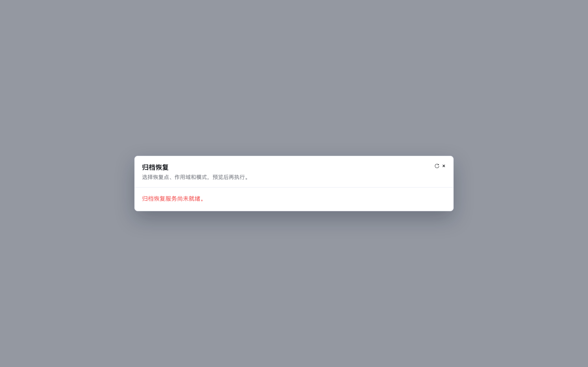

# Archive Readiness Verification

## Identity

- Base main: `c6f2d437a8810a822fb4210976aaf6af9ed3af74`.
- Code/design checkpoint: `7dd536ae4f1e76be870990ceef45ef3c940bf8c2`.
- Code/design tree: `e6f46799f590e4ab4426ff2f8ce1587aea2eacbb`.
- Branch: `codex/timemachine-archive-readiness-20260915`.
- Product files: archive modal and its existing mounted spec only.
- Runtime providers, backend, permissions, DB, flags, OpenAPI and shared CI:
  unchanged. This report and screenshots are a documentation-only child.

## Local Gates

Node 20.20.2 with existing workspace dependencies; no dependency installation.

| Gate | Result |
| --- | --- |
| Red-first readiness/recheck tests | 16 failed, 21 passed before implementation |
| Archive modal | 38/38 PASS |
| Archive client | 78/78 PASS |
| Config/history/trash neighbors plus archive | 5 files, 159/159 PASS |
| `vue-tsc --noEmit -p tsconfig.app.json` | PASS |
| Scoped ESLint | PASS, zero errors/warnings |
| `git diff --check` | PASS |
| Chromium synthetic browser | 12/12 PASS at 1440, 390 and 320 px |

Focused command:

```sh
pnpm --filter @metasheet/web exec vitest run \
  multitable-recovery-archive-modal multitable-recovery-archive-client \
  multitable-history-fe multitable-config-history-modal multitable-trash-fe
```

The complete `vue-tsc -b` is NOT recorded as passing: it reports a Vite 5/7
plugin-type conflict in the unchanged `vite.config.ts` project. Config, node
tsconfig and lockfile are byte-identical to base. Application-only Vue typecheck
passes. Scoped lint initially lacked direct parser resolution through reused
dependencies; it passed using temporary NODE_PATH entries for the already
installed parser/plugins. No tracked dependency/config change was made.

The full repository required-web script was not rerun locally for this two-file
product change. Its existing standalone archive invocation, identical to the
domain guard invocation, ran locally with both complete files. Remote exact-head
CI remains a separate gate; local green does not replace it.

## Discriminating Tests

1. Replace disabled classification with generic unavailable: exact disabled test
   fails (1 RED). Restore implementation and all focused/neighbor tests pass.
2. Replace recheck job discovery with a direct catalog load: retry serialization/
   discovery test fails (1 RED). Restore and all tests pass.
3. Reject an in-flight catalog request after close: the late error is ignored;
   reopening goes through job discovery again.
4. Existing executable-token, explicit-confirmation, scope and job tests remain.
   Async acceptance stays bound to its originating sheet; pending synchronous
   completion survives closing/reopening that same sheet.

Review exploration briefly attempted invalidating in-flight writes on close.
Two pre-existing completion-continuity tests failed, proving that this would
change the contract. That exploration and its contradictory tests were removed
before the final checkpoint. No write-lifetime change was published.

Independent Luna high read-only review of frozen code checkpoint `7dd536ae4`
returned P1/P2/P3 = 0/0/0 for this bounded delta. It independently confirmed
discovery-first retry, exact backend codes, HTTP precedence and retained
write-lifetime semantics. No model test results are claimed; tests above were
run by the coordinator. Review session is closed.

## Browser Evidence

The harness imports the real modal with synthetic service callbacks. Four
known backend error codes across three viewports show distinct fixed copy,
no raw provider message, no overflow, and no console/page error. Clicking the
accessible refresh icon produces exactly three total reads (initial discovery,
retry discovery, catalog) and zero writes, ending in the distinct empty state.
This is presentation evidence, NOT authenticated backend/storage recovery UAT.




## Delivery and Runtime Boundaries

- Publication target: independent Draft/HOLD PR; do not update or merge #5709.
- Remote CI at report creation: NOT YET VERIFIED.
- Ready/merge: NOT PERFORMED.
- Archive runtime enablement, capture/upload, KMS/object storage, isolated restore
  or process-restart acceptance: NOT PERFORMED in this slice.
- No flag, dispatch, deployment, staging, production or customer-data action.
- Remaining runtime work is explicitly defined in the companion design lock.
