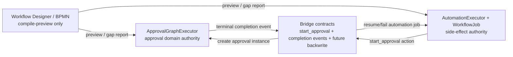

# Workflow / Approval / Automation Engine Convergence Doctrine - 2026-06-16

Type: **architecture doctrine / guardrail**.

Status: **decision note**. This document does not authorize code changes,
migrations, routes, or runtime rewrites.

## 0. Decision

MetaSheet should converge workflow, approval, and automation as **one product
experience**, not by physically merging all runtime engines into one executor.

The v1 architecture is:

1. **Approval runtime remains approval-authoritative.**
2. **Automation runtime remains side-effect / WorkflowJob-authoritative.**
3. **Workflow Designer / BPMN remains preview-authoritative for v1.**
4. **Cross-runtime behavior must use explicit bridge contracts.**
5. **The legacy live BPMN runtime must not be expanded implicitly.**

This is a convergence-by-contract model, not a fusion-by-refactor model.

## 1. Current Runtime Map

| Runtime | Current owner role | Evidence | v1 posture |
|---|---|---|---|
| `ApprovalGraphExecutor` | Approval template/runtime graph progression, assignee resolution, approval node state. | `packages/core-backend/src/services/ApprovalGraphExecutor.ts` | Keep as the approval source of truth. |
| `AutomationExecutor` + C1 `WorkflowJob` plane | Multitable automation actions, business side effects, retry, suspend/resume, branch/parallel lineage, `start_approval` bridge action. | `packages/core-backend/src/multitable/automation-executor.ts`; `packages/core-backend/src/multitable/automation-job-service.ts` | Keep as the automation source of truth. |
| `BPMNWorkflowEngine` mounted under `/api/workflow` | Legacy live BPMN process runtime with deploy/start/task APIs. | `packages/core-backend/src/routes/workflow.ts`; `packages/core-backend/src/workflow/BPMNWorkflowEngine.ts` | Fence from v1 convergence work; retire or formally own later by explicit product decision. |
| Workflow Designer compile-preview | Side-effect-free draft analysis and gap report. | `packages/core-backend/src/routes/workflow-designer.ts` `compile-preview`; `packages/core-backend/src/workflow/bpmnCompilePreview.ts` | Allowed for v1 as preview only. No live execution. |

## 2. Why Not Merge Engines Directly

Directly merging the three runtimes would create a high-risk rewrite with weak
product payoff:

- Approval has domain-specific state: assignments, approval records, approval
  modes, requester/assignee policies, SLA/metrics, and terminal transition
  semantics.
- Automation has side-effect orchestration: record writes, outbound messages,
  webhooks, retry, suspension, branch/parallel C1 job lineage, redaction, and
  operator provenance.
- BPMN has a different process-instance/task model and an existing live API
  surface. Folding it into v1 would either create a fourth execution path or
  force a broad migration before the product loop is validated.

The safer and more useful convergence is:

## 3. Ownership Rules

### 3.1 Approval Runtime Owns

Approval code owns:

- approval template publish/freeze;
- approval runtime graph traversal;
- assignment resolution;
- approval modes such as single/all/any;
- approval records and audit;
- approval terminal outcomes;
- approval permissions and action routes.

Automation code must not reimplement approval graph traversal. It may request
an approval instance through the bridge and consume terminal completion events.

### 3.2 Automation Runtime Owns

Automation code owns:

- record-triggered rule execution;
- outbound and record side effects;
- `multitable_automation_jobs` C1 job state;
- retry, suspend/resume, branch/parallel job lineage;
- action redaction and run-governance surfaces;
- `start_approval` as an automation action.

Approval code must not directly settle automation jobs except through the
completion-event bridge path.

Execution-style steps that perform side effects — e.g. a "handler" step that
disburses payment, applies a seal, or archives a record — are automation work
reached through the bridge, **not** a new approval node type. Putting such
behavior inside the approval graph would move side-effect authority into the
approval runtime and is out of bounds without an explicit owner decision.

### 3.3 Workflow Designer Owns

Workflow Designer code owns:

- draft authoring and visualization;
- side-effect-free compile preview;
- deterministic gap reports;
- mapping preview to existing approval/automation primitives.

Workflow Designer must not start production execution through BPMN for v1.

## 4. Bridge Rules

All cross-runtime behavior must be explicit and reviewable.

Allowed bridge contracts:

| Bridge | Direction | Status |
|---|---|---|
| `start_approval` action | Automation -> Approval | Landed runtime; deployed/operator smoke still gates operational sign-off. |
| Approval completion event | Approval -> Automation | Landed typed/redacted event with an idempotent durable claim; delivery itself is best-effort — see §4.1. |
| Approval result backwrite | Approval/Automation -> Multitable record | Scope-gated only; runtime requires W6 smoke PASS or named owner unlock plus concrete field mapping. |
| BPMN compile preview | BPMN draft -> preview of automation/approval shape | Landed as read-only preview; no live execution. |

Disallowed implicit bridges:

- Template save silently creating automation rules.
- Record update silently starting approval unless a named trigger-binding slice
  exists.
- Workflow Designer deploy silently routing to `BPMNWorkflowEngine` as the v1
  execution path.
- Approval completion directly writing business records without explicit W7
  mapping and idempotency.
- Automation reading approval private form/comment/runtime graph data outside
  the approved event or bridge contract.

### 4.1 Cross-runtime delivery semantics

The completion-event bridge is **durable-claim + best-effort delivery**. The
authoritative step is an idempotent compare-and-swap on a durable bridge row
(`claimCompletion` flips `status='pending' -> 'resumed'` exactly once), which
makes *double* delivery safe. The `eventBus` emit is fire-and-forget and is a
**nudge, never the system of record** — a lost emit (e.g. a crash between the
approval COMMIT and the emit) currently has **no reconciler backstop** and
strands the bridge row. That is tolerable for a resumable workflow job; it is
**not** tolerable for an irreversible side effect.

Rules for any new cross-runtime side-effect bridge (notably W7 backwrite):

- The side effect must be claimed idempotently from a durable row, never run
  directly inside a best-effort event handler.
- The event bus is an optimization; correctness must not depend on delivery.
- The bridge must ship a reconciler/backstop that re-derives outcomes for lost
  events (e.g. sweep stale `pending` rows against the approval terminal state).

Known debt: the existing completion-event path has the durable idempotent claim
but no lost-event reconciler. Close that gap before any irreversible side
effect (W7) rides it.

## 5. Legacy BPMN Runtime Fence

`BPMNWorkflowEngine` is a live mounted surface under `/api/workflow`; it is not
dead code. That means it requires an explicit product decision, not accidental
neglect.

For v1 convergence work:

- Do not add new product features that depend on `/api/workflow/start/:key`.
- Do not import `BPMNWorkflowEngine` from automation or approval runtime code.
- Do not treat Workflow Designer deploy as proof that the v1 automation/approval
  substrate can execute the workflow.
- Keep A6-4 style work limited to compile-preview and gap reports.

Future options, each requiring its own scope-gate:

1. **Formal legacy support:** document `/api/workflow` as a separate legacy BPMN
   product surface with owner, tests, and operator runbook.
2. **Soft fence:** hide or permission-gate new UI entry points while preserving
   existing API compatibility.
3. **Retirement:** migrate or disable live BPMN runtime after confirming no
   active tenants depend on it.

## 6. Development Guardrails

Any PR touching workflow/approval/automation convergence should answer:

1. Which authority owns the state being changed: approval, automation, or
   designer preview?
2. Is this a bridge contract? If yes, where is its idempotency/audit/redaction
   boundary?
3. Does this introduce another execution path?
4. Does this call `BPMNWorkflowEngine` from new v1 product code?
5. Does this write business data? If yes, where is the explicit mapping,
   permission guard, and duplicate-write guard?
6. Does this create a second status vocabulary, or does it reuse approval state
   and C1 `WorkflowJob` state?
7. Is unsupported shape handled by read-only/gap-report/fail-closed behavior
   rather than silent flattening?
8. If this is a side-effect bridge, does it claim from a durable row and ship a
   lost-event reconciler, rather than executing inside a best-effort event
   handler?

If a PR cannot answer these, it should stop at a scope-gate.

## 7. Recommended Next Moves

The doctrine does not change the current execution plan:

1. Keep approval authoring and automation convergence moving through named
   slices.
2. Run W6 `start_approval` deployed/operator smoke before treating the bridge as
   operationally signed off.
3. Start W7 result backwrite only with a concrete business mapping.
4. Keep BPMN work in compile-preview/gap-report mode unless an owner explicitly
   decides what to do with the legacy live runtime.

## 8. Non-goals

- No one-shot rewrite into a generic workflow engine.
- No live BPMN runtime expansion.
- No approval graph reimplementation inside automation.
- No automation side-effect execution inside approval.
- No hidden business writes from approval completion.
- No new generic JS/SQL/code node as a shortcut around missing bridge contracts.

